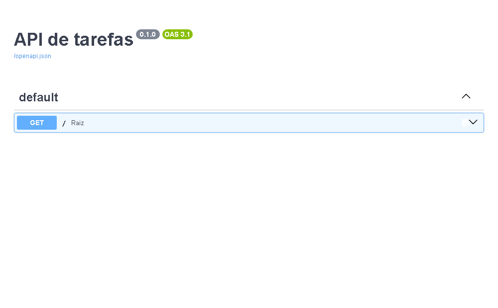
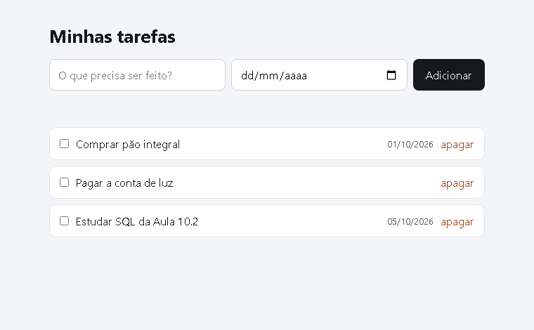
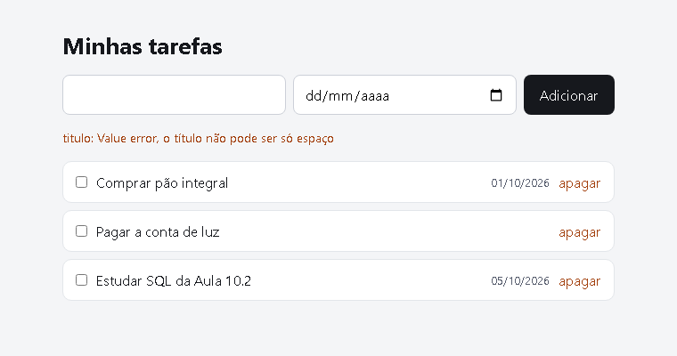

> A travessia do front para o back. Seu código deixa de rodar no navegador de alguém e passa a rodar num servidor — e a metade difícil é a que ninguém vê. Este é o passo a passo que eu seguiria, começando pela API errada de propósito, para medir cada defeito antes de consertá-lo: o status que mente, a consulta que aceita comando no lugar do dado, e o teste que só passa quando roda sozinho.

## O QUE VOCÊ PRECISA
- Python 3.10 ou mais novo. `python --version` no terminal responde.
- VS Code, com a extensão Python.
- O Módulo 9 lido: requisição, resposta, método e status.
- A oficina da Lista de Tarefas — o front dela é o que vai consumir esta API no fim.

## ANTES DE ESCREVER A PRIMEIRA LINHA
Crie uma pasta chamada `api-tarefas` e abra-a no VS Code (Arquivo → Abrir Pasta). Dentro dela, crie estes arquivos vazios:

~~~arvore
api-tarefas/
├── main.py
├── banco.py
├── modelos.py
├── test_api.py
├── requirements.txt
└── .gitignore
~~~
A divisão é a mesma o tempo todo: `main.py` só cuida de rotas e status, `banco.py` só cuida de SQL, `modelos.py` só descreve a forma dos dados. Nenhuma rota escreve SQL, e nenhuma função do banco sabe o que é um status HTTP.

### 1. O ambiente e a primeira rota
Isolar as bibliotecas do projeto, subir o servidor e ganhar uma documentação de graça.

No terminal, dentro da pasta, crie e ative o ambiente virtual. Ele mantém as bibliotecas desta oficina separadas do resto da máquina:

~~~codigo
python -m venv .venv
.venv\Scripts\activate          # Windows
source .venv/bin/activate       # macOS e Linux

pip install fastapi "uvicorn[standard]"
~~~
O nome do ambiente aparece no começo da linha do terminal — `(.venv)`. Se ele não aparecer, o `pip install` foi para a máquina inteira, não para o projeto.

~~~arquivo main.py
from fastapi import FastAPI

app = FastAPI(title="API de tarefas")

@app.get("/")
def raiz():
    return {"servico": "API de tarefas", "versao": "0.1"}
~~~
~~~arquivo requirements.txt
fastapi
uvicorn[standard]
pytest
httpx
~~~
Suba o servidor com `uvicorn main:app --reload` e abra `http://127.0.0.1:8000/docs`.

#### A documentação nasce do código
`uvicorn main:app` quer dizer: no arquivo `main.py`, use o objeto chamado `app`. O `--reload` reinicia o servidor a cada vez que você salva — vale no desenvolvimento e em lugar nenhum além dele.

O que aparece em `/docs` não foi escrito por ninguém: o FastAPI leu as funções, os nomes e as anotações de tipo e gerou a página. É por isso que anotar o tipo de retorno vale a pena — cada anotação vira documentação e validação ao mesmo tempo.

Conferi que `GET /` devolve `200` com `{"servico": "API de tarefas", "versao": "0.1"}`, e que `/openapi.json` já lista o caminho `/`.

!confira abra `/docs`, clique em `GET /`, depois em *Try it out* e em *Execute*: a resposta aparece na própria página, com o status ao lado.

### 2. Os cinco endpoints, ainda sem banco
Acertar a forma da API antes de decidir onde os dados moram.

~~~arquivo main.py
from fastapi import FastAPI
from pydantic import BaseModel

app = FastAPI(title="API de tarefas")

class TarefaEntrada(BaseModel):
    titulo: str
    feita: bool = False

class Tarefa(TarefaEntrada):
    id: int

# Etapa 2: o banco ainda é uma lista na memória. Some quando o servidor para,
# e é de propósito — primeiro a forma da API, depois onde os dados moram.
tarefas: list[Tarefa] = []
proximo_id = 1

@app.get("/tarefas")
def listar() -> list[Tarefa]:
    return tarefas

@app.get("/tarefas/{tarefa_id}")
def ver(tarefa_id: int):
    for t in tarefas:
        if t.id == tarefa_id:
            return t
    return {"erro": "não encontrada"}

@app.post("/tarefas")
def criar(entrada: TarefaEntrada) -> Tarefa:
    global proximo_id
    nova = Tarefa(id=proximo_id, **entrada.model_dump())
    proximo_id += 1
    tarefas.append(nova)
    return nova

@app.put("/tarefas/{tarefa_id}")
def editar(tarefa_id: int, entrada: TarefaEntrada):
    for i, t in enumerate(tarefas):
        if t.id == tarefa_id:
            tarefas[i] = Tarefa(id=tarefa_id, **entrada.model_dump())
            return tarefas[i]
    return {"erro": "não encontrada"}

@app.delete("/tarefas/{tarefa_id}")
def apagar(tarefa_id: int):
    global tarefas
    tarefas = [t for t in tarefas if t.id != tarefa_id]
    return {"ok": True}
~~~
#### Dois modelos, não um
`TarefaEntrada` é o que o cliente manda; `Tarefa` é o que a API devolve. A diferença é o `id`, e ela existe por um motivo prático: quem cria uma tarefa não escolhe o `id`. Se houvesse um modelo só, o cliente poderia mandar `id: 999` e o servidor teria de decidir o que fazer com isso. Com dois, o campo simplesmente não existe na entrada.

#### O buraco: a API responde 200 para tudo
Rodei os cinco endpoints e anotei o que cada um devolveu:

| O QUE PEDI | O QUE VOLTOU |
|---|---|
| `POST /tarefas` com um título | `200` — mas nada foi criado antes, deveria ser `201` |
| `GET /tarefas/1` | `200` com a tarefa — certo |
| `GET /tarefas/99` | `200` com `{"erro": "não encontrada"}` |
| `DELETE /tarefas/1` | `200` com `{"ok": true}` |
| `DELETE /tarefas/1` de novo | `200` outra vez, apagando o que já não existia |

A linha do meio é a grave. Para o programa que consome a API, `200` quer dizer “deu certo”. Um front que confia no status vai tentar desenhar a tarefa e receber um objeto com a chave `erro`, quebrando longe daqui. Quem escreve o cliente acaba testando `if ('erro' in resposta)` — inventando um segundo sistema de status por cima do que o HTTP já tem.

Também medi o outro lado: `POST` sem o campo `titulo` já devolve `422` sozinho, com `["body", "titulo"]` e a mensagem `Field required`. Essa parte o Pydantic acertou sem eu pedir.

!confira crie duas tarefas e liste. Depois peça `GET /tarefas/99` e repare no status `200` no canto do `/docs` — é ele que a próxima etapa conserta.

### 3. Os status que dizem a verdade
Cada resposta com o código que descreve o que aconteceu de fato.

~~~arquivo main.py
from fastapi import FastAPI, HTTPException, Response, status
from pydantic import BaseModel

app = FastAPI(title="API de tarefas")

class TarefaEntrada(BaseModel):
    titulo: str
    feita: bool = False

class Tarefa(TarefaEntrada):
    id: int

tarefas: list[Tarefa] = []
proximo_id = 1

def achar(tarefa_id: int) -> Tarefa:
    """Devolve a tarefa ou encerra o pedido com 404.

    Concentrar a busca num lugar só é o que garante que todo endpoint
    responda o mesmo 404, com a mesma mensagem.
    """
    for t in tarefas:
        if t.id == tarefa_id:
            return t
    raise HTTPException(status_code=404, detail=f"Tarefa {tarefa_id} não existe")

@app.get("/tarefas")
def listar() -> list[Tarefa]:
    return tarefas

@app.get("/tarefas/{tarefa_id}")
def ver(tarefa_id: int) -> Tarefa:
    return achar(tarefa_id)

@app.post("/tarefas", status_code=status.HTTP_201_CREATED)
def criar(entrada: TarefaEntrada, resposta: Response) -> Tarefa:
    global proximo_id
    nova = Tarefa(id=proximo_id, **entrada.model_dump())
    proximo_id += 1
    tarefas.append(nova)
    # 201 pede o endereço do que acabou de nascer.
    resposta.headers["Location"] = f"/tarefas/{nova.id}"
    return nova

@app.put("/tarefas/{tarefa_id}")
def editar(tarefa_id: int, entrada: TarefaEntrada) -> Tarefa:
    atual = achar(tarefa_id)
    trocada = Tarefa(id=atual.id, **entrada.model_dump())
    tarefas[tarefas.index(atual)] = trocada
    return trocada

@app.delete("/tarefas/{tarefa_id}", status_code=status.HTTP_204_NO_CONTENT)
def apagar(tarefa_id: int) -> None:
    alvo = achar(tarefa_id)
    tarefas.remove(alvo)
    # 204 é "deu certo, e não há o que dizer": corpo vazio, de propósito.
~~~

#### `raise`, não `return`
`HTTPException` é levantada, não devolvida. A diferença importa: `raise` interrompe a função na hora. Se fosse um `return`, cada chamador de `achar()` teria de checar o que voltou antes de seguir — e um esquecimento viraria um `500`.

Repare que `editar` e `apagar` agora começam chamando `achar()`. Não é desperdício: é o que faz `PUT` num id inexistente responder `404` em vez de criar uma tarefa do nada.

#### Medi os cinco status
| O QUE PEDI | STATUS | O QUE MAIS VEIO |
|---|---|---|
| `POST /tarefas` | `201` | cabeçalho `Location: /tarefas/1` |
| `GET /tarefas/99` | `404` | `{"detail": "Tarefa 99 não existe"}` |
| `POST` sem `titulo` | `422` | `["body","titulo"]` — `Field required` |
| `POST` com `feita: "talvez"` | `422` | `Input should be a valid boolean` |
| `DELETE /tarefas/1` | `204` | corpo vazio de verdade — conferi que são zero bytes |
| `DELETE /tarefas/1` de novo | `404` | não apaga duas vezes em silêncio |

#### Por que 204 e não 200
`204 No Content` promete que não há corpo. É por isso que a função é anotada com `-> None` e não devolve nada: se ela devolvesse `{"ok": true}`, o servidor estaria mentindo no cabeçalho, e alguns clientes engasgam ao tentar ler um corpo que o status disse não existir.

!confira apague uma tarefa e apague de novo: `204` na primeira, `404` na segunda. Mande `{"feita": "talvez"}` e leia o `422` — ele diz qual campo e por quê.

### 4. O banco de verdade
Trocar a lista por SQLite, com o SQL trancado num arquivo só.

~~~arquivo banco.py
"""Acesso ao SQLite. Nenhuma rota entra aqui, nenhum SQL sai daqui."""
import sqlite3
from pathlib import Path

ARQUIVO = Path(__file__).parent / "tarefas.db"

CRIAR = """
CREATE TABLE IF NOT EXISTS tarefas (
    id     INTEGER PRIMARY KEY AUTOINCREMENT,
    titulo TEXT    NOT NULL,
    feita  INTEGER NOT NULL DEFAULT 0
)
"""

def conectar() -> sqlite3.Connection:
    con = sqlite3.connect(ARQUIVO)
    # Sem isto, cada linha vem como tupla e o código vira dados[0], dados[1]...
    con.row_factory = sqlite3.Row
    return con

def criar_tabela() -> None:
    with conectar() as con:
        con.execute(CRIAR)

def listar() -> list[dict]:
    with conectar() as con:
        linhas = con.execute("SELECT id, titulo, feita FROM tarefas ORDER BY id").fetchall()
    return [dict(l) for l in linhas]

def ver(tarefa_id: int) -> dict | None:
    with conectar() as con:
        # O "?" é o que separa dado de comando: o valor nunca vira SQL.
        linha = con.execute(
            "SELECT id, titulo, feita FROM tarefas WHERE id = ?", (tarefa_id,)
        ).fetchone()
    return dict(linha) if linha else None

def criar(titulo: str, feita: bool) -> dict:
    with conectar() as con:
        cur = con.execute(
            "INSERT INTO tarefas (titulo, feita) VALUES (?, ?)", (titulo, int(feita))
        )
        novo_id = cur.lastrowid
    return {"id": novo_id, "titulo": titulo, "feita": feita}

def editar(tarefa_id: int, titulo: str, feita: bool) -> int:
    with conectar() as con:
        cur = con.execute(
            "UPDATE tarefas SET titulo = ?, feita = ? WHERE id = ?",
            (titulo, int(feita), tarefa_id),
        )
    return cur.rowcount

def apagar(tarefa_id: int) -> int:
    with conectar() as con:
        cur = con.execute("DELETE FROM tarefas WHERE id = ?", (tarefa_id,))
    return cur.rowcount
~~~
~~~arquivo main.py
from contextlib import asynccontextmanager

from fastapi import FastAPI, HTTPException, Response, status
from pydantic import BaseModel

import banco

@asynccontextmanager
async def ciclo(app: FastAPI):
    banco.criar_tabela()   # roda uma vez, quando o servidor sobe
    yield

app = FastAPI(title="API de tarefas", lifespan=ciclo)

class TarefaEntrada(BaseModel):
    titulo: str
    feita: bool = False

class Tarefa(TarefaEntrada):
    id: int

def achar(tarefa_id: int) -> dict:
    linha = banco.ver(tarefa_id)
    if linha is None:
        raise HTTPException(status_code=404, detail=f"Tarefa {tarefa_id} não existe")
    return linha

@app.get("/tarefas")
def listar() -> list[Tarefa]:
    return banco.listar()

@app.get("/tarefas/{tarefa_id}")
def ver(tarefa_id: int) -> Tarefa:
    return achar(tarefa_id)

@app.post("/tarefas", status_code=status.HTTP_201_CREATED)
def criar(entrada: TarefaEntrada, resposta: Response) -> Tarefa:
    nova = banco.criar(entrada.titulo, entrada.feita)
    resposta.headers["Location"] = f"/tarefas/{nova['id']}"
    return nova

@app.put("/tarefas/{tarefa_id}")
def editar(tarefa_id: int, entrada: TarefaEntrada) -> Tarefa:
    achar(tarefa_id)
    banco.editar(tarefa_id, entrada.titulo, entrada.feita)
    return {"id": tarefa_id, **entrada.model_dump()}

@app.delete("/tarefas/{tarefa_id}", status_code=status.HTTP_204_NO_CONTENT)
def apagar(tarefa_id: int) -> None:
    achar(tarefa_id)
    banco.apagar(tarefa_id)
~~~
Crie também o `.gitignore`, senão o banco vai junto para o repositório:

~~~arquivo .gitignore
tarefas.db
__pycache__/
.venv/
~~~

#### O `?` não é economia de digitação
Escrever `f"... WHERE id = {tarefa_id}"` funciona nos testes e cai no primeiro dado com aspas. Com `?`, o valor viaja separado do comando e o banco nunca o interpreta como SQL.

Medi: criei uma tarefa cujo título é `'; DROP TABLE tarefas; --`. Depois disso a tabela continuava viva, com duas linhas, e o título ficou gravado exatamente com esses caracteres. É esse o comportamento certo — o texto é texto.

#### `rowcount` responde “quantas linhas mudaram”
`UPDATE` num id que não existe não é erro para o SQLite: ele muda zero linhas e segue. Conferi que `editar(99, ...)` devolve `0`. É por isso que a rota chama `achar()` antes — o `404` vem da checagem, não do banco.

#### Os dados passam a sobreviver
Criei duas tarefas, editei uma, apaguei a outra e **encerrei o processo**. Ao subir de novo, `GET /tarefas` devolveu a tarefa editada, com `feita: true`. É a primeira vez nesta oficina que fechar o programa não apaga o trabalho.

!confira crie uma tarefa, pare o servidor com `Ctrl+C` e suba de novo. A tarefa continua lá. Repare que apareceu um arquivo `tarefas.db` na pasta.

### 5. Deixar o framework validar
Título vazio, data impossível e campo com erro de digitação recusados antes de chegar ao banco.

~~~arquivo modelos.py
"""Os modelos são o contrato da API. Quem valida é o Pydantic, não um if."""
from datetime import date

from pydantic import BaseModel, ConfigDict, Field, field_validator

class TarefaEntrada(BaseModel):
    # extra="forbid": campo desconhecido vira 422 em vez de ser ignorado em
    # silêncio. Um "titluo" com erro de digitação precisa reclamar.
    model_config = ConfigDict(extra="forbid")

    titulo: str = Field(min_length=1, max_length=120)
    feita: bool = False
    prazo: date | None = None

    @field_validator("titulo")
    @classmethod
    def sem_so_espaco(cls, v: str) -> str:
        """min_length não vê "   ": três espaços têm comprimento 3."""
        limpo = v.strip()
        if not limpo:
            raise ValueError("o título não pode ser só espaço")
        return limpo

class Tarefa(TarefaEntrada):
    id: int
~~~
No `main.py`, apague as duas classes e importe as de fora — `from modelos import Tarefa, TarefaEntrada`. No `banco.py`, a tabela ganha a coluna nova e as consultas passam a levá-la:

~~~arquivo banco.py — as partes que mudam
CRIAR = """
CREATE TABLE IF NOT EXISTS tarefas (
    id     INTEGER PRIMARY KEY AUTOINCREMENT,
    titulo TEXT    NOT NULL,
    feita  INTEGER NOT NULL DEFAULT 0,
    prazo  TEXT
)
"""

def criar(titulo: str, feita: bool, prazo=None) -> dict:
    with conectar() as con:
        cur = con.execute(
            "INSERT INTO tarefas (titulo, feita, prazo) VALUES (?, ?, ?)",
            (titulo, int(feita), prazo.isoformat() if prazo else None),
        )
        novo_id = cur.lastrowid
    return {"id": novo_id, "titulo": titulo, "feita": feita, "prazo": prazo}
~~~
#### As quatro recusas, medidas
| O QUE MANDEI | O QUE VOLTOU |
|---|---|
| `{"titulo": ""}` | `422` em `titulo` — `String should have at least 1 character` |
| `{"titulo": "   "}` | `422` em `titulo` — `o título não pode ser só espaço` |
| `{"titulo": "x", "prazo": "31/02/2026"}` | `422` em `prazo` — `Input should be a valid date` |
| `{"titulo": "x", "titluo": "ops"}` | `422` em `titluo` — `Extra inputs are not permitted` |

A terceira linha é a que mais engana: `31/02/2026` tem o formato de data e não existe no calendário. O Pydantic espera `AAAA-MM-DD` e recusa as duas coisas — o formato errado e o dia que não existe.

A quarta é a que mais poupa tempo depois. Sem `extra="forbid"`, um `titluo` mal digitado seria simplesmente ignorado, a tarefa nasceria sem título e o defeito só apareceria na tela, muito longe da causa.

#### `min_length` não basta
Três espaços têm comprimento 3, então passam por `min_length=1`. O `field_validator` roda depois da checagem de tipo e devolve o valor já limpo — conferi que `"  Comprar pão  "` é gravado como `"Comprar pão"`. Validar e normalizar no mesmo lugar evita que metade do banco tenha espaço sobrando.

!confira mande um título só com espaços e leia a mensagem. Depois mande um campo com o nome errado de propósito: o `422` diz o nome que ele não conhece.

### 6. Testes que não dependem uns dos outros
A rede de segurança, e o front do navegador consumindo a API.

~~~arquivo test_api.py
"""Cada teste começa com o banco vazio. É isso que os deixa independentes."""
import pytest
from fastapi.testclient import TestClient

import banco
import main

@pytest.fixture
def cliente(tmp_path, monkeypatch):
    # O banco do teste é um arquivo novo, dentro da pasta que o pytest
    # cria e apaga sozinho. O tarefas.db de verdade nunca é tocado.
    monkeypatch.setattr(banco, "ARQUIVO", tmp_path / "teste.db")
    with TestClient(main.app) as c:
        yield c

def test_lista_comeca_vazia(cliente):
    assert cliente.get("/tarefas").json() == []

def test_criar_devolve_201_e_endereco(cliente):
    r = cliente.post("/tarefas", json={"titulo": "Comprar pão"})
    assert r.status_code == 201
    assert r.headers["location"] == "/tarefas/1"
    assert r.json() == {"id": 1, "titulo": "Comprar pão", "feita": False, "prazo": None}

def test_id_que_nao_existe_da_404(cliente):
    r = cliente.get("/tarefas/99")
    assert r.status_code == 404
    assert "99" in r.json()["detail"]

def test_apagar_devolve_204_e_some(cliente):
    cliente.post("/tarefas", json={"titulo": "Comprar pão"})
    assert cliente.delete("/tarefas/1").status_code == 204
    assert cliente.get("/tarefas/1").status_code == 404

@pytest.mark.parametrize(
    "corpo, campo",
    [
        ({"titulo": ""}, "titulo"),
        ({"titulo": "   "}, "titulo"),
        ({"titulo": "x", "prazo": "31/02/2026"}, "prazo"),
        ({"titulo": "x", "titluo": "ops"}, "titluo"),
    ],
)
def test_corpo_invalido_da_422_dizendo_o_campo(cliente, corpo, campo):
    r = cliente.post("/tarefas", json=corpo)
    assert r.status_code == 422
    assert r.json()["detail"][0]["loc"][-1] == campo

def test_aspas_no_titulo_nao_quebram_o_sql(cliente):
    malicioso = "'; DROP TABLE tarefas; --"
    cliente.post("/tarefas", json={"titulo": malicioso})
    assert cliente.get("/tarefas/1").json()["titulo"] == malicioso
    assert len(cliente.get("/tarefas").json()) == 1

def test_o_navegador_recebe_a_permissao_de_cors(cliente):
    r = cliente.options(
        "/tarefas",
        headers={
            "Origin": "http://localhost:5500",
            "Access-Control-Request-Method": "POST",
        },
    )
    assert r.headers["access-control-allow-origin"] == "http://localhost:5500"
~~~
E o `main.py` ganha a permissão que o navegador exige:

~~~arquivo main.py — no topo, depois de criar o app
from fastapi.middleware.cors import CORSMiddleware

# O navegador só deixa a página falar com outra origem se o servidor
# autorizar. A lista é dos endereços que o front usa — nunca "*" junto
# com credenciais, que é o par que o navegador recusa.
ORIGENS = ["http://localhost:5500", "http://127.0.0.1:5500"]

app.add_middleware(
    CORSMiddleware,
    allow_origins=ORIGENS,
    allow_methods=["GET", "POST", "PUT", "DELETE"],
    allow_headers=["Content-Type"],
)
~~~
Rode `pytest -q`. Aqui saíram **14 testes passando em 3,4 segundos** — os sete de comportamento, os quatro do `parametrize` e os três restantes.

#### O `tmp_path` é o que salva a suíte
A armadilha clássica: os testes compartilham o `tarefas.db` de verdade. Cada um passa quando roda sozinho, e juntos falham — o segundo já encontra a tarefa que o primeiro criou, e `location == "/tarefas/1"` vira `"/tarefas/2"`.

`monkeypatch.setattr` troca `banco.ARQUIVO` por um caminho dentro de `tmp_path`, que o pytest cria novo para cada teste e apaga depois. O `with TestClient(...)` importa tanto quanto: é ele que dispara o `lifespan`, e portanto o `criar_tabela()` no banco novo. Sem o `with`, a tabela não existiria e todo teste morreria no primeiro `SELECT`.

#### O front, enfim
Com a API no ar em `8000` e o front servido em `5500`, são duas origens diferentes — e o navegador bloqueia a conversa até o servidor autorizar. Foi o que o `CORSMiddleware` fez. Conferi a resposta ao `OPTIONS` de sondagem: veio `access-control-allow-origin: http://127.0.0.1:5500`.

O cliente lê o status antes do corpo, e é isso que faz o `422` virar uma frase útil na tela em vez de um erro no console:

~~~arquivo front/app.js — o trecho que lê o status
async function pedir(caminho, opcoes = {}) {
    const resposta = await fetch(API + caminho, {
        headers: { 'Content-Type': 'application/json' },
        ...opcoes,
    });
    if (resposta.status === 422) {
        const { detail } = await resposta.json();
        throw new Error(`${detail[0].loc.at(-1)}: ${detail[0].msg}`);
    }
    if (!resposta.ok) {
        const corpo = await resposta.json().catch(() => ({}));
        throw new Error(corpo.detail || `Erro ${resposta.status}`);
    }
    return resposta.status === 204 ? null : resposta.json();
}
~~~

!confira suba a API e o front em terminais separados. Crie, marque e apague tarefas pela tela. Depois pare a API e tente de novo: o aviso diz que não deu para falar com o servidor, e a página não quebra.

### ✓ Roteiro de teste
Passe por estes casos antes de considerar a oficina concluída. Eles cobrem o que costuma quebrar.

| VOCÊ FAZ | DEVE ACONTECER |
|---|---|
| `POST /tarefas` com título válido | `201` e cabeçalho `Location` |
| `GET` num id que não existe | `404`, não `200` nem `500` |
| `DELETE` duas vezes no mesmo id | `204` e depois `404` |
| Enviar título vazio, só espaço ou longo demais | `422` dizendo `titulo` |
| Enviar `prazo` fora do calendário | `422` dizendo `prazo` |
| Errar o nome de um campo | `422` dizendo o campo desconhecido |
| Criar tarefa com aspas e ponto e vírgula | grava como texto; a tabela continua de pé |
| Parar e subir o servidor | as tarefas continuam lá |
| Rodar `pytest -q` duas vezes seguidas | mesmo resultado nas duas |
| Abrir o front em outra porta | a lista carrega, sem erro de CORS no console |

### ! Quando não funcionar
Os tropeços desta oficina, e o que procurar em cada um.

| SINTOMA | CAUSA QUASE CERTA |
|---|---|
| `ModuleNotFoundError: fastapi` | o ambiente virtual não está ativo — falta o `(.venv)` na linha |
| `Address already in use` | um `uvicorn` antigo ficou rodando; feche-o ou use outra porta |
| Erro `404` em tudo, até no que existe | o servidor foi iniciado noutra pasta, e `main.py` não é o que você editou |
| `GET` inexistente devolve `200` | faltou trocar o `return {"erro": ...}` por `raise HTTPException` |
| `DELETE` responde `500` | a função anotada com `204` está devolvendo corpo |
| Testes passam sozinhos e falham juntos | todos escrevem no mesmo banco; falta o `tmp_path` |
| `no such table: tarefas` nos testes | faltou o `with TestClient(...)`, que é quem dispara o `lifespan` |
| Coluna `prazo` não existe | o `tarefas.db` é anterior à mudança; apague o arquivo e suba de novo |
| `blocked by CORS policy` no console | a origem do front não está na lista, ou está com a porta trocada |
| A tarefa nasce sem título | falta `extra="forbid"`: o campo mal digitado foi ignorado em silêncio |

### → Para levar adiante
Extensões em ordem de dificuldade. Todas cabem no que você já construiu.

1. **Paginação e ordenação.** `GET /tarefas?limite=20&pagina=2&ordem=prazo`, com os limites validados pelo próprio Pydantic.
2. **Filtro por estado.** `?feita=true` usando um parâmetro opcional, sem inventar um endpoint novo.
3. **Autenticação com token.** Cada tarefa passa a ter dono, e o `404` vira a resposta certa também para a tarefa que existe mas não é sua.
4. **PostgreSQL num Docker Compose.** Troque só o `banco.py`: se o resto precisar mudar, a divisão de responsabilidades não estava tão firme quanto parecia.
5. **Publicar numa PaaS.** É o Módulo 12 — e o momento em que `tarefas.db` num disco efêmero deixa de ser suficiente.
