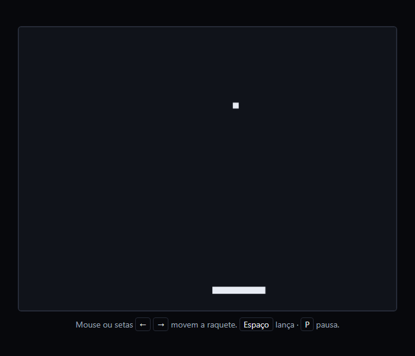
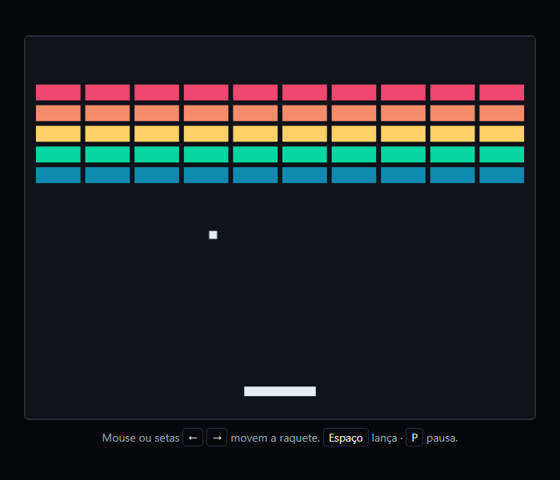
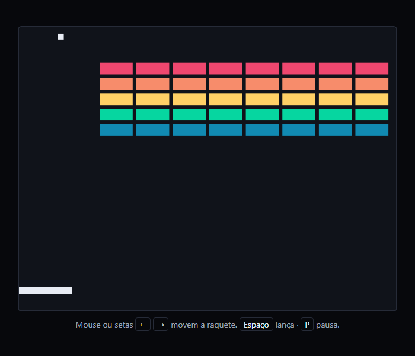
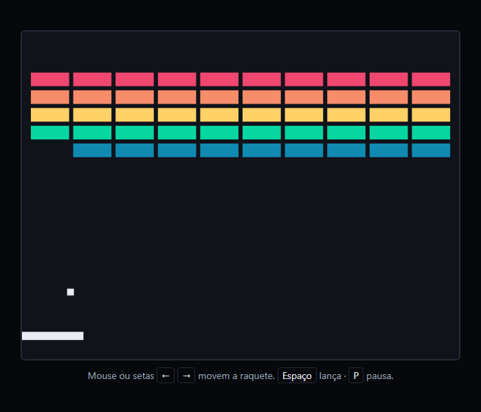
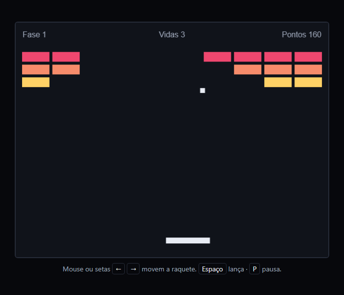

> A evolução natural do Pong: a mesma física, agora com dezenas de objetos para colidir e destruir. É onde aparece a pergunta que parece simples e não é — de que lado a bola bateu? — e onde um jogo ganha telas de menu, pausa e fim sem virar uma bagunça de laços. Este é o passo a passo que eu seguiria, e inclui a regra que costuma ser ensinada para descobrir o lado, com a medição de quantas vezes ela erra.

## O QUE VOCÊ PRECISA
- VS Code, com a extensão *Live Server* (opcional).
- Um navegador atual.
- Ter feito o Pong. A etapa 1 começa dele, e as explicações de `dt`, paredes e teclado não são repetidas aqui.

## ANTES DE ESCREVER A PRIMEIRA LINHA
Crie uma pasta chamada `breakout` e abra-a no VS Code (*Arquivo → Abrir Pasta*). Dentro dela, crie estes arquivos vazios:

~~~arvore
breakout/
├── index.html
├── estilo.css
└── jogo.js
~~~
HTML e CSS ficam prontos na etapa 1. O jogo inteiro cresce dentro do `jogo.js`.

### 1. Aproveite o Pong
Canvas, laço, bola, paredes e uma raquete embaixo — quase tudo copiado.
Se o seu Pong ficou bom, esta etapa é copiar e apagar. O laço com `dt`, o teto de 1/30 s, as paredes que devolvem a bola para dentro e forçam a direção, o objeto de teclas e o `blur` vêm sem mudar uma linha. O que muda: a raquete deita, as paredes passam a ser três, e entra o mouse.

~~~arquivo index.html
<!DOCTYPE html>
<html lang="pt-BR">
<head>
    <meta charset="UTF-8">
    <meta name="viewport" content="width=device-width, initial-scale=1.0">
    <title>Breakout</title>
    <link rel="stylesheet" href="estilo.css">
</head>
<body>
    <main>
        <canvas id="tela" width="640" height="480" aria-label="Jogo Breakout"></canvas>
        

            Mouse ou setas <kbd>←</kbd> <kbd>→</kbd> movem a raquete.
            <kbd>Espaço</kbd> lança · <kbd>P</kbd> pausa.
        

    </main>

    
</body>
</html>
~~~

~~~arquivo estilo.css
* {
    box-sizing: border-box;
    margin: 0;
    padding: 0;
}

body {
    min-height: 100vh;
    display: grid;
    place-items: center;
    padding: 24px;
    background: #07080c;
    color: #9aa3b5;
    font-family: 'Segoe UI', system-ui, sans-serif;
}

main {
    display: grid;
    justify-items: center;
    gap: 12px;
}

canvas {
    display: block;
    width: 640px;
    max-width: 100%;
    height: auto;
    border: 2px solid #262b38;
    border-radius: 6px;
    cursor: none;          /* a raquete é o cursor */
    touch-action: none;    /* arrastar o dedo move a raquete, não a página */
}

.dica { font-size: 14px; text-align: center; }

kbd {
    padding: 1px 6px;
    border: 1px solid #262b38;
    border-radius: 4px;
    color: #e8ecf4;
    font-family: inherit;
}
~~~

~~~arquivo jogo.js
const tela = document.getElementById('tela');
const ctx = tela.getContext('2d');

const LARGURA = tela.width;    // 640
const ALTURA = tela.height;    // 480

const BOLA = { tamanho: 10, velocidade: 340 };             // px/s
const RAQUETE = { largura: 90, altura: 12, velocidade: 480 };
const ANGULO_MAXIMO = Math.PI / 3;                          // 60° a partir da vertical

const raquete = { x: (LARGURA - RAQUETE.largura) / 2, y: ALTURA - 40 };
const bola = { x: 0, y: 0, vx: 0, vy: 0 };
const teclas = { ArrowLeft: false, ArrowRight: false };

let anterior = null;

function limitar(valor, minimo, maximo) {
    return Math.min(Math.max(valor, minimo), maximo);
}

/* A bola sai de cima da raquete, subindo com até 30° de inclinação. */
function sacar() {
    bola.x = raquete.x + (RAQUETE.largura - BOLA.tamanho) / 2;
    bola.y = raquete.y - BOLA.tamanho;
    const angulo = (Math.random() * 2 - 1) * (Math.PI / 6);
    bola.vx = BOLA.velocidade * Math.sin(angulo);
    bola.vy = -BOLA.velocidade * Math.cos(angulo);
}

/* O laço é o do Pong, sem mudar uma linha. */
function quadro(agora) {
    const dt = anterior === null ? 0 : Math.min((agora - anterior) / 1000, 1 / 30);
    anterior = agora;

    atualizar(dt);
    desenhar();
    requestAnimationFrame(quadro);
}

function atualizar(dt) {
    moverRaquete(dt);

    bola.x += bola.vx * dt;
    bola.y += bola.vy * dt;

    quicarNasParedes();
    rebaterNaRaquete();

    if (bola.y > ALTURA) sacar();   // provisório: ainda não há vidas
}

function moverRaquete(dt) {
    const direcao = (teclas.ArrowRight ? 1 : 0) - (teclas.ArrowLeft ? 1 : 0);
    raquete.x = limitar(raquete.x + direcao * RAQUETE.velocidade * dt, 0, LARGURA - RAQUETE.largura);
}

/* Três paredes agora: esquerda, direita e teto. O chão é por onde se perde. */
function quicarNasParedes() {
    if (bola.x < 0) {
        bola.x = -bola.x;
        bola.vx = Math.abs(bola.vx);
    } else if (bola.x + BOLA.tamanho > LARGURA) {
        bola.x = 2 * (LARGURA - BOLA.tamanho) - bola.x;
        bola.vx = -Math.abs(bola.vx);
    }
    if (bola.y < 0) {
        bola.y = -bola.y;
        bola.vy = Math.abs(bola.vy);
    }
}

/* A bola ocupa o retângulo (x, y, largura, altura)? */
function tocando(x, y, largura, altura) {
    return bola.x < x + largura && bola.x + BOLA.tamanho > x
        && bola.y < y + altura && bola.y + BOLA.tamanho > y;
}

function rebaterNaRaquete() {
    if (bola.vy <= 0) return;   // subindo: não rebate
    if (!tocando(raquete.x, raquete.y, RAQUETE.largura, RAQUETE.altura)) return;

    // Mesmo raciocínio do Pong, girado 90°: aqui o ângulo é medido a partir da vertical.
    const centro = bola.x + BOLA.tamanho / 2;
    const onde = limitar((centro - (raquete.x + RAQUETE.largura / 2)) / (RAQUETE.largura / 2), -1, 1);
    const angulo = onde * ANGULO_MAXIMO;
    const velocidade = Math.hypot(bola.vx, bola.vy);

    bola.vx = velocidade * Math.sin(angulo);
    bola.vy = -velocidade * Math.cos(angulo);
    bola.y = raquete.y - BOLA.tamanho;
}

function desenhar() {
    ctx.fillStyle = '#10131a';
    ctx.fillRect(0, 0, LARGURA, ALTURA);

    ctx.fillStyle = '#e8ecf4';
    ctx.fillRect(raquete.x, raquete.y, RAQUETE.largura, RAQUETE.altura);
    ctx.fillRect(bola.x, bola.y, BOLA.tamanho, BOLA.tamanho);
}

document.addEventListener('keydown', (evento) => {
    if (evento.key in teclas) {
        teclas[evento.key] = true;
        evento.preventDefault();
    }
});

document.addEventListener('keyup', (evento) => {
    if (evento.key in teclas) teclas[evento.key] = false;
});

window.addEventListener('blur', () => {
    teclas.ArrowLeft = false;
    teclas.ArrowRight = false;
});

/* O mouse dá a posição em pixels DA TELA. Se o CSS encolheu o canvas,
   é preciso converter para pixels DO CANVAS. */
tela.addEventListener('pointermove', (evento) => {
    const caixa = tela.getBoundingClientRect();
    const x = (evento.clientX - caixa.left) * (tela.width / caixa.width);
    raquete.x = limitar(x - RAQUETE.largura / 2, 0, LARGURA - RAQUETE.largura);
});

sacar();
requestAnimationFrame(quadro);
~~~

#### O ângulo agora é medido a partir da vertical

~~~codigo
bola.vx = velocidade * Math.sin(angulo);
bola.vy = -velocidade * Math.cos(angulo);
~~~
No Pong a bola saía na horizontal, então o cosseno ia para `vx`. Aqui ela sai para cima: com ângulo zero, toda a velocidade vai para `vy` (negativo, porque no canvas *y* cresce para baixo) e nada para `vx`. Seno e cosseno só trocaram de eixo. Medi: no meio da raquete a bola subiu reta; na ponta direita, saiu a 59° da vertical para a direita.

#### O mouse fala em pixels da tela, o jogo em pixels do canvas

~~~codigo
tela.addEventListener('pointermove', (evento) => {
    const caixa = tela.getBoundingClientRect();
    const x = (evento.clientX - caixa.left) * (tela.width / caixa.width);
    raquete.x = limitar(x - RAQUETE.largura / 2, 0, LARGURA - RAQUETE.largura);
});
~~~
`clientX` é a posição do mouse na janela. O canvas tem 640 px de desenho, mas numa tela pequena o CSS o encolhe. Sem converter, o mouse no meio do canvas encolhido pela metade dá `x = 160`, e a raquete vai parar na metade esquerda. Multiplicando pela razão entre a largura de desenho e a largura na tela, testei com o canvas em 320 px: o mouse no meio centralizou a raquete em 320, como deveria. `pointermove`, e não `mousemove`, porque também dispara com o dedo. É por isso que o CSS tem `touch-action: none`: sem ele, arrastar o dedo sobre o canvas rola a página.

!confira a bola quica nas laterais e no teto, rebate na raquete com ângulo pela posição, e volta a sair de cima da raquete quando cai. Mouse e setas movem a raquete.

### 2. Os blocos
Uma matriz de 5 × 10 blocos, gerada por dois laços.

~~~codigo
const BLOCO = { largura: 56, altura: 20, espaco: 6, topo: 60 };
const CORES = ['#ef476f', '#f78c6b', '#ffd166', '#06d6a0', '#118ab2', '#8338ec'];

function criarBlocos(linhas, colunas) {
    const larguraTotal = colunas * BLOCO.largura + (colunas - 1) * BLOCO.espaco;
    const margem = (LARGURA - larguraTotal) / 2;
    const lista = [];

    for (let linha = 0; linha < linhas; linha++) {
        for (let coluna = 0; coluna < colunas; coluna++) {
            lista.push({
                x: margem + coluna * (BLOCO.largura + BLOCO.espaco),
                y: BLOCO.topo + linha * (BLOCO.altura + BLOCO.espaco),
                cor: CORES[linha % CORES.length],
                vivo: true,
            });
        }
    }
    return lista;
}

let blocos = criarBlocos(5, 10);
~~~
E, em `desenhar()`, antes da raquete:

~~~codigo
for (const bloco of blocos) {
    if (!bloco.vivo) continue;
    ctx.fillStyle = bloco.cor;
    ctx.fillRect(bloco.x, bloco.y, BLOCO.largura, BLOCO.altura);
}
~~~

#### Posição calculada, não escrita
O laço de fora anda pelas linhas; o de dentro, pelas colunas. A posição de cada bloco sai da multiplicação: coluna × (largura + espaço). A margem é o que sobra da largura do canvas, dividido por dois — por isso a matriz fica centralizada sem nenhum número mágico. Conferi: primeiro bloco em `x =` `13`, último da linha em `x = 571`, linhas a cada 26 px, e nenhum par de blocos se sobrepondo. A cor vem de `CORES[linha % CORES.length]`: com mais linhas que cores, elas se repetem em vez de acabar.

#### Marcar como morto, em vez de remover
Cada bloco tem `vivo: true`. Destruir vai ser `bloco.vivo = false`, e não tirar o bloco do array. Remover itens de um array enquanto um laço anda por ele pula elementos — o índice seguinte escorrega para a posição do removido. Marcando, o array fica estável, e desenhar e colidir só pulam os mortos.

!confira cinco linhas coloridas, centralizadas, com espaço igual entre todos os blocos.

### 3. Destruir — do jeito ingênuo
A bola destrói o bloco e volta. Na maior parte das vezes.
`atualizar()` ganha uma chamada a `colidirComBlocos()`, logo depois de rebater na raquete. A primeira versão, que é a que todo mundo escreve:

~~~codigo
function colidirComBlocos() {
    for (const bloco of blocos) {
        if (!bloco.vivo) continue;
        if (!tocando(bloco.x, bloco.y, BLOCO.largura, BLOCO.altura)) continue;

        bloco.vivo = false;
        bola.vy = -bola.vy;
    }
}
~~~

#### Bug 1: dois blocos no mesmo quadro
O espaço entre dois blocos tem 6 px, e a bola tem 10. Quando ela sobe pela emenda, encosta nos dois ao mesmo tempo. O laço trata os dois: inverte `vy` no primeiro (agora desce) e de novo no segundo (agora sobe outra vez). As duas inversões se anulam, e a bola segue em frente destruindo. Coloquei a bola exatamente nessa situação: os dois blocos morreram e ela continuou subindo. Um quinto de segundo depois, já eram 6 blocos destruídos e ela ainda subia — é o corredor da imagem.

#### Bug 2: sempre o eixo vertical
Bater na lateral de um bloco deveria mandar a bola de volta para o lado. Esta versão inverte `vy` sempre. Testei com a bola chegando da esquerda: o bloco morreu, `vx` continuou apontando para a direita, e a bola seguiu para dentro do bloco vizinho.

!confira jogue um pouco: às vezes a bola atravessa uma fileira inteira, ou entra de lado numa linha e vai comendo tudo. A próxima etapa corrige as duas coisas.

### 4. De que lado bateu
Um bloco por quadro, e o lado decidido pela face que a bola cruzou por último.

~~~arquivo jogo.js — colidirComBlocos()
function colidirComBlocos() {
    for (const bloco of blocos) {
        if (!bloco.vivo) continue;
        if (!tocando(bloco.x, bloco.y, BLOCO.largura, BLOCO.altura)) continue;

        bloco.vivo = false;

        // Quanto a bola avançou para dentro do bloco em cada eixo.
        // Quanto a bola avançou para dentro do bloco, medido pela face que o
        // sentido do movimento permite cruzar: indo para a direita, só a da esquerda.
        const entrouX = bola.vx > 0 ? bola.x + BOLA.tamanho - bloco.x : bloco.x + BLOCO.largura - 
bola.x;
        const entrouY = bola.vy > 0 ? bola.y + BOLA.tamanho - bloco.y : bloco.y + BLOCO.altura - 
bola.y;

        // Penetração dividida pela velocidade = há quanto tempo a bola cruzou
        // aquela face. A face cruzada por último é a que ela bateu. Parada num
        // eixo, o tempo dá Infinity e esse eixo nunca é escolhido.
        const tempoX = entrouX / Math.abs(bola.vx);
        const tempoY = entrouY / Math.abs(bola.vy);

        if (tempoX < tempoY) {
            // Bateu do lado: volta no eixo horizontal e sai de dentro do bloco.
            const iaParaDireita = bola.vx > 0;
            bola.vx = iaParaDireita ? -Math.abs(bola.vx) : Math.abs(bola.vx);
            bola.x += iaParaDireita ? -entrouX : entrouX;
        } else {
            // Bateu em cima ou embaixo: volta no eixo vertical.
            const iaParaBaixo = bola.vy > 0;
            bola.vy = iaParaBaixo ? -Math.abs(bola.vy) : Math.abs(bola.vy);
            bola.y += iaParaBaixo ? -entrouY : entrouY;
        }

        return;   // um bloco por quadro: dois blocos não podem desfazer a inversão
    }
}
~~~

#### Um bloco por quadro
O `return` no fim do laço resolve o bug 1: tratou um bloco, acabou o quadro. Se a bola ainda estiver encostando no vizinho, ele é tratado no quadro seguinte — mas aí a bola já está indo embora, e não encosta mais. Na emenda, a versão nova destruiu um bloco e a bola desceu.

#### A regra famosa, e por que ela erra
A regra que costuma ser ensinada é: “compare o quanto a bola entrou no bloco em cada eixo; o eixo em que ela entrou menos é o lado em que bateu”. Parece lógico, e acerta na maioria das vezes. Mas pense na bola subindo reta pela emenda, com 3 px de largura sob o bloco. No quadro em que ela encosta, pode ter entrado 4 px para cima. A regra olha: 3 px na horizontal, 4 na vertical — “bateu do lado”. E a bola, que vinha reta de baixo, não volta. Medi todas as combinações de chegada pela emenda a 60 Hz: a regra da penetração erra o lado em 25% delas.

#### Penetração dividida pela velocidade

~~~codigo
const tempoX = entrouX / Math.abs(bola.vx);
const tempoY = entrouY / Math.abs(bola.vy);
~~~
A pergunta certa não é “quanto entrou”, e sim “há quanto tempo entrou”. Dividindo a penetração pela velocidade naquele eixo, sai o tempo desde que a bola cruzou aquela face. A face cruzada *por último* é a que ela acabou de bater. Com a bola subindo reta, `vx` é zero, e `3 / 0` em JavaScript é `Infinity` — ela nunca cruzou uma face lateral, e o eixo horizontal nunca é escolhido. Sem nenhum `if` especial. Um detalhe completa a regra: a penetração é medida pela face que o sentido permite cruzar. Indo para a direita, a bola só pode ter entrado pela face esquerda do bloco; medir pela direita daria um número sem sentido. Uma primeira versão minha, sem esse detalhe, ainda errava 6% das chegadas com a bola andando de lado. Com ele, rodei as 198 chegadas pela emenda com `vx` de 0, 40 e 120: nenhuma bola continuou subindo.

#### Por que aqui a sobreposição basta — e no Pong não bastava
No Pong, a bola a 900 px/s podia atravessar a raquete sem nunca se sobrepor a ela. Aqui a conta é outra. A velocidade máxima é 600 px/s, e o teto do `dt` é 1/30 s: o maior passo possível é 20 px. Para atravessar, a bola precisaria pular a janela inteira em que se sobrepõe ao bloco — 20 px do bloco mais 10 px dela, 30 px. Não cabe. Na raquete, 12 + 10 = 22 px, também maior que 20. Testei o pior caso: bola a 600 px/s, 30 Hz, subindo contra um bloco a partir de 40 posições diferentes. Nenhum bloco foi atravessado. Se um dia você aumentar a velocidade máxima, essa conta precisa ser refeita — ou a colisão varrida do Pong precisa voltar.

!confira a bola volta para baixo ao bater embaixo de um bloco, volta para o lado ao bater na lateral, e nunca atravessa uma fileira. Blocos destruídos não reaparecem nem colidem.

### 5. Vidas e fases
Três vidas, a bola presa na raquete antes do lançamento, e uma fase nova quando os blocos acabam.

~~~arquivo jogo.js
const tela = document.getElementById('tela');
const ctx = tela.getContext('2d');

const LARGURA = tela.width;
const ALTURA = tela.height;

const BOLA = { tamanho: 10, velocidadeInicial: 340, velocidadeMaxima: 600 };
const RAQUETE = { largura: 90, altura: 12, velocidade: 480 };
const ANGULO_MAXIMO = Math.PI / 3;
const VIDAS_INICIAIS = 3;

const BLOCO = { largura: 56, altura: 20, espaco: 6, topo: 60, colunas: 10, pontos: 10 };
const CORES = ['#ef476f', '#f78c6b', '#ffd166', '#06d6a0', '#118ab2', '#8338ec'];

const raquete = { x: (LARGURA - RAQUETE.largura) / 2, y: ALTURA - 40 };
const bola = { x: 0, y: 0, vx: 0, vy: 0 };
const teclas = { ArrowLeft: false, ArrowRight: false };

let blocos = [];
let fase = 1;
let vidas = VIDAS_INICIAIS;
let pontos = 0;
let presa = true;      // bola parada em cima da raquete, esperando o lançamento
let anterior = null;

function limitar(valor, minimo, maximo) {
    return Math.min(Math.max(valor, minimo), maximo);
}

function criarBlocos(linhas, colunas) {
    const larguraTotal = colunas * BLOCO.largura + (colunas - 1) * BLOCO.espaco;
    const margem = (LARGURA - larguraTotal) / 2;
    const lista = [];

    for (let linha = 0; linha < linhas; linha++) {
        for (let coluna = 0; coluna < colunas; coluna++) {
            lista.push({
                x: margem + coluna * (BLOCO.largura + BLOCO.espaco),
                y: BLOCO.topo + linha * (BLOCO.altura + BLOCO.espaco),
                cor: CORES[linha % CORES.length],
                vivo: true,
            });
        }
    }
    return lista;
}

/* Cada fase: uma linha a mais (até 8) e bola 12% mais rápida (até o teto). */
function linhasDaFase() {
    return Math.min(2 + fase, 8);
}

function velocidadeDaFase() {
    return Math.min(BOLA.velocidadeInicial * 1.12 ** (fase - 1), BOLA.velocidadeMaxima);
}

/* Montar a fase CRIA um array novo. Nenhum bloco da fase anterior sobrevive. */
function montarFase() {
    blocos = criarBlocos(linhasDaFase(), BLOCO.colunas);
    prenderBola();
}

function prenderBola() {
    presa = true;
    bola.vx = 0;
    bola.vy = 0;
    posicionarNaRaquete();
}

function posicionarNaRaquete() {
    bola.x = raquete.x + (RAQUETE.largura - BOLA.tamanho) / 2;
    bola.y = raquete.y - BOLA.tamanho;
}

function lancar() {
    if (!presa) return;
    presa = false;
    const angulo = (Math.random() * 2 - 1) * (Math.PI / 6);
    const velocidade = velocidadeDaFase();
    bola.vx = velocidade * Math.sin(angulo);
    bola.vy = -velocidade * Math.cos(angulo);
}

function perderVida() {
    vidas--;
    if (vidas > 0) {
        prenderBola();
        return;
    }
    // Provisório até a etapa 6: sem tela de fim, recomeça direto.
    fase = 1;
    vidas = VIDAS_INICIAIS;
    pontos = 0;
    montarFase();
}

function quadro(agora) {
    const dt = anterior === null ? 0 : Math.min((agora - anterior) / 1000, 1 / 30);
    anterior = agora;

    atualizar(dt);
    desenhar();
    requestAnimationFrame(quadro);
}

function atualizar(dt) {
    moverRaquete(dt);
    if (presa) {
        posicionarNaRaquete();   // a bola acompanha a raquete até ser lançada
        return;
    }

    bola.x += bola.vx * dt;
    bola.y += bola.vy * dt;

    quicarNasParedes();
    rebaterNaRaquete();
    colidirComBlocos();

    if (bola.y > ALTURA) {
        perderVida();
    } else if (blocos.every((b) => !b.vivo)) {
        fase++;
        montarFase();
    }
}

function moverRaquete(dt) {
    const direcao = (teclas.ArrowRight ? 1 : 0) - (teclas.ArrowLeft ? 1 : 0);
    raquete.x = limitar(raquete.x + direcao * RAQUETE.velocidade * dt, 0, LARGURA - RAQUETE.largura);
}

function quicarNasParedes() {
    if (bola.x < 0) {
        bola.x = -bola.x;
        bola.vx = Math.abs(bola.vx);
    } else if (bola.x + BOLA.tamanho > LARGURA) {
        bola.x = 2 * (LARGURA - BOLA.tamanho) - bola.x;
        bola.vx = -Math.abs(bola.vx);
    }
    if (bola.y < 0) {
        bola.y = -bola.y;
        bola.vy = Math.abs(bola.vy);
    }
}

function tocando(x, y, largura, altura) {
    return bola.x < x + largura && bola.x + BOLA.tamanho > x
        && bola.y < y + altura && bola.y + BOLA.tamanho > y;
}

function rebaterNaRaquete() {
    if (bola.vy <= 0) return;
    if (!tocando(raquete.x, raquete.y, RAQUETE.largura, RAQUETE.altura)) return;

    const centro = bola.x + BOLA.tamanho / 2;
    const onde = limitar((centro - (raquete.x + RAQUETE.largura / 2)) / (RAQUETE.largura / 2), -1, 1);
    const angulo = onde * ANGULO_MAXIMO;
    const velocidade = Math.hypot(bola.vx, bola.vy);

    bola.vx = velocidade * Math.sin(angulo);
    bola.vy = -velocidade * Math.cos(angulo);
    bola.y = raquete.y - BOLA.tamanho;
}
function colidirComBlocos() {
    for (const bloco of blocos) {
        if (!bloco.vivo) continue;
        if (!tocando(bloco.x, bloco.y, BLOCO.largura, BLOCO.altura)) continue;

        bloco.vivo = false;
        pontos += BLOCO.pontos;

        // Quanto a bola avançou para dentro do bloco, medido pela face que o
        // sentido do movimento permite cruzar: indo para a direita, só a da esquerda.
        const entrouX = bola.vx > 0 ? bola.x + BOLA.tamanho - bloco.x : bloco.x + BLOCO.largura - 
bola.x;
        const entrouY = bola.vy > 0 ? bola.y + BOLA.tamanho - bloco.y : bloco.y + BLOCO.altura - 
bola.y;

        // Penetração dividida pela velocidade = há quanto tempo a bola cruzou
        // aquela face. A face cruzada por último é a que ela bateu. Parada num
        // eixo, o tempo dá Infinity e esse eixo nunca é escolhido.
        const tempoX = entrouX / Math.abs(bola.vx);
        const tempoY = entrouY / Math.abs(bola.vy);

        if (tempoX < tempoY) {
            // Bateu do lado: volta no eixo horizontal e sai de dentro do bloco.
            const iaParaDireita = bola.vx > 0;
            bola.vx = iaParaDireita ? -Math.abs(bola.vx) : Math.abs(bola.vx);
            bola.x += iaParaDireita ? -entrouX : entrouX;
        } else {
            // Bateu em cima ou embaixo: volta no eixo vertical.
            const iaParaBaixo = bola.vy > 0;
            bola.vy = iaParaBaixo ? -Math.abs(bola.vy) : Math.abs(bola.vy);
            bola.y += iaParaBaixo ? -entrouY : entrouY;
        }

        return;
    }
}

function desenhar() {
    ctx.fillStyle = '#10131a';
    ctx.fillRect(0, 0, LARGURA, ALTURA);

    for (const bloco of blocos) {
        if (!bloco.vivo) continue;
        ctx.fillStyle = bloco.cor;
        ctx.fillRect(bloco.x, bloco.y, BLOCO.largura, BLOCO.altura);
    }

    ctx.fillStyle = '#e8ecf4';
    ctx.fillRect(raquete.x, raquete.y, RAQUETE.largura, RAQUETE.altura);
    ctx.fillRect(bola.x, bola.y, BOLA.tamanho, BOLA.tamanho);

    // Placar no topo
    ctx.fillStyle = '#9aa3b5';
    ctx.font = '16px sans-serif';
    ctx.textAlign = 'left';
    ctx.fillText(`Fase ${fase}`, 14, 30);
    ctx.textAlign = 'center';
    ctx.fillText(`Vidas ${vidas}`, LARGURA / 2, 30);
    ctx.textAlign = 'right';
    ctx.fillText(`Pontos ${pontos}`, LARGURA - 14, 30);

    if (presa) {
        ctx.textAlign = 'center';
        ctx.fillText('Espaço ou clique para lançar', LARGURA / 2, raquete.y - 30);
    }
}

document.addEventListener('keydown', (evento) => {
    if (evento.key in teclas) {
        teclas[evento.key] = true;
        evento.preventDefault();
    }
    if (evento.key === ' ') {
        evento.preventDefault();   // espaço não rola a página
        lancar();
    }
});

document.addEventListener('keyup', (evento) => {
    if (evento.key in teclas) teclas[evento.key] = false;
});

window.addEventListener('blur', () => {
    teclas.ArrowLeft = false;
    teclas.ArrowRight = false;
});

tela.addEventListener('pointermove', (evento) => {
    const caixa = tela.getBoundingClientRect();
    const x = (evento.clientX - caixa.left) * (tela.width / caixa.width);
    raquete.x = limitar(x - RAQUETE.largura / 2, 0, LARGURA - RAQUETE.largura);
});

tela.addEventListener('click', lancar);

montarFase();
requestAnimationFrame(quadro);
~~~

#### A bola presa
Enquanto `presa` for verdadeiro, `atualizar()` move a raquete, cola a bola em cima dela e para ali. A pessoa escolhe de onde lançar; Espaço ou clique chamam `lancar()`, que só funciona uma vez. Conferi: com a seta segurada, a bola acompanhou a raquete; o Espaço a lançou a 340 px/s.

#### Fase nova é array novo

~~~codigo
function montarFase() {
    blocos = criarBlocos(linhasDaFase(), BLOCO.colunas);
    prenderBola();
}
~~~
O critério “passar de fase não deixa resíduo” se resolve com uma decisão: `criarBlocos()` devolve um array novo, e ele substitui o antigo. Nenhum bloco morto da fase anterior existe mais para ser confundido. Limpei todos os blocos da fase 1: o quadro seguinte já estava na fase 2, com 40 blocos, todos vivos, e a bola presa de novo.

#### Dificuldade calculada a partir da fase

~~~codigo
function linhasDaFase() {
    return Math.min(2 + fase, 8);
}

function velocidadeDaFase() {
    return Math.min(BOLA.velocidadeInicial * 1.12 ** (fase - 1), BOLA.velocidadeMaxima);
}
~~~
Como a velocidade da Cobrinha, a dificuldade não é somada a cada fase: é calculada. A fase 2 lançou a 380,8 px/s (12% a mais). A fase 10 pediria 942 px/s e 12 linhas; os limites deram 600 px/s e 8 linhas. O teto de 600 não é gosto: é o número que mantém a conta de “não atravessa” da etapa 4 verdadeira.

!confira perca a bola: uma vida a menos, e ela volta presa na raquete. Destrua todos os blocos: fase 2, uma linha a mais, bola mais rápida. Perca as três vidas: por enquanto o jogo recomeça sozinho.

### 6. Telas de estado
Menu, jogando, pausado e fim — com um laço só.
O arquivo final. As mudanças em relação à etapa 5 são a variável `estado` e as funções `novoJogo()`, `acaoPrincipal()`, `alternarPausa()` e `textoCentral()`; `quadro()` só chama `atualizar()` jogando; `perderVida()` leva ao fim; e os ouvintes de teclado, aba e mouse passam a consultar o estado.

~~~arquivo jogo.js
const tela = document.getElementById('tela');
const ctx = tela.getContext('2d');

const LARGURA = tela.width;
const ALTURA = tela.height;

const BOLA = { tamanho: 10, velocidadeInicial: 340, velocidadeMaxima: 600 };
const RAQUETE = { largura: 90, altura: 12, velocidade: 480 };
const ANGULO_MAXIMO = Math.PI / 3;
const VIDAS_INICIAIS = 3;

const BLOCO = { largura: 56, altura: 20, espaco: 6, topo: 60, colunas: 10, pontos: 10 };
const CORES = ['#ef476f', '#f78c6b', '#ffd166', '#06d6a0', '#118ab2', '#8338ec'];

const raquete = { x: (LARGURA - RAQUETE.largura) / 2, y: ALTURA - 40 };
const bola = { x: 0, y: 0, vx: 0, vy: 0 };
const teclas = { ArrowLeft: false, ArrowRight: false };

/* Uma variável decide o que o jogo está fazendo — e um laço só obedece a ela. */
let estado = 'menu';   // 'menu' | 'jogando' | 'pausado' | 'fim'
let blocos = [];
let fase = 1;
let vidas = VIDAS_INICIAIS;
let pontos = 0;
let presa = true;
let anterior = null;

function limitar(valor, minimo, maximo) {
    return Math.min(Math.max(valor, minimo), maximo);
}

function criarBlocos(linhas, colunas) {
    const larguraTotal = colunas * BLOCO.largura + (colunas - 1) * BLOCO.espaco;
    const margem = (LARGURA - larguraTotal) / 2;
    const lista = [];

    for (let linha = 0; linha < linhas; linha++) {
        for (let coluna = 0; coluna < colunas; coluna++) {
            lista.push({
                x: margem + coluna * (BLOCO.largura + BLOCO.espaco),
                y: BLOCO.topo + linha * (BLOCO.altura + BLOCO.espaco),
                cor: CORES[linha % CORES.length],
                vivo: true,
            });
        }
    }
    return lista;
}

function linhasDaFase() {
    return Math.min(2 + fase, 8);
}

function velocidadeDaFase() {
    return Math.min(BOLA.velocidadeInicial * 1.12 ** (fase - 1), BOLA.velocidadeMaxima);
}

function montarFase() {
    blocos = criarBlocos(linhasDaFase(), BLOCO.colunas);
    prenderBola();
}

function prenderBola() {
    presa = true;
    bola.vx = 0;
    bola.vy = 0;
    posicionarNaRaquete();
}

function posicionarNaRaquete() {
    bola.x = raquete.x + (RAQUETE.largura - BOLA.tamanho) / 2;
    bola.y = raquete.y - BOLA.tamanho;
}

function novoJogo() {
    fase = 1;
    vidas = VIDAS_INICIAIS;
    pontos = 0;
    raquete.x = (LARGURA - RAQUETE.largura) / 2;
    montarFase();
    estado = 'jogando';
}

function lancar() {
    if (!presa) return;
    presa = false;
    const angulo = (Math.random() * 2 - 1) * (Math.PI / 6);
    const velocidade = velocidadeDaFase();
    bola.vx = velocidade * Math.sin(angulo);
    bola.vy = -velocidade * Math.cos(angulo);
}

function perderVida() {
    vidas--;
    if (vidas > 0) prenderBola();
    else estado = 'fim';
}

/* O que o Espaço (e o clique) faz depende do estado. */
function acaoPrincipal() {
    if (estado === 'menu' || estado === 'fim') novoJogo();
    else if (estado === 'jogando') lancar();
}
function alternarPausa() {
    if (estado === 'jogando') estado = 'pausado';
    else if (estado === 'pausado') estado = 'jogando';
}

function quadro(agora) {
    const dt = anterior === null ? 0 : Math.min((agora - anterior) / 1000, 1 / 30);
    anterior = agora;

    if (estado === 'jogando') atualizar(dt);   // só aqui o mundo se move
    desenhar();                                // desenhar acontece sempre
    requestAnimationFrame(quadro);
}

function atualizar(dt) {
    moverRaquete(dt);

    if (presa) {
        posicionarNaRaquete();
        return;
    }

    bola.x += bola.vx * dt;
    bola.y += bola.vy * dt;

    quicarNasParedes();
    rebaterNaRaquete();
    colidirComBlocos();

    if (bola.y > ALTURA) {
        perderVida();
    } else if (blocos.every((b) => !b.vivo)) {
        fase++;
        montarFase();
    }
}

function moverRaquete(dt) {
    const direcao = (teclas.ArrowRight ? 1 : 0) - (teclas.ArrowLeft ? 1 : 0);
    raquete.x = limitar(raquete.x + direcao * RAQUETE.velocidade * dt, 0, LARGURA - RAQUETE.largura);
}

function quicarNasParedes() {
    if (bola.x < 0) {
        bola.x = -bola.x;
        bola.vx = Math.abs(bola.vx);
    } else if (bola.x + BOLA.tamanho > LARGURA) {
        bola.x = 2 * (LARGURA - BOLA.tamanho) - bola.x;
        bola.vx = -Math.abs(bola.vx);
    }
    if (bola.y < 0) {
        bola.y = -bola.y;
        bola.vy = Math.abs(bola.vy);
    }
}

function tocando(x, y, largura, altura) {
    return bola.x < x + largura && bola.x + BOLA.tamanho > x
        && bola.y < y + altura && bola.y + BOLA.tamanho > y;
}

function rebaterNaRaquete() {
    if (bola.vy <= 0) return;
    if (!tocando(raquete.x, raquete.y, RAQUETE.largura, RAQUETE.altura)) return;

    const centro = bola.x + BOLA.tamanho / 2;
    const onde = limitar((centro - (raquete.x + RAQUETE.largura / 2)) / (RAQUETE.largura / 2), -1, 1);
    const angulo = onde * ANGULO_MAXIMO;
    const velocidade = Math.hypot(bola.vx, bola.vy);

    bola.vx = velocidade * Math.sin(angulo);
    bola.vy = -velocidade * Math.cos(angulo);
    bola.y = raquete.y - BOLA.tamanho;
}

function colidirComBlocos() {
    for (const bloco of blocos) {
        if (!bloco.vivo) continue;
        if (!tocando(bloco.x, bloco.y, BLOCO.largura, BLOCO.altura)) continue;

        bloco.vivo = false;
        pontos += BLOCO.pontos;

        // Quanto a bola avançou para dentro do bloco, medido pela face que o
        // sentido do movimento permite cruzar: indo para a direita, só a da esquerda.
        const entrouX = bola.vx > 0 ? bola.x + BOLA.tamanho - bloco.x : bloco.x + BLOCO.largura - 
bola.x;
        const entrouY = bola.vy > 0 ? bola.y + BOLA.tamanho - bloco.y : bloco.y + BLOCO.altura - 
bola.y;

        // Penetração dividida pela velocidade = há quanto tempo a bola cruzou
        // aquela face. A face cruzada por último é a que ela bateu. Parada num
        // eixo, o tempo dá Infinity e esse eixo nunca é escolhido.
        const tempoX = entrouX / Math.abs(bola.vx);
        const tempoY = entrouY / Math.abs(bola.vy);

        if (tempoX < tempoY) {
            // Bateu do lado: volta no eixo horizontal e sai de dentro do bloco.
            const iaParaDireita = bola.vx > 0;
            bola.vx = iaParaDireita ? -Math.abs(bola.vx) : Math.abs(bola.vx);
            bola.x += iaParaDireita ? -entrouX : entrouX;
        } else {
            // Bateu em cima ou embaixo: volta no eixo vertical.
            const iaParaBaixo = bola.vy > 0;
            bola.vy = iaParaBaixo ? -Math.abs(bola.vy) : Math.abs(bola.vy);
            bola.y += iaParaBaixo ? -entrouY : entrouY;
        }

        return;
    }
}

function textoCentral(titulo, linha) {
    ctx.fillStyle = 'rgba(7, 8, 12, 0.72)';
    ctx.fillRect(0, 0, LARGURA, ALTURA);
    ctx.fillStyle = '#e8ecf4';
    ctx.textAlign = 'center';
    ctx.font = 'bold 36px sans-serif';
    ctx.fillText(titulo, LARGURA / 2, ALTURA / 2 - 10);
    ctx.font = '17px sans-serif';
    ctx.fillText(linha, LARGURA / 2, ALTURA / 2 + 26);
}

function desenhar() {
    ctx.fillStyle = '#10131a';
    ctx.fillRect(0, 0, LARGURA, ALTURA);

    for (const bloco of blocos) {
        if (!bloco.vivo) continue;
        ctx.fillStyle = bloco.cor;
        ctx.fillRect(bloco.x, bloco.y, BLOCO.largura, BLOCO.altura);
    }

    ctx.fillStyle = '#e8ecf4';
    ctx.fillRect(raquete.x, raquete.y, RAQUETE.largura, RAQUETE.altura);
    ctx.fillRect(bola.x, bola.y, BOLA.tamanho, BOLA.tamanho);

    ctx.fillStyle = '#9aa3b5';
    ctx.font = '16px sans-serif';
    ctx.textAlign = 'left';
    ctx.fillText(`Fase ${fase}`, 14, 30);
    ctx.textAlign = 'center';
    ctx.fillText(`Vidas ${vidas}`, LARGURA / 2, 30);
    ctx.textAlign = 'right';
    ctx.fillText(`Pontos ${pontos}`, LARGURA - 14, 30);

    // A mesma cena por baixo; o estado só decide o que vai por cima.
    if (estado === 'menu') {
        textoCentral('BREAKOUT', 'Espaço ou clique para começar');
    } else if (estado === 'pausado') {
        textoCentral('Pausado', 'P para continuar');
    } else if (estado === 'fim') {
        textoCentral('Fim de jogo', `${pontos} pontos na fase ${fase} · Espaço para jogar de novo`);
    } else if (presa) {
        ctx.textAlign = 'center';
        ctx.fillStyle = '#9aa3b5';
        ctx.fillText('Espaço ou clique para lançar', LARGURA / 2, raquete.y - 30);
    }
}

document.addEventListener('keydown', (evento) => {
    if (evento.key in teclas) {
        teclas[evento.key] = true;
        evento.preventDefault();
    } else if (evento.key === ' ') {
        evento.preventDefault();
        acaoPrincipal();
    } else if (evento.key === 'p' || evento.key === 'P' || evento.key === 'Escape') {
        alternarPausa();
    }
});

document.addEventListener('keyup', (evento) => {
    if (evento.key in teclas) teclas[evento.key] = false;
});

window.addEventListener('blur', () => {
    teclas.ArrowLeft = false;
    teclas.ArrowRight = false;
});

/* Trocar de aba no meio da partida pausa sozinho. */
document.addEventListener('visibilitychange', () => {
    if (document.hidden && estado === 'jogando') estado = 'pausado';
});

tela.addEventListener('pointermove', (evento) => {
    if (estado !== 'jogando') return;   // pausado, a raquete também não se move
    const caixa = tela.getBoundingClientRect();
    const x = (evento.clientX - caixa.left) * (tela.width / caixa.width);
    raquete.x = limitar(x - RAQUETE.largura / 2, 0, LARGURA - RAQUETE.largura);
});

tela.addEventListener('click', acaoPrincipal);

montarFase();          // os blocos aparecem atrás do menu
requestAnimationFrame(quadro);
~~~

#### Um laço, e o estado decide

~~~codigo
function quadro(agora) {
    const dt = anterior === null ? 0 : Math.min((agora - anterior) / 1000, 1 / 30);
    anterior = agora;

    if (estado === 'jogando') atualizar(dt);   // só aqui o mundo se move
    desenhar();                                // desenhar acontece sempre
    requestAnimationFrame(quadro);
}
~~~
A tentação é ter um laço para o menu, outro para o jogo, outro para a pausa. Cada troca de tela precisaria cancelar um laço e começar outro — e bastava esquecer um cancelamento para dois laços rodarem juntos e o jogo andar no dobro da velocidade. É o bug dos dois `setInterval` do Pomodoro, com outra roupa. Aqui o laço é um só e nunca para. Ele sempre desenha; só atualiza quando está jogando. `desenhar()` pinta a mesma cena em qualquer estado e só escolhe o que vai por cima.

#### A pausa que não mexe em nada
Pausei no meio de uma jogada e, durante dois segundos pausado, segurei a seta e movi o mouse. Bola e raquete ficaram idênticas. A seta estava coberta pelo laço: `moverRaquete()` só roda dentro de `atualizar()`. O mouse não estava — o `pointermove` mexe na raquete direto, fora do laço. Por isso ele ganhou a primeira linha `if (estado !== 'jogando') return;`. Todo evento que altera o jogo por fora do laço precisa respeitar o estado por conta própria. E ao despausar a bola não dá salto: como o laço continuou rodando, `anterior` está sempre fresco, e o primeiro `dt` depois da pausa é de um quadro só.

#### O que a aba escondida faz
No Pong, esconder a aba só congelava o laço. Aqui, `visibilitychange` pausa o jogo: quem volta encontra a tela de pausa, e não uma bola já caindo. Simulei a aba escondida no meio da partida, e o estado foi para `'pausado'`. P e Esc alternam.

#### Uma tecla, quatro significados

~~~codigo
function acaoPrincipal() {
    if (estado === 'menu' || estado === 'fim') novoJogo();
    else if (estado === 'jogando') lancar();
}
~~~
Espaço começa no menu, lança jogando, recomeça no fim — e não faz nada pausado. O clique no canvas chama a mesma função. Na tela de fim, testei: P não fez nada, e o clique recomeçou com fase 1, 3 vidas, zero pontos, 30 blocos e a bola presa.

!confira o jogo abre no menu; Espaço começa; P pausa e nada se move, nem com o mouse; troque de aba e volte — está pausado; perca as três vidas — tela de fim; Espaço recomeça limpo.

### ✓ Roteiro de teste
Passe por estes casos antes de considerar a oficina concluída. Eles cobrem o que costuma quebrar.

| VOCÊ FAZ | DEVE ACONTECER |
|---|---|
| Bater embaixo de um bloco | a bola volta para baixo |
| Bater na lateral de um bloco | a bola volta para o lado |
| Mandar a bola pela emenda entre dois blocos | um bloco só é destruído, e ela volta |
| Observar blocos destruídos | não reaparecem e não colidem |
| Limpar uma fase | fase nova limpa, com uma linha a mais e bola mais rápida |
| Perder a bola | uma vida a menos, bola presa na raquete |
| Perder as três vidas | tela de fim; Espaço recomeça do zero |
| Pausar e mexer o mouse e as setas | nada se move; ao despausar, continua de onde estava |
| Trocar de aba jogando | ao voltar, o jogo está pausado |
| Encolher a janela e jogar com o mouse | a raquete segue o mouse certinho |

### ! Quando não funcionar
Os tropeços desta oficina, e o que procurar em cada um.

| SINTOMA | CAUSA QUASE CERTA |
|---|---|
| A raquete fica deslocada do mouse numa tela pequena | Falta converter `clientX` pela razão entre `tela.width` e a largura na tela. |
| Arrastar o dedo rola a página | Falta `touch-action: none` no canvas. |
| A bola atravessa uma fileira inteira | Mais de um bloco tratado no mesmo quadro. Saia do laço depois do primeiro. |
| A bola entra de lado e vai destruindo a linha | Só `vy` é invertido. Decida o eixo pela face cruzada. |
| Às vezes a bola não volta ao bater embaixo | O lado é decidido só pela penetração. Divida pela velocidade, medindo pela face do sentido. |
| Blocos invisíveis continuam rebatendo | O teste de colisão não pula blocos com `vivo: false`. |
| Na fase nova sobram blocos mortos ou a bola sai voando | `montarFase()` não cria um array novo, ou não prende a bola. |
| Pausado, a raquete se move com o mouse | O `pointermove` não consulta o estado. |
| Depois de voltar ao menu o jogo fica mais rápido | Existem dois laços rodando. Use um só e deixe o estado decidir. |

### → Para levar adiante
Extensões em ordem de dificuldade. Todas cabem no que você já construiu.
1. Blocos de duas batidas. Troque `vivo` por `resistencia`: bater subtrai 1, e a cor clareia a cada batida. 2. Itens que caem. Um bloco especial solta um item que desce; pegar com a raquete a alarga por 10 segundos no relógio de jogo. 3. Editor de fases. Fases como arrays de texto ( `"##..##"`) que `criarBlocos()` lê em vez do laço fixo. 4. Muitos blocos. Com milhares de blocos, testar todos a cada quadro pesa. Uma grade espacial testa só os blocos perto da bola.
