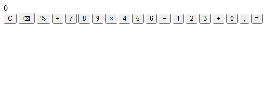
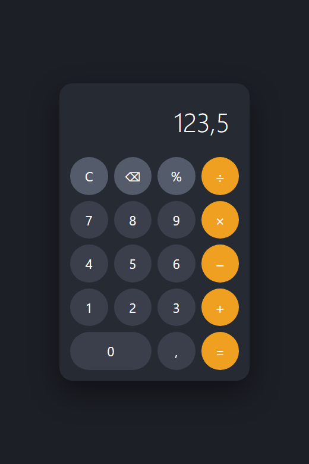
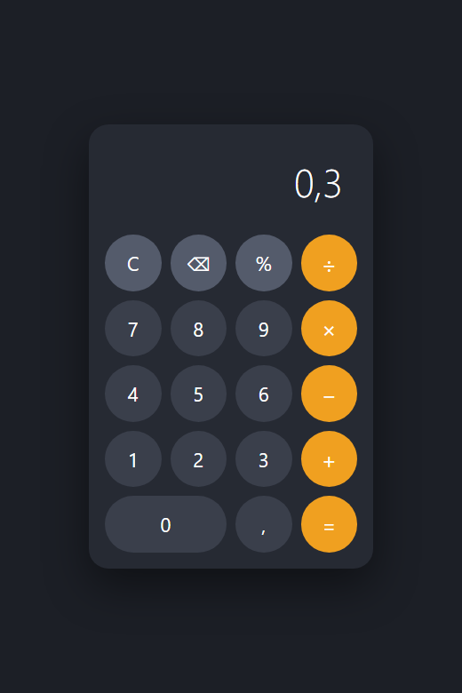
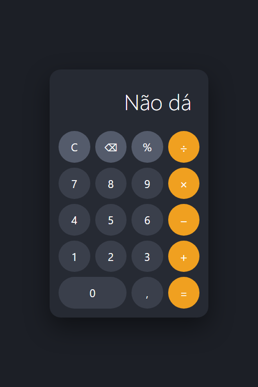

> Este é o passo a passo que eu seguiria se estivesse construindo a calculadora do zero, no VS Code, agora. Cada etapa termina com um programa que abre no navegador e funciona — nada fica pela metade esperando a etapa seguinte. As telas mostram exatamente o que você deve estar vendo ao fim de cada uma.

## O QUE VOCÊ PRECISA
- VS Code instalado, com a extensão *Live Server* (opcional, mas poupa apertar F5 o tempo todo).
- Um navegador. Qualquer um dos atuais serve.
- Saber o que é uma tag HTML e o que é uma função. O resto está explicado aqui.

## ANTES DE ESCREVER A PRIMEIRA LINHA
Crie uma pasta chamada `calculadora` e abra-a no VS Code (*Arquivo → Abrir Pasta*). Dentro dela, crie três arquivos vazios:

~~~arvore
calculadora/
├── index.html
├── estilo.css
└── app.js
~~~
São sempre esses três, e eles ficam assim até o fim. O que muda de etapa para etapa é o conteúdo — nunca a estrutura de pastas.

### 1. A estrutura, sem nenhum estilo
Escrever o HTML inteiro de uma vez e olhar o resultado feio de propósito.
Começo sempre pelo HTML completo. É tentador estilizar um botão bonito antes de ter os outros dezoito, mas isso esconde erros de estrutura embaixo de cor. Prefiro ver a página crua primeiro: se algum botão faltar, aparece agora, não daqui a uma hora.

~~~arquivo index.html
<!DOCTYPE html>
<html lang="pt-BR">
<head>
    <meta charset="UTF-8">
    <meta name="viewport" content="width=device-width, initial-scale=1.0">
    <title>Calculadora</title>
    <link rel="stylesheet" href="estilo.css">
</head>
<body>
    <main class="calculadora">
        <output class="visor" id="visor">0</output>

        

            <button class="tecla acao"     data-acao="limpar">C</button>
            <button class="tecla acao"     data-acao="apagar">&#9003;</button>
            <button class="tecla acao"     data-acao="porcento">%</button>
            <button class="tecla operador" data-operador="/">&divide;</button>

            <button class="tecla" data-digito="7">7</button>
            <button class="tecla" data-digito="8">8</button>
            <button class="tecla" data-digito="9">9</button>
            <button class="tecla operador" data-operador="*">&times;</button>

            <button class="tecla" data-digito="4">4</button>
            <button class="tecla" data-digito="5">5</button>
            <button class="tecla" data-digito="6">6</button>
            <button class="tecla operador" data-operador="-">&minus;</button>

            <button class="tecla" data-digito="1">1</button>
            <button class="tecla" data-digito="2">2</button>
            <button class="tecla" data-digito="3">3</button>
            <button class="tecla operador" data-operador="+">+</button>

            <button class="tecla zero" data-digito="0">0</button>
            <button class="tecla" data-digito=",">,</button>
            <button class="tecla igual" data-acao="igual">=</button>
        

    </main>

    
</body>
</html>
~~~

#### Por que `<output>` e não `
` no visor?
Porque `<output>` quer dizer, no próprio HTML, “aqui aparece o resultado de um cálculo”. Leitores de tela anunciam a mudança de valor sem que você precise configurar nada. Visualmente é idêntico a uma `div`; a diferença é de significado, e significado é de graça — basta escolher a tag certa.

#### Por que `data-digito`, `data-operador`, `data-acao`?
Este é o ponto mais importante da etapa, e ele decide o tamanho do JavaScript lá na frente. Um atributo `data-*` guarda um dado seu dentro da tag, e o JavaScript lê tudo isso por `elemento.dataset`. Ao marcar cada botão com o que ele significa, você não precisa depois perguntar “qual botão foi clicado?” comparando textos na tela. O botão já chega dizendo o que é. Repare também que os três nomes separam o teclado em três categorias de comportamento: dígito entra no número, operador guarda a conta, ação faz outra coisa. Essa divisão vai virar, literalmente, os três `if` do programa.

#### Por que `<script>` no fim do `<body>`?
Porque o navegador lê a página de cima para baixo. Se o script estivesse no `<head>`, ele rodaria antes de os botões existirem e `getElementById('visor')` devolveria `null`. Colocando no fim, quando o script roda a página inteira já está montada.

!confira abra o `index.html` no navegador. Você deve ver o `0` e dezenove botões desalinhados. Conte-os: quatro linhas de quatro, mais três embaixo.

### 2. A grade, com CSS Grid
Transformar a fileira de botões em teclado — em cerca de trinta linhas de CSS.
Um teclado de calculadora é uma grade de quatro colunas com uma exceção: o zero, que ocupa duas. CSS Grid resolve isso em duas declarações, e é por isso que ele é a ferramenta certa aqui — `flexbox` daria um trabalho bem maior para o mesmo resultado.

~~~arquivo estilo.css
* {
    box-sizing: border-box;
    margin: 0;
    padding: 0;
}

body {
    min-height: 100vh;
    display: grid;
    place-items: center;
    background: #1c1f26;
    font-family: 'Segoe UI', system-ui, sans-serif;
}

.calculadora {
    width: 320px;
    padding: 18px;
    background: #262a33;
    border-radius: 22px;
    box-shadow: 0 20px 50px rgba(0, 0, 0, .45);
}

/* O visor precisa alinhar à direita e não deixar número grande vazar */
.visor {
    display: block;
    padding: 22px 16px;
    margin-bottom: 14px;
    text-align: right;
    font-size: 44px;
    font-weight: 300;
    color: #fff;
    line-height: 1.1;
    overflow-x: auto;
    white-space: nowrap;
}

/* Quatro colunas iguais: é a grade inteira em uma linha de CSS */
.teclado {
    display: grid;
    grid-template-columns: repeat(4, 1fr);
    gap: 10px;
}

.tecla {
    aspect-ratio: 1;
    border: 0;
    border-radius: 50%;
    background: #3a3f4b;
    color: #fff;
    font-size: 22px;
    font-family: inherit;
    cursor: pointer;
    transition: filter .15s;
}

.tecla:hover { filter: brightness(1.25); }
.tecla:active { filter: brightness(.85); }

.acao { background: #545b6b; }
.operador { background: #f0a020; font-size: 25px; }
.igual { background: #f0a020; }

/* O zero ocupa duas colunas — a única exceção da grade */
.zero {
    grid-column: span 2;
    aspect-ratio: auto;
    border-radius: 999px;
}
~~~

#### As duas linhas que fazem a grade

~~~codigo
grid-template-columns: repeat(4, 1fr);
~~~
`1fr` é “uma fração do espaço que sobrou”. Quatro colunas de `1fr` dividem a largura em quatro partes iguais, sem você calcular pixel nenhum — e continuam iguais se a calculadora mudar de largura.

~~~codigo
.zero { grid-column: span 2; }
~~~
“Este item ocupa duas colunas.” Como a grade tem quatro e a última linha tem três itens, a conta fecha: 2 + 1 + 1.

#### `aspect-ratio: 1` — o truque do botão redondo
Ele diz “sua altura acompanha sua largura”. Com isso os botões são quadrados perfeitos em qualquer tamanho de tela, e `border-radius: 50%` os transforma em círculos exatos. Sem `aspect-ratio`, você teria que fixar a altura em pixels e o círculo viraria elipse quando a largura mudasse. O zero desliga isso ( `aspect-ratio: auto`) justamente porque não é quadrado — ele é o dobro de largo, e por isso usa `border-radius: 999px`, que arredonda as pontas de qualquer retângulo.

#### `box-sizing: border-box` no `*`
Sem isso, quando você dá `width: 320px` e `padding: 18px` ao mesmo elemento, ele ocupa 356px na tela — o padding é somado por fora. Com `border-box`, 320px são 320px, padding incluído. É a primeira linha de praticamente todo CSS que eu escrevo, e evita uma classe inteira de desalinhamentos.

!confira quatro colunas alinhadas, o zero com o dobro da largura, os botões clareando ao passar o mouse. Se o zero não estiver esticado, confira se a classe `zero` está no botão certo no HTML.

### 3. O primeiro dígito na tela
Fazer os números aparecerem — com um único ouvinte de clique para os dezenove botões.
Agora o `app.js`. E aqui vem a primeira decisão de arquitetura de verdade: não vou colocar um `addEventListener` em cada botão. Coloco um só, no teclado inteiro.

~~~arquivo app.js
const visor = document.getElementById('visor');
const teclado = document.getElementById('teclado');

/* O que está sendo digitado agora, sempre como texto. */
let atual = '0';

function mostrar() {
    visor.textContent = atual;
}

/* Um ouvinte só, no pai. Ele atende os 19 botões — inclusive os que
   ainda nem existem, se um dia a grade crescer. */
teclado.addEventListener('click', (evento) => {
    const tecla = evento.target.closest('.tecla');
    if (!tecla) return;

    const digito = tecla.dataset.digito;
    if (digito === undefined) return;

    digitar(digito);
    mostrar();
});

function digitar(caractere) {
    // O zero inicial some assim que qualquer outro dígito chega.
    if (atual === '0' && caractere !== ',') {
        atual = caractere;
        return;
    }
    atual += caractere;
}

mostrar();
~~~

#### Delegação de eventos: um ouvinte no lugar de dezenove
Cliques sobem pela árvore do HTML: clicar no botão `7` dispara um evento que passa pelo `.teclado` antes de chegar ao documento. Então basta ouvir no pai. `evento.target` é onde o clique nasceu; `.closest('.tecla')` sobe a partir dali até achar a tecla — importante porque o clique pode nascer num elemento interno, e não no botão em si. Se não achar nenhuma tecla (você clicou no espaço entre os botões), `closest` devolve `null` e o `if (!tecla)` `return;` encerra em silêncio. O ganho prático: acrescentar um botão ao HTML depois não exige tocar no JavaScript. Ele já vai funcionar.

#### Por que `atual` é texto e não número?
Porque digitar não é calcular. Enquanto a pessoa digita, você precisa de coisas que só texto tem: um zero à esquerda que some, uma vírgula que ainda não terminou ( `3,` não é número nenhum), um *backspace* que remove o último caractere. Como número, `3,` seria impossível de representar. A conversão para número acontece uma vez só, na hora de fazer a conta — e você vai ver isso na próxima etapa.

#### A separação entre `digitar()` e `mostrar()`
`digitar()` muda o estado; `mostrar()` copia o estado para a tela. Nenhuma função de regra toca no visor diretamente. Parece exagero com uma função só. Na etapa 5 haverá seis, e o valor aparece: qualquer uma delas pode mudar o número sabendo que a tela será atualizada, e existe um único lugar no programa que escreve no visor. Quando o visor mostrar algo errado, há uma linha para investigar, não seis.

!confira clique `1 2 3` — deve aparecer `123`, e não `0123`. Operadores e o `=` ainda não fazem nada; é o previsto.

### 4. A conta
As quatro operações, com um modelo de estado de quatro variáveis.
Esta é a etapa que as pessoas costumam achar difícil, e a dificuldade quase nunca está na matemática — está em perceber quanta coisa a calculadora precisa lembrar. Pense no que acontece quando você aperta `7`, `÷`, `8`, `=`. No instante em que o `÷` é apertado, o `7` tem que ser guardado em algum lugar, porque o visor vai ser reaproveitado para o próximo número. E o programa precisa lembrar que a operação pendente é divisão. São quatro informações:

!nota `atual` o número que está sendo digitado agora `anterior` o número guardado quando o operador foi apertado `operador` qual conta está pendente `recomecar` o próximo dígito começa um número novo ou continua este?

~~~arquivo app.js
const visor = document.getElementById('visor');
const teclado = document.getElementById('teclado');

/* ---------------------------------------------------------------
   O estado. Quatro variáveis, e o programa inteiro gira em torno delas.
   --------------------------------------------------------------- */
let atual = '0';        // o que está sendo digitado agora
let anterior = null;    // o número guardado antes do operador
let operador = null;    // qual operação está pendente
let recomecar = false;  // o próximo dígito começa um número novo?

function mostrar() {
    visor.textContent = atual;
}

teclado.addEventListener('click', (evento) => {
    const tecla = evento.target.closest('.tecla');
    if (!tecla) return;

    const { digito, operador: op, acao } = tecla.dataset;

    if (digito !== undefined) digitar(digito);
    if (op !== undefined) escolherOperador(op);
    if (acao === 'igual') resolver();

    mostrar();
});

function digitar(caractere) {
    // Depois de um resultado ou de um operador, o dígito abre número novo.
    if (recomecar) {
        atual = '0';
        recomecar = false;
    }
    if (caractere === ',' && atual.includes(',')) return;  // uma vírgula só
    if (atual === '0' && caractere !== ',') {
        atual = caractere;
        return;
    }
    atual += caractere;
}

function escolherOperador(novo) {
    // Já havia conta pendente? Resolve antes de guardar a próxima.
    if (operador !== null && !recomecar) resolver();

    anterior = atual;
    operador = novo;
    recomecar = true;
}

function resolver() {
    if (operador === null || anterior === null) return;

    const a = Number(anterior.replace(',', '.'));
    const b = Number(atual.replace(',', '.'));
    let resultado;

    switch (operador) {
        case '+': resultado = a + b; break;
        case '-': resultado = a - b; break;
        case '*': resultado = a * b; break;
        case '/': resultado = b === 0 ? null : a / b; break;
    }

    atual = resultado === null ? 'Não dá' : formatar(resultado);
    anterior = null;
    operador = null;
    recomecar = true;
}

/* 0.1 + 0.2 dá 0.30000000000000004 em qualquer linguagem que use
   ponto flutuante. Arredondamos na EXIBIÇÃO, nunca na conta. */
function formatar(numero) {
    const arredondado = Math.round(numero * 1e10) / 1e10;
    return String(arredondado).replace('.', ',');
}

mostrar();
~~~

#### `recomecar`: a variável que todo mundo esquece
É a mais sutil das quatro, e a ausência dela é o bug clássico desta oficina. Depois que você aperta `÷`, o visor ainda mostra `7`. Se você apertar `8` sem nenhum cuidado, o resultado é `78`. O `recomecar` marca “o que está no visor é resultado ou é sobra — o próximo dígito zera e começa de novo”. Ele é ligado em dois momentos: ao escolher um operador e ao resolver uma conta. É por isso que apertar `=` e depois um dígito começa um cálculo novo, em vez de grudar no resultado.

#### Correntes: `2 + 3 + 4` sem apertar `=`

~~~codigo
if (operador !== null && !recomecar) resolver();
~~~
Uma calculadora de verdade resolve o que está pendente quando você aperta o segundo operador. Essa linha faz exatamente isso: se já havia conta pendente *e* você digitou um número novo desde então, resolve antes de guardar a próxima. A segunda metade da condição ( `!recomecar`) é o que impede o erro de apertar `+` duas vezes seguidas por engano: sem número novo digitado, ele apenas troca o operador em vez de calcular com o mesmo número duas vezes.

#### 0,1 + 0,2 não dá 0,3 — e isso não é bug seu

~~~codigo
Math.round(numero * 1e10) / 1e10
~~~
Computadores guardam decimais em binário, e `0,1` em binário é uma dízima — como `1/3` em decimal. O resultado é que `0.1 + 0.2` dá `0.30000000000000004` em JavaScript, em Python, em Java, em C. Não é um defeito da linguagem; é o formato de ponto flutuante. A solução aqui arredonda na exibição, na décima casa, e nunca no valor guardado. Isso importa: se você arredondasse a cada operação, os erros se acumulariam ao longo de uma sequência de contas. Em sistema financeiro de verdade não se usa ponto flutuante para dinheiro — usa-se centavos inteiros ou um tipo decimal próprio —, mas para uma calculadora de tela arredondar na saída é a resposta certa.

#### Divisão por zero, tratada onde ela nasce

~~~codigo
case '/': resultado = b === 0 ? null : a / b; break;
~~~
Em JavaScript, `7 / 0` não lança erro: devolve `Infinity`, que apareceria no visor com essa palavra em inglês. Interceptando no lugar em que a divisão acontece, o resto do programa nunca precisa lidar com um valor estranho.

!confira `7 ÷ 8 =` deve dar `0,875`. `2 + 3 + 4` (sem apertar igual entre eles) deve mostrar `5` quando você apertar o segundo `+`.

### 5. O acabamento
Teclado físico, C, apagar, porcentagem, e as bordas que quebram calculadora.
A calculadora já calcula. O que separa um exercício de um programa que dá gosto de usar são as bordas — e a maior delas é o teclado físico. Ninguém digita conta no mouse. Aqui eu poderia ter escrito, no `keydown`, uma segunda versão das regras. Seria a decisão errada: duas cópias das mesmas regras sempre se desencontram, e você acaba com um bug que só acontece no teclado e não no mouse. Em vez disso, criei uma porta de entrada única.

~~~arquivo app.js
const visor = document.getElementById('visor');
const teclado = document.getElementById('teclado');

/* ---------------------------------------------------------------
   O estado. Quatro variáveis, e o programa inteiro gira em torno delas.
   --------------------------------------------------------------- */
let atual = '0';        // o que está sendo digitado agora
let anterior = null;    // o número guardado antes do operador
let operador = null;    // qual operação está pendente
let recomecar = false;  // o próximo dígito começa um número novo?

function mostrar() {
    visor.textContent = atual;
}

/* ---------------------------------------------------------------
   Uma porta de entrada só. Mouse e teclado chamam esta função,
   então a regra vive num lugar e nunca desanda entre os dois.
   --------------------------------------------------------------- */
function comandar({ digito, operador: op, acao }) {
    if (digito !== undefined) digitar(digito);
    else if (op !== undefined) escolherOperador(op);
    else if (acao === 'igual') resolver();
    else if (acao === 'limpar') limpar();
    else if (acao === 'apagar') apagar();
    else if (acao === 'porcento') porcento();

    mostrar();
}

teclado.addEventListener('click', (evento) => {
    const tecla = evento.target.closest('.tecla');
    if (!tecla) return;
    comandar(tecla.dataset);
    tecla.blur();
});

/* Cada tecla do teclado físico vira o mesmo comando de um botão. */
const TECLAS = {
    '+': { operador: '+' }, '-': { operador: '-' },
    '*': { operador: '*' }, '/': { operador: '/' },
    '=': { acao: 'igual' }, 'Enter': { acao: 'igual' },
    'Escape': { acao: 'limpar' }, 'c': { acao: 'limpar' },
    'Backspace': { acao: 'apagar' }, '%': { acao: 'porcento' },
    ',': { digito: ',' }, '.': { digito: ',' },
};

document.addEventListener('keydown', (evento) => {
    const comando = /^[0-9]$/.test(evento.key)
        ? { digito: evento.key }
        : TECLAS[evento.key];

    if (!comando) return;
    evento.preventDefault();   // impede o Backspace de voltar página
    comandar(comando);
});

/* ---------------------------------------------------------------
   As operações
   --------------------------------------------------------------- */

function digitar(caractere) {
    if (recomecar) {
        atual = '0';
        recomecar = false;
    }
    if (caractere === ',' && atual.includes(',')) return;
    if (atual.replace(/[^0-9]/g, '').length >= 12) return;  // não estoura o visor
    if (atual === '0' && caractere !== ',') {
        atual = caractere;
        return;
    }
    atual += caractere;
}

function escolherOperador(novo) {
    if (operador !== null && !recomecar) resolver();
    anterior = atual;
    operador = novo;
    recomecar = true;
}

function resolver() {
    if (operador === null || anterior === null) return;

    const a = paraNumero(anterior);
    const b = paraNumero(atual);
    let resultado;

    switch (operador) {
        case '+': resultado = a + b; break;
        case '-': resultado = a - b; break;
        case '*': resultado = a * b; break;
        case '/': resultado = b === 0 ? null : a / b; break;
    }

    atual = resultado === null ? 'Não dá' : formatar(resultado);
    anterior = null;
    operador = null;
    recomecar = true;
}

function limpar() {
    atual = '0';
    anterior = null;
    operador = null;
    recomecar = false;
}

function apagar() {
    if (recomecar || atual === 'Não dá') return limpar();
    atual = atual.length > 1 ? atual.slice(0, -1) : '0';
    if (atual === '-') atual = '0';
}

function porcento() {
    atual = formatar(paraNumero(atual) / 100);
    recomecar = true;
}

/* ---------------------------------------------------------------
   Conversão: o visor fala português (vírgula), o JavaScript fala
   ponto. A tradução acontece só nestas duas funções.
   --------------------------------------------------------------- */

function paraNumero(texto) {
    return Number(texto.replace(',', '.')) || 0;
}

function formatar(numero) {
    if (!Number.isFinite(numero)) return 'Não dá';
    const arredondado = Math.round(numero * 1e10) / 1e10;
    return String(arredondado).replace('.', ',');
}

mostrar();
~~~

#### `comandar()`: uma regra, duas entradas
`comandar()` recebe um objeto `{ digito }`, `{ operador }` ou `{ acao }` e decide o que fazer. O clique passa `tecla.dataset`, que já tem exatamente esse formato — foi por isso que os atributos `data-*` foram escolhidos assim lá na etapa 1. O teclado físico passa um objeto do mapa `TECLAS`. As duas entradas convergem para a mesma função na segunda linha do caminho. Daí em diante existe um comportamento só, e corrigir um bug corrige nos dois lugares.

#### O mapa `TECLAS` em vez de uma escada de `if`
Um objeto que traduz tecla em comando cabe em oito linhas e se lê como uma tabela. A mesma coisa em `if/else if` ocuparia trinta e esconderia a estrutura. Repare que `,` e `.` apontam para o mesmo comando: em teclado numérico o separador decimal costuma ser o ponto, e a pessoa não deveria ter que pensar nisso.

#### `evento.preventDefault()` — a linha que não é opcional
Sem ela, o `Backspace` continua fazendo o que o navegador faz por padrão em algumas situações: voltar para a página anterior. A pessoa aperta para corrigir um dígito e perde a calculadora. A chamada só acontece depois de confirmar que a tecla é uma das suas — teclas que você não trata seguem funcionando normalmente, inclusive `F5` e `Ctrl+L`.

#### `tecla.blur()` depois do clique
Ao clicar num `<button>`, ele fica com o foco. Se depois disso a pessoa apertar `Enter` pelo teclado, o navegador dispara de novo o clique nesse botão, além do seu `keydown`. O `blur()` tira o foco e o problema deixa de existir.

#### A tela de erro
`9 ÷ 0 =` agora mostra `Não dá`, em português e sem susto. E há um detalhe fácil de esquecer: com `Não dá` no visor, apertar ⌫ não pode apagar letra por letra — o texto não é um número, então `apagar()` chama `limpar()` e devolve a calculadora a um estado válido.

#### O limite de 12 dígitos

~~~codigo
if (atual.replace(/[^0-9]/g, '').length >= 12) return;
~~~
Segurar uma tecla numérica enche o visor até o número vazar do cartão. Doze dígitos cabem no espaço, e a expressão descarta vírgula e sinal na contagem, medindo só os algarismos.

!confira digite `0,1 + 0,2 Enter` pelo teclado — deve dar `0,3`. Depois `9 ÷ 0 Enter` deve mostrar `Não dá`, e o ⌫ em seguida deve limpar tudo.

### ✓ Roteiro de teste
Passe por estes doze casos antes de considerar a oficina concluída. Eles cobrem tudo que costuma quebrar.

| VOCÊ FAZ | DEVE APARECER |
|---|---|
| 1 2 3 | 123 — sem zero na frente |
| 0 0 0 5 | 5 |
| 1 , 5 , 2 | 1,52 — a segunda vírgula é ignorada |
| , 5 | 0,5 |
| 7 ÷ 8 = | 0,875 |
| 0,1 + 0,2 = | 0,3 |
| 2 + 3 + 4 = | 5 no segundo +, depois 9 |
| 9 ÷ 0 = | Não dá |
| 9 ÷ 0 = e então ⌫ | 0 |
| 5 = = = | 5 — sem operador pendente, nada acontece |
| 2 0 0 % | 2 |
| Segurar o 9 | para em 12 dígitos |

### ! Quando não funcionar
Os sete tropeços desta oficina, e o que procurar em cada um.

| SINTOMA | CAUSA QUASE CERTA |
|---|---|
| Nada acontece ao clicar | O `app.js` não está sendo carregado. Abra o console (F12) — se disser *404*, o nome do arquivo ou a pasta estão diferentes do `<script src>`. |
| `Cannot read properties of` `null` | O script está rodando antes do HTML. Confirme que a tag `<script>` está no fim do `<body>`, e não no `<head>`. |
| Digitar 8 depois do operador dá 78 | Falta o `recomecar`, ou ele não está sendo ligado em `escolherOperador()`. |
| Aparece `NaN` | Uma vírgula chegou ao `Number()` sem virar ponto. A tradução tem que acontecer em `paraNumero()`. |
| Aparece `Infinity` | A guarda do `b === 0` não está no `case '/'`. |
| Os botões não formam grade | O CSS não chegou. Veja se o `<link rel="stylesheet">` aponta para `estilo.css` com esse nome exato. |
| Backspace volta de página | Falta `evento.preventDefault()` no `keydown`. |

### → Para levar adiante
Quatro extensões em ordem de dificuldade. Todas cabem no que você já construiu.
1. Histórico. Guarde cada conta resolvida num array e mostre as últimas cinco acima do visor. Exercita array e renderização de lista. 2. Tema claro. Troque as cores fixas do CSS por variáveis em `:root` e adicione um botão que alterna. Exercita variáveis CSS. 3. Memória (M+, MR, MC). Uma variável a mais no estado, três ações a mais no `comandar()`. Testa se o seu modelo de estado ficou de fato extensível. 4. Salvar entre sessões. Grave o histórico em `localStorage` e recarregue ao abrir. Primeiro contato com persistência no navegador.
