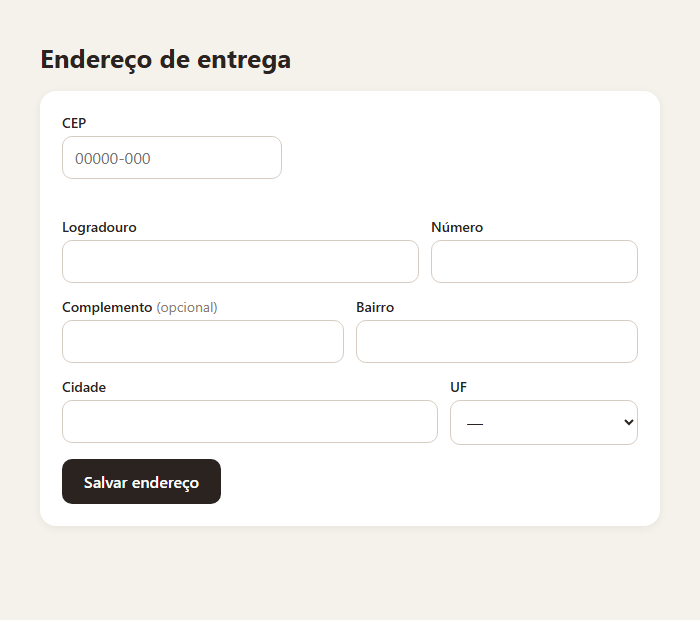
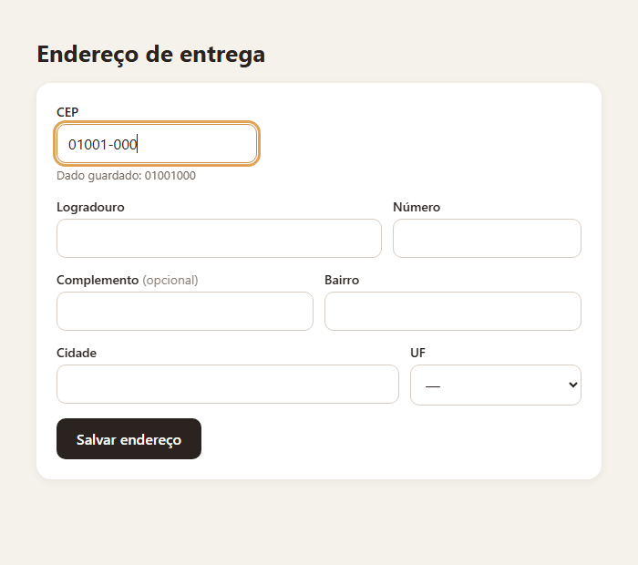
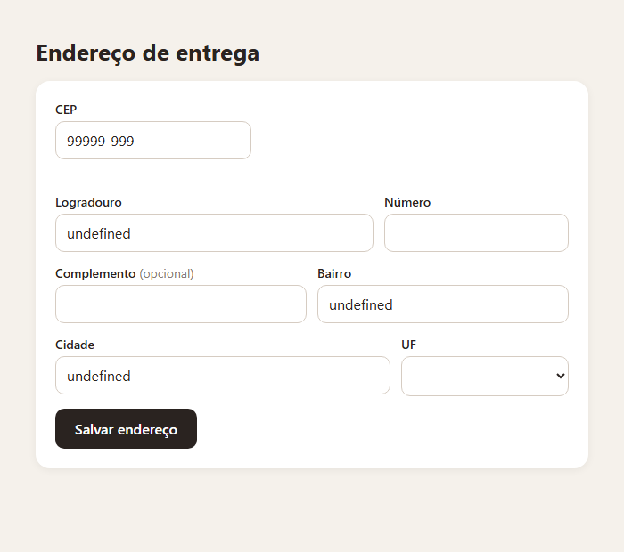
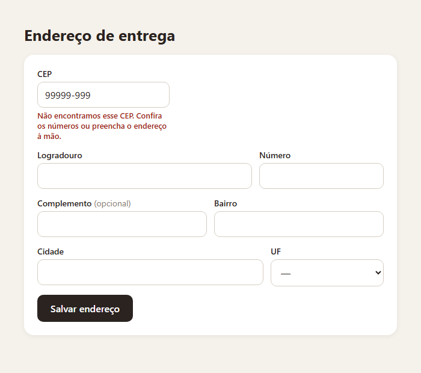

> O formulário que toda aplicação brasileira tem. Curto de fazer, e cheio de detalhe real: a máscara que não pode ir junto com o dado, a API que responde “deu certo” para um CEP que não existe, e o endereço que a pessoa precisa poder corrigir depois de preenchido. Este é o passo a passo que eu seguiria, com cada tratamento baseado no que o ViaCEP de fato respondeu quando eu testei.

## O QUE VOCÊ PRECISA
- VS Code, com a extensão *Live Server* (opcional).
- Um navegador atual e conexão com a internet.
- A oficina do Painel do Tempo ajuda muito: erros com nome e `AbortController` voltam aqui, mais curtos.

## ANTES DE ESCREVER A PRIMEIRA LINHA
Crie uma pasta chamada `cep` e abra-a no VS Code (*Arquivo → Abrir Pasta*). Dentro dela, crie estes arquivos vazios:

~~~arvore
cep/
├── index.html
├── estilo.css
└── app.js
~~~
HTML e CSS ficam prontos na etapa 1 e não mudam mais — inclusive os parágrafos de erro, que só ganham uso na etapa 6.

### 1. O formulário completo
Sete campos, cada um com rótulo, tipo e preenchimento automático corretos.

~~~arquivo index.html
<!DOCTYPE html>
<html lang="pt-BR">
<head>
    <meta charset="UTF-8">
    <meta name="viewport" content="width=device-width, initial-scale=1.0">
    <title>Endereço de entrega</title>
    <link rel="stylesheet" href="estilo.css">
</head>
<body>
    <main class="app">
        <h1>Endereço de entrega</h1>

        <!-- novalidate: a validação e as mensagens são nossas (etapa 6) -->
        <form id="endereco" class="formulario" novalidate>
            

                

                    <label for="cep">CEP</label>
                    <input id="cep" name="cep" type="text" inputmode="numeric"
                           autocomplete="postal-code" placeholder="00000-000" aria-describedby="aviso-
cep">
                    

                

            

            

                

                    <label for="logradouro">Logradouro</label>
                    <input id="logradouro" name="logradouro" type="text"
                           autocomplete="address-line1" aria-describedby="erro-logradouro">
                    

                

                

                    <label for="numero">Número</label>
                    <input id="numero" name="numero" type="text" aria-describedby="erro-numero">
                    

                

            

            

                

                    <label for="complemento">Complemento (opcional)
</label>
                    <input id="complemento" name="complemento" type="text" autocomplete="address-
line2">
                

                

                    <label for="bairro">Bairro</label>
                    <input id="bairro" name="bairro" type="text"
                           autocomplete="address-level3" aria-describedby="erro-bairro">
                    

                

            

            

                

                    <label for="cidade">Cidade</label>
                    <input id="cidade" name="cidade" type="text"
                           autocomplete="address-level2" aria-describedby="erro-cidade">
                    

                

                

                    <label for="uf">UF</label>
                    <select id="uf" name="uf" autocomplete="address-level1" aria-describedby="erro-
uf">
                        <option value="">—</option>
                    </select>
                    

                

            

            <button type="submit" class="botao">Salvar endereço</button>
        </form>

        <section id="resultado" class="resultado" hidden>
            <h2>Pronto para enviar</h2>
            <pre><code></code></pre>
        </section>
    </main>

    
</body>
</html>
~~~

~~~arquivo estilo.css
* {
    box-sizing: border-box;
    margin: 0;
    padding: 0;
}

[hidden] { display: none !important; }

body {
    min-height: 100vh;
    padding: 40px 18px;
    background: #f5f1eb;
    color: #2a2320;
    font-family: 'Segoe UI', system-ui, sans-serif;
}

.app { max-width: 620px; margin: 0 auto; }

h1 { margin-bottom: 16px; font-size: 26px; }
.formulario {
    display: grid;
    gap: 14px;
    padding: 22px;
    border-radius: 16px;
    background: #fff;
    box-shadow: 0 2px 10px rgba(0, 0, 0, .06);
}

.linha { display: grid; grid-template-columns: 1fr 1fr; gap: 12px; }
.linha.dupla { grid-template-columns: 2fr 1fr; }

.campo { display: grid; align-content: start; gap: 4px; }
.campo.cep { max-width: 220px; }

label { font-size: 14px; font-weight: 600; }
.opcional { color: #8a7d73; font-weight: 400; }

input, select {
    padding: 10px 12px;
    border: 1px solid #d6ccc2;
    border-radius: 10px;
    background: #fff;
    color: inherit;
    font: inherit;
    font-size: 16px;
}
input:focus, select:focus { border-color: #c98a3f; outline: 3px solid #e0a458; outline-offset: 1px; }
[aria-invalid="true"] { border-color: #c0392b; background: #fdf2f1; }

/* Uma linha de situação debaixo do CEP: buscando, encontrado ou erro. */
.aviso { min-height: 20px; color: #6f635a; font-size: 13px; }
.aviso[data-tipo="carregando"]::before {
    content: '';
    display: inline-block;
    width: 10px;
    height: 10px;
    margin-right: 6px;
    border: 2px solid #d6ccc2;
    border-top-color: #c98a3f;
    border-radius: 50%;
    vertical-align: -1px;
    animation: girar .8s linear infinite;
}
@keyframes girar { to { transform: rotate(360deg); } }
.aviso[data-tipo="erro"], .erro-campo { color: #a3261b; font-size: 13px; font-weight: 600; }
.aviso[data-tipo="ok"] { color: #1d7a4c; }

.botao {
    justify-self: start;
    padding: 12px 22px;
    border: 0;
    border-radius: 10px;
    background: #2a2320;
    color: #fff;
    font: inherit;
    font-weight: 600;
    cursor: pointer;
}

.resultado {
    margin-top: 16px;
    padding: 18px;
    border-radius: 16px;
    background: #1f2a24;
    color: #d9f2e3;
}
.resultado h2 { margin-bottom: 8px; color: #fff; font-size: 15px; }
.resultado pre { font-size: 14px; white-space: pre-wrap; }

@media (max-width: 520px) {
    .linha, .linha.dupla { grid-template-columns: 1fr; }
}
~~~

~~~arquivo app.js
const seletorUf = document.getElementById('uf');
/* As 26 unidades da federação e o DF, geradas a partir de uma lista.
   A mesma lista vai servir para validar o envio na etapa 6. */
const UFS = ['AC', 'AL', 'AM', 'AP', 'BA', 'CE', 'DF', 'ES', 'GO', 'MA', 'MG', 'MS', 'MT', 'PA',
             'PB', 'PE', 'PI', 'PR', 'RJ', 'RN', 'RO', 'RR', 'RS', 'SC', 'SE', 'SP', 'TO'];
for (const uf of UFS) {
    seletorUf.append(new Option(uf, uf));
}
~~~

#### Rótulo de verdade em cada campo
Cada `<label>` tem um `for` igual ao `id` do seu campo. Com isso, clicar no rótulo leva ao campo, e o leitor de tela anuncia “CEP” ao entrar nele. Um `placeholder` não substitui: ele some quando a pessoa começa a digitar. Conferi os sete controles do formulário: todos têm um rótulo ligado.

#### CEP é texto, não número
O CEP usa `type="text"` com `inputmode="numeric"`. O `inputmode` faz o celular abrir o teclado de números, sem transformar o campo em numérico. `type="number"` é para quantidades: mostra setinhas de aumentar e diminuir, aceita a letra *e* da notação científica e não aceita o traço da máscara. Um CEP não é uma quantidade — ninguém soma dois CEPs.

#### `autocomplete` com os nomes certos
O navegador guarda os endereços que a pessoa já digitou e oferece preenchê-los, mas só entende o campo se ele disser o que é. Os nomes são padronizados: `postal-code` para o CEP, `address-line1` para a rua, `address-line2` para o complemento, e níveis para bairro, cidade e estado ( `address-` `level3`, `2` e `1`). Conferi os seis atributos. O número não tem nome próprio no padrão, por isso fica sem.

#### Os parágrafos de erro já no HTML
Cada campo obrigatório tem um `
` escondido, apontado por `aria-describedby`. Na etapa 6, a mensagem de erro entra ali — e o leitor de tela lê o rótulo seguido do erro. Deixar isso pronto agora é o mesmo raciocínio do CSS: estrutura antes de comportamento.

!confira Tab percorre os campos na ordem; clicar em cada rótulo leva ao campo; a lista de UF tem os 27 estados. No celular, o CEP abre o teclado numérico.

### 2. A máscara
A tela mostra 00000-000; o dado continua sendo só os oito dígitos.

~~~arquivo app.js
const campoCep = document.getElementById('cep');
const avisoCep = document.getElementById('aviso-cep');
const seletorUf = document.getElementById('uf');

const UFS = ['AC', 'AL', 'AM', 'AP', 'BA', 'CE', 'DF', 'ES', 'GO', 'MA', 'MG', 'MS', 'MT', 'PA',
             'PB', 'PE', 'PI', 'PR', 'RJ', 'RN', 'RO', 'RR', 'RS', 'SC', 'SE', 'SP', 'TO'];

for (const uf of UFS) {
    seletorUf.append(new Option(uf, uf));
}

/* ---------------------------------------------------------------
   A máscara. A tela mostra 00000-000; o dado é só os 8 dígitos.
   --------------------------------------------------------------- */
function soDigitos(texto) {
    return texto.replace(/\D/g, '').slice(0, 8);
}

function mascarar(digitos) {
    return digitos.length > 5 ? `${digitos.slice(0, 5)}-${digitos.slice(5)}` : digitos;
}

campoCep.addEventListener('input', () => {
    const digitos = soDigitos(campoCep.value);
    campoCep.value = mascarar(digitos);

    // Provisório, só para enxergar a diferença entre tela e dado.
    avisoCep.textContent = digitos === '' ? '' : `Dado guardado: ${digitos}`;
});
~~~

#### Máscara é apresentação, não dado

~~~codigo
function soDigitos(texto) {
    return texto.replace(/\D/g, '').slice(0, 8);
}

function mascarar(digitos) {
    return digitos.length > 5 ? `${digitos.slice(0, 5)}-${digitos.slice(5)}` : digitos;
}
~~~
A cada tecla, o campo é reescrito em duas etapas: tira tudo que não é dígito e corta em oito, depois põe o traço depois do quinto. O dado é o resultado da primeira etapa. O traço existe só para a pessoa ler — e se o traço for junto para o servidor, cada sistema que receber o CEP vai precisar tirá-lo de novo.

#### Digitar e colar dão no mesmo
Como a máscara começa jogando fora tudo que não é dígito, não importa como o CEP chegou. Testei:

| DIGITADO OU COLADO | NA TELA |
|---|---|
| `01001000` | 01001-000 |
| `01001-000` | 01001-000 |
| `01.001-000`, com pontos e espaços | 01001-000 |
| `010012` | 01001-2 — o traço aparece a partir do sexto dígito |
| `abc12` | 12 |
| `010010001234` | 01001-000 — dígitos a mais são cortados |
O limite de oito é aplicado aos dígitos, e não aos caracteres. Por isso o campo não tem `maxlength`: um CEP colado com pontos e traço tem mais de oito caracteres, e precisa caber antes de ser limpo.

!confira digite um CEP: o traço aparece sozinho. Cole um CEP com traço, ou com pontos: fica igual. Letras não entram.

### 3. Buscar e preencher — do jeito ingênuo
Com oito dígitos, consultar o ViaCEP e preencher o endereço. Funciona para CEP real.

~~~arquivo app.js
const formulario = document.getElementById('endereco');
const campoCep = document.getElementById('cep');
const avisoCep = document.getElementById('aviso-cep');
const seletorUf = document.getElementById('uf');

const UFS = ['AC', 'AL', 'AM', 'AP', 'BA', 'CE', 'DF', 'ES', 'GO', 'MA', 'MG', 'MS', 'MT', 'PA',
             'PB', 'PE', 'PI', 'PR', 'RJ', 'RN', 'RO', 'RR', 'RS', 'SC', 'SE', 'SP', 'TO'];

for (const uf of UFS) {
    seletorUf.append(new Option(uf, uf));
}

function soDigitos(texto) {
    return texto.replace(/\D/g, '').slice(0, 8);
}

function mascarar(digitos) {
    return digitos.length > 5 ? `${digitos.slice(0, 5)}-${digitos.slice(5)}` : digitos;
}

/* Uma linha de situação debaixo do CEP. O tipo muda a aparência no CSS. */
function avisar(tipo, texto) {
    avisoCep.dataset.tipo = tipo;
    avisoCep.textContent = texto;
}

/* Versão ingênua: busca e preenche, sem perguntar se deu certo. */
async function buscarEndereco(digitos) {
    avisar('carregando', 'Buscando o endereço…');

    const resposta = await fetch(`https://viacep.com.br/ws/${digitos}/json/`);
    const dados = await resposta.json();

    const campos = formulario.elements;
    campos.logradouro.value = dados.logradouro;
    campos.bairro.value = dados.bairro;
    campos.cidade.value = dados.localidade;
    campos.uf.value = dados.uf;

    avisar('', '');
}

campoCep.addEventListener('input', () => {
    const digitos = soDigitos(campoCep.value);
    campoCep.value = mascarar(digitos);

    if (digitos.length === 8) buscarEndereco(digitos);
});
~~~

#### O que o ViaCEP responde
Antes de tratar erro, perguntei à API o que ela faz em cada caso:

| PEDIDO | RESPOSTA |
|---|---|
| CEP real, `01001000` | HTTP 200, JSON com `logradouro`, `bairro`, `localidade`, `uf` e outros |
| CEP que não existe, `99999999` | HTTP 200, com o JSON `{"erro": "true"}` |
| CEP mal formado, `1234` | HTTP 400, com uma página HTML — não é JSON |
A segunda linha é o problema desta etapa e da próxima. A terceira explica por que CEP incompleto nunca deve chegar à API.

#### De onde vem o “undefined”
Para o CEP inexistente, a resposta tem 200 e é JSON válido, então nada falha. Só que o objeto não tem `logradouro`: `dados.logradouro` vale `undefined`. E atribuir `undefined` ao `value` de um campo de texto não o deixa vazio — escreve a palavra “undefined”. Medi: logradouro, bairro e cidade ficaram com “undefined”; a UF ficou vazia, porque não existe opção com esse valor.

!confira digite 01001000: a Praça da Sé aparece. Digite 99999999 e repare nos campos — é o que a próxima etapa resolve.

### 4. Os três erros
CEP inexistente, serviço fora do ar e CEP incompleto — três mensagens diferentes, e nenhum bloqueio.

~~~codigo
class CepInexistente extends Error {}
class ConsultaIndisponivel extends Error {}

async function consultarCep(digitos) {
    let resposta;
    try {
        resposta = await fetch(`https://viacep.com.br/ws/${digitos}/json/`);
    } catch {
        throw new ConsultaIndisponivel();   // sem rede, DNS, conexão recusada
    }
    // Com 8 dígitos o ViaCEP não devolve 400; um erro aqui é problema do serviço.
    if (!resposta.ok) throw new ConsultaIndisponivel();

    const dados = await resposta.json();

    // CEP inexistente chega com 200 OK e { "erro": "true" } — e "true" é TEXTO.
    // Por isso a pergunta é se o campo existe, e não se ele vale true.
    if ('erro' in dados) throw new CepInexistente();

    return dados;
}

function avisar(tipo, texto) {
    avisoCep.dataset.tipo = tipo;
    avisoCep.textContent = texto;
    campoCep.toggleAttribute('aria-invalid', tipo === 'erro');
}

async function buscarEndereco(digitos) {
    avisar('carregando', 'Buscando o endereço…');
    try {
        const dados = await consultarCep(digitos);
        preencher(dados);
        avisar('ok', 'Endereço encontrado. Confira e complete com o número.');
    } catch (erro) {
        if (erro instanceof CepInexistente) {
            avisar('erro', 'Não encontramos esse CEP. Confira os números ou preencha o endereço à 
mão.');
        } else {
            avisar('erro', 'Não foi possível consultar o CEP agora. Preencha o endereço à mão.');
        }
    }
}

campoCep.addEventListener('blur', () => {
    const digitos = soDigitos(campoCep.value);
    if (digitos.length > 0 && digitos.length < 8) {
        avisar('erro', `CEP incompleto: são 8 números, e há ${digitos.length}.`);
    }
});
~~~

#### “erro” vem como texto

~~~codigo
    if ('erro' in dados) throw new CepInexistente();
~~~
A especificação desta oficina diz que o ViaCEP devolve `{ "erro": true }`. Quando testei, veio `{"erro": "true"}`, com `true` entre aspas — um texto. Medi: `typeof dados.erro` é `"string"`, e `dados.erro === true` é falso. Um código que confere `=== true` deixaria o CEP inexistente passar, e o bug do “undefined” voltaria. Perguntar se o campo `erro` existe funciona com as duas formas, e com qualquer outra que a API venha a usar.

#### Três situações, três mensagens
- CEP inexistente — a API respondeu, e respondeu que não conhece. A mensagem pede para conferir os números, ou preencher à mão.
- Serviço fora do ar — sem rede, ou o ViaCEP respondeu com erro. Testei os dois (fetch rejeitando e resposta 500): a mensagem é a mesma, porque para a pessoa a ação é a mesma — preencher à mão.
- CEP incompleto — nem chega à API. Ao sair do campo com menos de oito dígitos, a mensagem diz quantos dígitos há. Com quatro: “são 8 números, e há 4”.
Nas três, `aria-invalid` marca o campo, e a linha de aviso tem `aria-live`: o leitor de tela anuncia a mensagem sem a pessoa procurar. Com um CEP válido depois, a marca sai.

#### Preencher não é bloquear
A base de CEPs erra, fica desatualizada, e às vezes a pessoa mora num lugar que ela conhece de outro jeito. Nenhum campo preenchido pela API fica `readonly` ou `disabled` — conferi os três. E em todas as mensagens de erro existe a saída “preencha à mão”. Um formulário de endereço que impede a pessoa de digitar o próprio endereço é um formulário que perde a venda.

!confira 99999999: mensagem de CEP não encontrado e campos vazios. Quatro dígitos e Tab: mensagem de incompleto. DevTools › Network › Offline, e um CEP real: mensagem para preencher à mão.

### 5. Foco, CEP de cidade e digitação rápida
Levar a pessoa ao próximo campo útil, tratar o CEP de cidade inteira, e não deixar consultas velhas chegarem.

~~~codigo
function preencher(dados) {
    const campos = formulario.elements;
    campos.logradouro.value = dados.logradouro;
    campos.bairro.value = dados.bairro;
    campos.cidade.value = dados.localidade;
    campos.uf.value = dados.uf;

    // Cidade com CEP único: a base não tem rua. O próximo campo útil é o logradouro.
    const proximo = dados.logradouro === '' ? campos.logradouro : campos.numero;
    proximo.focus();
}

let controle = null;          // a consulta que está no ar
let ultimoConsultado = '';    // para não consultar o mesmo CEP duas vezes seguidas

async function buscarEndereco(digitos) {
    if (controle) controle.abort();
    controle = new AbortController();
    const sinal = controle.signal;
    ultimoConsultado = digitos;

    avisar('carregando', 'Buscando o endereço…');
    try {
        const dados = await consultarCep(digitos, sinal);
        preencher(dados);
        avisar('ok', dados.logradouro === ''
            ? 'CEP da cidade inteira. Complete com a rua e o número.'
            : 'Endereço encontrado. Confira e complete com o número.');
    } catch (erro) {
        if (erro.name === 'AbortError') return;
        if (erro instanceof CepInexistente) {
            avisar('erro', 'Não encontramos esse CEP. Confira os números ou preencha o endereço à 
mão.');
        } else {
            ultimoConsultado = '';   // falha de rede: deixa tentar o mesmo CEP de novo
            avisar('erro', 'Não foi possível consultar o CEP agora. Preencha o endereço à mão.');
        }
    }
}

campoCep.addEventListener('input', () => {
    const digitos = soDigitos(campoCep.value);
    campoCep.value = mascarar(digitos);

    if (digitos.length === 8) {
        if (digitos !== ultimoConsultado) buscarEndereco(digitos);
        return;
    }

    // Apagou um dígito: a consulta anterior não vale mais.
    if (controle) controle.abort();
    ultimoConsultado = '';
    avisar('', '');
});
~~~

#### O foco vai para o que a base não sabe
A API nunca sabe o número. Então, depois de preencher, o foco vai direto para ele: a pessoa digitou o CEP e já continua digitando, sem pegar o mouse. Conferi que o foco foi para o número. Mas muitas cidades pequenas têm um CEP só para o município inteiro. Testei oito CEPs terminados em `-000` de cidades pequenas: sete vieram com `logradouro` e `bairro` vazios (Acrelândia, Coruripe, Barreirinhas, Poconé, Berilo, Arapoti e Tarauacá), e um não existia. Nesse caso, o próximo campo útil é o logradouro — e o aviso explica por quê: “CEP da cidade inteira. Complete com a rua e o número.”

#### Não consultar à toa
`ultimoConsultado` guarda o último CEP pedido. Se o campo disparar outro `input` com os mesmos oito dígitos (uma letra digitada por engano, que a máscara joga fora), nada é pedido de novo. Contei as chamadas: uma. Se a consulta falhar por rede, a variável é limpa — e o mesmo CEP pode ser tentado outra vez. Contei: duas.

#### A consulta velha não pode chegar
É o mesmo problema do Painel do Tempo, com um detalhe a mais. A pessoa digita um CEP, percebe o erro e troca o último dígito: são duas consultas no ar, e a primeira pode voltar por último. Atrasei a primeira em 1,5 segundo e a segunda em 0,1: o endereço que ficou foi o da segunda, porque a primeira foi cancelada com `AbortController`. O detalhe: apagar um dígito também cancela. Com sete dígitos, a consulta anterior já não corresponde ao que está no campo. Digitei um CEP e apaguei o último dígito logo em seguida: nenhum endereço foi preenchido.

!confira digite um CEP de rua: o foco vai para o número. Digite 69945-000: o foco vai para o logradouro. Com a rede lenta no DevTools, troque o último dígito rápido: fica o endereço do CEP final.

### 6. Validar antes de enviar
Nada sai com campo obrigatório vazio — e em vez de alert, o foco vai até o problema.

~~~codigo
const REGRAS = [
    ['cep', (v) => soDigitos(v).length === 8, 'Informe o CEP com 8 números.'],
    ['logradouro', (v) => v.trim() !== '', 'Informe a rua, avenida ou praça.'],
    ['numero', (v) => v.trim() !== '', 'Informe o número — ou “s/n”.'],
    ['bairro', (v) => v.trim() !== '', 'Informe o bairro.'],
    ['cidade', (v) => v.trim() !== '', 'Informe a cidade.'],
    ['uf', (v) => UFS.includes(v), 'Escolha o estado.'],
];

function mostrarErro(campo, mensagem) {
    if (campo === campoCep) {
        if (mensagem) avisar('erro', mensagem);
        return;
    }
    const paragrafo = document.getElementById(`erro-${campo.name}`);
    paragrafo.textContent = mensagem;
    paragrafo.hidden = mensagem === '';
    campo.toggleAttribute('aria-invalid', mensagem !== '');
}

function dadosParaEnvio() {
    const campos = formulario.elements;
    return {
        cep: soDigitos(campos.cep.value),     // o dado limpo, sem a máscara
        logradouro: campos.logradouro.value.trim(),
        numero: campos.numero.value.trim(),
        complemento: campos.complemento.value.trim(),
        bairro: campos.bairro.value.trim(),
        cidade: campos.cidade.value.trim(),
        uf: campos.uf.value,
    };
}

formulario.addEventListener('submit', (evento) => {
    evento.preventDefault();

    let primeiroInvalido = null;
    for (const [nome, valido, mensagem] of REGRAS) {
        const campo = formulario.elements[nome];
        const ok = valido(campo.value);
        mostrarErro(campo, ok ? '' : mensagem);
        if (!ok && primeiroInvalido === null) primeiroInvalido = campo;
    }

    if (primeiroInvalido) {
        resultado.hidden = true;
        primeiroInvalido.focus();   // leva a pessoa até o problema — sem alert
        return;
    }

    resultado.querySelector('code').textContent = JSON.stringify(dadosParaEnvio(), null, 2);
    resultado.hidden = false;
});

formulario.addEventListener('input', (evento) => {
    const campo = evento.target;
    if (campo !== campoCep && campo.name) mostrarErro(campo, '');
});
~~~

#### Regras como dados
Cada regra é uma linha: o nome do campo, uma função que diz se o valor é válido e a mensagem. O envio percorre a lista uma vez. Acrescentar um campo obrigatório é acrescentar uma linha — e as regras ficam lidas lado a lado, sem um `if` por campo espalhado pelo código. Repare que a regra da UF usa a mesma lista `UFS` que gerou as opções na etapa 1. Um valor que não esteja lá não passa, mesmo que alguém o injete no `select` pelo DevTools.

#### Cada erro no seu lugar, e o foco no primeiro
Enviei o formulário vazio: cada campo obrigatório mostrou a própria mensagem no parágrafo apontado por `aria-describedby`, o CEP usou a sua linha de aviso, e o foco foi para o primeiro campo com problema — o CEP. Nenhum `alert`: contei, e foram zero. O `alert` trava a página, some quando fechado e não diz em qual campo está o problema. Digitar num campo com erro apaga a mensagem dele na hora — conferi no número. E preencher o endereço pelo CEP limpa os erros dos quatro campos que a API preencheu.

#### O que sai é o dado limpo — e corrigível
`dadosParaEnvio()` é onde a decisão da etapa 2 se paga: o CEP vai como `01001000`, sem o traço. Conferi no objeto de envio. E, como os campos continuam editáveis, corrigi o logradouro que a API tinha preenchido para “Praça da Sé, lado ímpar”: foi exatamente isso que saiu no envio.

!confira envie vazio: mensagens em cada campo e foco no CEP. Preencha pelo CEP e envie: só o número fica marcado. Complete e envie: o bloco escuro mostra o CEP sem traço e o que você corrigiu.

### ✓ Roteiro de teste
Passe por estes casos antes de considerar a oficina concluída. Eles cobrem o que costuma quebrar.

| VOCÊ FAZ | DEVE ACONTECER |
|---|---|
| Digitar `01001000` | preenche o endereço da Praça da Sé; foco no número |
| Digitar `99999999` | mensagem de CEP não encontrado; nenhum “undefined” |
| Colar `01001-000` já formatado | igual a digitar |
| Quatro dígitos e sair do campo | mensagem de CEP incompleto, sem consulta |
| Offline no DevTools e um CEP real | mensagem para preencher à mão |
| Digitar `69945-000` | cidade preenchida; foco no logradouro |
| Corrigir o logradouro preenchido e enviar | sai o texto corrigido |
| Enviar sem número | número marcado, com foco nele, sem alert |
| Conferir o envio | CEP só com dígitos |
| Preencher e enviar só com teclado | dá para ir do CEP ao envio |

### ! Quando não funcionar
Os tropeços desta oficina, e o que procurar em cada um.

| SINTOMA | CAUSA QUASE CERTA |
|---|---|
| Os campos aparecem com “undefined” | O CEP não existe e a resposta não foi conferida. Procure o campo `erro` antes de preencher. |
| CEP inexistente passa como válido | A conferência é `dados.erro === true`, mas a API manda o texto `"true"`. Use `'erro' in dados`. |
| `Unexpected token <` no console | Um CEP incompleto chegou à API, que respondeu HTML. Só consulte com oito dígitos. |
| O traço vai junto no envio | O valor enviado é o do campo. Envie `soDigitos()`. |
| Colar um CEP formatado não funciona | Há um `maxlength` cortando o texto antes da máscara, ou a máscara não remove não dígitos. |
| O endereço de um CEP antigo aparece | Falta cancelar a consulta anterior com `AbortController`. |
| A pessoa não consegue corrigir a rua | Os campos preenchidos foram marcados como `readonly` ou `disabled`. |
| O erro de um campo não some ao corrigir | Falta o ouvinte de `input` que chama `mostrarErro(campo, '')`. |

### → Para levar adiante
Extensões em ordem de dificuldade. Todas cabem no que você já construiu.
1. Buscar CEP pelo endereço. O ViaCEP também aceita `/ws/UF/cidade/rua/json/` e devolve uma lista para escolher. 2. Guardar vários endereços. Casa, trabalho: uma lista no `localStorage`, com a validação das oficinas anteriores. 3. Cursor no lugar certo. Reescrever o campo a cada tecla leva o cursor para o fim. Guarde `selectionStart` e reposicione. 4. Frete pelo CEP. Uma tabela de faixas de CEP por região e o valor aparecendo assim que o endereço é encontrado.
