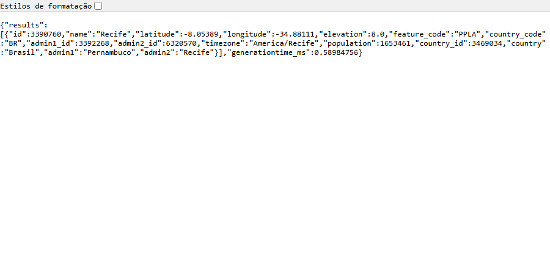
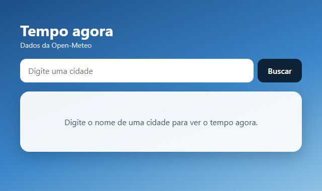
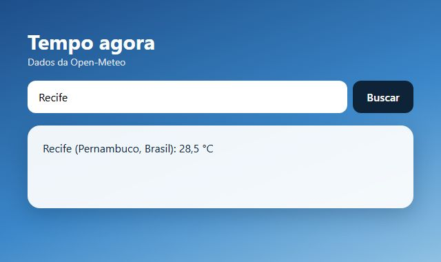
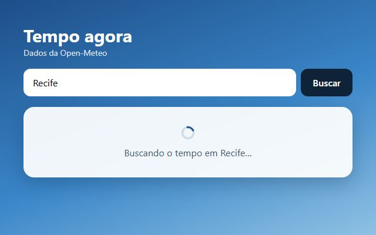
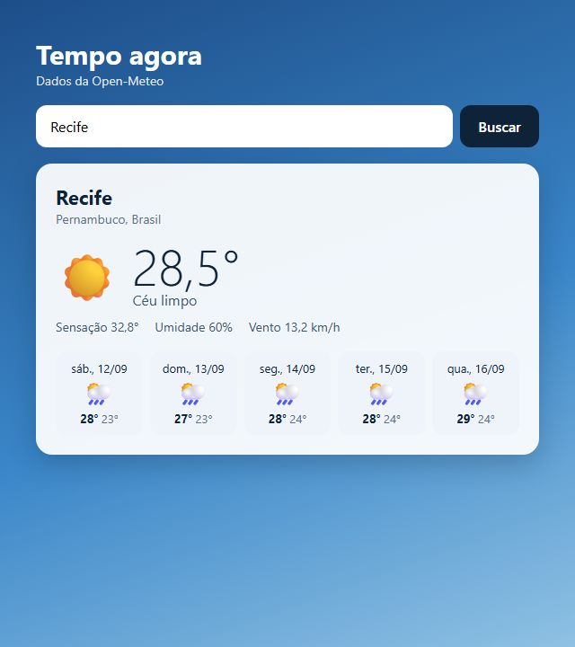
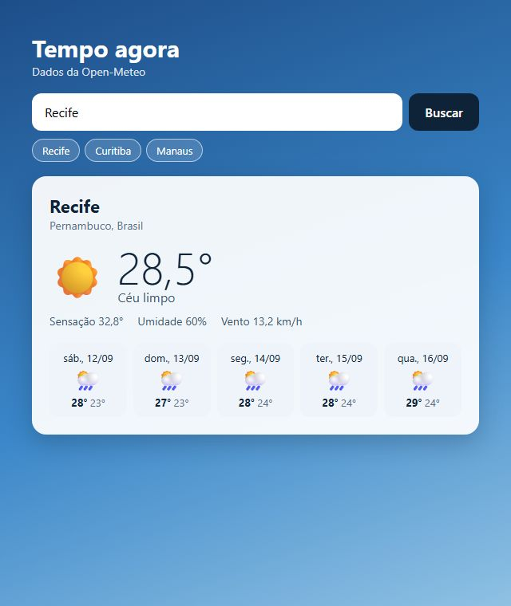

> O projeto que mais impressiona em entrevista júnior, porque obriga a tratar o mundo real: rede lenta, servidor com defeito, cidade que não existe, e duas buscas que chegam fora de ordem. Este é o passo a passo que eu seguiria. Ele começa lendo a API antes de programar — e cada decisão de tratamento de erro vem de algo que a API de fato respondeu quando eu testei.

## O QUE VOCÊ PRECISA
- VS Code, com a extensão *Live Server* (opcional).
- Um navegador atual e conexão com a internet.
- Ter visto `async` / `await` no Módulo 3. A oficina da Lista de Tarefas ajuda: a ideia de a tela sair de um estado volta aqui.

## ANTES DE ESCREVER A PRIMEIRA LINHA
Crie uma pasta chamada `clima` e abra-a no VS Code (*Arquivo → Abrir Pasta*). Dentro dela, crie estes arquivos vazios:

~~~arvore
clima/
├── index.html
├── estilo.css
├── app.js
├── .env.example
└── .gitignore
~~~
O HTML e o CSS ficam prontos na etapa 1; o HTML ganha só a faixa de atalhos na etapa 6. Os dois arquivos que começam com ponto são explicados já na etapa 1.

### 1. Conhecer a API antes de escrever código
Duas chamadas na barra de endereço, o esqueleto da página, e onde uma chave de API nunca pode ficar.
A Open-Meteo não pede cadastro nem chave, e responde a qualquer site. Antes de qualquer `fetch`, abro no navegador as duas chamadas que o programa vai fazer. A primeira transforma o nome da cidade em coordenadas:

~~~codigo
https://geocoding-api.open-meteo.com/v1/search?name=Recife&count=1&language=pt
~~~

A segunda recebe essas coordenadas e devolve o tempo:

~~~codigo
https://api.open-meteo.com/v1/forecast?latitude=-8.05&longitude=-34.88&current=temperature_2m
~~~
Com o formato em mãos, a página:

~~~arquivo index.html
<!DOCTYPE html>
<html lang="pt-BR">
<head>
    <meta charset="UTF-8">
    <meta name="viewport" content="width=device-width, initial-scale=1.0">
    <title>Tempo agora</title>
    <link rel="stylesheet" href="estilo.css">
</head>
<body>
    <main class="app">
        <header>
            <h1>Tempo agora</h1>
            
Dados da Open-Meteo

        </header>

        <form id="busca" class="busca" role="search">
            <label for="cidade" class="oculto">Cidade</label>
            <input id="cidade" type="search" placeholder="Digite uma cidade" autocomplete="off" 
required>
            <button type="submit">Buscar</button>
        </form>

        <section id="painel" class="painel" aria-live="polite"></section>
    </main>

    
</body>
</html>
~~~

~~~arquivo estilo.css
* {
    box-sizing: border-box;
    margin: 0;
    padding: 0;
}

[hidden] { display: none !important; }

body {
    min-height: 100vh;
    padding: 40px 18px;
    background: linear-gradient(160deg, #1d4e89 0%, #3a86c8 55%, #8fc1e3 100%) fixed;
    color: #0f2338;
    font-family: 'Segoe UI', system-ui, sans-serif;
}

.app { max-width: 560px; margin: 0 auto; }

header { margin-bottom: 18px; color: #fff; }
h1 { font-size: 30px; }
.sub { font-size: 14px; opacity: .85; }

.oculto {
    position: absolute;
    width: 1px;
    height: 1px;
    overflow: hidden;
    clip-path: inset(50%);
    white-space: nowrap;
}

.busca { display: flex; gap: 8px; }
.busca input {
    flex: 1;
    padding: 13px 16px;
    border: 0;
    border-radius: 12px;
    font: inherit;
    font-size: 16px;
}
.busca input:focus { outline: 3px solid #ffd166; }
.busca button {
    padding: 0 20px;
    border: 0;
    border-radius: 12px;
    background: #0f2338;
    color: #fff;
    font: inherit;
    font-weight: 600;
    cursor: pointer;
}

.recentes { display: flex; flex-wrap: wrap; gap: 6px; margin-top: 10px; }
.recentes button {
    padding: 5px 12px;
    border: 1px solid rgba(255, 255, 255, .6);
    border-radius: 999px;
    background: rgba(255, 255, 255, .15);
    color: #fff;
    font: inherit;
    font-size: 13px;
    cursor: pointer;
}

.painel {
    min-height: 120px;
    margin-top: 18px;
    padding: 22px;
    border-radius: 18px;
    background: rgba(255, 255, 255, .93);
    box-shadow: 0 10px 30px rgba(15, 35, 56, .25);
}

/* Cada estado tem sua aparência — escolhida pelo data-estado do painel. */
.painel[data-estado="inicial"],
.painel[data-estado="carregando"] {
    display: grid;
    place-items: center;
    color: #3b5670;
    text-align: center;
}
.painel[data-estado="erro"] { border-left: 6px solid #c0392b; }

.aviso-erro { color: #8e2a1f; font-weight: 600; }

.girando {
    display: inline-block;
    width: 22px;
    height: 22px;
    margin-bottom: 8px;
    border: 3px solid #c9d8e6;
    border-top-color: #1d4e89;
    border-radius: 50%;
    animation: girar .8s linear infinite;
}
@keyframes girar { to { transform: rotate(360deg); } }

.lugar { font-size: 22px; }
.regiao { color: #5a7089; font-size: 14px; }
.agora { display: flex; align-items: center; gap: 14px; margin: 14px 0 10px; }
.agora .icone { font-size: 52px; line-height: 1; }
.temperatura { font-size: 56px; font-weight: 300; line-height: 1; }
.condicao { color: #3b5670; }

.detalhes { display: flex; flex-wrap: wrap; gap: 6px 18px; color: #3b5670; font-size: 14px; }

.dias {
    display: grid;
    grid-template-columns: repeat(5, 1fr);
    gap: 8px;
    margin-top: 18px;
    list-style: none;
}
.dia {
    display: grid;
    gap: 2px;
    padding: 10px 4px;
    border-radius: 12px;
    background: #eef4fa;
    font-size: 13px;
    text-align: center;
}
.dia .icone { font-size: 26px; }
.max { font-weight: 700; }
.min { color: #5a7089; }

@media (max-width: 480px) {
    .dias { grid-template-columns: repeat(3, 1fr); }
}
~~~

~~~arquivo app.js
const painel = document.getElementById('painel');
/* Antes de escrever código de rede, explore a API pela barra de endereço.
   São duas chamadas, e a primeira alimenta a segunda:
   1. Nome da cidade -> coordenadas
      https://geocoding-api.open-meteo.com/v1/search?name=Recife&count=1&language=pt
   2. Coordenadas -> tempo agora
      https://api.open-meteo.com/v1/forecast?latitude=-8.05&longitude=-34.88&current=temperature_2m
   Abra as duas, leia o JSON, e só então programe. */
painel.dataset.estado = 'inicial';
painel.textContent = 'Digite o nome de uma cidade para ver o tempo agora.';
~~~

~~~arquivo .env.example
# Este projeto usa a Open-Meteo, que não exige chave de API.
#
# Se um dia você trocar por um provedor que exige (OpenWeather, WeatherAPI...):
# a chave NÃO pode ir para o app.js. Todo JavaScript entregue ao navegador é
# público — qualquer pessoa lê pelo "Exibir código-fonte". Um arquivo .env
# também não chega ao navegador sozinho: alguém precisa lê-lo, e esse alguém é
# um servidor seu, que guarda a chave e repassa a chamada (Módulo 8).
#
# Copie este arquivo para .env (que está no .gitignore) e preencha:
CLIMA_API_KEY=

.gitignore

# Segredos locais nunca vão para o repositório. O .env.example, sim.
.env
~~~

#### Duas respostas que decidem o código da etapa 4
Explorar a API é também testar o que dá errado. Fiz as duas chamadas que ninguém faz no primeiro dia:

| PEDIDO | O QUE A API RESPONDEU |
|---|---|
| Cidade | HTTP 200 — sucesso —, com um JSON sem o campo `results` |

~~~codigo
Xyzzyqwertolandia
~~~

!nota Latitude 999 HTTP 400, com `{"error": true, "reason": "..."}` — e o `fetch` não deu erro
A primeira quer dizer que “cidade não encontrada” não é um erro para a API: o código vai ter que perguntar se `results` existe. A segunda quer dizer que um `fetch` que termina sem exceção não significa que deu certo. As duas viram regras na etapa 4.

#### O `.env.example` num projeto sem chave
Com a Open-Meteo não há segredo nenhum. Mas o dia em que você trocar por um provedor com chave, o erro clássico é colar a chave no `app.js`. Todo JavaScript que vai para o navegador é público: qualquer pessoa lê pelo “Exibir código-fonte”. E um arquivo `.env` não resolve sozinho, porque o navegador não lê arquivos do seu computador — alguém precisa ler o `.env` e usar a chave, e esse alguém é um servidor seu (Módulo 8). O `.env.example` documenta que variável existe, sem valor, e vai para o repositório. O `.env` de verdade fica no `.gitignore` e nunca é versionado.

#### Três atributos de acessibilidade que custam uma palavra
- `role="search"` no formulário: leitores de tela anunciam “pesquisa” e deixam pular direto para ele.
- `type="search"` no campo: no celular, o teclado costuma trocar o Enter por um botão de pesquisa.
- `aria-live="polite"` no painel: quando o resultado chegar, ele é lido em voz alta sem a pessoa precisar procurar.

!confira abra as duas URLs no navegador e ache, no JSON, o nome do estado e a temperatura. Abra a página: título, campo, botão e o painel com o convite.

### 2. O caminho feliz
Buscar, esperar, mostrar. E descobrir o que acontece quando não é feliz.

~~~arquivo app.js
const formulario = document.getElementById('busca');
const campo = document.getElementById('cidade');
const painel = document.getElementById('painel');

const URL_GEOCODIFICACAO = 'https://geocoding-api.open-meteo.com/v1/search';
const URL_PREVISAO = 'https://api.open-meteo.com/v1/forecast';

const numero = new Intl.NumberFormat('pt-BR', { maximumFractionDigits: 1 });

/* Nome -> coordenadas. URLSearchParams cuida de espaço e acento:
   "São Paulo" vira "S%C3%A3o+Paulo" sem você pensar nisso. */
async function geocodificar(cidade) {
    const endereco = new URL(URL_GEOCODIFICACAO);
    endereco.search = new URLSearchParams({ name: cidade, count: 1, language: 'pt', format: 'json' });

    const resposta = await fetch(endereco);
    const dados = await resposta.json();
    const [lugar] = dados.results;

    return {
        nome: lugar.name,
        regiao: [lugar.admin1, lugar.country].filter(Boolean).join(', '),
        latitude: lugar.latitude,
        longitude: lugar.longitude,
    };
}

/* Coordenadas -> tempo agora. */
async function obterPrevisao(lugar) {
    const endereco = new URL(URL_PREVISAO);
    endereco.search = new URLSearchParams({
        latitude: lugar.latitude,
        longitude: lugar.longitude,
        current: 'temperature_2m',
        timezone: 'auto',
    });

    const resposta = await fetch(endereco);
    return resposta.json();
}

/* Só o caminho feliz, por enquanto. */
formulario.addEventListener('submit', async (evento) => {
    evento.preventDefault();
    const cidade = campo.value.trim();
    if (cidade === '') return;

    const lugar = await geocodificar(cidade);
    const dados = await obterPrevisao(lugar);
    painel.dataset.estado = 'sucesso';
    painel.textContent = `${lugar.nome} (${lugar.regiao}): 
${numero.format(dados.current.temperature_2m)} °C`;
});

painel.dataset.estado = 'inicial';
painel.textContent = 'Digite o nome de uma cidade para ver o tempo agora.';
~~~

#### Uma chamada depois da outra
`geocodificar()` precisa terminar antes de `obterPrevisao()` começar, porque a segunda usa as coordenadas da primeira. `await` escreve essa espera como se o código fosse sequencial. O ouvinte do `submit` é `async` para poder usar `await` dentro dele.

#### `URLSearchParams` em vez de montar a URL na mão
Concatenar `'?name=' + cidade` funciona para “Recife” e quebra para “São Paulo”: espaço e acento precisam ser codificados, e um `&` no nome estragaria os outros parâmetros. Conferi: `URLSearchParams` transformou “São Paulo” em `?name=S%C3%A3o+Paulo` sem nenhum código a mais.

#### O que o caminho feliz esconde
Depois de buscar Recife com sucesso, busquei uma cidade que não existe. Nada mudou na tela. O painel continuou mostrando “Recife (Pernambuco, Brasil): 28,5 °C”, sem aviso nenhum — e a pessoa acha que aquela temperatura é da cidade que acabou de digitar. É pior que uma tela de erro: é um resultado velho com cara de atual. A etapa 3 existe para que isso não possa acontecer.

!confira busque sua cidade: aparece nome, estado e temperatura com vírgula. Busque um nome inventado e repare que a tela não muda — é o problema que vem a seguir.

### 3. Os quatro estados
Inicial, carregando, sucesso e erro — cada um com sua tela, todos saídos de um objeto só.

~~~arquivo app.js
const formulario = document.getElementById('busca');
const campo = document.getElementById('cidade');
const painel = document.getElementById('painel');

const URL_GEOCODIFICACAO = 'https://geocoding-api.open-meteo.com/v1/search';
const URL_PREVISAO = 'https://api.open-meteo.com/v1/forecast';

const numero = new Intl.NumberFormat('pt-BR', { maximumFractionDigits: 1 });

/* Cria um elemento com classe e conteúdo (texto ou lista de filhos).
   Texto sempre por textContent: nome de cidade vem de fora. */
function el(tag, classe, conteudo) {
    const elemento = document.createElement(tag);
    if (classe) elemento.className = classe;
    if (Array.isArray(conteudo)) elemento.append(...conteudo);
    else if (conteudo !== undefined) elemento.textContent = conteudo;
    return elemento;
}

async function geocodificar(cidade) {
    const endereco = new URL(URL_GEOCODIFICACAO);
    endereco.search = new URLSearchParams({ name: cidade, count: 1, language: 'pt', format: 'json' });

    const resposta = await fetch(endereco);
    const dados = await resposta.json();
    const [lugar] = dados.results;

    return {
        nome: lugar.name,
        regiao: [lugar.admin1, lugar.country].filter(Boolean).join(', '),
        latitude: lugar.latitude,
        longitude: lugar.longitude,
    };
}

async function obterPrevisao(lugar) {
    const endereco = new URL(URL_PREVISAO);
    endereco.search = new URLSearchParams({
        latitude: lugar.latitude,
        longitude: lugar.longitude,
        current: 'temperature_2m',
        timezone: 'auto',
    });

    const resposta = await fetch(endereco);
    return resposta.json();
}

/* ---------------------------------------------------------------
   Os quatro estados. A tela inteira do painel sai de UM objeto:
   { tipo: 'inicial' | 'carregando' | 'sucesso' | 'erro', ... }
   --------------------------------------------------------------- */
function mostrar(estado) {
    painel.dataset.estado = estado.tipo;
    painel.replaceChildren(...conteudoDo(estado));
}

function conteudoDo(estado) {
    switch (estado.tipo) {
        case 'inicial':
            return [el('p', null, 'Digite o nome de uma cidade para ver o tempo agora.')];

        case 'carregando': {
            const girando = el('span', 'girando');
            girando.setAttribute('aria-hidden', 'true');
            return [el('div', null, [girando, el('p', null, `Buscando o tempo em ${estado.cidade}…
`)])];
        }

        case 'erro': {
            const aviso = el('p', 'aviso-erro', estado.mensagem);
            aviso.setAttribute('role', 'alert');
            return [aviso];
        }

        case 'sucesso':
            return [
                el('h2', 'lugar', estado.lugar.nome),
                el('p', 'regiao', estado.lugar.regiao),
                el('p', 'temperatura', `${numero.format(estado.dados.current.temperature_2m)}°`),
            ];
    }
}

async function buscar(cidade) {
    mostrar({ tipo: 'carregando', cidade });
    try {
        const lugar = await geocodificar(cidade);
        const dados = await obterPrevisao(lugar);
        mostrar({ tipo: 'sucesso', lugar, dados });
    } catch {
        // Provisório: toda falha vira a mesma mensagem. A etapa 4 separa.
        mostrar({ tipo: 'erro', mensagem: 'Não foi possível buscar o tempo.' });
    }
}

formulario.addEventListener('submit', (evento) => {
    evento.preventDefault();
    const cidade = campo.value.trim();
    if (cidade !== '') buscar(cidade);
});

mostrar({ tipo: 'inicial' });
~~~

#### Um objeto descreve a tela inteira

~~~codigo
function mostrar(estado) {
    painel.dataset.estado = estado.tipo;
    painel.replaceChildren(...conteudoDo(estado));
}
~~~
`{ tipo: 'carregando', cidade: 'Recife' }` é tudo que o painel precisa saber para se desenhar. `conteudoDo()` decide o que criar para cada tipo, e `mostrar()` troca o conteúdo inteiro e anota o tipo em `data-estado`, que o CSS usa para mudar a aparência. Com isso, o bug da etapa 2 fica impossível: toda busca começa com `mostrar({ tipo: 'carregando'` `})`, que apaga o resultado anterior. Qualquer que seja o desfecho, a tela velha não sobrevive.

#### O carregando precisa aparecer de verdade
Numa conexão rápida, a resposta chega em fração de segundo e o estado de carregando pisca rápido demais para ser visto — e rápido demais para você perceber se está quebrado. Atrasei as respostas em 1,5 segundo: no mesmo instante do envio, o painel já mostrava “Buscando o tempo em Recife…”, e depois virou sucesso. Para testar isso sem escrever código: DevTools, aba *Network*, troque “No throttling” por uma conexão lenta.

#### Um erro genérico esconde o problema
A cidade inexistente agora mostra “Não foi possível buscar o tempo.” Melhor que antes, mas a mesma frase serve para qualquer coisa. Chamei `geocodificar()` direto para ver o que estava por trás: `TypeError: undefined is not iterable`. É o `const [lugar] = dados.results` tentando desmontar um `results` que não existe — a resposta 200 sem resultados da etapa 1. Ou seja: a mensagem genérica esconde um bug do nosso código atrás de uma frase que parece falha de rede. A etapa 4 separa os casos.

!confira busque uma cidade: o painel mostra o “buscando” e depois o resultado. Busque um nome inventado: agora aparece um erro, com borda vermelha — ainda genérico.

### 4. Erros de verdade, e buscas fora de ordem
Três erros com nome, três mensagens úteis, e cancelamento da busca que ficou velha.

~~~codigo
class ErroDeRede extends Error {}
class ErroDoServico extends Error {
    constructor(status) {
        super(`HTTP ${status}`);
        this.status = status;
    }
}
class CidadeNaoEncontrada extends Error {}

async function buscarJson(endereco, sinal) {
    let resposta;
    try {
        resposta = await fetch(endereco, { signal: sinal });
    } catch (erro) {
        if (erro.name === 'AbortError') throw erro;
        throw new ErroDeRede();   // só a falha do fetch em si vira "erro de rede"
    }
    // fetch só rejeita quando não chega resposta nenhuma. 404 e 500 chegam aqui.
    if (!resposta.ok) throw new ErroDoServico(resposta.status);
    return resposta.json();
}

async function geocodificar(cidade, sinal) {
    const endereco = new URL(URL_GEOCODIFICACAO);
    endereco.search = new URLSearchParams({ name: cidade, count: 1, language: 'pt', format: 'json' 
});

    const dados = await buscarJson(endereco, sinal);

    // Cidade inexistente não é erro para a API: vem 200, sem o campo results.
    if (!dados.results || dados.results.length === 0) throw new CidadeNaoEncontrada();

    const [lugar] = dados.results;
    return {
        nome: lugar.name,
        regiao: [lugar.admin1, lugar.country].filter(Boolean).join(', '),
        latitude: lugar.latitude,
        longitude: lugar.longitude,
    };
}

function mensagemDeErro(erro, cidade) {
    if (erro instanceof CidadeNaoEncontrada) {
        return `Não encontrei nenhuma cidade chamada “${cidade}”. Confira a grafia.`;
    }
    if (erro instanceof ErroDeRede) {
        return 'Não consegui falar com o serviço de previsão. Verifique sua conexão.';
    }
    if (erro instanceof ErroDoServico) {
        return `O serviço de previsão está com problema (erro ${erro.status}). Tente de novo em 
alguns minutos.`;
    }
    console.error(erro);   // um bug nosso: registra para investigar
    return 'Algo inesperado aconteceu ao montar a previsão.';
}

let controle = null;

async function buscar(cidade) {
    if (controle) controle.abort();      // a busca anterior, se ainda estiver no ar, morre aqui
    controle = new AbortController();
    const sinal = controle.signal;

    mostrar({ tipo: 'carregando', cidade });
    try {
        const lugar = await geocodificar(cidade, sinal);
        const dados = await obterPrevisao(lugar, sinal);
        mostrar({ tipo: 'sucesso', lugar, dados });
    } catch (erro) {
        if (erro.name === 'AbortError') return;   // substituída por uma mais nova: não é erro
        mostrar({ tipo: 'erro', mensagem: mensagemDeErro(erro, cidade) });
    }
}
~~~
O resto do arquivo é o da etapa 3, com `obterPrevisao()` recebendo e repassando o `sinal`.

#### `fetch` não falha quando o servidor falha
`fetch` só rejeita quando não chega resposta nenhuma — sem rede, DNS que não resolve, conexão recusada. Um 404 ou um 500 é uma resposta, e a promessa resolve normalmente. Vimos isso na etapa 1 com o 400 da latitude inválida. Por isso `buscarJson()` confere `resposta.ok` e lança `ErroDoServico` com o status. Simulei o servidor respondendo 500, e a tela disse “erro 500. Tente de novo em alguns minutos”.

#### Só o `fetch` vira “erro de rede”
Um jeito comum de detectar rede fora é `catch (erro) { if (erro instanceof TypeError) ... }`, porque é um `TypeError` que o `fetch` lança sem conexão. Só que o bug da etapa 3 também era um `TypeError`. Classificar pelo tipo mandaria a pessoa verificar a internet por causa de um defeito nosso. Aqui o `try` envolve só a linha do `fetch`. Qualquer outra exceção passa reto e cai em “Algo inesperado”, registrada no console. Testei com uma resposta que não era JSON: a tela disse “Algo inesperado”, e não “verifique sua conexão”.

#### Como provocar cada erro
- Cidade inexistente: digite um nome inventado. É a API real.
- Sem rede: DevTools › *Network* › “Offline”. O navegador passa a rejeitar o `fetch` — que é o que eu simulei para a foto.
- Erro do servidor: difícil de provocar numa API que funciona. O 400 da latitude inválida, da etapa 1, percorre exatamente o mesmo caminho do código — troque temporariamente a latitude em `obterPrevisao()` por 999 e busque.

#### Duas buscas, e a resposta velha chegando por último
A pessoa busca “Recife” e, antes de chegar a resposta, busca “Manaus”. Nada garante que as respostas voltem na mesma ordem. Atrasei Recife em 1,5 segundo e Manaus em 0,1 e fiz as duas buscas seguidas:

| VERSÃO | A TELA TERMINOU EM |
|---|---|
| Sem cancelar a busca anterior | Recife — a resposta velha chegou depois e sobrescreveu |
| Com `AbortController` | Manaus — a busca de Recife foi cancelada no ar |
Cada busca cria um `AbortController` e passa o `signal` para os `fetch`. A busca seguinte chama `abort()` na anterior, e o `fetch` dela rejeita com um erro de nome `AbortError`. Esse erro não é falha de ninguém — é o próprio programa desistindo —, por isso `buscar()` o ignora em silêncio.

!confira busque um nome inventado: mensagem de cidade não encontrada. Ligue “Offline” no DevTools e busque: mensagem de conexão. Com a rede lenta, busque duas cidades seguidas: aparece a segunda.

### 5. A previsão dos próximos dias
Cinco cards com máxima, mínima e ícone — e a data que chega um dia atrasada se você não souber um detalhe de fuso.

~~~codigo
async function obterPrevisao(lugar, sinal) {
    const endereco = new URL(URL_PREVISAO);
    endereco.search = new URLSearchParams({
        latitude: lugar.latitude,
        longitude: lugar.longitude,
        current: 
'temperature_2m,apparent_temperature,relative_humidity_2m,wind_speed_10m,weather_code',
        daily: 'weather_code,temperature_2m_max,temperature_2m_min',
        timezone: 'auto',
        forecast_days: 6,    // hoje + os cinco seguintes
    });
    return buscarJson(endereco, sinal);
}

function proximosDias(diario) {
    return diario.time.slice(1, 6).map((data, i) => ({
        data,
        codigo: diario.weather_code[i + 1],
        maxima: diario.temperature_2m_max[i + 1],
        minima: diario.temperature_2m_min[i + 1],
    }));
}

function descreverTempo(codigo) {
~~~

`if (codigo === 0) return ['` ☀ `', 'Céu limpo'];` `if (codigo <= 2) return ['` 🌤 `', 'Poucas nuvens'];` `if (codigo === 3) return ['` ☁ `', 'Nublado'];` `if (codigo <= 48) return ['` 🌫 `', 'Neblina'];` `if (codigo <= 57) return ['` 🌦 `', 'Garoa'];` `if (codigo <= 67) return ['` 🌧 `', 'Chuva'];` `if (codigo <= 77) return ['` ❄ `', 'Neve'];` `if (codigo <= 82) return ['` 🌧 `', 'Pancadas de chuva'];` `if (codigo <= 86) return ['` 🌨 `', 'Neve'];` `return ['` ⛈ `', 'Trovoada'];`

~~~codigo
}
const diaCurto = new Intl.DateTimeFormat('pt-BR', { weekday: 'short', day: '2-digit', month: '2-
digit' });
function formatarData(texto) {
    const [ano, mes, dia] = texto.split('-').map(Number);
    return diaCurto.format(new Date(ano, mes - 1, dia));
}
function montarDia(dia) {
    const [icone, condicao] = descreverTempo(dia.codigo);
    const simbolo = el('span', 'icone', icone);
    simbolo.setAttribute('aria-hidden', 'true');
    return el('li', 'dia', [
        el('span', 'nome', formatarData(dia.data)),
        simbolo,
        el('span', 'oculto', condicao),
        el('span', null, [el('span', 'max', `${Math.round(dia.maxima)}°`), el('span', 'min', ` 
${Math.round(dia.minima)}°`)]),
    ]);
}
~~~
`montarSucesso()` junta o tempo agora — ícone, condição, sensação, umidade e vento — e a lista de dias:

~~~codigo
function montarSucesso(lugar, dados) {
    const agora = dados.current;
    const [icone, condicao] = descreverTempo(agora.weather_code);

    const iconeGrande = el('span', 'icone', icone);
    iconeGrande.setAttribute('aria-hidden', 'true');

    return [
        el('h2', 'lugar', lugar.nome),
        el('p', 'regiao', lugar.regiao),
        el('div', 'agora', [
            iconeGrande,
            el('div', null, [
                el('p', 'temperatura', `${numero.format(agora.temperature_2m)}°`),
                el('p', 'condicao', condicao),
            ]),
        ]),
        el('p', 'detalhes', [
            el('span', null, `Sensação ${numero.format(agora.apparent_temperature)}°`),
            el('span', null, `Umidade ${agora.relative_humidity_2m}%`),
            el('span', null, `Vento ${numero.format(agora.wind_speed_10m)} km/h`),
        ]),
        el('ol', 'dias', proximosDias(dados.daily).map(montarDia)),
    ];
}
~~~

#### A API manda colunas; a tela quer linhas
O bloco `daily` não vem como uma lista de dias. Vem como listas paralelas: todas as datas num array, todas as máximas em outro, todas as mínimas em outro. O dia 3 é a posição 3 de cada um. `proximosDias()` faz a troca uma vez, e o resto do código trabalha com objetos `{ data, codigo,` `maxima, minima }`. O `slice(1, 6)` pula a posição 0, que é hoje — já mostrado no bloco “agora”.

#### A data que volta um dia
A API manda as datas como texto: `"2026-09-12"`. O caminho óbvio é `new Date("2026-09-12")`. Pela especificação da linguagem, uma data só com dia nesse formato é lida como meia-noite em UTC. No fuso deste computador, que é `America/Sao_Paulo`, meia-noite em UTC ainda é 21h do dia anterior. Medi:

| COMO A DATA FOI CRIADA | O QUE O CARD MOSTRARIA |
|---|---|
| `new Date("2026-09-12")` | sex., 11/09 — um dia antes |
| `new Date(2026, 8, 12)` | sáb., 12/09 — certo |
Montar a data com ano, mês e dia separados cria meia-noite no fuso local, e o dia fica certo em qualquer lugar do mundo. O `mes - 1` é porque, nesse construtor, janeiro é 0. Conferi que o primeiro card mostra exatamente o dia seguinte ao de hoje na cidade.

#### Os detalhes de apresentação
- `timezone: 'auto'` faz a API calcular os dias no fuso da cidade. Buscando Tóquio daqui, os dias são os de Tóquio.
- Os códigos de tempo seguem a tabela da Organização Meteorológica Mundial. Faixas de `if` dão conta dela: conferi nove códigos, de céu limpo a trovoada.
- `Intl.NumberFormat('pt-BR')` escreve 28,6 com vírgula, e `Intl.DateTimeFormat` escreve “sáb.” em português, sem nenhuma tabela de nomes no código.
- O emoji leva `aria-hidden`, e a condição por escrito vai num `span` oculto: o leitor de tela lê “Chuva”, e não o nome do desenho.

!confira busque uma cidade: cinco cards, começando por amanhã, com dia da semana em português, ícone, máxima e mínima.

### 6. Últimas buscas
As cinco cidades mais recentes, guardadas e oferecidas como atalho.
No HTML, a faixa de atalhos entra entre o formulário e o painel, começando escondida:

~~~codigo
        

~~~
No `app.js`:

~~~codigo
const CHAVE_RECENTES = 'clima:recentes';
const MAX_RECENTES = 5;

function lerRecentes() {
    try {
        const valor = JSON.parse(localStorage.getItem(CHAVE_RECENTES));
        if (!Array.isArray(valor)) return [];
        return valor.filter((nome) => typeof nome === 'string').slice(0, MAX_RECENTES);
    } catch {
        return [];
    }
}

function lembrar(nome) {
    const lista = [nome, ...lerRecentes().filter((n) => n.toLowerCase() !== nome.toLowerCase())]
        .slice(0, MAX_RECENTES);
    try {
        localStorage.setItem(CHAVE_RECENTES, JSON.stringify(lista));
    } catch {
        // Sem armazenamento, os atalhos valem só nesta aba.
    }
    desenharRecentes();
}

function desenharRecentes() {
    const lista = lerRecentes();
    recentes.replaceChildren(...lista.map((nome) => {
        const botao = el('button', null, nome);
        botao.type = 'button';
        botao.dataset.cidade = nome;
        return botao;
    }));
    recentes.hidden = lista.length === 0;
}

async function buscar(cidade) {
    if (controle) controle.abort();
    controle = new AbortController();
    const sinal = controle.signal;
    mostrar({ tipo: 'carregando', cidade });
    try {
        const lugar = await geocodificar(cidade, sinal);
        const dados = await obterPrevisao(lugar, sinal);
        mostrar({ tipo: 'sucesso', lugar, dados });
        lembrar(lugar.nome);   // só busca que deu certo vira atalho
    } catch (erro) {
        if (erro.name === 'AbortError') return;
        mostrar({ tipo: 'erro', mensagem: mensagemDeErro(erro, cidade) });
    }
}

recentes.addEventListener('click', (evento) => {
    const botao = evento.target.closest('[data-cidade]');
    if (!botao) return;
    campo.value = botao.dataset.cidade;
    buscar(botao.dataset.cidade);
});
~~~

#### O nome que se guarda é o da API
A pessoa digita “recife ”, com minúscula e espaço. A API devolve “Recife”. `lembrar()` é chamada com `lugar.nome`, então o atalho sai limpo, e buscar “RECIFE” depois não cria um segundo atalho: a comparação ignora maiúsculas, e a repetida vai para o começo da fila. Para testar essa lógica sem depender da internet, esta prova usou respostas simuladas da API. Com elas: “recife” virou o atalho “Recife”; Recife, Manaus e RECIFE deram só dois atalhos, Recife na frente; depois de seis cidades diferentes ficaram as cinco mais recentes.

#### Só sucesso vira atalho
`lembrar()` fica dentro do `try`, logo depois do sucesso. Uma cidade inexistente não vira um atalho que só leva a erro — conferi — e uma busca cancelada pela seguinte também não.

#### Os atalhos também desconfiam do armazenamento
`lerRecentes()` segue a regra das oficinas anteriores: JSON quebrado vira lista vazia (testei com `'x{'`), o que não for array é descartado, e só textos entram. E como o atalho é um `<button>`, ele funciona com Tab e Enter, e o nome da cidade entra por `textContent`.

!confira busque três cidades: aparecem três atalhos, o último primeiro. Clique num: ele busca de novo. Aperte F5: os atalhos continuam. Busque um nome inventado: ele não vira atalho.

### ✓ Roteiro de teste
Passe por estes casos antes de considerar a oficina concluída. Eles cobrem o que costuma quebrar.

| VOCÊ FAZ | DEVE ACONTECER |
|---|---|
| Buscar uma cidade real | agora, detalhes e cinco dias, começando amanhã |
| Buscar um nome inventado | mensagem de cidade não encontrada — não de erro de rede |
| DevTools › Network › Offline, e buscar | mensagem de conexão, nunca tela em branco |
| Rede lenta no DevTools, e buscar | o “buscando” aparece e depois o resultado |
| Com a rede lenta, buscar duas cidades seguidas | a tela termina na segunda |
| Buscar “São Paulo”, com espaço e acento | funciona |
| Conferir o dia do primeiro card | é amanhã, e não hoje |
| Buscar três cidades e apertar F5 | os três atalhos continuam |
| Abrir o repositório | nenhuma chave; o `.env` não existe nele |

### ! Quando não funcionar
Os tropeços desta oficina, e o que procurar em cada um.

| SINTOMA | CAUSA QUASE CERTA |
|---|---|
| “São Paulo” não é encontrada | A URL foi montada por concatenação. Use `URLSearchParams`. |
| Buscar outra cidade mantém o resultado anterior | A tela não passa pelo estado de carregando antes da busca. |
| `undefined is not iterable` no console | A cidade não existe e `results` não veio. Confira antes de desmontar. |
| Erro 500 aparece como sucesso vazio | Falta conferir `resposta.ok` — o `fetch` não rejeita em erro HTTP. |
| Todo erro diz “verifique sua conexão” | O erro está sendo classificado por `TypeError`. Envolva só o `fetch`. |
| A cidade antiga aparece por cima da nova | Falta cancelar a busca anterior com `AbortController`. |
| Aparece erro ao buscar rápido | O `AbortError` está sendo mostrado como falha. Ignore-o. |
| Os cards começam um dia antes | `new Date("AAAA-MM-DD")` lê em UTC. Monte com ano, mês e dia. |
| Atalhos duplicados (“Recife” e “recife”) | Guarde o nome devolvido pela API e compare sem diferenciar maiúsculas. |

### → Para levar adiante
Extensões em ordem de dificuldade. Todas cabem no que você já construiu.
1. Minha localização. `navigator.geolocation` dá as coordenadas e pula a geocodificação. Trate a permissão negada como um quarto erro. 2. Escolher entre cidades homônimas. Há três “Recife” no Brasil. Peça `count: 5` e deixe a pessoa escolher antes de buscar a previsão. 3. Previsão por hora. O parâmetro `hourly` devolve as próximas horas, também em colunas. Um gráfico em canvas cabe bem. 4. Guardar a última resposta. Mostre a última previsão salva enquanto a nova carrega — com a hora em que foi obtida, para não virar o bug da etapa 2.
