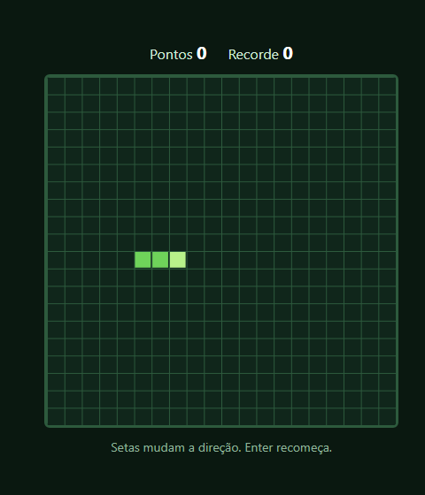
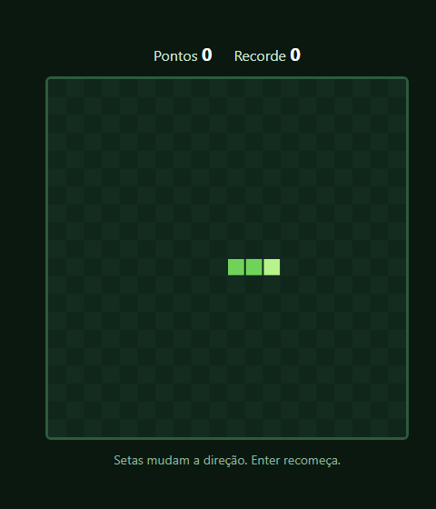
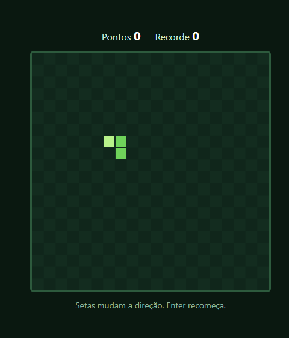
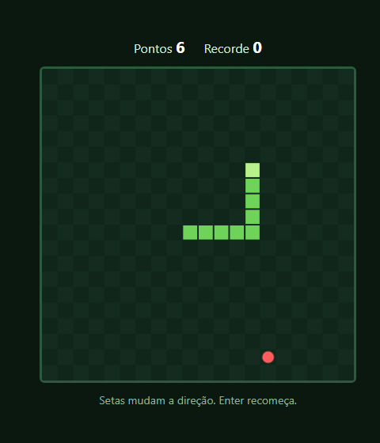
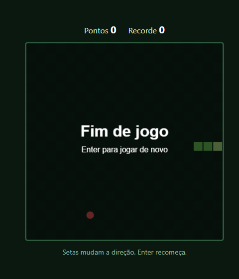
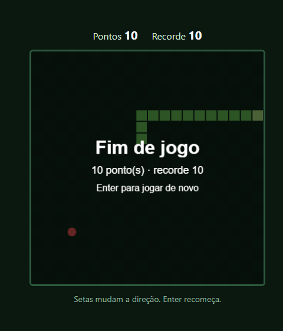

> Um passo além do Pong: o jogo agora tem uma grade, e a cobra é uma lista que cresce. É o projeto em que estrutura de dados fica visível na tela — e em que três bugs clássicos aparecem: a cobra que morre ao apertar a seta oposta, a que morre com duas setas rápidas, e a comida que um dia nasce dentro da cobra. Este é o passo a passo que eu seguiria, com medições de cada um.

## O QUE VOCÊ PRECISA
- VS Code, com a extensão *Live Server* (opcional).
- Um navegador atual.
- Ter feito o Pong ajuda muito: o laço com `requestAnimationFrame` e o `dt` são reaproveitados aqui.

## ANTES DE ESCREVER A PRIMEIRA LINHA
Crie uma pasta chamada `cobrinha` e abra-a no VS Code (*Arquivo → Abrir Pasta*). Dentro dela, crie estes arquivos vazios:

~~~arvore
cobrinha/
├── index.html
├── estilo.css
└── jogo.js
~~~
HTML e CSS ficam prontos na etapa 1. O placar já aparece, mas só começa a contar na etapa 4.

### 1. A grade e a cobra
Um canvas de 400 × 400 dividido em 20 × 20 células, e a cobra desenhada nelas.

~~~arquivo index.html
<!DOCTYPE html>
<html lang="pt-BR">
<head>
    <meta charset="UTF-8">
    <meta name="viewport" content="width=device-width, initial-scale=1.0">
    <title>Cobrinha</title>
    <link rel="stylesheet" href="estilo.css">
</head>
<body>
    <main>
        

            Pontos <b id="pontos">0</b>
            Recorde <b id="recorde">0</b>
        

        <canvas id="tela" width="400" height="400" aria-label="Jogo da cobrinha"></canvas>

        
Setas mudam a direção. Enter recomeça.

    </main>

    
</body>
</html>
~~~

~~~arquivo estilo.css
* {
    box-sizing: border-box;
    margin: 0;
    padding: 0;
}

body {
    min-height: 100vh;
    display: grid;
    place-items: center;
    padding: 24px;
    background: #0a1810;
    color: #cfe8d5;
    font-family: 'Segoe UI', system-ui, sans-serif;
}

main {
    display: grid;
    justify-items: center;
    gap: 12px;
}
.placar {
    display: flex;
    gap: 24px;
    font-size: 16px;
    font-variant-numeric: tabular-nums;
}
.placar b { color: #fff; font-size: 20px; }

/* Resolução de desenho nos atributos do canvas; tamanho na tela aqui. */
canvas {
    display: block;
    width: 400px;
    max-width: 100%;
    height: auto;
    border: 3px solid #2d5a3d;
    border-radius: 6px;
}

.dica { color: #8fb39a; font-size: 14px; }
~~~

~~~arquivo jogo.js
const tela = document.getElementById('tela');
const ctx = tela.getContext('2d');

const CELULA = 20;                     // pixels por célula
const COLUNAS = tela.width / CELULA;   // 20
const LINHAS = tela.height / CELULA;   // 20

/* A cobra em coordenadas de CÉLULA, não de pixel. A cabeça é o
   primeiro elemento do array; a cauda, o último. */
const cobra = [
    { x: 7, y: 10 },
    { x: 6, y: 10 },
    { x: 5, y: 10 },
];

function desenhar() {
    ctx.fillStyle = '#10261b';
    ctx.fillRect(0, 0, tela.width, tela.height);

    // Grade só para conferir o alinhamento — sai na próxima etapa.
    // O +0,5 põe a linha de 1 px no meio de um pixel, e ela sai nítida.
    ctx.strokeStyle = '#2d5a3d';
    ctx.lineWidth = 1;
    for (let i = 0; i <= COLUNAS; i++) {
        ctx.beginPath();
        ctx.moveTo(i * CELULA + 0.5, 0);
        ctx.lineTo(i * CELULA + 0.5, tela.height);
        ctx.stroke();
    }
    for (let j = 0; j <= LINHAS; j++) {
        ctx.beginPath();
        ctx.moveTo(0, j * CELULA + 0.5);
        ctx.lineTo(tela.width, j * CELULA + 0.5);
        ctx.stroke();
    }

    // Célula -> pixel acontece só aqui, na hora de pintar.
    cobra.forEach((segmento, i) => {
        ctx.fillStyle = i === 0 ? '#b8f28a' : '#6fd35a';
        ctx.fillRect(segmento.x * CELULA + 1, segmento.y * CELULA + 1, CELULA - 2, CELULA - 2);
    });
}

desenhar();
~~~

#### A cobra pensa em células, não em pixels
No Pong, as posições eram pixels, porque a bola anda de forma contínua. Aqui, tudo acontece em saltos de uma célula. Guardando `{ x: 7, y: 10 }` em vez de `{ x: 140, y: 200 }`, a colisão vira comparar dois números inteiros com `===`, e “a célula à direita” é somar 1. A conversão para pixel — multiplicar por `CELULA` — acontece num lugar só, dentro de `desenhar()`. Se um dia as células passarem a ter 30 px, muda uma constante e nenhuma regra do jogo. E a ordem do array é uma decisão: a cabeça é o índice 0. É ela que se move, colide e come, então fica no lugar mais barato de acessar.

#### Por que o `+ 0.5` na grade
O canvas desenha uma linha de 1 px *centrada* na coordenada. Em `x = 20`, metade dela cai no pixel 19 e metade no 20, e nenhum dos dois pixels fica aceso de verdade. Medi numa linha branca sobre fundo preto:

| LINHA DESENHADA EM | O QUE APARECE |
|---|---|
| `x = 20` | dois pixels acinzentados, com brilho 127 e 128 (de 255) |
| `x = 40.5` | um pixel só, com brilho 255 — e os vizinhos em 0 |
Somando meio pixel, a linha cai inteira dentro de um pixel e sai nítida. A grade é só para conferir que células e cobra estão alinhadas; na próxima etapa ela sai.

!confira 20 colunas e 20 linhas de grade, a cobra na metade esquerda, três quadrados, o da frente mais claro.

### 2. O movimento
Um passo a cada 120 ms: cabeça nova na frente, cauda fora atrás.

~~~arquivo jogo.js
const tela = document.getElementById('tela');
const ctx = tela.getContext('2d');

const CELULA = 20;
const COLUNAS = tela.width / CELULA;
const LINHAS = tela.height / CELULA;
const INTERVALO = 120;                 // ms entre dois passos da cobra

const cobra = [
    { x: 7, y: 10 },
    { x: 6, y: 10 },
    { x: 5, y: 10 },
];

let direcao = { x: 1, y: 0 };   // por enquanto, sempre para a direita
let acumulado = 0;              // ms guardados até completar um passo
let anterior = null;

/* O laço roda na taxa do monitor; a cobra anda em passos de 120 ms.
   O acumulador é a ponte entre os dois ritmos. */
function quadro(agora) {
    const dt = anterior === null ? 0 : Math.min(agora - anterior, 250);
    anterior = agora;

    acumulado += dt;
    while (acumulado >= INTERVALO) {
        acumulado -= INTERVALO;
        passo();
    }

    desenhar();
    requestAnimationFrame(quadro);
}

function passo() {
    const cabeca = cobra[0];
    const nova = {
        // Provisório até a etapa 5: quem sai por uma borda entra pela oposta.
        x: (cabeca.x + direcao.x + COLUNAS) % COLUNAS,
        y: (cabeca.y + direcao.y + LINHAS) % LINHAS,
    };

    cobra.unshift(nova);   // cabeça nova na frente...
    cobra.pop();           // ...e a cauda sai de trás
}

function desenhar() {
    // Tabuleiro xadrez: marca as células sem a poluição da grade.
    for (let y = 0; y < LINHAS; y++) {
        for (let x = 0; x < COLUNAS; x++) {
            ctx.fillStyle = (x + y) % 2 === 0 ? '#10261b' : '#132c1f';
            ctx.fillRect(x * CELULA, y * CELULA, CELULA, CELULA);
        }
    }

    cobra.forEach((segmento, i) => {
        ctx.fillStyle = i === 0 ? '#b8f28a' : '#6fd35a';
        ctx.fillRect(segmento.x * CELULA + 1, segmento.y * CELULA + 1, CELULA - 2, CELULA - 2);
    });
}

requestAnimationFrame(quadro);
~~~

#### O truque inteiro do jogo são duas linhas

~~~codigo
cobra.unshift(nova);   // cabeça nova na frente...
cobra.pop();           // ...e a cauda sai de trás
~~~
Nenhum segmento do corpo se move. A cabeça nova entra na frente do array, e o último elemento sai. Para quem olha, a cobra inteira andou uma célula — mas o programa só mexeu nas duas pontas. É por isso que uma cobra de 300 segmentos anda tão rápido quanto uma de 3.

#### Dois ritmos, e um acumulador entre eles

~~~codigo
acumulado += dt;
while (acumulado >= INTERVALO) {
    acumulado -= INTERVALO;
    passo();
}
~~~
O laço roda na taxa do monitor, como no Pong. Mas a cobra não se move continuamente: ela dá passos. O acumulador guarda o tempo que passou e, a cada 120 ms guardados, gasta um passo. É `while`, e não `if`, porque um quadro atrasado pode trazer tempo para dois passos de uma vez. Conferi: 1,25 segundo deu os mesmos 10 passos a 60 Hz e a 144 Hz. E o teto do `dt` agora é 250 ms: voltando de uma aba escondida por 5 segundos, a cobra deu no máximo 2 passos, e não 41 de uma vez.

#### O `+ COLUNAS` antes do `%`
Enquanto não existem paredes (elas chegam na etapa 5), a cobra que sai por uma borda entra pela oposta. Em JavaScript, o resto da divisão mantém o sinal: `-1 % 20` dá `-1`, e não 19. Somar 20 antes resolve os dois lados: `(-1 + 20) % 20` é 19, e `(20 + 20) % 20` é 0. Conferi o corpo depois de atravessar a borda: células 2, 1 e 0, contíguo.

!confira a cobra anda sozinha para a direita, some na borda e reaparece do outro lado, sem acelerar nem travar.

### 3. Mudar de direção sem se matar
Setas mudam a direção — mas nunca 180°, e nunca duas vezes no mesmo passo.
Entram as direções como objetos, uma fila de curvas pedidas, e o ouvinte de teclado. O passo passa a consumir a fila:

~~~codigo
const DIRECOES = {
    ArrowUp:    { x: 0,  y: -1 },
    ArrowDown:  { x: 0,  y: 1 },
    ArrowLeft:  { x: -1, y: 0 },
    ArrowRight: { x: 1,  y: 0 },
};

let fila = [];          // curvas pedidas que ainda não aconteceram (no máximo 2)

// A direção só muda NO PASSO, e uma curva por passo.
if (fila.length > 0) direcao = fila.shift();
~~~

~~~arquivo jogo.js — teclado
document.addEventListener('keydown', (evento) => {
    const pedida = DIRECOES[evento.key];
    if (!pedida) return;
    evento.preventDefault();

    // Compara com a última curva JÁ PEDIDA — ou com a atual, se não há nenhuma.
    const ultima = fila.length > 0 ? fila[fila.length - 1] : direcao;
    const oposta = pedida.x === -ultima.x && pedida.y === -ultima.y;

    if (oposta || pedida === ultima || fila.length >= 2) return;
    fila.push(pedida);
});
~~~

#### A inversão instantânea
Indo para a direita, apertar a seta esquerda faz a cabeça tentar entrar na célula do próprio pescoço. Na etapa 5, isso seria morte na hora — por apertar uma tecla. Então a seta oposta à direção atual é recusada. Até aqui, é o que todo tutorial faz.

#### O bug que sobrevive a essa correção: duas setas rápidas
O jeito comum de escrever é trocar `direcao` direto no `keydown`, comparando com a direção atual. Agora imagine: indo para a direita, a pessoa aperta cima e, antes do próximo passo, esquerda.

~~~codigo
cima:      comparada com "direita" — não é oposta, vira a direção
esquerda:  comparada com "cima"    — não é oposta, vira a direção
passo:     a cobra, que ainda estava indo para a direita, anda para a esquerda
~~~
Simulei: a cabeça iria para a célula 6,10 — exatamente onde está o pescoço. A cobra morre fazendo uma curva perfeitamente legal, só que rápida. A correção tem duas partes. A direção só muda no passo, e as curvas pedidas entram numa fila. Cada pedido é comparado com o último pedido da fila (ou com a direção atual, se a fila estiver vazia). Com o mesmo cima+esquerda, o primeiro passo subiu e o segundo virou à esquerda, sem tocar no pescoço. A fila guarda no máximo duas curvas: o suficiente para uma curva em U rápida, e pouco para a pessoa acumular pedidos que vão acontecer muito depois de apertados.

#### Comparar direções com `===`
`{ x: 1, y: 0 } === { x: 1, y: 0 }` é `false`: são dois objetos diferentes com o mesmo conteúdo. Mas toda direção do jogo sai de `DIRECOES`, então é sempre um desses quatro objetos, e `pedida ===` `ultima` funciona. Por isso a seta da direção atual não entra na fila à toa.

!confira indo para a direita, a seta esquerda não faz nada. Cima e esquerda bem rápido: a cobra sobe e vira, sem se atravessar. As setas não rolam a página.

### 4. Comida e crescimento
Comer é não tirar a cauda. E a comida só pode nascer onde a cobra não está.

~~~codigo
function sortearComida() {
    const ocupadas = new Set(cobra.map((s) => s.y * COLUNAS + s.x));
    const livres = [];
    for (let i = 0; i < COLUNAS * LINHAS; i++) {
        if (!ocupadas.has(i)) livres.push(i);
    }
    if (livres.length === 0) return null;   // tabuleiro cheio

    const escolhida = livres[Math.floor(Math.random() * livres.length)];
    return { x: escolhida % COLUNAS, y: Math.floor(escolhida / COLUNAS) };
}

function passo() {
    if (fila.length > 0) direcao = fila.shift();

    const cabeca = cobra[0];
    const nova = {
        x: (cabeca.x + direcao.x + COLUNAS) % COLUNAS,
        y: (cabeca.y + direcao.y + LINHAS) % LINHAS,
    };
    const comeu = comida !== null && nova.x === comida.x && nova.y === comida.y;

    cobra.unshift(nova);

    if (comeu) {
        pontos++;                    // a cauda NÃO sai: a cobra cresceu um
        campoPontos.textContent = pontos;
        comida = sortearComida();
    } else {
        cobra.pop();
    }
}
~~~
Em `desenhar()`, a comida é um círculo, pintado antes da cobra:

~~~codigo
if (comida !== null) {
    ctx.fillStyle = '#ff5d5d';
    ctx.beginPath();
    ctx.arc(comida.x * CELULA + CELULA / 2, comida.y * CELULA + CELULA / 2, CELULA * 0.38, 0, 
Math.PI * 2);
    ctx.fill();
}
~~~

#### Crescer é deixar de fazer uma coisa
O passo normal é “cabeça nova, cauda fora”. Comendo, a cauda simplesmente não sai — e a cobra tem um segmento a mais. Não existe código de crescer. Conferi: depois de uma comida, 4 segmentos; depois de mais cinco, exatamente 9; dois passos sem comer, continuou 9.

#### Sortear entre as células livres
O jeito comum é sortear qualquer célula e, se cair na cobra, sortear de novo. Parece inocente. Medi quantos sorteios esse método gasta, em média, para achar uma célula livre:

| TABULEIRO OCUPADO PELA COBRA | SORTEIOS POR COMIDA |
|---|---|
| 50% | 2,0 |
| 90% | 9,9 |
| 99% | 100,8 |
| 100% | infinitos — o laço nunca termina e a aba trava |
A última linha é o problema real: quando a cobra enche o tabuleiro, não há célula livre, e o “tente de novo” vira um laço eterno. A página congela justamente no momento em que a pessoa venceu. `sortearComida()` faz ao contrário: monta a lista de células livres e sorteia *dentro* dela. É um sorteio só, sempre. Com 390 células ocupadas, 2.000 sorteios seguidos não caíram nenhuma vez em cima da cobra; com 399, veio sempre a única livre; com 400, veio `null` — e o jogo pode tratar isso como vitória.

#### Um número por célula
O `Set` guarda cada célula ocupada como um número só: `y * COLUNAS + x`. A célula (3, 2) vira 43. Perguntar “43 está ocupada?” a um `Set` é imediato, enquanto procurar um objeto `{ x, y }` num array exigiria percorrê-lo. Para voltar, `43 % 20` dá 3 e `Math.floor(43 / 20)` dá 2.

!confira coma algumas comidas: a cobra cresce um segmento cada, o placar soma, e a comida nova nunca aparece dentro da cobra.

### 5. Morte e recomeço
Paredes de verdade, bater em si mesma, tela de fim e Enter para jogar de novo.
O estado da partida vira variáveis preenchidas por `novoJogo()`, como na Forca, e a travessia de borda sai de cena:

~~~arquivo jogo.js
const tela = document.getElementById('tela');
const ctx = tela.getContext('2d');
const campoPontos = document.getElementById('pontos');

const CELULA = 20;
const COLUNAS = tela.width / CELULA;
const LINHAS = tela.height / CELULA;
const INTERVALO = 120;

const DIRECOES = {
    ArrowUp:    { x: 0,  y: -1 },
    ArrowDown:  { x: 0,  y: 1 },
    ArrowLeft:  { x: -1, y: 0 },
    ArrowRight: { x: 1,  y: 0 },
};

let cobra;
let direcao;
let fila;
let pontos;
let comida;
let estado;        // 'jogando' ou 'fim'
let acumulado;
let anterior = null;

function novoJogo() {
    cobra = [
        { x: 7, y: 10 },
        { x: 6, y: 10 },
        { x: 5, y: 10 },
    ];
    direcao = DIRECOES.ArrowRight;
    fila = [];
    pontos = 0;
    estado = 'jogando';
    acumulado = 0;
    comida = sortearComida();
    campoPontos.textContent = pontos;
}

function sortearComida() {
    const ocupadas = new Set(cobra.map((s) => s.y * COLUNAS + s.x));
    const livres = [];
    for (let i = 0; i < COLUNAS * LINHAS; i++) {
        if (!ocupadas.has(i)) livres.push(i);
    }
    if (livres.length === 0) return null;

    const escolhida = livres[Math.floor(Math.random() * livres.length)];
    return { x: escolhida % COLUNAS, y: Math.floor(escolhida / COLUNAS) };
}

function quadro(agora) {
    const dt = anterior === null ? 0 : Math.min(agora - anterior, 250);
    anterior = agora;

    if (estado === 'jogando') {
        acumulado += dt;
        while (acumulado >= INTERVALO && estado === 'jogando') {
            acumulado -= INTERVALO;
            passo();
        }
    }

    desenhar();
    requestAnimationFrame(quadro);
}

function passo() {
    if (fila.length > 0) direcao = fila.shift();

    const cabeca = cobra[0];
    const nova = { x: cabeca.x + direcao.x, y: cabeca.y + direcao.y };
    const comeu = comida !== null && nova.x === comida.x && nova.y === comida.y;

    // Sem comer, a cauda sai NESTE passo: a célula dela já está livre.
    const corpo = comeu ? cobra : cobra.slice(0, -1);
    const bateuNaParede = nova.x < 0 || nova.x >= COLUNAS || nova.y < 0 || nova.y >= LINHAS;
    const bateuEmSi = corpo.some((s) => s.x === nova.x && s.y === nova.y);

    if (bateuNaParede || bateuEmSi) {
        estado = 'fim';
        return;
    }

    cobra.unshift(nova);

    if (comeu) {
        pontos++;
        campoPontos.textContent = pontos;
        comida = sortearComida();
        if (comida === null) estado = 'fim';   // encheu o tabuleiro
    } else {
        cobra.pop();
    }
}

function desenhar() {
    for (let y = 0; y < LINHAS; y++) {
        for (let x = 0; x < COLUNAS; x++) {
            ctx.fillStyle = (x + y) % 2 === 0 ? '#10261b' : '#132c1f';
            ctx.fillRect(x * CELULA, y * CELULA, CELULA, CELULA);
        }
    }
    if (comida !== null) {
        ctx.fillStyle = '#ff5d5d';
        ctx.beginPath();
        ctx.arc(comida.x * CELULA + CELULA / 2, comida.y * CELULA + CELULA / 2, CELULA * 0.38, 0, 
Math.PI * 2);
        ctx.fill();
    }

    cobra.forEach((segmento, i) => {
        ctx.fillStyle = i === 0 ? '#b8f28a' : '#6fd35a';
        ctx.fillRect(segmento.x * CELULA + 1, segmento.y * CELULA + 1, CELULA - 2, CELULA - 2);
    });

    if (estado === 'fim') {
        ctx.fillStyle = 'rgba(0, 0, 0, 0.6)';
        ctx.fillRect(0, 0, tela.width, tela.height);
        ctx.fillStyle = '#ffffff';
        ctx.textAlign = 'center';
        ctx.font = 'bold 32px sans-serif';
        ctx.fillText('Fim de jogo', tela.width / 2, tela.height / 2 - 10);
        ctx.font = '16px sans-serif';
        ctx.fillText('Enter para jogar de novo', tela.width / 2, tela.height / 2 + 22);
    }
}

document.addEventListener('keydown', (evento) => {
    if (estado === 'fim' && evento.key === 'Enter') {
        novoJogo();
        return;
    }

    const pedida = DIRECOES[evento.key];
    if (!pedida) return;
    evento.preventDefault();

    const ultima = fila.length > 0 ? fila[fila.length - 1] : direcao;
    const oposta = pedida.x === -ultima.x && pedida.y === -ultima.y;

    if (oposta || pedida === ultima || fila.length >= 2) return;
    fila.push(pedida);
});

novoJogo();
requestAnimationFrame(quadro);
~~~

#### A regra da cauda

~~~codigo
// Sem comer, a cauda sai NESTE passo: a célula dela já está livre.
const corpo = comeu ? cobra : cobra.slice(0, -1);
const bateuNaParede = nova.x < 0 || nova.x >= COLUNAS || nova.y < 0 || nova.y >= LINHAS;
const bateuEmSi = corpo.some((s) => s.x === nova.x && s.y === nova.y);
~~~
O teste óbvio de colisão procura a cabeça nova em todo o corpo. Ele mata a cobra num movimento legal: andar para a célula onde a cauda está *agora*. Nesse mesmo passo a cauda sai, e a célula fica livre. Numa cobra dando voltas bem fechadas, isso acontece o tempo todo. Por isso o corpo testado é o array sem o último elemento — a não ser que a cobra vá comer, caso em que a cauda fica. Montei os três casos: entrar no corpo encerrou; entrar na célula da cauda continuou jogando, com 4 segmentos; entrar na célula da cauda com comida ali encerrou.

#### Um estado, e o laço obedece
`estado` vale `'jogando'` ou `'fim'`. O laço continua rodando no fim — é ele que desenha a tela escura por cima —, mas só dá passos jogando. A condição dentro do `while` importa: se a cobra morrer no primeiro de dois passos acumulados, o segundo não acontece. Conferi: dois segundos depois do fim a cobra estava idêntica, as setas não faziam nada, Enter recomeçou com 3 segmentos e placar zero, e Enter no meio da partida não reiniciou nada.

#### As quatro paredes
Sem o `%`, a cabeça nova pode ter `x` igual a −1 ou 20, e isso é exatamente o teste de parede. Coloquei a cobra encostada em cada uma das quatro bordas, indo contra ela: as quatro encerraram.

!confira bata numa parede: tela escura e “Fim de jogo”. Enter começa outra partida limpa. Faça uma curva bem fechada seguindo a própria cauda: a cobra não morre.

### 6. Velocidade e recorde
A cobra acelera a cada comida, e o melhor resultado sobrevive ao F5.

~~~codigo
const INTERVALO_INICIAL = 120;   // ms por passo no começo
const INTERVALO_MINIMO = 60;     // o mais rápido que ela chega
const ACELERACAO = 3;            // ms a menos por comida
const CHAVE_RECORDE = 'cobrinha:recorde';

function intervalo() {
    return Math.max(INTERVALO_MINIMO, INTERVALO_INICIAL - pontos * ACELERACAO);
}

function quadro(agora) {
    const dt = anterior === null ? 0 : Math.min(agora - anterior, 250);
    anterior = agora;

    if (estado === 'jogando') {
        acumulado += dt;
        // intervalo() é consultado a cada volta: se ela comer, o próximo passo já é mais curto.
        while (acumulado >= intervalo() && estado === 'jogando') {
            acumulado -= intervalo();
            passo();
        }
    }

    desenhar();
    requestAnimationFrame(quadro);
}

function lerRecorde() {
    try {
        const valor = Number(localStorage.getItem(CHAVE_RECORDE));
        return Number.isInteger(valor) && valor > 0 ? valor : 0;
    } catch {
        return 0;
    }
}

function terminar() {
    estado = 'fim';
    if (pontos > lerRecorde()) {
        try {
            localStorage.setItem(CHAVE_RECORDE, String(pontos));
        } catch {
            // Sem armazenamento, o recorde vale só nesta aba.
        }
    }
    mostrarPlacar();
}
~~~
`mostrarPlacar()` atualiza pontos e recorde, e a tela de fim ganha uma linha com os dois. O arquivo completo:

~~~arquivo jogo.js
const tela = document.getElementById('tela');
const ctx = tela.getContext('2d');
const campoPontos = document.getElementById('pontos');
const campoRecorde = document.getElementById('recorde');

const CELULA = 20;
const COLUNAS = tela.width / CELULA;
const LINHAS = tela.height / CELULA;
const INTERVALO_INICIAL = 120;   // ms por passo no começo
const INTERVALO_MINIMO = 60;     // o mais rápido que ela chega
const ACELERACAO = 3;            // ms a menos por comida
const CHAVE_RECORDE = 'cobrinha:recorde';

const DIRECOES = {
    ArrowUp:    { x: 0,  y: -1 },
    ArrowDown:  { x: 0,  y: 1 },
    ArrowLeft:  { x: -1, y: 0 },
    ArrowRight: { x: 1,  y: 0 },
};

let cobra;
let direcao;
let fila;
let pontos;
let comida;
let estado;
let acumulado;
let anterior = null;

function lerRecorde() {
    try {
        const valor = Number(localStorage.getItem(CHAVE_RECORDE));
        return Number.isInteger(valor) && valor > 0 ? valor : 0;
    } catch {
        return 0;
    }
}

function mostrarPlacar() {
    campoPontos.textContent = pontos;
    campoRecorde.textContent = lerRecorde();
}

function intervalo() {
    return Math.max(INTERVALO_MINIMO, INTERVALO_INICIAL - pontos * ACELERACAO);
}

function novoJogo() {
    cobra = [
        { x: 7, y: 10 },
        { x: 6, y: 10 },
        { x: 5, y: 10 },
    ];
    direcao = DIRECOES.ArrowRight;
    fila = [];
    pontos = 0;
    estado = 'jogando';
    acumulado = 0;
    comida = sortearComida();
    mostrarPlacar();
}

function terminar() {
    estado = 'fim';
    if (pontos > lerRecorde()) {
        try {
            localStorage.setItem(CHAVE_RECORDE, String(pontos));
        } catch {
            // Sem armazenamento, o recorde vale só nesta aba.
        }
    }
    mostrarPlacar();
}

function sortearComida() {
    const ocupadas = new Set(cobra.map((s) => s.y * COLUNAS + s.x));
    const livres = [];
    for (let i = 0; i < COLUNAS * LINHAS; i++) {
        if (!ocupadas.has(i)) livres.push(i);
    }
    if (livres.length === 0) return null;

    const escolhida = livres[Math.floor(Math.random() * livres.length)];
    return { x: escolhida % COLUNAS, y: Math.floor(escolhida / COLUNAS) };
}

function quadro(agora) {
    const dt = anterior === null ? 0 : Math.min(agora - anterior, 250);
    anterior = agora;

    if (estado === 'jogando') {
        acumulado += dt;
        // intervalo() é consultado a cada volta: se ela comer, o próximo passo já é mais curto.
        while (acumulado >= intervalo() && estado === 'jogando') {
            acumulado -= intervalo();
            passo();
        }
    }

    desenhar();
    requestAnimationFrame(quadro);
}

function passo() {
    if (fila.length > 0) direcao = fila.shift();

    const cabeca = cobra[0];
    const nova = { x: cabeca.x + direcao.x, y: cabeca.y + direcao.y };
    const comeu = comida !== null && nova.x === comida.x && nova.y === comida.y;

    const corpo = comeu ? cobra : cobra.slice(0, -1);
    const bateuNaParede = nova.x < 0 || nova.x >= COLUNAS || nova.y < 0 || nova.y >= LINHAS;
    const bateuEmSi = corpo.some((s) => s.x === nova.x && s.y === nova.y);

    if (bateuNaParede || bateuEmSi) {
        terminar();
        return;
    }

    cobra.unshift(nova);

    if (comeu) {
        pontos++;
        comida = sortearComida();
        mostrarPlacar();
        if (comida === null) terminar();
    } else {
        cobra.pop();
    }
}

function desenhar() {
    for (let y = 0; y < LINHAS; y++) {
        for (let x = 0; x < COLUNAS; x++) {
            ctx.fillStyle = (x + y) % 2 === 0 ? '#10261b' : '#132c1f';
            ctx.fillRect(x * CELULA, y * CELULA, CELULA, CELULA);
        }
    }

    if (comida !== null) {
        ctx.fillStyle = '#ff5d5d';
        ctx.beginPath();
        ctx.arc(comida.x * CELULA + CELULA / 2, comida.y * CELULA + CELULA / 2, CELULA * 0.38, 0, 
Math.PI * 2);
        ctx.fill();
    }

    cobra.forEach((segmento, i) => {
        ctx.fillStyle = i === 0 ? '#b8f28a' : '#6fd35a';
        ctx.fillRect(segmento.x * CELULA + 1, segmento.y * CELULA + 1, CELULA - 2, CELULA - 2);
    });

    if (estado === 'fim') {
        ctx.fillStyle = 'rgba(0, 0, 0, 0.6)';
        ctx.fillRect(0, 0, tela.width, tela.height);
        ctx.fillStyle = '#ffffff';
        ctx.textAlign = 'center';
        ctx.font = 'bold 32px sans-serif';
        ctx.fillText('Fim de jogo', tela.width / 2, tela.height / 2 - 24);
        ctx.font = '18px sans-serif';
        ctx.fillText(`${pontos} ponto(s) · recorde ${lerRecorde()}`, tela.width / 2, tela.height / 2 + 
10);
        ctx.font = '16px sans-serif';
        ctx.fillText('Enter para jogar de novo', tela.width / 2, tela.height / 2 + 40);
    }
}

document.addEventListener('keydown', (evento) => {
    if (estado === 'fim' && evento.key === 'Enter') {
        novoJogo();
        return;
    }

    const pedida = DIRECOES[evento.key];
    if (!pedida) return;
    evento.preventDefault();

    const ultima = fila.length > 0 ? fila[fila.length - 1] : direcao;
    const oposta = pedida.x === -ultima.x && pedida.y === -ultima.y;

    if (oposta || pedida === ultima || fila.length >= 2) return;
    fila.push(pedida);
});

novoJogo();
requestAnimationFrame(quadro);
~~~

#### A velocidade é calculada, não somada
Seria possível fazer `intervalo -= 3` a cada comida. Aí você precisa lembrar de voltar ao valor inicial em `novoJogo()`, e de não passar do mínimo. Calculando a partir de `pontos`, nada disso existe: 0 pontos dão 120 ms, 10 dão 90, 20 dão 60, e 30 ou 50 continuam em 60, o limite. Com 20 pontos, 1,1 segundo deu 18 passos — um a cada 60 ms. E `intervalo()` é consultado a cada volta do `while`: se a cobra comer no meio de uma rajada de passos, o próximo já sai mais curto.

#### O recorde, desconfiado
Como na Memória, a leitura não confia no que encontra. Aqui o teste é `Number.isInteger`: pontos são inteiros, então `'2.5'` é tão inválido quanto `'abc'` — testei os dois, e os dois viraram 0. Terminar com 7 gravou 7; terminar depois com 3 não sobrescreveu.

!confira coma várias comidas: a cobra acelera até um limite. Faça um recorde, aperte F5: ele continua no placar. Uma partida pior não o substitui.

### ✓ Roteiro de teste
Passe por estes casos antes de considerar a oficina concluída. Eles cobrem o que costuma quebrar.

| VOCÊ FAZ | DEVE ACONTECER |
|---|---|
| Indo para a direita, apertar a seta esquerda | nada acontece |
| Apertar cima e esquerda muito rápido | a cobra sobe e vira, sem morrer |
| Comer várias comidas | cresce exatamente um segmento por comida |
| Observar onde a comida nasce | nunca em cima da cobra |
| Bater em cada uma das quatro paredes | encerra sempre |
| Seguir a própria cauda numa curva fechada | não morre |
| Bater em si mesma | encerra |
| Enter na tela de fim | partida nova, 3 segmentos, placar zero |
| Comer muito | acelera, até um limite |
| Fazer um recorde e apertar F5 | o recorde continua |

### ! Quando não funcionar
Os tropeços desta oficina, e o que procurar em cada um.

| SINTOMA | CAUSA QUASE CERTA |
|---|---|
| A grade sai borrada, com linhas cinza de 2 px | Falta o `+ 0.5` nas coordenadas das linhas. |
| A cobra "estica" ou deixa buracos no corpo | O passo mexe em segmentos do meio. Só insira na frente e remova atrás. |
| Anda mais rápido em outro monitor | O passo está preso ao quadro. Use o acumulador com `dt`. |
| Some na borda esquerda e não volta | `-1 % 20` dá −1. Some `COLUNAS` antes do resto. |
| Morre ao apertar a seta oposta | Falta recusar a direção oposta. |
| Morre com duas setas rápidas | A direção muda no `keydown`. Use a fila e compare com o último pedido. |
| A comida aparece dentro da cobra | O sorteio não exclui as células ocupadas. |
| A página trava quando a cobra fica enorme | Sorteio com “tente de novo” sem célula livre. Sorteie entre as livres. |
| Morre numa curva fechada atrás da cauda | A colisão considera a cauda, que sai no mesmo passo. |
| Cresce sem parar, ou não cresce | O `pop()` está acontecendo sempre, ou nunca. Ele só é pulado quando come. |

### → Para levar adiante
Extensões em ordem de dificuldade. Todas cabem no que você já construiu.
1. Pausa. Espaço alterna um estado `pausado`. O cuidado: zerar `anterior` ao voltar, para o `dt` não trazer a pausa inteira. 2. Obstáculos. Um array de células bloqueadas: entra no teste de colisão e na lista de ocupadas do sorteio. 3. Paredes que teletransportam. Uma opção que liga o `%` da etapa 2 de volta. O teste de parede passa a depender dela. 4. Comida especial. Às vezes uma comida dourada vale 3 e some depois de 5 segundos — usando o relógio de jogo do Pong.
