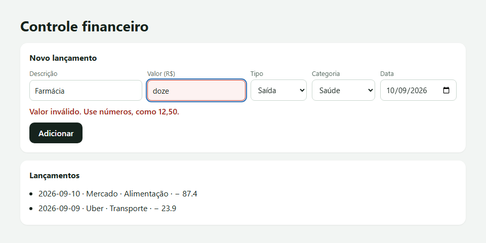
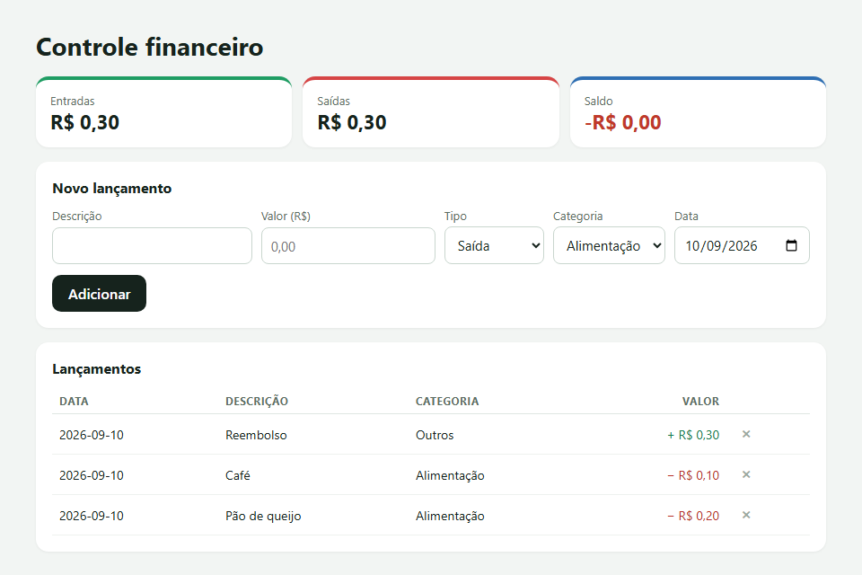
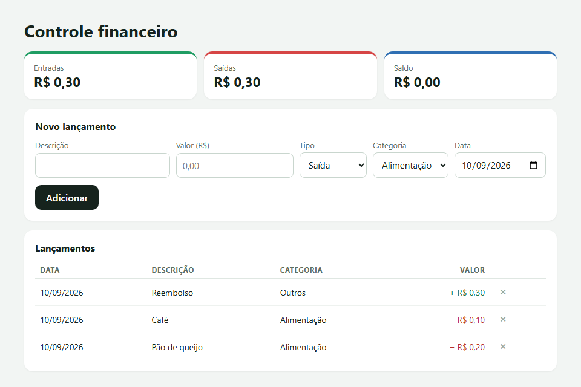
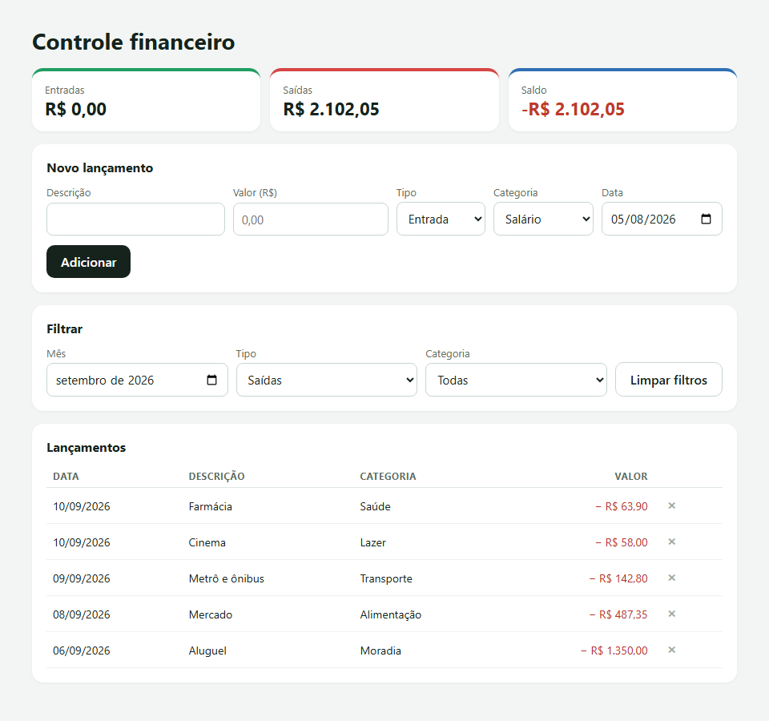
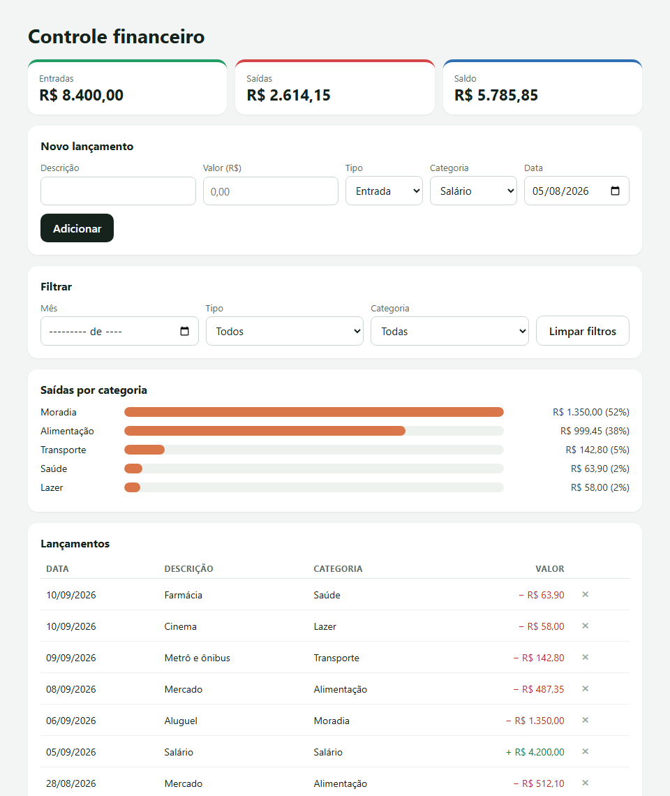
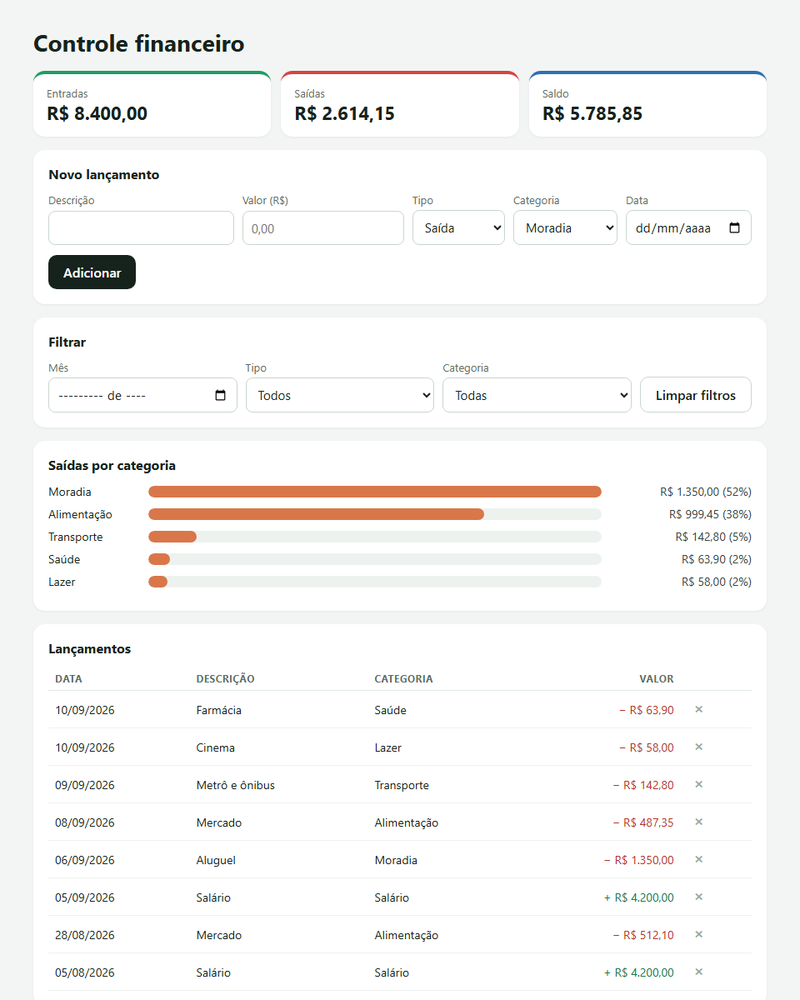

> O projeto mais completo em JavaScript puro deste laboratório: cadastro, totais, filtros, gráfico, persistência e exportação para planilha. É também o projeto em que um erro de um centavo aparece na tela — e aparece em vermelho. Este é o passo a passo que eu seguiria, com uma etapa inteira construída do jeito comum, para medir esse centavo antes de eliminá-lo.

## O QUE VOCÊ PRECISA
- VS Code, com a extensão *Live Server* (opcional).
- Um navegador atual, e uma planilha (Excel, LibreOffice ou Google Planilhas) para abrir o CSV no fim.
- As oficinas da Lista de Tarefas (estado, persistência) e do Quiz (validação de dados) ajudam bastante.

## ANTES DE ESCREVER A PRIMEIRA LINHA
Crie uma pasta chamada `financeiro` e abra-a no VS Code (*Arquivo → Abrir Pasta*). Dentro dela, crie estes arquivos vazios:

~~~arvore
financeiro/
├── index.html
├── estilo.css
├── app.js
└── graficos.js
~~~
O CSS fica pronto na etapa 1. O HTML ganha totais, filtros, gráfico e botão de exportar ao longo das etapas. O `graficos.js` entra na etapa 5.

### 1. O lançamento
Um formulário com cinco campos — e nada entra sem passar pela validação.

~~~arquivo index.html
<!DOCTYPE html>
<html lang="pt-BR">
<head>
    <meta charset="UTF-8">
    <meta name="viewport" content="width=device-width, initial-scale=1.0">
    <title>Controle financeiro</title>
    <link rel="stylesheet" href="estilo.css">
</head>
<body>
    <main class="app">
        <h1>Controle financeiro</h1>

        <!-- novalidate: as mensagens de erro são nossas, iguais em todo navegador -->
        <form id="lancamento" class="painel" novalidate>
            <h2>Novo lançamento</h2>
            

                <label>Descrição
                    <input name="descricao" type="text" maxlength="80" autocomplete="off">
                </label>
                <label>Valor (R$)
                    <input name="valor" type="text" inputmode="decimal" placeholder="0,00" 
autocomplete="off">
                </label>
                <label>Tipo
                    <select name="tipo">
                        <option value="saida">Saída</option>
                        <option value="entrada">Entrada</option>
                    </select>
                </label>
                <label>Categoria
                    <select name="categoria" id="categoria"></select>
                </label>
                <label>Data
                    <input name="data" type="date">
                </label>
            

            

            <button type="submit" class="botao">Adicionar</button>
        </form>

        <section class="painel">
            <h2>Lançamentos</h2>
            <ul id="lista" class="lista-simples"></ul>
        </section>
    </main>

    
</body>
</html>
~~~

~~~arquivo estilo.css
* {
    box-sizing: border-box;
    margin: 0;
    padding: 0;
}

[hidden] { display: none !important; }

/* Some da tela, mas continua lido por leitor de tela. */
.oculto {
    position: absolute;
    width: 1px;
    height: 1px;
    overflow: hidden;
    clip-path: inset(50%);
    white-space: nowrap;
}

body {
    min-height: 100vh;
    padding: 32px 18px 48px;
    background: #f2f5f3;
    color: #16231d;
    font-family: 'Segoe UI', system-ui, sans-serif;
}

.app { display: grid; gap: 16px; max-width: 880px; margin: 0 auto; }

h1 { font-size: 28px; }
h2 { margin-bottom: 12px; font-size: 16px; }

.painel {
    padding: 18px;
    border-radius: 14px;
    background: #fff;
    box-shadow: 0 1px 3px rgba(0, 0, 0, .06);
}

/* ---- totais ---- */
.cartoes { display: grid; grid-template-columns: repeat(3, 1fr); gap: 12px; }
.cartao {
    padding: 14px 16px;
    border-top: 4px solid #9fb3a8;
    border-radius: 14px;
    background: #fff;
    box-shadow: 0 1px 3px rgba(0, 0, 0, .06);
}
.cartao span { display: block; color: #5b6e64; font-size: 13px; }
.cartao strong { font-size: 22px; font-variant-numeric: tabular-nums; }
.cartao.entrada { border-top-color: #1f9d63; }
.cartao.saida   { border-top-color: #d64545; }
.cartao.saldo   { border-top-color: #2f6fb3; }
.cartao.negativo strong { color: #c0392b; }

/* ---- formulários ---- */
.campos { display: grid; grid-template-columns: 2fr 1fr 1fr 1fr 1fr; gap: 10px; }
label { display: grid; gap: 4px; color: #5b6e64; font-size: 13px; }
input, select {
    padding: 9px 10px;
    border: 1px solid #c9d6ce;
    border-radius: 8px;
    background: #fff;
    color: #16231d;
    font: inherit;
    font-size: 15px;
}
input:focus, select:focus { outline: 2px solid #2f6fb3; outline-offset: 1px; }
[aria-invalid="true"] { border-color: #c0392b; background: #fdf2f1; }

.erro { margin-top: 10px; color: #a3261b; font-weight: 600; }

.botao {
    margin-top: 12px;
    padding: 10px 18px;
    border: 0;
    border-radius: 10px;
    background: #16231d;
    color: #fff;
    font: inherit;
    font-weight: 600;
    cursor: pointer;
}
.botao.secundario { border: 1px solid #c9d6ce; background: none; color: #16231d; }

.filtros .campos { grid-template-columns: repeat(3, 1fr) auto; align-items: end; }
.filtros .botao { margin-top: 0; }

/* ---- lista e tabela ---- */
.lista-simples { padding-left: 18px; line-height: 1.8; }

.tabela { width: 100%; border-collapse: collapse; font-size: 14px; }
.tabela th {
    padding: 6px 8px;
    border-bottom: 1px solid #dfe7e2;
    color: #5b6e64;
    font-size: 12px;
    letter-spacing: .04em;
    text-align: left;
    text-transform: uppercase;
}
.tabela td { padding: 8px; border-bottom: 1px solid #eef2ef; }
.tabela .valor { font-variant-numeric: tabular-nums; text-align: right; white-space: nowrap; }
.valor.entrada { color: #157a4b; }
.valor.saida   { color: #b8322b; }

.remover {
    width: 28px;
    height: 28px;
    border: 0;
    border-radius: 6px;
    background: none;
    color: #9aa9a0;
    font-size: 20px;
    cursor: pointer;
}
.remover:hover,
.remover:focus-visible { background: #fdecec; color: #b8322b; }

.vazio { padding: 16px; color: #7b8c83; text-align: center; }

/* ---- gráfico de barras feito de 
 ---- */
.barra-linha {
    display: grid;
    grid-template-columns: 110px 1fr 170px;
    align-items: center;
    gap: 10px;
    margin-bottom: 8px;
    font-size: 14px;
}
.barra-trilho { height: 14px; overflow: hidden; border-radius: 999px; background: #eef2ef; }
.barra { height: 100%; border-radius: 999px; background: #d9774a; }
.barra-valor { color: #34453c; font-variant-numeric: tabular-nums; text-align: right; }

.rodape { display: flex; justify-content: flex-end; }

@media (max-width: 720px) {
    .campos, .filtros .campos { grid-template-columns: 1fr 1fr; }
    .cartoes { grid-template-columns: 1fr; }
    .barra-linha { grid-template-columns: 90px 1fr; }
    .barra-valor { grid-column: 1 / -1; text-align: left; }
}
~~~

~~~arquivo app.js
const formulario = document.getElementById('lancamento');
const campoErro = document.getElementById('erro');
const lista = document.getElementById('lista');
const seletorCategoria = document.getElementById('categoria');

const CATEGORIAS = ['Moradia', 'Alimentação', 'Transporte', 'Saúde', 'Lazer', 'Salário', 'Outros'];

let lancamentos = [];

/* As opções saem da lista. A mesma lista vai alimentar filtros e gráfico. */
for (const categoria of CATEGORIAS) {
    seletorCategoria.append(new Option(categoria, categoria));
}

/* Devolve { lancamento } se estiver tudo certo, ou { erro, campo }. */
function lerFormulario() {
    const dados = new FormData(formulario);
    const descricao = String(dados.get('descricao')).trim();
    const textoValor = String(dados.get('valor')).trim();
    const valor = Number(textoValor.replace(',', '.'));   // provisório: a etapa 3 troca por centavos
    const data = String(dados.get('data'));

    if (descricao === '') return { erro: 'Escreva uma descrição.', campo: 'descricao' };
    if (textoValor === '' || !Number.isFinite(valor)) return { erro: 'Valor inválido. Use números, 
como 12,50.', campo: 'valor' };
    if (valor <= 0) return { erro: 'O valor precisa ser maior que zero.', campo: 'valor' };
    if (data === '') return { erro: 'Escolha a data.', campo: 'data' };

    return {
        lancamento: { descricao, valor, tipo: dados.get('tipo'), categoria: dados.get('categoria'), 
data },
    };
}

/* A mensagem aparece perto do botão, e o foco vai até o campo com problema. */
function mostrarErro(mensagem, campo) {
    limparErro();
    campoErro.textContent = mensagem;
    campoErro.hidden = false;
    const alvo = formulario.elements[campo];
    alvo.setAttribute('aria-invalid', 'true');
    alvo.focus();
}

function limparErro() {
    campoErro.hidden = true;
    for (const elemento of formulario.elements) elemento.removeAttribute('aria-invalid');
}

function desenhar() {
    lista.replaceChildren(...lancamentos.map((l) => {
        const item = document.createElement('li');
        const sinal = l.tipo === 'entrada' ? '+' : '−';
        item.textContent = `${l.data} · ${l.descricao} · ${l.categoria} · ${sinal} ${l.valor}`;
        return item;
    }));
}

formulario.addEventListener('submit', (evento) => {
    evento.preventDefault();

    const resultado = lerFormulario();
    if (resultado.erro) {
        mostrarErro(resultado.erro, resultado.campo);
        return;
    }

    limparErro();
    lancamentos.push(resultado.lancamento);

    // Tipo, categoria e data ficam: quem lança várias contas do mesmo dia agradece.
    formulario.elements.descricao.value = '';
    formulario.elements.valor.value = '';
    formulario.elements.descricao.focus();
    desenhar();
});

desenhar();
~~~

#### Ler o formulário devolve um resultado ou um erro

~~~codigo
function lerFormulario() {
    const dados = new FormData(formulario);
    const descricao = String(dados.get('descricao')).trim();
    const textoValor = String(dados.get('valor')).trim();
    const valor = Number(textoValor.replace(',', '.'));   // provisório: a etapa 3 troca por 
centavos
    const data = String(dados.get('data'));

    if (descricao === '') return { erro: 'Escreva uma descrição.', campo: 'descricao' };
    if (textoValor === '' || !Number.isFinite(valor)) return { erro: 'Valor inválido. Use 
números, como 12,50.', campo: 'valor' };
    if (valor <= 0) return { erro: 'O valor precisa ser maior que zero.', campo: 'valor' };
    if (data === '') return { erro: 'Escolha a data.', campo: 'data' };

    return {
        lancamento: { descricao, valor, tipo: dados.get('tipo'), categoria: 
dados.get('categoria'), data },
    };
}
~~~
`FormData` lê todos os campos pelo atributo `name`, sem um `getElementById` por campo. A função não mexe na tela: ela devolve `{ lancamento }` ou `{ erro, campo }`, e quem chamou decide o que fazer. Testei os quatro erros — descrição vazia, valor que não é número, valor zero, data vazia — e cada um mostrou sua mensagem e levou o foco ao campo certo.

#### Mensagens nossas, e o campo marcado
O `novalidate` desliga as bolhas de validação do navegador, que mudam de texto e de aparência de um navegador para outro. No lugar, a mensagem aparece no parágrafo com `role="alert"`, que o leitor de tela anuncia na hora, e o campo recebe `aria-invalid="true"`, que o CSS pinta de vermelho. Quando o lançamento entra, os dois somem. Um detalhe de uso: depois de adicionar, só descrição e valor são limpos. Data, tipo e categoria ficam — quem lança as contas do mês costuma lançar várias do mesmo dia seguidas.

#### Um buraco que fica aberto até a etapa 3
O valor é lido com `Number(texto.replace(',', '.'))`. Parece suficiente. Mas `Number` aceita notação científica: digitei `1e3` no valor, e o lançamento entrou, valendo 1000. Esse e outro problema bem maior são resolvidos na etapa 3, quando o dinheiro deixa de ser número quebrado.

!confira tente adicionar com cada campo vazio e com o valor “doze”: mensagem, foco e borda vermelha. Um lançamento certo aparece na lista.

### 2. A lista e os totais
Uma tabela e três cartões — e o centavo que aparece em vermelho.
O HTML troca a lista por uma tabela e ganha três cartões no topo:

~~~arquivo index.html (trechos novos)
<section class="cartoes" aria-label="Totais">
    
Entradas<strong id="total-entradas">R$ 0,00</strong>

    
Saídas<strong id="total-saidas">R$ 0,00</strong>

    
Saldo<strong id="total-saldo">R$ 0,00</strong>

</section>
...
<table class="tabela">
    <thead>
        <tr><th>Data</th><th>Descrição</th><th>Categoria</th><th class="valor">Valor</th><th>Ações</th></tr>
    </thead>
    <tbody id="linhas"></tbody>
</table>
~~~
E o `app.js` ganha um formatador de moeda, um id em cada lançamento, a soma e a tabela:

~~~codigo
const reais = new Intl.NumberFormat('pt-BR', { style: 'currency', currency: 'BRL' });
function somar(lista, tipo) {
    return lista
        .filter((l) => l.tipo === tipo)
        .reduce((soma, l) => soma + l.valor, 0);
}
function desenhar() {
    const entradas = somar(lancamentos, 'entrada');
    const saidas = somar(lancamentos, 'saida');
    const saldo = entradas - saidas;
    totalEntradas.textContent = reais.format(entradas);
    totalSaidas.textContent = reais.format(saidas);
    totalSaldo.textContent = reais.format(saldo);
    totalSaldo.closest('.cartao').classList.toggle('negativo', saldo < 0);
    linhas.replaceChildren(...lancamentos.map(criarLinha));
}
function criarLinha(lancamento) {
    const linha = document.createElement('tr');
    linha.dataset.id = lancamento.id;
    const celula = (texto, classe) => {
        const td = document.createElement('td');
        td.textContent = texto;
        if (classe) td.className = classe;
        return td;
    };
    const sinal = lancamento.tipo === 'entrada' ? '+' : '−';
    const remover = document.createElement('button');
    remover.type = 'button';
    remover.className = 'remover';
    remover.textContent = '×';
    remover.setAttribute('aria-label', `Remover ${lancamento.descricao}`);
    const acoes = document.createElement('td');
    acoes.append(remover);
    linha.append(
        celula(lancamento.data),
        celula(lancamento.descricao),
        celula(lancamento.categoria),
        celula(`${sinal} ${reais.format(lancamento.valor)}`, `valor ${lancamento.tipo}`),
        acoes,
    );
    return linha;
}
linhas.addEventListener('click', (evento) => {
    if (!evento.target.matches('.remover')) return;
    const id = evento.target.closest('tr').dataset.id;
    lancamentos = lancamentos.filter((l) => l.id !== id);
    desenhar();
});
~~~

#### Totais calculados, nunca acumulados
O jeito que parece natural é ter `let saldo = 0` e somar a cada lançamento. Aí remover um lançamento exige lembrar de subtrair, editar exige subtrair e somar, e cedo ou tarde o número do cartão deixa de bater com a tabela. Aqui não existe variável de total: `somar()` percorre a lista toda vez que a tela é desenhada. Removi o lançamento do meio de três, e o total de saídas foi recalculado sozinho.

#### O centavo fantasma
Lancei uma entrada de R$ 0,30 e duas saídas, de R$ 0,10 e R$ 0,20. A conta é zero. O que o programa guardou:

| CASO | VALOR GUARDADO | O QUE A TELA MOSTROU |
|---|---|---|
| Saldo: 0,30 − (0,10 + 0,20) | `-5.551115123125783e-17` | −R$ 0,00, com o cartão em vermelho |
| Dez entradas de 0,10 | `0.9999999999999999` | R$ 1,00 — mas `soma === 1` deu `false` |
Computadores guardam números quebrados em binário, e 0,1 e 0,2 não têm representação exata em binário — é o mesmo motivo da pergunta do Quiz. A diferença é minúscula, e a formatação em reais esconde quase sempre. Mas `saldo < 0` não arredonda nada: o saldo zero foi considerado negativo, e o formatador escreveu o sinal. E qualquer comparação com `===`, como a do segundo caso, erra em silêncio.

!confira lance R$ 0,30 de entrada e duas saídas de R$ 0,10 e R$ 0,20. Se o seu saldo também ficou −R$ 0,00, você reproduziu o bug — é isso que a próxima etapa resolve.

### 3. Dinheiro em centavos
Do texto digitado a um número inteiro de centavos, sem passar por número quebrado em momento nenhum.

~~~codigo
function paraCentavos(texto) {
    let limpo = texto.trim().replace(/^R\$\s*/, '').replace(/\s/g, '');
    if (limpo.includes(',')) {
        limpo = limpo.replace(/\./g, '').replace(',', '.');   // "1.234,56" -> "1234.56"
    }
    if (!/^\d{1,9}(\.\d{1,2})?$/.test(limpo)) return null;

    const [inteiro, fracao = ''] = limpo.split('.');
    return Number(inteiro) * 100 + Number(fracao.padEnd(2, '0'));
}

function formatarReais(centavos) {
    return reais.format(centavos / 100);
}

function formatarData(iso) {
    const [ano, mes, dia] = iso.split('-');
    return `${dia}/${mes}/${ano}`;
}

function lerFormulario() {
    const dados = new FormData(formulario);
    const descricao = String(dados.get('descricao')).trim();
    const valor = paraCentavos(String(dados.get('valor')));
    const data = String(dados.get('data'));

    if (descricao === '') return { erro: 'Escreva uma descrição.', campo: 'descricao' };
    if (valor === null) return { erro: 'Valor inválido. Use números, como 12,50.', campo: 'valor' 
};
    if (valor === 0) return { erro: 'O valor precisa ser maior que zero.', campo: 'valor' };
    if (!/^\d{4}-\d{2}-\d{2}$/.test(data)) return { erro: 'Escolha a data.', campo: 'data' };

    return {
        lancamento: {
            id: crypto.randomUUID(),
            descricao,
            valor,
            tipo: dados.get('tipo'),
            categoria: dados.get('categoria'),
            data,
        },
    };
}
function emOrdem(lista) {
    return [...lista].sort((a, b) => b.data.localeCompare(a.data));
}
~~~
`desenhar()` e `criarLinha()` passam a usar `formatarReais()` e `formatarData()`, e a tabela usa `emOrdem(lancamentos)`.

#### Por que não `Math.round(valor * 100)`
A saída óbvia é continuar lendo o valor como número e multiplicar por 100. Só que a multiplicação também acontece em ponto flutuante: `0.29 * 100` dá `28.999999999999996`. Com `Math.floor`, esse lançamento viraria 28 centavos. `Math.round` salva este caso, mas a conta continua passando por um número inexato. `paraCentavos()` nunca cria um número quebrado. Ela trata o valor como texto até o fim: separa a parte inteira da parte dos centavos e só então converte cada uma em inteiro. É a mesma razão do tipo `DECIMAL` da Aula 9.5, no banco de dados.

#### O que a conversão aceita e o que recusa

| DIGITADO | CENTAVOS |
|---|---|
| `12,50` | 1250 |
| `1.234,56` | 123456 — o ponto de milhar sai |
| `R$ 7,5` | 750 |
| `12.5` | 1250 — sem vírgula, o ponto vale como decimal |
| `1e3` | recusado — o buraco da etapa 1 fechou |
| `12,345` | recusado — três casas não são centavos |
| `1.234` | recusado — mil e duzentos, ou um real e vinte e três? Ambíguo, então a pessoa escolhe a vírgula |
| `-5` | recusado — o sinal é o campo Tipo |
Com os valores em centavos, repeti os dois casos da etapa 2: o saldo de 0,30 − 0,10 − 0,20 deu R$ 0,00, sem marcação de negativo, e dez entradas de 0,10 somaram exatamente 100 centavos.

#### Dividir por 100 só na hora de mostrar
`formatarReais()` é o único lugar onde os centavos viram reais. Um inteiro dividido por 100 e formatado com duas casas sempre sai certo, porque o erro do ponto flutuante nunca é grande o bastante para mudar o arredondamento da segunda casa. O que não pode é somar números quebrados — e toda soma acontece em inteiros.

#### Datas como texto ISO
O campo de data já entrega `"2026-09-11"`, e isso é guardado como está. Datas nesse formato ordenam certo por comparação de texto — ano, depois mês, depois dia —, então `localeCompare` basta para colocar o mais recente primeiro. Conferi com 02/09, 15/09 e 30/08: saíram 15/09, 02/09, 30/08. E `formatarData()` corta o texto em vez de criar um `Date`. No Painel do Tempo, um `new Date("AAAA-` `MM-DD")` mostrou o dia anterior por causa do fuso; aqui o problema nem existe.

!confira repita o caso 0,30 − 0,10 − 0,20: saldo R$ 0,00. Tente `1e3` e `12,345`: são recusados. Lance em datas fora de ordem: a tabela mostra o mais recente primeiro.

### 4. Filtros combináveis
Por mês, tipo e categoria, em qualquer combinação — e os totais obedecem.
Um segundo formulário, só de filtros, entre o lançamento e a tabela:

~~~arquivo index.html (trecho novo)
<form id="filtros" class="painel filtros">
    <h2>Filtrar</h2>
    

        <label>Mês
            <input name="mes" type="month">
        </label>
        <label>Tipo
            <select name="tipo">
                <option value="">Todos</option>
                <option value="entrada">Entradas</option>
                <option value="saida">Saídas</option>
            </select>
        </label>
        <label>Categoria
            <select name="categoria" id="filtro-categoria">
                <option value="">Todas</option>
            </select>
        </label>
        <button type="button" id="limpar-filtros" class="botao secundario">Limpar filtros</button>
    

</form>

let filtro = { mes: '', tipo: '', categoria: '' };   // vazio = sem filtro

function visiveis() {
    return lancamentos
        .filter((l) => filtro.mes === '' || l.data.startsWith(filtro.mes))
        .filter((l) => filtro.tipo === '' || l.tipo === filtro.tipo)
        .filter((l) => filtro.categoria === '' || l.categoria === filtro.categoria)
        .sort((a, b) => b.data.localeCompare(a.data));
}

function desenhar() {
    const lista = visiveis();

    // Os totais respeitam o filtro: somam só o que está na tela.
    const entradas = somar(lista, 'entrada');
    const saidas = somar(lista, 'saida');
    const saldo = entradas - saidas;

    totalEntradas.textContent = formatarReais(entradas);
    totalSaidas.textContent = formatarReais(saidas);
    totalSaldo.textContent = formatarReais(saldo);
    totalSaldo.closest('.cartao').classList.toggle('negativo', saldo < 0);

    linhas.replaceChildren(...lista.map(criarLinha));
    vazio.hidden = lista.length > 0;
    vazio.textContent = lancamentos.length === 0
        ? 'Nenhum lançamento ainda.'
        : 'Nenhum lançamento com esses filtros.';
}

formFiltros.addEventListener('input', () => {
    const dados = new FormData(formFiltros);
    filtro = {
        mes: String(dados.get('mes')),
        tipo: String(dados.get('tipo')),
        categoria: String(dados.get('categoria')),
    };
    desenhar();
});

botaoLimparFiltros.addEventListener('click', () => {
    formFiltros.reset();
    filtro = { mes: '', tipo: '', categoria: '' };
    desenhar();
});
~~~

#### O filtro é estado, e os totais seguem o recorte
`visiveis()` aplica as três condições sobre a lista inteira e devolve uma lista nova. `desenhar()` soma a partir dela — então, com um filtro ligado, os cartões mostram o total do que está na tela. Com oito lançamentos de agosto e setembro, o filtro de setembro deixou seis, e os cartões mostraram R$ 4.200,00 de entradas e R$ 2.102,05 de saídas: exatamente a soma daquelas linhas.

#### A ordem dos filtros não importa
Um critério da oficina é “filtros combinados funcionam nas duas ordens”. Aqui isso não é algo a cuidar: cada mudança relê os três campos e recalcula tudo a partir da lista inteira, então não existe “o resultado do filtro anterior”. Conferi: setembro + saídas + Alimentação, e depois Alimentação + saídas + setembro, deram o mesmo único lançamento. E filtrar nunca apaga: com o mês de julho, sem nenhum resultado, a tela mostrou “Nenhum lançamento com esses filtros” e totais zerados; “Limpar filtros” trouxe os oito de volta.

#### Detalhes do formulário de filtros
- O ouvinte de `input` fica no formulário inteiro: qualquer campo que mudar chega nele.
- `type="month"` entrega `"2026-09"`. Como a data é `"2026-09-08"`, “é deste mês” vira `startsWith`.
- `reset()` limpa os campos, mas não mexe na variável `filtro`. Por isso o botão zera as duas coisas.

!confira filtre por um mês: os cartões mudam junto com a tabela. Combine os três filtros em ordens diferentes: mesmo resultado. Limpe: tudo volta.

### 5. O gráfico
Saídas por categoria, com barras de div e nenhuma biblioteca.

~~~arquivo graficos.js
/* Gastos por categoria, com barras feitas de 
.
   Este arquivo é carregado ANTES do app.js e divide com ele o mesmo
   escopo global. Por isso tudo aqui mora dentro da função: um
   `const reais` solto neste arquivo impediria o app.js de declarar
   o dele ("Identifier has already been declared"). */
function desenharGraficoCategorias(container, lancamentos) {
    const formato = new Intl.NumberFormat('pt-BR', { style: 'currency', currency: 'BRL' });
    // 1. Somar as saídas de cada categoria, em centavos.
    const totais = new Map();
    for (const l of lancamentos) {
        if (l.tipo !== 'saida') continue;
        totais.set(l.categoria, (totais.get(l.categoria) || 0) + l.valor);
    }
    if (totais.size === 0) {
        const aviso = document.createElement('p');
        aviso.className = 'vazio';
        aviso.textContent = 'Nenhuma saída para mostrar.';
        container.replaceChildren(aviso);
        return;
    }
    // 2. Ordenar do maior para o menor, e achar a referência das barras.
    const ordenados = [...totais].sort((a, b) => b[1] - a[1]);
    const maior = ordenados[0][1];
    const soma = ordenados.reduce((total, [, centavos]) => total + centavos, 0);
    // 3. Uma linha por categoria: nome, barra proporcional ao maior gasto, valor.
    container.replaceChildren(...ordenados.map(([categoria, centavos]) => {
        const linha = document.createElement('div');
        linha.className = 'barra-linha';
        const nome = document.createElement('span');
        nome.textContent = categoria;
        const trilho = document.createElement('div');
        trilho.className = 'barra-trilho';
        trilho.setAttribute('aria-hidden', 'true');   // o valor em texto já diz tudo
        const barra = document.createElement('div');
        barra.className = 'barra';
        barra.style.width = `${(centavos / maior) * 100}%`;
        trilho.append(barra);
        const valor = document.createElement('span');
        valor.className = 'barra-valor';
        valor.textContent = `${formato.format(centavos / 100)} (${Math.round((centavos / soma) * 
100)}%)`;
        linha.append(nome, trilho, valor);
        return linha;
    }));
}
~~~
No HTML, a seção do gráfico entra antes da tabela, e o novo arquivo é carregado antes do `app.js`:

~~~codigo
    <h2>Saídas por categoria</h2>
    

</section>
...

~~~
E no fim de `desenhar()`:

~~~codigo
// O gráfico (de graficos.js) recebe a MESMA lista filtrada que a tabela e os totais.
desenharGraficoCategorias(grafico, lista);
~~~

#### O que uma biblioteca de gráfico faz por você
Três passos, que estão numerados nos comentários: somar por categoria, ordenar e achar a referência, e desenhar cada linha. A largura de cada barra é proporcional ao maior gasto, e não ao total — assim a maior barra ocupa a linha inteira e as outras são comparáveis entre si. O percentual ao lado, esse sim, é sobre o total. Com os oito lançamentos: Moradia (R$ 1.350,00) ficou com 100% da largura e 52% do total; Alimentação (R$ 999,45, somando agosto e setembro) ficou com 74% da largura. Uma biblioteca faz isso, mais eixos, legendas e animação — e agora você sabe o que ela está fazendo.

#### O gráfico recebe a mesma lista que a tabela
`desenharGraficoCategorias()` não sabe nada de filtros: recebe a lista já filtrada. Com o filtro de Lazer, desenhou uma barra só; com o filtro de entradas, mostrou o aviso de que não há saídas. Nunca existe um gráfico dizendo uma coisa e a tabela outra.

#### Dois arquivos, um escopo global
Scripts carregados com `<script src>` dividem o mesmo escopo global. Se `graficos.js` declarasse um `const reais` solto, o `app.js` nem chegaria a rodar. Injetei um script com `const reais = 1` na página, e o navegador respondeu: *Identifier 'reais' has already been declared*. Por isso tudo em `graficos.js` mora dentro da função. Não é uma armadilha teórica. O script que eu uso para testar estas oficinas declarava uma variável `linhas` — e o `app.js` desta oficina declara `const linhas` para o corpo da tabela. Resultado: as provas das etapas 2 a 6 simplesmente não rodaram, até eu trocar o nome do lado dos testes.

!confira as barras aparecem ordenadas, a maior ocupando a linha toda. Filtre por uma categoria: sobra uma barra. Filtre por entradas: aparece o aviso.

### 6. Persistir e exportar
Tudo guardado no navegador, e um CSV que abre certo numa planilha em português.
O botão de exportar entra no fim da página:

~~~codigo

    <button type="button" id="exportar" class="botao secundario">Exportar CSV</button>

~~~

~~~arquivo app.js
const formulario = document.getElementById('lancamento');
const campoErro = document.getElementById('erro');
const linhas = document.getElementById('linhas');
const vazio = document.getElementById('vazio');
const seletorCategoria = document.getElementById('categoria');
const totalEntradas = document.getElementById('total-entradas');
const totalSaidas = document.getElementById('total-saidas');
const totalSaldo = document.getElementById('total-saldo');
const formFiltros = document.getElementById('filtros');
const filtroCategoria = document.getElementById('filtro-categoria');
const botaoLimparFiltros = document.getElementById('limpar-filtros');
const grafico = document.getElementById('grafico');
const botaoExportar = document.getElementById('exportar');

const CHAVE = 'financeiro:v1';
const CATEGORIAS = ['Moradia', 'Alimentação', 'Transporte', 'Saúde', 'Lazer', 'Salário', 'Outros'];
const TIPOS = ['entrada', 'saida'];
const reais = new Intl.NumberFormat('pt-BR', { style: 'currency', currency: 'BRL' });

for (const categoria of CATEGORIAS) {
    seletorCategoria.append(new Option(categoria, categoria));
    filtroCategoria.append(new Option(categoria, categoria));
}

/* ---------------------------------------------------------------
   Dinheiro e datas
   --------------------------------------------------------------- */
function paraCentavos(texto) {
    let limpo = texto.trim().replace(/^R\$\s*/, '').replace(/\s/g, '');
    if (limpo.includes(',')) {
        limpo = limpo.replace(/\./g, '').replace(',', '.');
    }
    if (!/^\d{1,9}(\.\d{1,2})?$/.test(limpo)) return null;

    const [inteiro, fracao = ''] = limpo.split('.');
    return Number(inteiro) * 100 + Number(fracao.padEnd(2, '0'));
}

function formatarReais(centavos) {
    return reais.format(centavos / 100);
}

function formatarData(iso) {
    const [ano, mes, dia] = iso.split('-');
    return `${dia}/${mes}/${ano}`;
}

/* ---------------------------------------------------------------
   Persistência
   --------------------------------------------------------------- */
function lancamentoValido(l) {
    return l
        && typeof l.id === 'string'
        && typeof l.descricao === 'string'
        && Number.isInteger(l.valor) && l.valor > 0
        && TIPOS.includes(l.tipo)
        && CATEGORIAS.includes(l.categoria)
        && typeof l.data === 'string' && /^\d{4}-\d{2}-\d{2}$/.test(l.data);
}

function carregar() {
    try {
        const dados = JSON.parse(localStorage.getItem(CHAVE));
        return Array.isArray(dados) ? dados.filter(lancamentoValido) : [];
    } catch {
        return [];
    }
}

function salvar() {
    try {
        localStorage.setItem(CHAVE, JSON.stringify(lancamentos));
    } catch {
        // Sem armazenamento, os lançamentos valem só até fechar a aba.
    }
}

let lancamentos = carregar();
let filtro = { mes: '', tipo: '', categoria: '' };

/* ---------------------------------------------------------------
   CSV para planilha em português
   --------------------------------------------------------------- */
const BOM = String.fromCharCode(0xfeff);   // marca de UTF-8: sem ela o Excel estraga os acentos

function centavosCsv(centavos) {
    const sinal = centavos < 0 ? '-' : '';
    const absoluto = Math.abs(centavos);
    return `${sinal}${Math.floor(absoluto / 100)},${String(absoluto % 100).padStart(2, '0')}`;
}

/* Texto vindo do usuário: aspas se tiver separador, e um apóstrofo na frente
   se começar com = + - @, que a planilha executaria como fórmula. */
function textoCsv(valor) {
    let texto = String(valor);
    if (/^[=+\-@]/.test(texto)) texto = `'${texto}`;
    return /[;"\r\n]/.test(texto) ? `"${texto.replace(/"/g, '""')}"` : texto;
}

function gerarCsv(lista) {
    const cabecalho = ['Data', 'Descrição', 'Tipo', 'Categoria', 'Valor'].join(';');
    const corpo = lista.map((l) => [
        formatarData(l.data),
        textoCsv(l.descricao),
        l.tipo === 'entrada' ? 'Entrada' : 'Saída',
        textoCsv(l.categoria),
        centavosCsv(l.tipo === 'entrada' ? l.valor : -l.valor),   // com sinal: somar a coluna dá o 
saldo
    ].join(';'));
    return BOM + [cabecalho, ...corpo].join('\r\n');
}

function baixar(nomeArquivo, conteudo) {
    const arquivo = new Blob([conteudo], { type: 'text/csv;charset=utf-8' });
    const endereco = URL.createObjectURL(arquivo);
    const link = document.createElement('a');
    link.href = endereco;
    link.download = nomeArquivo;
    link.click();
    setTimeout(() => URL.revokeObjectURL(endereco), 1000);
}

/* ---------------------------------------------------------------
   Formulário
   --------------------------------------------------------------- */
function lerFormulario() {
    const dados = new FormData(formulario);
    const descricao = String(dados.get('descricao')).trim();
    const valor = paraCentavos(String(dados.get('valor')));
    const data = String(dados.get('data'));

    if (descricao === '') return { erro: 'Escreva uma descrição.', campo: 'descricao' };
    if (valor === null) return { erro: 'Valor inválido. Use números, como 12,50.', campo: 'valor' };
    if (valor === 0) return { erro: 'O valor precisa ser maior que zero.', campo: 'valor' };
    if (!/^\d{4}-\d{2}-\d{2}$/.test(data)) return { erro: 'Escolha a data.', campo: 'data' };

    return {
        lancamento: {
            id: crypto.randomUUID(),
            descricao,
            valor,
            tipo: dados.get('tipo'),
            categoria: dados.get('categoria'),
            data,
        },
    };
}

function mostrarErro(mensagem, campo) {
    limparErro();
    campoErro.textContent = mensagem;
    campoErro.hidden = false;
    const alvo = formulario.elements[campo];
    alvo.setAttribute('aria-invalid', 'true');
    alvo.focus();
}

function limparErro() {
    campoErro.hidden = true;
    for (const elemento of formulario.elements) elemento.removeAttribute('aria-invalid');
}

/* ---------------------------------------------------------------
   Tela
   --------------------------------------------------------------- */
function somar(lista, tipo) {
    return lista
        .filter((l) => l.tipo === tipo)
        .reduce((soma, l) => soma + l.valor, 0);
}

function visiveis() {
    return lancamentos
        .filter((l) => filtro.mes === '' || l.data.startsWith(filtro.mes))
        .filter((l) => filtro.tipo === '' || l.tipo === filtro.tipo)
        .filter((l) => filtro.categoria === '' || l.categoria === filtro.categoria)
        .sort((a, b) => b.data.localeCompare(a.data));
}

function desenhar() {
    const lista = visiveis();

    const entradas = somar(lista, 'entrada');
    const saidas = somar(lista, 'saida');
    const saldo = entradas - saidas;

    totalEntradas.textContent = formatarReais(entradas);
    totalSaidas.textContent = formatarReais(saidas);
    totalSaldo.textContent = formatarReais(saldo);
    totalSaldo.closest('.cartao').classList.toggle('negativo', saldo < 0);

    linhas.replaceChildren(...lista.map(criarLinha));
    vazio.hidden = lista.length > 0;
    vazio.textContent = lancamentos.length === 0
        ? 'Nenhum lançamento ainda.'
        : 'Nenhum lançamento com esses filtros.';

    desenharGraficoCategorias(grafico, lista);
    botaoExportar.disabled = lista.length === 0;
}

function criarLinha(lancamento) {
    const linha = document.createElement('tr');
    linha.dataset.id = lancamento.id;

    const celula = (texto, classe) => {
        const td = document.createElement('td');
        td.textContent = texto;
        if (classe) td.className = classe;
        return td;
    };

    const sinal = lancamento.tipo === 'entrada' ? '+' : '−';
    const remover = document.createElement('button');
    remover.type = 'button';
    remover.className = 'remover';
    remover.textContent = '×';
    remover.setAttribute('aria-label', `Remover ${lancamento.descricao}`);
    const acoes = document.createElement('td');
    acoes.append(remover);

    linha.append(
        celula(formatarData(lancamento.data)),
        celula(lancamento.descricao),
        celula(lancamento.categoria),
        celula(`${sinal} ${formatarReais(lancamento.valor)}`, `valor ${lancamento.tipo}`),
        acoes,
    );
    return linha;
}

/* ---------------------------------------------------------------
   Eventos
   --------------------------------------------------------------- */
formulario.addEventListener('submit', (evento) => {
    evento.preventDefault();

    const resultado = lerFormulario();
    if (resultado.erro) {
        mostrarErro(resultado.erro, resultado.campo);
        return;
    }

    limparErro();
    lancamentos.push(resultado.lancamento);
    salvar();
    formulario.elements.descricao.value = '';
    formulario.elements.valor.value = '';
    formulario.elements.descricao.focus();
    desenhar();
});

linhas.addEventListener('click', (evento) => {
    if (!evento.target.matches('.remover')) return;
    const id = evento.target.closest('tr').dataset.id;
    lancamentos = lancamentos.filter((l) => l.id !== id);
    salvar();
    desenhar();
});

formFiltros.addEventListener('input', () => {
    const dados = new FormData(formFiltros);
    filtro = {
        mes: String(dados.get('mes')),
        tipo: String(dados.get('tipo')),
        categoria: String(dados.get('categoria')),
    };
    desenhar();
});

botaoLimparFiltros.addEventListener('click', () => {
    formFiltros.reset();
    filtro = { mes: '', tipo: '', categoria: '' };
    desenhar();
});
/* Exporta o que está na tela: com filtro ligado, só os lançamentos filtrados. */
botaoExportar.addEventListener('click', () => {
    const hoje = new Date().toLocaleDateString('sv-SE');   // "AAAA-MM-DD" no fuso local
    baixar(`lancamentos-${hoje}.csv`, gerarCsv(visiveis()));
});

desenhar();
~~~

#### Carregar desconfiando de tudo

~~~codigo
function lancamentoValido(l) {
    return l
        && typeof l.id === 'string'
        && typeof l.descricao === 'string'
        && Number.isInteger(l.valor) && l.valor > 0
        && TIPOS.includes(l.tipo)
        && CATEGORIAS.includes(l.categoria)
        && typeof l.data === 'string' && /^\d{4}-\d{2}-\d{2}$/.test(l.data);
}
~~~
Com dinheiro, um dado ruim no armazenamento vira um total errado sem ninguém perceber. Gravei à mão uma lista com um lançamento bom e cinco ruins — valor com casas decimais, valor negativo, tipo inexistente, categoria fora da lista e data no formato brasileiro — e só o bom foi carregado. E com um F5 de verdade, os oito lançamentos voltaram idênticos, com todos os valores ainda em centavos inteiros.

#### O CSV que a planilha brasileira espera
Planilhas em português usam a vírgula como separador decimal, e por isso usam o ponto e vírgula para separar colunas num CSV. O arquivo também começa com a marca `BOM`, um caractere invisível que avisa que o texto está em UTF-8 — sem ela, o Excel costuma estragar “Descrição” e “Saúde”. Conferi o primeiro caractere do arquivo gerado: é a marca.

| SITUAÇÃO | LINHA GERADA |
|---|---|
| Texto com ponto e vírgula | `11/09/2026;"Mercado; feira";Saída;Alimentação;-123,45` |
| Entrada | `05/09/2026;Salário;Entrada;Salário;3500,00` |
| Descrição `=SOMA(A1:A9)` | `01/09/2026;'=SOMA(A1:A9);Saída;Outros;-1,00` |
| Texto com aspas | `02/09/2026;"Disse ""oi""";Saída;Outros;-0,05` |
A terceira linha é uma questão de segurança. Uma célula que começa com `=`, `+`, `-` ou `@` é interpretada como fórmula pela planilha — é a chamada injeção de CSV. Um apóstrofo na frente faz a planilha mostrar o texto em vez de executá-lo. Isso vale só para as colunas de texto; os valores negativos continuam números.

#### Valores com sinal, e somar a coluna dá o saldo
Na coluna Valor, entradas vão positivas e saídas negativas. Assim, a primeira coisa que alguém faz ao abrir a planilha — somar a coluna — dá o saldo. Conferi pelo próprio CSV: somar a coluna Valor deu R$ 5.785,85, exatamente o saldo mostrado na tela.

#### Baixar um arquivo sem servidor

~~~codigo
function baixar(nomeArquivo, conteudo) {
    const arquivo = new Blob([conteudo], { type: 'text/csv;charset=utf-8' });
    const endereco = URL.createObjectURL(arquivo);
    const link = document.createElement('a');
    link.href = endereco;
    link.download = nomeArquivo;
    link.click();
    setTimeout(() => URL.revokeObjectURL(endereco), 1000);
}
~~~
O CSV é montado em memória, vira um `Blob`, ganha um endereço temporário com `URL.createObjectURL` e é baixado por um link com o atributo `download`, que nunca chega a aparecer na página. O endereço é liberado um segundo depois. O nome do arquivo leva a data de hoje: o formato de data da Suécia ( `sv-SE`) é justamente `AAAA-MM-DD`, no fuso local. Conferi o nome gerado e que o link apontava para um blob. E o CSV leva o que está na tela: com o filtro de agosto, saíram só as duas linhas de agosto; sem nada na tela, o botão fica desabilitado.

!confira lance algumas contas e aperte F5: tudo volta. Exporte o CSV, abra numa planilha: colunas separadas, acentos certos, valores com vírgula, e a soma da coluna Valor igual ao saldo.

### ✓ Roteiro de teste
Passe por estes casos antes de considerar a oficina concluída. Eles cobrem o que costuma quebrar.

| VOCÊ FAZ | DEVE ACONTECER |
|---|---|
| Lançar 0,30 de entrada e 0,10 + 0,20 de saída | saldo R$ 0,00, sem vermelho |
| Lançar dez entradas de 0,10 | entradas exatamente R$ 1,00 |
| Digitar `1e3`, `12,345` ou `doze` no valor | recusado, com mensagem e foco no campo |
| Somar à mão as linhas de um filtro | bate com os cartões |
| Aplicar os três filtros em ordens diferentes | mesmo resultado |
| Conferir o gráfico com a tabela filtrada | as barras batem com as saídas mostradas |
| Apertar F5 | todos os lançamentos voltam |
| Exportar e abrir na planilha | colunas certas, acentos certos, soma da coluna Valor igual ao saldo |
| Descrição começando com `=` e exportar | a planilha mostra o texto, não executa |
| Lançar uma centena de contas | a tela continua respondendo sem demora |

### ! Quando não funcionar
Os tropeços desta oficina, e o que procurar em cada um.

| SINTOMA | CAUSA QUASE CERTA |
|---|---|
| Saldo zero aparece como −R$ 0,00 | Os valores estão em ponto flutuante. Guarde centavos inteiros. |
| `1e3` vira mil reais | O valor está sendo lido com `Number()`. Valide o texto com uma expressão regular. |
| O total não bate depois de remover | Existe um total acumulado. Calcule sempre a partir da lista. |
| Filtrar e depois limpar perde lançamentos | O filtro está alterando o array. Filtre uma cópia. |
| Os totais ignoram o filtro | `somar()` recebe a lista inteira, e não a de `visiveis()`. |
| `Identifier has already been` `declared` | Os dois scripts declaram o mesmo nome no topo. Coloque o de `graficos.js` dentro da função. |
| A data aparece um dia antes | Um `new Date("AAAA-MM-DD")` entrou no caminho. Formate cortando o texto. |
| O CSV abre tudo numa coluna só | O separador é vírgula. Use ponto e vírgula. |
| Acentos estragados na planilha | Falta a marca `BOM` no começo do arquivo. |
| Uma descrição vira fórmula na planilha | Falta o apóstrofo na frente de textos que começam com `= + - @`. |

### → Para levar adiante
Extensões em ordem de dificuldade. Todas cabem no que você já construiu.
1. Editar um lançamento. Reaproveite o formulário: preencha com o lançamento escolhido e troque “Adicionar” por “Salvar”. 2. Orçamento por categoria. Um limite mensal por categoria e a barra do gráfico ficando vermelha quando passar. 3. Importar CSV. Ler um arquivo com `<input type="file">`, passando cada linha por `paraCentavos()` e `lancamentoValido()`. 4. Gráfico em canvas. Refaça as barras com `fillRect`, como no Pong. É onde a vantagem das divs (texto, acessibilidade) fica clara.
