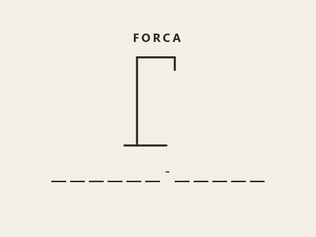
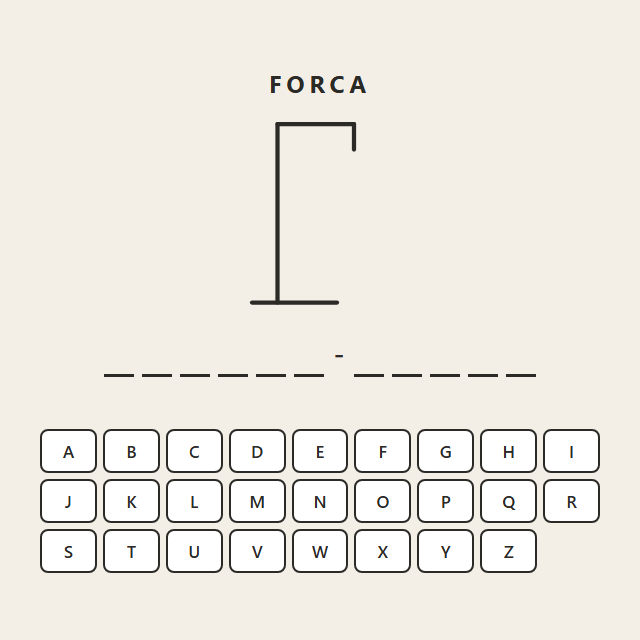
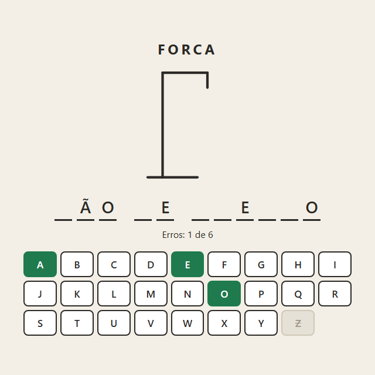
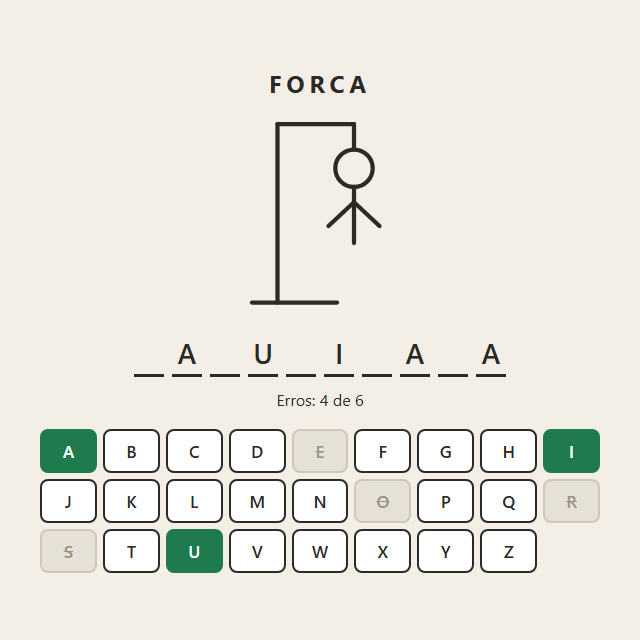

> A forca junta string, array, condicional e estado de jogo num projeto só. E tem um problema real que só aparece quando o jogo é em português: acento. Em português, a pessoa aperta A e espera ver o à de *pão* aparecer. Este é o passo a passo que eu seguiria — resolvendo o acento logo na primeira etapa, porque é lá que ele fica barato.

## O QUE VOCÊ PRECISA
- VS Code, com a extensão *Live Server* (opcional).
- Um navegador atual.
- As oficinas da Calculadora e do Pomodoro ajudam: a ideia de uma função única que desenha a tela a partir do estado volta aqui.

## ANTES DE ESCREVER A PRIMEIRA LINHA
Crie uma pasta chamada `forca` e abra-a no VS Code (*Arquivo → Abrir Pasta*). Dentro dela, crie estes arquivos vazios:

~~~arvore
forca/
├── index.html
├── estilo.css
├── palavras.js
└── app.js
~~~
Um arquivo a mais que nas oficinas anteriores: a lista de palavras mora separada da lógica.

### 1. A palavra e as lacunas
Estrutura completa, a lista de palavras, e o tratamento de acento desde a primeira linha.
Escrevo o HTML inteiro de uma vez, inclusive o desenho da forca, que só vai ganhar vida na etapa 4. O teclado e as lacunas começam vazios: quem os preenche é o JavaScript.

~~~arquivo index.html
<!DOCTYPE html>
<html lang="pt-BR">
<head>
    <meta charset="UTF-8">
    <meta name="viewport" content="width=device-width, initial-scale=1.0">
    <title>Forca</title>
    <link rel="stylesheet" href="estilo.css">
</head>
<body>
    <main class="forca" id="jogo">
        <h1>Forca</h1>

        <svg class="boneco" viewBox="0 0 200 240" aria-hidden="true">
            <!-- a forca: sempre visível -->
            <line x1="20"  y1="230" x2="120" y2="230" />
            <line x1="50"  y1="230" x2="50"  y2="20" />
            <line x1="50"  y1="20"  x2="140" y2="20" />
            <line x1="140" y1="20"  x2="140" y2="50" />

            <!-- o boneco: seis partes, na ordem em que aparecem -->
            <circle class="parte" cx="140" cy="72" r="22" />
            <line class="parte" x1="140" y1="94"  x2="140" y2="160" />
            <line class="parte" x1="140" y1="112" x2="110" y2="140" />
            <line class="parte" x1="140" y1="112" x2="170" y2="140" />
            <line class="parte" x1="140" y1="160" x2="115" y2="200" />
            <line class="parte" x1="140" y1="160" x2="165" y2="200" />
        </svg>

        

        

        

        <button class="novo" id="novo" hidden>Jogar de novo</button>
    </main>

    
    
</body>
</html>
~~~

~~~arquivo estilo.css
* {
    box-sizing: border-box;
    margin: 0;
    padding: 0;
}

/* Um elemento com display definido no CSS ignora o atributo hidden:
   a regra do autor vence a regra padrão do navegador. Esta linha
   devolve ao hidden o poder de esconder. */
[hidden] { display: none !important; }

body {
    min-height: 100vh;
    display: grid;
    place-items: center;
    padding: 24px;
    background: #f3efe6;
    color: #2b2a27;
    font-family: 'Segoe UI', system-ui, sans-serif;
}

.forca {
    width: min(560px, 100%);
    text-align: center;
}

h1 {
    margin-bottom: 8px;
    font-size: 24px;
    letter-spacing: .2em;
    text-transform: uppercase;
}

/* O SVG herda cor e espessura de traço daqui — as linhas não têm estilo próprio. */
.boneco {
    width: 170px;
    height: 204px;
    fill: none;
    stroke: #2b2a27;
    stroke-width: 5;
    stroke-linecap: round;
}
.parte          { visibility: hidden; }
.parte.visivel  { visibility: visible; }
.perdeu .parte  { stroke: #b3261e; }

.lacunas {
    display: flex;
    flex-wrap: wrap;
    justify-content: center;
    gap: 8px;
    min-height: 48px;
    margin: 16px 0 10px;
}

/* Cada casa é a lacuna: o "_" é a borda de baixo, não um caractere. */
.casa {
    width: 30px;
    height: 46px;
    border-bottom: 3px solid currentColor;
    font-size: 28px;
    font-weight: 600;
    line-height: 44px;
}
.casa.separador { width: 14px; border-bottom-color: transparent; }
.casa.faltou    { color: #b3261e; }

.situacao {
    min-height: 24px;
    margin-bottom: 16px;
    font-size: 16px;
}
.situacao.venceu { color: #1f7a4d; font-weight: 600; }
.situacao.perdeu { color: #b3261e; font-weight: 600; }

.teclado {
    display: grid;
    grid-template-columns: repeat(9, 1fr);
    gap: 6px;
}

.tecla {
    padding: 9px 0;
    border: 2px solid #2b2a27;
    border-radius: 8px;
    background: #fff;
    color: #2b2a27;
    font: inherit;
    font-size: 17px;
    font-weight: 600;
    cursor: pointer;
}
.tecla:hover:not(:disabled) { background: #2b2a27; color: #fff; }
.tecla:focus-visible        { outline: 3px solid #3570c0; outline-offset: 2px; }
.tecla:disabled             { cursor: default; }
.tecla.acerto { background: #1f7a4d; border-color: #1f7a4d; color: #fff; }
.tecla.erro   { background: #e6e1d6; border-color: #cfc8b8; color: #9a9384; text-decoration: line-
through; }

.novo {
    margin-top: 20px;
    padding: 12px 28px;
    border: 0;
    border-radius: 999px;
    background: #2b2a27;
    color: #fff;
    font: inherit;
    font-size: 16px;
    cursor: pointer;
}
.novo:focus-visible { outline: 3px solid #3570c0; outline-offset: 3px; }
~~~

~~~arquivo palavras.js
/* A lista fica num arquivo só dela: trocar ou aumentar as palavras
   nunca exige mexer na lógica do jogo. Acento, espaço e hífen são
   bem-vindos — o jogo sabe lidar com os três. */
const PALAVRAS = [
    'ABACAXI',
    'ALGORITMO',
    'CAFÉ COM LEITE',
    'CORAÇÃO',
    'FUNÇÃO',
    'GUARDA-CHUVA',
    'JABUTICABA',
    'JAVASCRIPT',
    'MANDIOCA',
    'ÔNIBUS',
    'PÃO DE QUEIJO',
    'PARALELEPÍPEDO',
    'PROGRAMAÇÃO',
    'TECLADO',
    'VARIÁVEL',
];
~~~

~~~arquivo app.js
const lacunas = document.getElementById('lacunas');
function sortear() {
    return PALAVRAS[Math.floor(Math.random() * PALAVRAS.length)];
}
/* NFC junta letra e acento num caractere só ("A" + "~" vira "Ã"),
   para que o laço nunca os separe em duas casas. */
function preparar(texto) {
    return texto.normalize('NFC').toUpperCase();
}
/* NFD faz o contrário: separa "Ã" em "A" + "~". Aí basta apagar
   os acentos, que moram todos na faixa U+0300 a U+036F. */
function semAcento(texto) {
    return texto.normalize('NFD').replace(/[\u0300-\u036f]/g, '');
}
function ehLetra(caractere) {
    return /^[A-Z]$/.test(semAcento(caractere));
}
let palavra = preparar(sortear());
function desenharLacunas() {
    lacunas.replaceChildren();
    for (const caractere of palavra) {
        const casa = document.createElement('span');
        if (ehLetra(caractere)) {
            casa.className = 'casa';
        } else {
            casa.className = 'casa separador';   // espaço e hífen já aparecem
            casa.textContent = caractere;
        }
        lacunas.append(casa);
    }
}
desenharLacunas();
~~~

#### O acento é o problema real deste projeto

~~~codigo
'PÃO'.includes('A')     // false
~~~
Para o JavaScript, `A` e `Ã` são caracteres diferentes. Se o jogo comparar direto, a pessoa aperta A em *pão* e erra — ou precisa de um teclado com 40 teclas. A decisão que tomei é normalizar: toda comparação acontece sem acento, e a tela continua mostrando a letra original.

~~~codigo
function semAcento(texto) {
    return texto.normalize('NFD').replace(/[\u0300-\u036f]/g, '');
}
~~~
`normalize('NFD')` separa cada letra acentuada em duas partes: a letra base e o acento, que vira um caractere “combinante” próprio. Todos esses acentos combinantes moram na faixa Unicode de `U+0300` a `U+036F`, então uma expressão regular com essa faixa apaga todos de uma vez. `Ç` também entra: a cedilha é o combinante `U+0327`. Conferi: `semAcento('CORAÇÃO')` dá `CORACAO`.

#### E por que `preparar()` faz o contrário (NFC)
Aqui está a parte que quase ninguém sabe: o mesmo *pão* que aparece na tela pode estar guardado de dois jeitos. Com o `ã` como um caractere só, ou como `a` seguido do til combinante. Visualmente idênticos. Mas `.length` dá 3 num e 4 no outro — medi. O laço `for (const caractere of palavra)` anda de caractere em caractere. Sem tratamento, a versão decomposta vira quatro casas na tela, uma delas só com um til flutuando. `normalize('NFC')` junta tudo na forma composta, e as casas saem certas venha a palavra de onde vier. É uma linha, aplicada na entrada, e o problema deixa de existir no resto do programa.

#### A lista em outro arquivo, e a ordem dos `<script>`
`palavras.js` declara `PALAVRAS` no escopo global; `app.js` usa. Por isso `palavras.js` vem antes no HTML — invertendo, o `app.js` roda primeiro e dá `PALAVRAS is not defined`. A vantagem de separar: aumentar a lista, trocar por nomes de bichos ou traduzir o jogo não exige tocar numa linha de lógica. E eu verifiquei a lista inteira: toda palavra tem só letras, espaço ou hífen, que são os três casos que o jogo sabe mostrar.

#### A lacuna é uma borda, não um sublinhado
Cada casa é um `` com largura fixa e `border-bottom`. Um `_` de texto mudaria de largura conforme a fonte e se colaria no vizinho. Com a borda, a casa já tem o tamanho da letra que vai ocupá- la: quando a letra aparece, nada se mexe. Espaço e hífen viram casas estreitas, sem borda, e já mostram o próprio caractere.

~~~codigo
[hidden] { display: none !important; }
~~~
O botão “Jogar de novo” começa com o atributo `hidden`. Só que a regra do navegador que esconde `[hidden]` perde para qualquer `display` escrito no seu CSS — e aí o elemento aparece mesmo “escondido”. O portal deste curso já teve exatamente esse bug, numa caixa de busca que cobria a página inteira. A primeira linha útil do CSS impede que ele volte.

!confira recarregue algumas vezes: cada F5 sorteia uma palavra, com uma casa por letra e espaços/hífens aparecendo. No console, `semAcento("AÇÚCAR")` deve dar `ACUCAR`.

### 2. O teclado, gerado por JavaScript
Vinte e seis botões com um laço — nenhum escrito à mão.
O `app.js` ganha uma constante e uma função. O restante continua igual à etapa 1.

~~~codigo
const ALFABETO = 'ABCDEFGHIJKLMNOPQRSTUVWXYZ';
function montarTeclado() {
    for (const letra of ALFABETO) {
        const tecla = document.createElement('button');
        tecla.className = 'tecla';
        tecla.textContent = letra;
        tecla.dataset.letra = letra;
        teclado.append(tecla);
    }
}
~~~
E, no final do arquivo, a chamada `montarTeclado();` antes de `desenharLacunas();`.

#### Por que não escrever os 26 botões no HTML
Vinte e seis linhas quase idênticas são vinte e seis chances de erro de digitação — um `data-letra="O"` no botão do Q, e uma letra fica impossível de acertar sem ninguém perceber. Gerando por laço, o texto e o `data-letra` saem da mesma variável e não têm como divergir. Conferi os 26: todos com `data-` `letra` igual ao texto. E mudar o teclado (tirar o K, W e Y, por exemplo) vira mudar uma string.

#### `<button>`, e não `
` clicável
Um botão de verdade recebe foco com Tab, é ativado com Enter ou Espaço, é anunciado como botão por leitor de tela e pode ser desabilitado com `disabled` — que é exatamente o que a etapa 3 precisa. Com `div`, cada uma dessas coisas vira código seu.

!confira 26 teclas, de A a Z, em três linhas de nove, oito na última.

### 3. Acertar e errar
Chutar uma letra revela todas as ocorrências, ou gasta uma tentativa. E a letra usada trava.
Aqui entra o estado do jogo. São três variáveis, e tudo que aparece na tela — lacunas, cor de cada tecla, contador de erros — é calculado a partir delas.

| VARIÁVEL | O QUE GUARDA |
|---|---|
| `palavra` | a palavra sorteada, já preparada (maiúscula e composta) |
| `usadas` | um `Set` com as letras já chutadas, sempre sem acento |
| `erros` | quantos chutes não estavam na palavra |

~~~arquivo app.js
const lacunas = document.getElementById('lacunas');
const teclado = document.getElementById('teclado');
const situacao = document.getElementById('situacao');

const ALFABETO = 'ABCDEFGHIJKLMNOPQRSTUVWXYZ';
const MAX_ERROS = 6;

function sortear() {
    return PALAVRAS[Math.floor(Math.random() * PALAVRAS.length)];
}

function preparar(texto) {
    return texto.normalize('NFC').toUpperCase();
}

function semAcento(texto) {
    return texto.normalize('NFD').replace(/[\u0300-\u036f]/g, '');
}

function ehLetra(caractere) {
    return /^[A-Z]$/.test(semAcento(caractere));
}

/* ---------------------------------------------------------------
   O estado inteiro do jogo são três variáveis. Tudo o que aparece
   na tela é calculado a partir delas.
   --------------------------------------------------------------- */
let palavra = preparar(sortear());
let usadas = new Set();    // letras já tentadas, sempre sem acento
let erros = 0;

function revelado(caractere) {
    return !ehLetra(caractere) || usadas.has(semAcento(caractere));
}

/* A única porta de entrada: botão na tela e tecla física chamam esta. */
function tentar(letra) {
    if (usadas.has(letra)) return;          // repetida: não gasta tentativa
    usadas.add(letra);

    const acertou = [...palavra].some((c) => semAcento(c) === letra);
    if (!acertou) erros++;

    desenhar();
}

function montarTeclado() {
    for (const letra of ALFABETO) {
        const tecla = document.createElement('button');
        tecla.className = 'tecla';
        tecla.textContent = letra;
        tecla.dataset.letra = letra;
        teclado.append(tecla);
    }
}

function desenhar() {
    lacunas.replaceChildren();
    for (const caractere of palavra) {
        const casa = document.createElement('span');
        casa.className = ehLetra(caractere) ? 'casa' : 'casa separador';
        casa.textContent = revelado(caractere) ? caractere : '';
        lacunas.append(casa);
    }

    // O teclado não é recriado: só o estado de cada botão muda.
    for (const tecla of teclado.children) {
        const letra = tecla.dataset.letra;
        const usada = usadas.has(letra);
        const acerto = usada && [...palavra].some((c) => semAcento(c) === letra);
        tecla.disabled = usada;
        tecla.classList.toggle('acerto', acerto);
        tecla.classList.toggle('erro', usada && !acerto);
    }

    situacao.textContent = `Erros: ${erros} de ${MAX_ERROS}`;
}

teclado.addEventListener('click', (evento) => {
    const tecla = evento.target.closest('.tecla');
    if (tecla) tentar(tecla.dataset.letra);
});

document.addEventListener('keydown', (evento) => {
    if (evento.ctrlKey || evento.metaKey || evento.altKey) return;  // Ctrl+R não é chute
    const letra = semAcento(evento.key).toUpperCase();
    if (/^[A-Z]$/.test(letra)) tentar(letra);
});

montarTeclado();
desenhar();
~~~

#### `Set` para as letras usadas

~~~codigo
function tentar(letra) {
    if (usadas.has(letra)) return;          // repetida: não gasta tentativa
    usadas.add(letra);

    const acertou = [...palavra].some((c) => semAcento(c) === letra);
    if (!acertou) erros++;

    desenhar();
}
~~~
Um `Set` é uma coleção sem repetição, com `has()` para perguntar e `add()` para guardar. A primeira linha de `tentar()` é o critério “clicar na mesma letra duas vezes não gasta duas tentativas”: chutei Z duas vezes em BANANA e o contador ficou em 1. E `some()` responde “alguma letra da palavra, sem acento, é esta?” — sem laço escrito à mão. Revelar todas as ocorrências não precisa de código nenhum: as lacunas são redesenhadas perguntando, para cada casa, se a letra dela já foi usada. Em BANANA, um único A mostrou `_A_A_A`.

#### Uma porta de entrada para mouse e teclado
O clique na tela e a tecla física chamam a mesma `tentar()`. É a lição da calculadora: duas cópias da regra sempre se desencontram. Aqui, a regra do Set, a do acento e a contagem de erros existem num lugar só.

#### Duas armadilhas do teclado físico

~~~codigo
document.addEventListener('keydown', (evento) => {
    if (evento.ctrlKey || evento.metaKey || evento.altKey) return;  // Ctrl+R não é chute
    const letra = semAcento(evento.key).toUpperCase();
    if (/^[A-Z]$/.test(letra)) tentar(letra);
});
~~~
Ctrl+R. A tecla `r` chega no `keydown` mesmo quando a pessoa está apertando Ctrl+R para recarregar. Sem a primeira linha, recarregar a página gastaria um chute no R no caminho. Testei: com a guarda, Ctrl+R não entra em `usadas`. A tecla ç. Teclado brasileiro tem a tecla ç, e `semAcento('ç')` dá `c`. O mesmo tratamento de acento da etapa 1 resolve de graça: apertar ç conta como C. E teclas como Enter, Shift e setas são descartadas porque não viram uma letra única de A a Z.

#### As lacunas são recriadas; o teclado, não
`desenhar()` apaga e recria as lacunas a cada jogada — elas não guardam nada, então recriar é o jeito mais simples de ficar certo. O teclado é diferente: um botão pode estar com foco, e um elemento recriado perde o foco. Quem joga pelo teclado com Tab ficaria voltando para o começo da página a cada chute. Por isso o teclado é montado uma vez e `desenhar()` só ajusta cada botão. Conferi: com o foco no B, uma jogada no X não tirou o foco do B. E `classList.toggle(nome, condição)` põe *ou tira* a classe conforme a condição — isso vai importar muito na etapa 5.

!confira em BANANA, A revela três letras; o mesmo A de novo não muda nada; uma letra errada risca a tecla e soma um erro. Pelo teclado físico funciona igual, e Ctrl+R não gasta chute.

### 4. O boneco
Seis erros desenham o boneco parte por parte — sem desenhar nada.
O truque desta etapa é que o boneco já está inteiro no SVG desde a etapa 1, com as seis partes invisíveis. Desenhar é só tornar visíveis as primeiras *n*. No `app.js`, três mudanças:

~~~codigo
const partes = document.querySelectorAll('.parte');
const MAX_ERROS = partes.length;   // o desenho decide: seis partes, seis erros
~~~
e, dentro de `desenhar()`, antes do contador:

~~~codigo
    partes.forEach((parte, i) => parte.classList.toggle('visivel', i < erros));
~~~

#### Por que SVG com partes escondidas, e não canvas
No canvas, desenhar a cabeça é calcular um arco em pixels, e a cada erro você redesenharia a cena inteira. No SVG, as partes são elementos do HTML: estão escritas uma vez, com coordenadas legíveis, e cada uma liga e desliga com uma classe. A cor e a espessura vêm do CSS ( `stroke` no `.boneco`) — e é por isso que, na derrota, uma única regra `.perdeu .parte` pinta o boneco de vermelho. A ordem das partes no SVG *é* a ordem em que aparecem: cabeça, tronco, braços, pernas. Reordenar o desenho é reordenar linhas do HTML.

~~~codigo
MAX_ERROS = partes.length
~~~
Na etapa 3, o limite era o número 6 escrito no código. Agora ele vem do desenho. Se alguém acrescentar olhos e boca ao SVG como partes, o jogo passa a aceitar oito erros sem mudar uma linha de JavaScript — e nunca vai existir o bug de o limite dizer 6 e o desenho ter 7 partes.

!confira três letras erradas mostram cabeça, tronco e um braço; acertos não desenham nada; seis erros completam o boneco.

### 5. Fim de jogo e jogar de novo
Vitória, derrota, revelar a palavra — e reiniciar cinco vezes sem sobrar nada da partida anterior.
A etapa que separa um jogo que funciona uma vez de um jogo que funciona sempre. O bug clássico aqui só aparece na segunda partida: uma tecla que continua travada, uma perna do boneco que não some. O `app.js` final:

~~~arquivo app.js
const jogo = document.getElementById('jogo');
const lacunas = document.getElementById('lacunas');
const teclado = document.getElementById('teclado');
const situacao = document.getElementById('situacao');
const botaoNovo = document.getElementById('novo');
const partes = document.querySelectorAll('.parte');

const ALFABETO = 'ABCDEFGHIJKLMNOPQRSTUVWXYZ';
const MAX_ERROS = partes.length;

function sortear() {
    return PALAVRAS[Math.floor(Math.random() * PALAVRAS.length)];
}

function preparar(texto) {
    return texto.normalize('NFC').toUpperCase();
}

function semAcento(texto) {
    return texto.normalize('NFD').replace(/[\u0300-\u036f]/g, '');
}

function ehLetra(caractere) {
    return /^[A-Z]$/.test(semAcento(caractere));
}

let palavra;
let usadas;
let erros;

/* Reiniciar é só recriar as três variáveis. Como a tela inteira sai
   delas, não existe resíduo possível da partida anterior. */
function novoJogo(escolhida = sortear()) {
    palavra = preparar(escolhida);
    usadas = new Set();
    erros = 0;
    desenhar();
}

function revelado(caractere) {
    return !ehLetra(caractere) || usadas.has(semAcento(caractere));
}

function situacaoDoJogo() {
    if (erros >= MAX_ERROS) return 'perdeu';
    if ([...palavra].every(revelado)) return 'venceu';
    return 'jogando';
}

function tentar(letra) {
    if (situacaoDoJogo() !== 'jogando') return;   // acabou: ignora
    if (usadas.has(letra)) return;
    usadas.add(letra);

    const acertou = [...palavra].some((c) => semAcento(c) === letra);
    if (!acertou) erros++;

    desenhar();
}

function montarTeclado() {
    for (const letra of ALFABETO) {
        const tecla = document.createElement('button');
        tecla.className = 'tecla';
        tecla.textContent = letra;
        tecla.dataset.letra = letra;
        teclado.append(tecla);
    }
}

function desenhar() {
    const estado = situacaoDoJogo();
    const acabou = estado !== 'jogando';

    lacunas.replaceChildren();
    for (const caractere of palavra) {
        const casa = document.createElement('span');
        casa.className = ehLetra(caractere) ? 'casa' : 'casa separador';
        // No fim a palavra aparece inteira; o que faltou vem em vermelho.
        if (revelado(caractere)) {
            casa.textContent = caractere;
        } else if (acabou) {
            casa.textContent = caractere;
            casa.classList.add('faltou');
        }
        lacunas.append(casa);
    }

    for (const tecla of teclado.children) {
        const letra = tecla.dataset.letra;
        const usada = usadas.has(letra);
        const acerto = usada && [...palavra].some((c) => semAcento(c) === letra);
        tecla.disabled = usada || acabou;
        tecla.classList.toggle('acerto', acerto);
        tecla.classList.toggle('erro', usada && !acerto);
    }

    partes.forEach((parte, i) => parte.classList.toggle('visivel', i < erros));

    jogo.classList.toggle('perdeu', estado === 'perdeu');
    situacao.className = 'situacao ' + estado;
    situacao.textContent = estado === 'venceu' ? `Você venceu com ${erros} erro(s)!`
                         : estado === 'perdeu' ? 'Não foi dessa vez.'
                         :                       `Erros: ${erros} de ${MAX_ERROS}`;

    botaoNovo.hidden = !acabou;
    if (acabou) botaoNovo.focus();   // Enter já começa outra partida
}

teclado.addEventListener('click', (evento) => {
    const tecla = evento.target.closest('.tecla');
    if (tecla) tentar(tecla.dataset.letra);
});

document.addEventListener('keydown', (evento) => {
    if (evento.ctrlKey || evento.metaKey || evento.altKey) return;
    const letra = semAcento(evento.key).toUpperCase();
    if (/^[A-Z]$/.test(letra)) tentar(letra);
});

botaoNovo.addEventListener('click', () => novoJogo());

montarTeclado();
novoJogo();
~~~

#### Vitória e derrota são calculadas, não guardadas

~~~codigo
function situacaoDoJogo() {
    if (erros >= MAX_ERROS) return 'perdeu';
    if ([...palavra].every(revelado)) return 'venceu';
    return 'jogando';
}
~~~
Não existe `let venceu = false`. Uma variável assim seria mais uma coisa para lembrar de zerar ao reiniciar — e para esquecer. Como a situação sai de `erros` e de `usadas`, ela está sempre certa. E `tentar()` ganhou uma primeira linha que ignora chutes depois do fim: conferi que, com o jogo ganho, chutar Z não mexe em nada.

#### Reiniciar é recriar três variáveis

~~~codigo
function novoJogo(escolhida = sortear()) {
    palavra = preparar(escolhida);
    usadas = new Set();
    erros = 0;
    desenhar();
}
~~~
É aqui que a decisão da etapa 3 se paga. Como tudo na tela é calculado em `desenhar()`, e cada `classList.toggle` tira a classe quando a condição é falsa, não existe estado escondido na interface para limpar. As teclas destravam porque `usadas` está vazio; as partes somem porque `erros` é zero. O jeito que dá bug é o contrário: fazer `tecla.disabled = true` dentro de `tentar()` e depois ter que lembrar de desfazer cada coisa num “reset”. Joguei cinco partidas seguidas, até o fim, sem recarregar: todas começaram sem tecla travada, sem parte visível, sem letra na tela e com o contador em zero.

#### Revelar o que faltou
Na derrota, a palavra aparece inteira, e as letras que a pessoa não achou recebem a classe `faltou` (vermelho). É um detalhe que muda a experiência: perder sem saber qual era a palavra é frustrante. Em CORAÇÃO com seis chutes errados, as sete letras apareceram em vermelho.

#### Jogável só pelo teclado, do começo ao fim
Quando a partida acaba, `botaoNovo.focus()` leva o foco para “Jogar de novo”. Assim, quem joga pelo teclado aperta Enter e começa outra partida sem tocar no mouse. Ao reiniciar, o botão volta a ficar `hidden`, perde o foco, e as letras do teclado físico continuam funcionando porque o `keydown` escuta o `document` inteiro.

!confira ganhe uma partida e perca outra: mensagens certas, palavra revelada na derrota, Enter começa outra. Jogue cinco seguidas sem F5 e observe se sobra alguma tecla travada ou parte do boneco.

### ✓ Roteiro de teste
Passe por estes casos antes de considerar a oficina concluída. Eles cobrem o que costuma quebrar.

| VOCÊ FAZ | DEVE ACONTECER |
|---|---|
| Chutar A numa palavra com três A | as três aparecem de uma vez |
| Clicar duas vezes na mesma letra errada | conta um erro só |
| Chutar A em PÃO DE QUEIJO | o à aparece |
| Apertar a tecla ç no teclado físico | conta como C |
| Apertar Ctrl+R para recarregar | nenhuma letra R é gasta |
| Errar seis vezes | boneco completo em vermelho, palavra revelada |
| Acertar todas as letras | mensagem de vitória e teclado travado |
| Terminar uma partida e apertar Enter | começa outra, limpa |
| Jogar cinco partidas seguidas sem F5 | nenhuma tecla travada ou parte do boneco sobrando |
| Jogar só com Tab, Enter e letras | dá para ir do começo ao fim |

### ! Quando não funcionar
Os tropeços desta oficina, e o que procurar em cada um.

| SINTOMA | CAUSA QUASE CERTA |
|---|---|
| `PALAVRAS is not defined` | O `<script src="palavras.js">` está depois do `app.js`, ou com nome diferente. |
| Chutar A não revela o à | A comparação está sendo feita com a letra acentuada. Compare `semAcento(c) === letra`. |
| Uma casa aparece com um acento sozinho | A palavra chegou decomposta. Aplique `normalize('NFC')` ao sortear. |
| A mesma letra gasta duas tentativas | Falta o `if (usadas.has(letra)) return;` antes de somar o erro. |
| Na segunda partida uma tecla continua travada | Alguma classe ou `disabled` é ligada fora de `desenhar()` e nunca desligada. Use `toggle` com condição. |
| O botão “Jogar de novo” aparece desde o começo | Um `display` no CSS está vencendo o `hidden`. Falta a regra `[hidden] {` `display: none !important; }`. |
| Recarregar com Ctrl+R gasta um chute | O `keydown` não ignora teclas com `ctrlKey` / `metaKey`. |
| Jogando com Tab, o foco volta para o topo a cada chute | O teclado está sendo recriado em cada jogada. Monte uma vez e só atualize os botões. |

### → Para levar adiante
Extensões em ordem de dificuldade. Todas cabem no que você já construiu.
1. Categorias com dica. Transforme a lista em objetos `{ palavra, dica }` e mostre a dica acima das lacunas. 2. Placar no localStorage. Vitórias e derrotas que sobrevivem ao F5 — com a validação de leitura do Pomodoro. 3. Animação ao revelar. Uma `@keyframes` que entra só nas casas que acabaram de ser reveladas. O desafio é saber quais são “novas”. 4. Dois jogadores. Um digita a palavra (escondida), o outro adivinha. Valide a entrada com `ehLetra()`.
