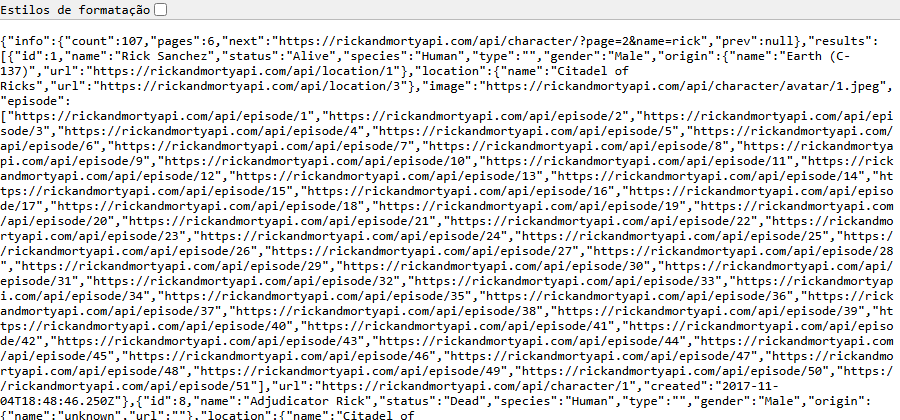
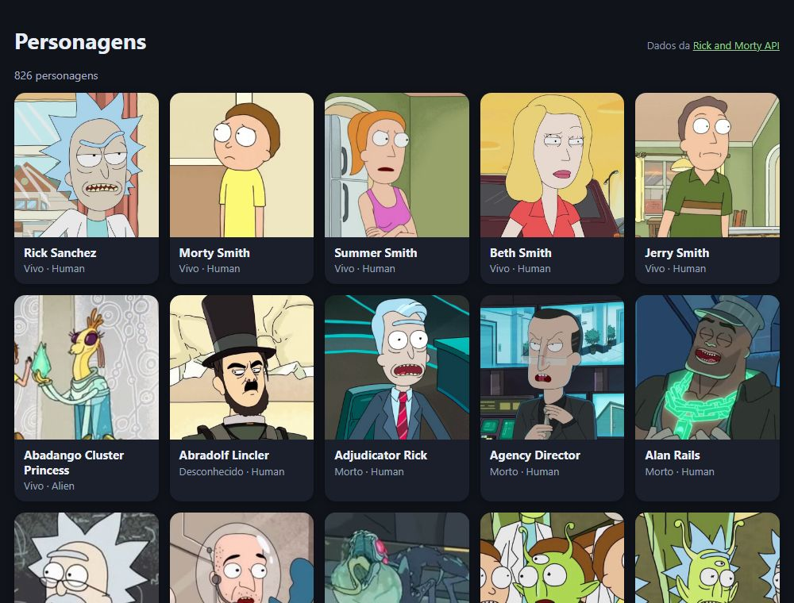
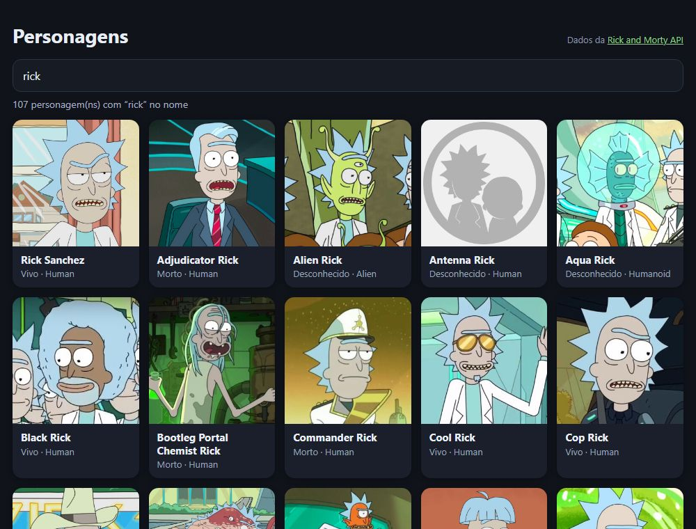
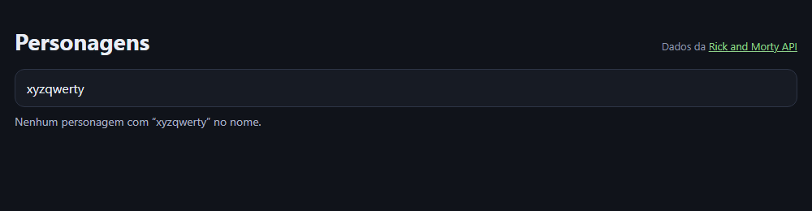
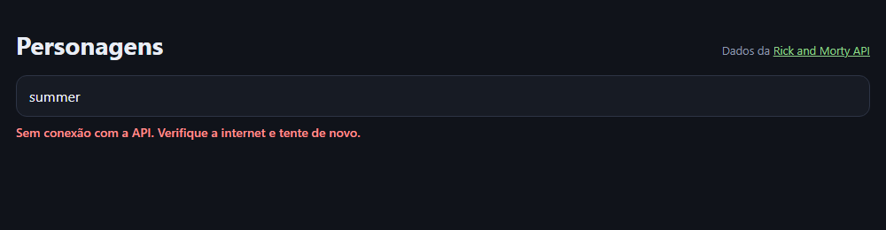
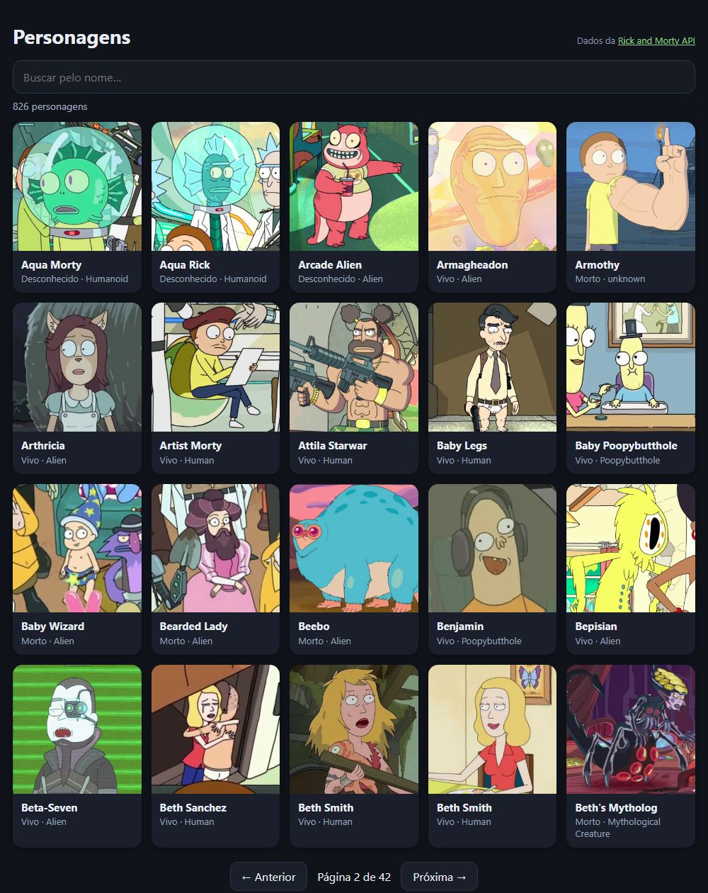
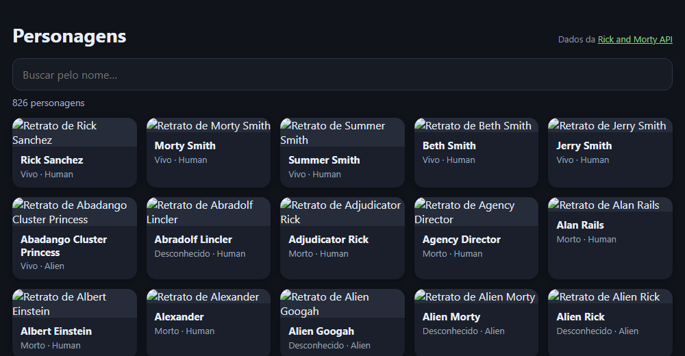
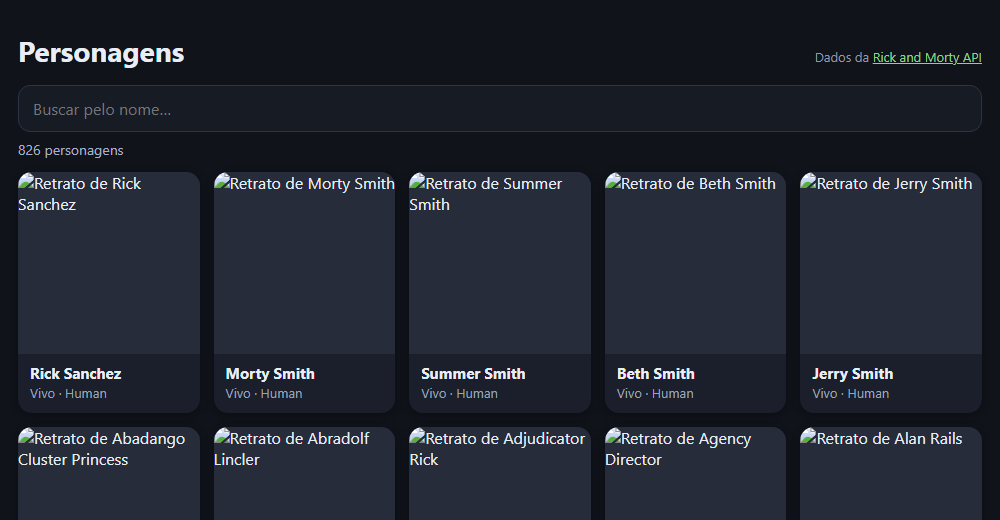

> Uma grade de cards com busca e paginação, alimentada pela Rick and Morty API. Parece só “buscar e mostrar”, e é aí que moram os problemas de quem consome API de verdade: requisição a cada tecla, respostas que chegam fora de ordem, erro de rede, busca sem resultado, imagem que empurra a página. Este é o passo a passo que eu seguiria — e cada um desses problemas aparece medido antes de ser resolvido.

## O QUE VOCÊ PRECISA
- VS Code, com a extensão *Live Server* (opcional).
- Um navegador moderno e internet.
- A oficina do Clima: `fetch`, `async/await` e tratamento de erro voltam aqui, mais fundo.

## ANTES DE ESCREVER A PRIMEIRA LINHA
Crie uma pasta chamada `galeria` e abra-a no VS Code (*Arquivo → Abrir Pasta*). Dentro dela, crie estes arquivos vazios:

~~~arvore
galeria/
├── index.html
├── estilo.css
├── api.js
└── app.js
~~~
O `api.js` é o único arquivo que conhece a API. O `app.js` só pede personagens e desenha.

### 1. Ler a API antes de escrever código
Abrir as respostas no navegador, entender o formato, e montar a estrutura da página.

*A resposta da API aberta direto na barra de endereço: o bloco* `info` *e a lista* `results` *.*

#### Quinze minutos lendo a resposta economizam horas
Antes de qualquer `fetch`, abra os endereços no navegador e leia. Anotei o que encontrei, e cada item vira uma decisão de código mais adiante:

| O QUE EU VI | O QUE ISSO DECIDE |
|---|---|
| `info.count` e `info.pages`: “rick” tem 107 personagens em 6 páginas | A paginação vem pronta da API. |
| 20 itens por página em `results` | A grade sempre recebe no máximo 20 cards. |
| Busca sem resultado responde HTTP 404 com | 404 aqui não é falha: é lista vazia. |

~~~codigo
{"error":"There is nothing here"}
~~~

!nota Pedir a página 999 também dá 404 Nunca pedir página além de `info.pages`. As imagens têm 300 por 300 pixels Dá para reservar o espaço da imagem antes de ela chegar (etapa 6).
Conferi cada linha dessa tabela com requisições de verdade. O 404 da busca vazia é o item que mais pega gente desprevenida: quem trata “qualquer coisa diferente de 200” como erro mostra “falha na API” para uma busca que só não achou ninguém.

~~~arquivo index.html
<!DOCTYPE html>
<html lang="pt-BR">
<head>
    <meta charset="UTF-8">
    <meta name="viewport" content="width=device-width, initial-scale=1.0">
    <title>Personagens</title>
    <link rel="stylesheet" href="estilo.css">
</head>
<body>
    <main class="app">
        <header class="topo">
            <h1>Personagens</h1>
            
Dados da <a href="https://rickandmortyapi.com">Rick and Morty API</a>

        </header>

        

        <ul id="grade" class="grade"></ul>
    </main>

    
    
</body>
</html>
~~~

~~~arquivo estilo.css
* {
    box-sizing: border-box;
    margin: 0;
    padding: 0;
}

[hidden] { display: none !important; }

.oculto {
    position: absolute;
    width: 1px;
    height: 1px;
    overflow: hidden;
    clip-path: inset(50%);
    white-space: nowrap;
}

body {
    min-height: 100vh;
    padding: 32px 18px;
    background: #10131a;
    color: #e9edf5;
    font-family: 'Segoe UI', system-ui, sans-serif;
}

.app { max-width: 1080px; margin: 0 auto; }

.topo {
    display: flex;
    flex-wrap: wrap;
    align-items: baseline;
    justify-content: space-between;
    gap: 12px;
    margin-bottom: 16px;
}
h1 { font-size: 28px; }
.fonte { color: #8f99ad; font-size: 13px; }
.fonte a { color: #8fd18a; }

#busca {
    width: 100%;
    margin-bottom: 8px;
    padding: 12px 14px;
    border: 1px solid #2d3445;
    border-radius: 12px;
    background: #171b24;
    color: inherit;
    font: inherit;
    font-size: 16px;
}
#busca:focus { outline: 2px solid #8fd18a; outline-offset: 1px; }

.situacao { min-height: 20px; margin-bottom: 12px; color: #a8b1c3; font-size: 14px; }
.situacao[data-tipo="erro"] { color: #ff8f8f; font-weight: 600; }

/* Quantas colunas couberem, cada uma com pelo menos 170px. Nenhuma media query. */
.grade {
    display: grid;
    grid-template-columns: repeat(auto-fill, minmax(170px, 1fr));
    gap: 14px;
    list-style: none;
    transition: opacity .2s;
}
.grade.carregando { opacity: .5; }

.card {
    overflow: hidden;
    border-radius: 14px;
    background: #1a1f2b;
    box-shadow: 0 2px 8px rgba(0, 0, 0, .3);
}
/* A imagem ocupa a largura do card; a altura, o navegador calcula. */
.card img { display: block; width: 100%; height: auto; background: #262c3a; }
.card h2 { padding: 10px 12px 2px; font-size: 15px; line-height: 1.25; }
.card p { padding: 0 12px 12px; color: #9aa4b8; font-size: 13px; }

.paginacao {
    display: flex;
    align-items: center;
    justify-content: center;
    gap: 14px;
    margin-top: 20px;
    font-variant-numeric: tabular-nums;
}
.paginacao button {
    padding: 9px 16px;
    border: 1px solid #2d3445;
    border-radius: 10px;
    background: #1a1f2b;
    color: inherit;
    font: inherit;
    cursor: pointer;
}
.paginacao button:disabled { opacity: .4; cursor: default; }
~~~

~~~arquivo api.js
/* Tudo que sabe falar com a API vai morar neste arquivo.
   O app.js vai pedir personagens, sem saber de URL nem de formato.

   Antes de programar, abra na barra de endereço:

   https://rickandmortyapi.com/api/character/
   https://rickandmortyapi.com/api/character/?name=rick&page=2
   https://rickandmortyapi.com/api/character/?name=xyzqwerty

   e repare em três coisas: o bloco "info", os 20 itens de "results",
   e o que acontece com a última busca. */

const API_BASE = 'https://rickandmortyapi.com/api/character/';
~~~

~~~arquivo app.js
const situacao = document.getElementById('situacao');
situacao.textContent = `A galeria vai ler de ${API_BASE}`;
~~~

#### Uma grade que se ajusta sem media query
`repeat(auto-fill, minmax(170px, 1fr))` diz ao navegador: “quantas colunas de pelo menos 170px couberem, dividindo a sobra igualmente”. No celular sai uma ou duas colunas; num monitor largo, seis. Nenhum ponto de quebra escrito à mão. Na imagem, `width: 100%` e `height: auto` fazem ela ocupar a largura do card e manter a proporção. Isso vai importar na etapa 6.

#### Por que separar `api.js`
O endereço, os nomes dos campos em inglês e as manias da API (como o 404 da busca vazia) ficam num arquivo só. Se a API mudar, ou se você trocar de API, o `app.js` nem fica sabendo. Os dois são carregados como scripts comuns, nesta ordem, então o `app.js` enxerga o que o `api.js` declarou.

!confira a página abre escura, com o título e a frase “A galeria vai ler de https://rickandmortyapi.com/api/character/”. Se a frase não aparece, a ordem dos scripts está trocada.

### 2. Buscar e desenhar a grade
A primeira página de personagens, em cards criados pelo JavaScript.

~~~arquivo api.js
const API_BASE = 'https://rickandmortyapi.com/api/character/';
const STATUS = { Alive: 'Vivo', Dead: 'Morto', unknown: 'Desconhecido' };
/* A API devolve muito mais do que a tela usa. Aqui cada personagem
   vira só o que interessa, com nomes em português. */
function simplificar(personagem) {
    return {
        id: personagem.id,
        nome: personagem.name,
        imagem: personagem.image,
        especie: personagem.species,
        status: STATUS[personagem.status] || personagem.status,
    };
}
async function buscarPersonagens() {
    const resposta = await fetch(API_BASE);
    const dados = await resposta.json();
    return {
        total: dados.info.count,
        paginas: dados.info.pages,
        personagens: dados.results.map(simplificar),
    };
}
~~~

~~~arquivo app.js
const grade = document.getElementById('grade');
const situacao = document.getElementById('situacao');

let estado = { personagens: [], total: 0, carregando: false };

async function carregar() {
    estado.carregando = true;
    desenhar();
    const resultado = await buscarPersonagens();
    estado = { ...estado, ...resultado, carregando: false };
    desenhar();
}

function criarCard(personagem) {
    const card = document.createElement('li');
    card.className = 'card';

    const imagem = document.createElement('img');
    imagem.src = personagem.imagem;
    imagem.alt = `Retrato de ${personagem.nome}`;
    const nome = document.createElement('h2');
    nome.textContent = personagem.nome;

    const detalhe = document.createElement('p');
    detalhe.textContent = `${personagem.status} · ${personagem.especie}`;

    card.append(imagem, nome, detalhe);
    return card;
}

function desenhar() {
    grade.classList.toggle('carregando', estado.carregando);
    situacao.textContent = estado.carregando ? 'Carregando…' : `${estado.total} personagens`;
    grade.replaceChildren(...estado.personagens.map(criarCard));
}

carregar();
~~~

#### Traduzir a resposta na porta de entrada
`simplificar()` transforma cada personagem da API no formato que a tela usa: só cinco campos, com nomes em português, e o status já traduzido. O resto do código nunca vê `personagem.species` — vê `personagem.especie`. O `|| personagem.status` garante que um status novo, que a tabela `STATUS` não conhece, apareça como veio em vez de sumir. Conferi o primeiro card: nome “Rick Sanchez”, detalhe “Vivo · Human”, e o texto alternativo da imagem “Retrato de Rick Sanchez”. A contagem no topo mostrou “826 personagens”.

#### `textContent` para tudo o que vem de fora
Os nomes vêm de um servidor que você não controla. Montar o card com `innerHTML` e o nome no meio abriria a porta para qualquer HTML que viesse na resposta. Com `createElement` e `textContent`, o nome é sempre texto — é a mesma regra da oficina de Markdown.

!confira 20 cards com foto, nome e status. Estreite a janela: as colunas diminuem sozinhas.

### 3. Busca com debounce
Um campo de busca que não dispara uma requisição por tecla — e o primeiro problema de ordem.

~~~arquivo index.html — o campo de busca, antes da situação
<label for="busca" class="oculto">Buscar personagem pelo nome</label>
<input id="busca" type="search" placeholder="Buscar pelo nome…" autocomplete="off">

async function buscarPersonagens({ nome = '' } = {}) {
    const endereco = new URL(API_BASE);
    if (nome !== '') endereco.searchParams.set('name', nome);

    const resposta = await fetch(endereco);

    // Esta API responde 404 quando a busca não encontra ninguém.
    // Para a tela isso não é falha: é uma lista vazia.
    if (resposta.status === 404) return { total: 0, paginas: 0, personagens: [] };

    const dados = await resposta.json();
    return {
        total: dados.info.count,
        paginas: dados.info.pages,
        personagens: dados.results.map(simplificar),
    };
}
~~~

~~~arquivo app.js — o debounce
campoBusca.addEventListener('input', () => {
    clearTimeout(temporizador);
    temporizador = setTimeout(() => {
        const nome = campoBusca.value.trim();
        if (nome === estado.nome) return;   // "rick " e "rick" são a mesma busca
        estado.nome = nome;
        carregar();
    }, ESPERA_DIGITACAO_MS);
});

function mensagem() {
    if (estado.carregando && estado.personagens.length === 0) return 'Carregando…';
    if (!estado.carregando && estado.total === 0) return `Nenhum personagem com “${estado.nome}” no 
nome.`;
    return estado.nome === ''
        ? `${estado.total} personagens`
        : `${estado.total} personagem(ns) com “${estado.nome}” no nome`;
}

function desenhar() {
    grade.classList.toggle('carregando', estado.carregando);
    situacao.textContent = mensagem();
    // Enquanto carrega, os cards antigos ficam — esmaecidos — em vez de a tela piscar vazia.
    if (!estado.carregando) grade.replaceChildren(...estado.personagens.map(criarCard));
}
~~~

#### Debounce: esperar a pessoa parar de digitar
Buscar a cada tecla significa, para “rick sanchez”, doze requisições — onze delas com resultados que ninguém vai ver. O debounce desmarca a busca agendada a cada tecla e agenda outra para daqui a 350 ms. A busca só acontece quando a pessoa faz uma pausa. Medi: digitei as 12 letras com 60 ms entre elas, e saiu 1 requisição. Depois acrescentei um espaço no fim: o `trim()` deixa o texto igual ao da busca anterior, e nenhuma requisição nova saiu.

#### Busca vazia e tela que não pisca
O 404 da etapa 1 vira `{ total: 0 }` dentro do `api.js`, e a tela mostra uma frase em vez de um erro:

Enquanto uma busca carrega, `desenhar()` não apaga os cards antigos: só os deixa esmaecidos com a classe `carregando`. A grade não pisca vazia a cada letra.

#### A corrida: a resposta velha chega por último
Esta etapa tem um erro que só aparece quando a rede oscila. Simulei: a busca “morty” demorando 1,5 s para responder, e a pessoa trocando para “rick” antes disso. A resposta de “rick” chegou primeiro; a de “morty”, depois — e foi ela que ficou na tela.

| O QUE A TELA MOSTROU | DE ONDE VEIO |
|---|---|
| Campo de busca: “rick” | o que a pessoa digitou |
| Mensagem: “68 personagem(ns) com “rick” no nome” | o nome é o de agora; o total é o de “morty” |
| Primeiro card: Morty Smith | a resposta velha, que chegou por último |
Nenhuma linha do código está “errada” sozinha: cada resposta, quando chega, escreve no estado. O problema é que ninguém disse que a busca de “morty” não interessava mais.

!confira digite “rick” devagar e depois rápido; na aba Network das ferramentas do navegador, conte as requisições. Busque “xyzqwerty”: a frase aparece, sem erro.

### 4. Cancelar a busca velha e tratar erros
AbortController para a corrida; mensagens diferentes para rede, servidor e busca vazia.

~~~arquivo api.js
const API_BASE = 'https://rickandmortyapi.com/api/character/';
const STATUS = { Alive: 'Vivo', Dead: 'Morto', unknown: 'Desconhecido' };
class ErroDeRede extends Error {}
class ErroDoServico extends Error {
    constructor(status) {
        super(`HTTP ${status}`);
        this.status = status;
    }
}
function simplificar(personagem) {
    return {
        id: personagem.id,
        nome: personagem.name,
        imagem: personagem.image,
        especie: personagem.species,
        status: STATUS[personagem.status] || personagem.status,
    };
}
async function buscarPersonagens({ nome = '' } = {}, sinal) {
    const endereco = new URL(API_BASE);
    if (nome !== '') endereco.searchParams.set('name', nome);
    let resposta;
    try {
        resposta = await fetch(endereco, { signal: sinal });
    } catch (erro) {
        if (erro.name === 'AbortError') throw erro;
        throw new ErroDeRede();
    }
    if (resposta.status === 404) return { total: 0, paginas: 0, personagens: [] };
    if (!resposta.ok) throw new ErroDoServico(resposta.status);
    const dados = await resposta.json();
    return {
        total: dados.info.count,
        paginas: dados.info.pages,
        personagens: dados.results.map(simplificar),
    };
}

async function carregar() {
    if (controle) controle.abort();
    controle = new AbortController();
    const sinal = controle.signal;
    estado.carregando = true;
    estado.erro = null;
    desenhar();
    try {
        const resultado = await buscarPersonagens({ nome: estado.nome }, sinal);
        estado = { ...estado, ...resultado };
    } catch (erro) {
        if (erro.name === 'AbortError') return;   // uma busca mais nova tomou o lugar desta
        estado = { ...estado, personagens: [], total: 0, erro: mensagemDeErro(erro) };
    }
    estado.carregando = false;
    desenhar();
}
function mensagemDeErro(erro) {
    if (erro instanceof ErroDeRede) return 'Sem conexão com a API. Verifique a internet e tente de 
novo.';
    if (erro instanceof ErroDoServico) return `A API respondeu com erro (${erro.status}). Tente de 
novo em instantes.`;
    console.error(erro);
    return 'Algo inesperado aconteceu ao buscar os personagens.';
}
function desenhar() {
    grade.classList.toggle('carregando', estado.carregando);
    situacao.textContent = mensagem();
    situacao.dataset.tipo = estado.erro ? 'erro' : '';
    if (!estado.carregando) grade.replaceChildren(...estado.personagens.map(criarCard));
}
~~~

#### Cancelar é dizer “esta não interessa mais”
Cada `carregar()` cancela a busca anterior com `controle.abort()` antes de começar a sua. O `fetch` cancelado rejeita com um erro de nome `AbortError`, e o `carregar()` daquela busca simplesmente termina — sem mexer no estado. Repeti a corrida da etapa 3 com os mesmos tempos: ficou na tela a busca por “rick”, com cards de Rick. Repare no `return` do `AbortError`: ele pula até o `carregando = false`. Está certo, porque quem cancelou foi uma busca nova, que já marcou `carregando = true` e vai desmarcar quando terminar.

#### Três situações, três mensagens
O `api.js` transforma o que deu errado em dois tipos de erro com nome, e o `app.js` escolhe a frase pelo tipo:

| O QUE ACONTECEU | O QUE A PESSOA LÊ |
|---|---|
| `fetch` rejeitou (sem rede) | Sem conexão com a API. Verifique a internet e tente de novo. |
| Servidor respondeu 500 | A API respondeu com erro (500). Tente de novo em instantes. |
| Busca sem ninguém (404) | Nenhum personagem com “…” no nome. — sem cara de erro |
Simulei as três e conferi as frases. Erro de verdade ganha `data-tipo="erro"`, que o CSS pinta de vermelho; a busca vazia continua neutra.

#### O que a API ao vivo me mostrou
Enquanto testava esta oficina, algumas requisições feitas pelo navegador falharam: o console mostrou *“blocked by CORS policy: No 'Access-Control-Allow-Origin' header”*. Duas lições saíram disso:
- Na etapa 3, que ainda não tem `try/catch`, uma dessas falhas deixou a tela em “carregando” para sempre. O erro subiu do `await` e ninguém o pegou. Na etapa 4, a mesma falha apareceu como “Sem conexão com a API”. Para o JavaScript, um bloqueio de CORS chega igual a uma queda de rede — um `TypeError` sem detalhes, por segurança. “Sem conexão” é o máximo que a página consegue dizer, e é por isso que a frase manda verificar e tentar de novo.
Ao gravar dados da API para os testes, ela também respondeu 429 — Too Many Requests: APIs públicas limitam quantos pedidos você faz. É mais um motivo para o debounce, e o motivo de os testes deste tutorial rodarem sobre respostas gravadas uma vez, em vez de martelar a API a cada execução.

!confira no DevTools, aba Network, escolha “Offline” e busque algo: a mensagem de conexão aparece. Volte para “No throttling” e busque de novo: a grade volta.

### 5. Paginação
Anterior e próxima, com a página atual no estado — e a busca nova sempre voltando para a primeira.

~~~arquivo index.html — depois da grade
<nav id="paginacao" class="paginacao" aria-label="Páginas" hidden>
    <button id="anterior" type="button">← Anterior</button>
    
    <button id="proxima" type="button">Próxima →</button>
</nav>

async function buscarPersonagens({ nome = '', pagina = 1 } = {}, sinal) {
    const endereco = new URL(API_BASE);
    if (nome !== '') endereco.searchParams.set('name', nome);
    endereco.searchParams.set('page', pagina);

    let resposta;
    try {
        resposta = await fetch(endereco, { signal: sinal });
    } catch (erro) {
        if (erro.name === 'AbortError') throw erro;
        throw new ErroDeRede();
    }

    // 404 também é o que vem para uma página além da última.
    if (resposta.status === 404) return { total: 0, paginas: 0, personagens: [] };
    if (!resposta.ok) throw new ErroDoServico(resposta.status);

    const dados = await resposta.json();
    return {
        total: dados.info.count,
        paginas: dados.info.pages,
        personagens: dados.results.map(simplificar),
    };
}

function desenhar() {
    grade.classList.toggle('carregando', estado.carregando);
    situacao.textContent = mensagem();
    situacao.dataset.tipo = estado.erro ? 'erro' : '';
    if (!estado.carregando) grade.replaceChildren(...estado.personagens.map(criarCard));

    // A paginação só existe se houver mais de uma página, e trava enquanto carrega.
    paginacao.hidden = estado.paginas <= 1;
    indicador.textContent = `Página ${estado.pagina} de ${estado.paginas}`;
    botaoAnterior.disabled = estado.carregando || estado.pagina <= 1;
    botaoProxima.disabled = estado.carregando || estado.pagina >= estado.paginas;
}
~~~

~~~arquivo app.js — busca e botões
campoBusca.addEventListener('input', () => {
    clearTimeout(temporizador);
    temporizador = setTimeout(() => {
        const nome = campoBusca.value.trim();
        if (nome === estado.nome) return;
        estado.nome = nome;
        estado.pagina = 1;   // busca nova sempre começa na primeira página
        carregar();
    }, ESPERA_DIGITACAO_MS);
});

botaoAnterior.addEventListener('click', () => {
    if (estado.pagina <= 1) return;
    estado.pagina--;
    carregar();
});

botaoProxima.addEventListener('click', () => {
    if (estado.pagina >= estado.paginas) return;
    estado.pagina++;
    carregar();
});
~~~

#### A página é mais um campo do estado
`estado.pagina` vai para a URL como `page`, e `info.pages` diz até onde dá para ir. Os botões só mudam o número e chamam `carregar()`; `desenhar()` decide o resto. Conferi:

| SITUAÇÃO | O QUE ACONTECEU |
|---|---|
| Primeira abertura | “Página 1 de 42”, e Anterior desabilitado |
| Clicar em Próxima | os dois botões travam enquanto carrega; depois, página 2, começando no personagem 21 |
| Chegar à última página | Próxima desabilitado |
| Estar na página 5 e buscar “rick” | volta para a página 1 |
| Buscar “abradolf” (2 resultados) | uma página só: a paginação some |

#### Busca nova, página 1
Sem o `estado.pagina = 1` no debounce, quem está na página 5 da lista geral e busca “rick” pede a página 5 de uma busca que só tem 6 — ou, buscando algo com 2 resultados, uma página que não existe e responde 404. A tela diria “nenhum personagem” para uma busca que tem resultados. É o tipo de erro que só aparece para quem navegou antes de buscar.

!confira avance algumas páginas, busque um nome e confira que volta para a 1. Na última página, Próxima fica apagado.

### 6. Imagens sem sustos
Reservar o espaço de cada imagem antes de ela chegar, e só baixar o que está perto de aparecer.

~~~codigo
function criarCard(personagem) {
    const card = document.createElement('li');
    card.className = 'card';

    const imagem = document.createElement('img');
    // Largura e altura no próprio elemento: o navegador calcula a proporção e
    // reserva o espaço antes de a imagem chegar — nada pula quando ela carrega.
    imagem.width = LADO_IMAGEM;
    imagem.height = LADO_IMAGEM;
    imagem.loading = 'lazy';     // só baixa quando estiver perto de aparecer
    imagem.decoding = 'async';
    imagem.src = personagem.imagem;
    imagem.alt = `Retrato de ${personagem.nome}`;

    const nome = document.createElement('h2');
    nome.textContent = personagem.nome;

    const detalhe = document.createElement('p');
    detalhe.textContent = `${personagem.status} · ${personagem.especie}`;

    card.append(imagem, nome, detalhe);
    return card;
}
~~~

#### Largura e altura no elemento
Sem `width` e `height`, o navegador não sabe o tamanho da imagem até baixá-la. O card nasce baixo, a foto chega, o card cresce — e tudo abaixo dele é empurrado. Em quem está lendo ou prestes a clicar, isso é o famoso “a página pulou”. Com `width = 300` e `height = 300`, o navegador calcula a proporção na hora. O CSS continua mandando no tamanho ( `width: 100%; height: auto`), mas agora a altura é conhecida desde o começo. Medi a altura da imagem no instante em que os cards entram na grade, antes de qualquer foto carregar:

| ANTES DA FOTO CHEGAR | DEPOIS |
|---|---|
| Etapa 5, sem os atributos 0 px | 172 px |
| Etapa 6, com `width` e `height` 172 px | 172 px |
Nas rodadas com a API e as imagens ao vivo, o navegador registrou o deslocamento acumulado de layout (a métrica *CLS*) entre 0,34 e 0,44 na etapa 5, e 0 na etapa 6.

#### `loading="lazy"` e `alt`
Com `loading = 'lazy'`, uma imagem longe da área visível só é baixada quando a pessoa rola até perto dela. Numa grade de 20 fotos, quem só olha a primeira fileira não baixa as outras. `decoding =` `'async'` deixa o navegador decodificar a foto sem segurar o resto da página. O `alt` “Retrato de …” é o que um leitor de tela lê, e o que aparece se a imagem não carregar. A etapa 2 já tinha; aqui ele continua, e conferi os quatro atributos no primeiro card.

!confira no DevTools, aba Network, limite a velocidade para “Slow 4G” e recarregue: os cards já nascem com a altura final, e as fotos preenchem o espaço.

### ✓ Roteiro de teste
Passe por estes casos antes de considerar a oficina concluída. Eles cobrem o que costuma quebrar.

| VOCÊ FAZ | DEVE ACONTECER |
|---|---|
| Digitar um nome rápido | uma requisição só, depois da pausa |
| Trocar de busca enquanto a anterior carrega | fica a busca mais nova |
| Buscar um nome que não existe | frase clara, sem cara de erro |
| Ficar offline e buscar | mensagem de conexão |
| Navegar até a página 5 e buscar | volta para a página 1 |
| Chegar à última página | Próxima desabilitado |
| Busca com uma página só | paginação some |
| Rede lenta | os cards não pulam quando as fotos chegam |
| Tela estreita e tela larga | a grade ajusta as colunas sozinha |

### ! Quando não funcionar
Os tropeços desta oficina, e o que procurar em cada um.

| SINTOMA | CAUSA QUASE CERTA |
|---|---|
| Uma requisição por tecla | Falta o debounce, ou o `clearTimeout` não está cancelando o agendamento anterior. |
| A tela mostra resultado de uma busca antiga | As respostas chegaram fora de ordem. Cancele a busca anterior com AbortController. |
| “Erro na API” para busca sem resultado | O 404 da busca vazia está sendo tratado como falha. |
| A tela fica em “carregando” para sempre | Um erro no `await` não foi pego: falta `try/catch` em volta da busca. |
| Mensagem de erro aparece ao trocar de busca rápido | O `AbortError` está sendo tratado como erro de verdade. |
| Busca nova abre numa página vazia | A página não volta para 1 quando o texto da busca muda. |
| Blocked by CORS policy no console | O servidor não autorizou aquela origem. Não é algo que o front-end resolva sozinho. |
| 429 Too Many Requests | Pedidos demais em pouco tempo. Diminua a frequência (debounce) e espere antes de tentar de novo. |
| A página pula quando as fotos chegam | Faltam `width` e `height` na imagem. |

### → Para levar adiante
Extensões em ordem de dificuldade. Todas cabem no que você já construiu.
1. Busca na URL. Guarde nome e página em `?name=rick&page=2`: o link compartilhado abre na mesma busca. 2. Detalhe do personagem. Clique no card para abrir uma janela com os episódios, usando `/character/{id}`. 3. Filtros. Status e espécie como botões, somados à busca por nome na mesma URL da API. 4. Rolagem infinita. Troque os botões por um `IntersectionObserver` no fim da grade.
