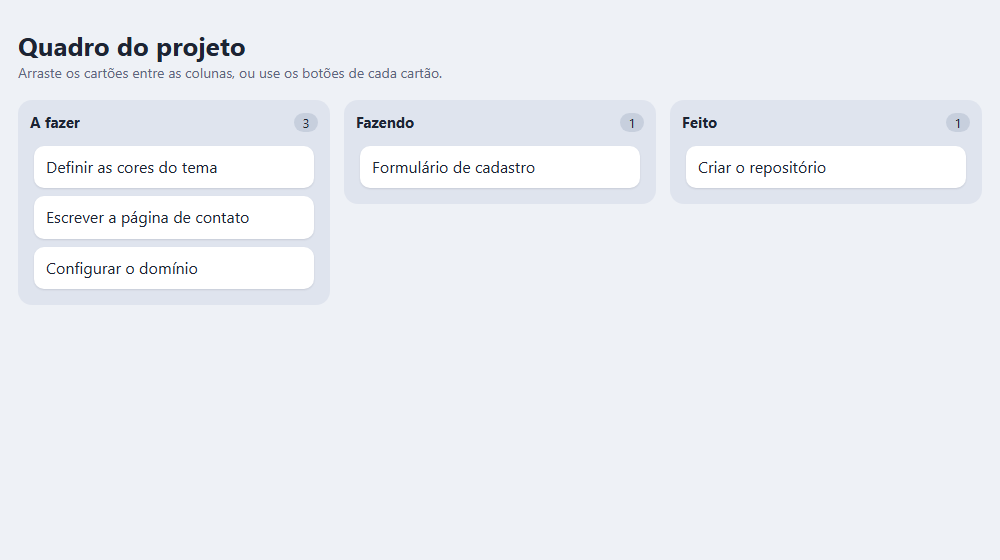
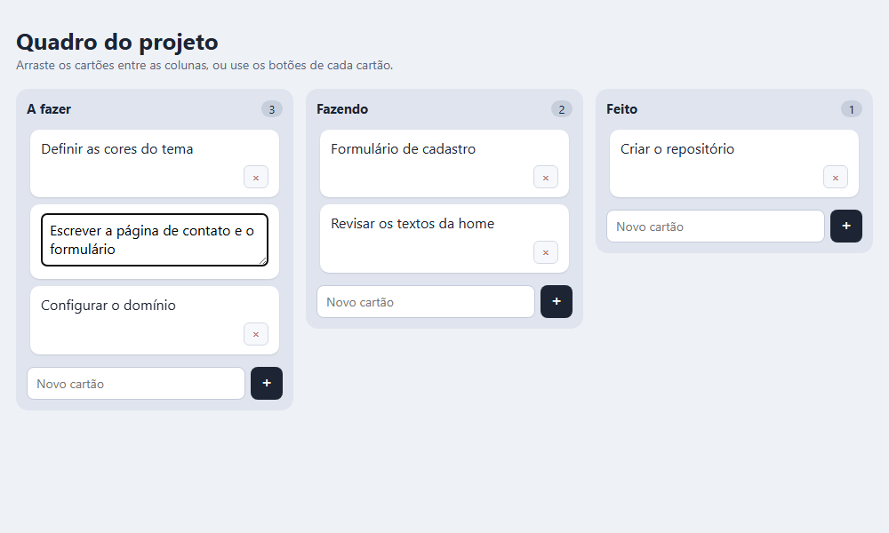
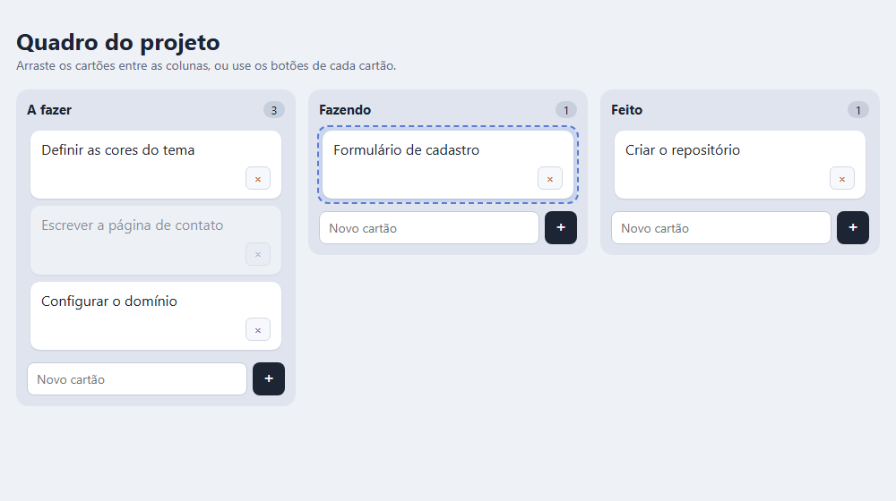
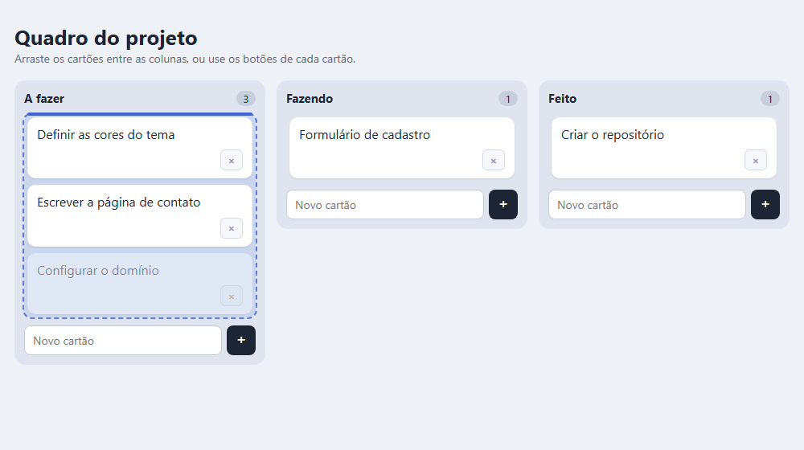
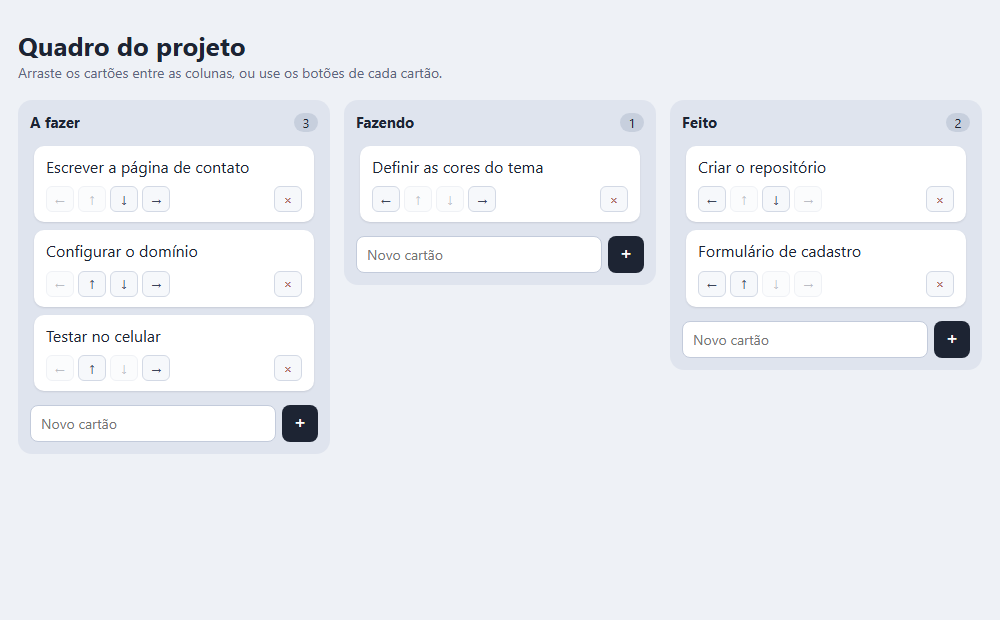

> Colunas, cartões, e arrastar entre elas. É o projeto que expõe se você entende estado: a interface pode mentir sobre onde o cartão está, e só o estado diz a verdade. Este é o passo a passo que eu seguiria — começando pelos dados, sem nenhum HTML de cartão — e com a medição de dois erros que parecem funcionar: o cartão movido só na tela, e a posição que erra por um.

## O QUE VOCÊ PRECISA
- VS Code, com a extensão *Live Server* (opcional).
- Um navegador de computador (o arrastar e soltar do HTML é pensado para mouse).
- A oficina da Lista de Tarefas: edição no lugar, delegação de eventos e persistência voltam aqui.

## ANTES DE ESCREVER A PRIMEIRA LINHA
Crie uma pasta chamada `kanban` e abra-a no VS Code (*Arquivo → Abrir Pasta*). Dentro dela, crie estes arquivos vazios:

~~~arvore
kanban/
├── index.html
├── estilo.css
└── app.js
~~~
HTML e CSS ficam prontos na etapa 1 e não mudam mais: o quadro inteiro é gerado pelo JavaScript.

### 1. A estrutura de dados primeiro
Modelar colunas e cartões, e desenhar o quadro inteiro a partir disso.

~~~arquivo index.html
<!DOCTYPE html>
<html lang="pt-BR">
<head>
    <meta charset="UTF-8">
    <meta name="viewport" content="width=device-width, initial-scale=1.0">
    <title>Quadro do projeto</title>
    <link rel="stylesheet" href="estilo.css">
</head>
<body>
    <main class="app">
        <header class="topo">
            <h1>Quadro do projeto</h1>
            
Arraste os cartões entre as colunas, ou use os botões de cada cartão.

        </header>

        <!-- Vazio de propósito: o quadro inteiro é desenhado a partir do estado. -->
        

    </main>

    
</body>
</html>
~~~

~~~arquivo estilo.css
* {
    box-sizing: border-box;
    margin: 0;
    padding: 0;
}

[hidden] { display: none !important; }

.oculto {
    position: absolute;
    width: 1px;
    height: 1px;
    overflow: hidden;
    clip-path: inset(50%);
    white-space: nowrap;
}

body {
    min-height: 100vh;
    padding: 28px 18px;
    background: #eef1f6;
    color: #1d2433;
    font-family: 'Segoe UI', system-ui, sans-serif;
}

.app { max-width: 1100px; margin: 0 auto; }

.topo { margin-bottom: 18px; }
h1 { font-size: 26px; }
.dica { color: #5d6780; font-size: 14px; }

/* Colunas lado a lado; se não couberem, o quadro rola na horizontal. */
.quadro {
    display: grid;
    grid-auto-columns: minmax(260px, 1fr);
    grid-auto-flow: column;
    align-items: start;
    gap: 14px;
    padding-bottom: 8px;
    overflow-x: auto;
}

.coluna {
    display: grid;
    gap: 10px;
    padding: 12px;
    border-radius: 14px;
    background: #dfe4ee;
}

.coluna-topo { display: flex; align-items: center; justify-content: space-between; }
.coluna-topo h2 { font-size: 15px; }
.contagem {
    min-width: 24px;
    padding: 1px 8px;
    border-radius: 999px;
    background: #c7cfdd;
    font-size: 13px;
    text-align: center;
}

.cartoes {
    display: grid;
    gap: 8px;
    min-height: 48px;
    padding: 4px;
    border-radius: 10px;
    list-style: none;
}
.cartoes.alvo { background: #c9d6ee; outline: 2px dashed #5b7bd5; }

.cartao {
    position: relative;
    padding: 10px 12px;
    border-radius: 10px;
    background: #fff;
    box-shadow: 0 1px 2px rgba(29, 36, 51, .12);
}
.cartao[draggable="true"] { cursor: grab; }
.cartao.arrastando { opacity: .45; }
/* A linha azul que mostra onde o cartão vai cair. */
.cartao.inserir-antes::before,
.cartoes.inserir-fim::after {
    content: '';
    display: block;
    height: 4px;
    border-radius: 2px;
    background: #3f63d1;
}
.cartao.inserir-antes::before { position: absolute; top: -6px; right: 0; left: 0; }

.texto { line-height: 1.4; white-space: pre-wrap; word-break: break-word; }
.texto:focus-visible { outline: 2px solid #3f63d1; outline-offset: 3px; border-radius: 4px; }

.acoes { display: flex; flex-wrap: wrap; gap: 4px; margin-top: 8px; }
.acoes button {
    min-width: 28px;
    height: 26px;
    padding: 0 6px;
    border: 1px solid #d3d9e5;
    border-radius: 6px;
    background: #f6f8fb;
    color: #3b4459;
    font: inherit;
    font-size: 13px;
    cursor: pointer;
}
.acoes button:hover:not(:disabled),
.acoes button:focus-visible { border-color: #9fb0d6; background: #e5ebf7; }
.acoes button:disabled { opacity: .35; cursor: default; }
.acoes .remover { margin-left: auto; color: #a33a3a; }

.edicao {
    width: 100%;
    min-height: 60px;
    padding: 6px 8px;
    border: 2px solid #3f63d1;
    border-radius: 6px;
    font: inherit;
    resize: vertical;
}

.novo { display: flex; gap: 6px; }
.novo input {
    flex: 1;
    min-width: 0;
    padding: 8px 10px;
    border: 1px solid #c3cbdb;
    border-radius: 8px;
    background: #fff;
    font: inherit;
    font-size: 14px;
}
.novo button {
    width: 36px;
    border: 0;
    border-radius: 8px;
    background: #1d2433;
    color: #fff;
    font-size: 18px;
    cursor: pointer;
}
~~~

~~~arquivo app.js
const areaQuadro = document.getElementById('quadro');
/* ---------------------------------------------------------------
   O estado inteiro do quadro. Tudo que aparece na tela sai daqui —
   e a ordem dos cartões na tela é a ordem destes arrays.
   --------------------------------------------------------------- */
let quadro = {
    colunas: [
        {
            id: 'a-fazer',
            titulo: 'A fazer',
            cartoes: [
                { id: 'k1', texto: 'Definir as cores do tema' },
                { id: 'k2', texto: 'Escrever a página de contato' },
                { id: 'k3', texto: 'Configurar o domínio' },
            ],
        },
        {
            id: 'fazendo',
            titulo: 'Fazendo',
            cartoes: [
                { id: 'k4', texto: 'Formulário de cadastro' },
            ],
        },
        {
            id: 'feito',
            titulo: 'Feito',
            cartoes: [
                { id: 'k5', texto: 'Criar o repositório' },
            ],
        },
    ],
};
/* Apaga tudo e desenha de novo, a partir do estado. */
function desenhar() {
    areaQuadro.replaceChildren(...quadro.colunas.map(criarColuna));
}
function criarColuna(coluna) {
    const secao = document.createElement('section');
    secao.className = 'coluna';
    const topo = document.createElement('header');
    topo.className = 'coluna-topo';
    const titulo = document.createElement('h2');
    titulo.textContent = coluna.titulo;
    const contagem = document.createElement('span');
    contagem.className = 'contagem';
    contagem.textContent = coluna.cartoes.length;
    topo.append(titulo, contagem);
    const lista = document.createElement('ol');
    lista.className = 'cartoes';
    lista.dataset.coluna = coluna.id;
    lista.append(...coluna.cartoes.map(criarCartao));
    secao.append(topo, lista);
    return secao;
}
function criarCartao(cartao) {
    const item = document.createElement('li');
    item.className = 'cartao';
    item.dataset.cartao = cartao.id;
    const texto = document.createElement('p');
    texto.className = 'texto';
    texto.textContent = cartao.texto;
    item.append(texto);
    return item;
}
desenhar();
~~~

#### A ordem da tela é a ordem dos arrays
O quadro é um objeto com uma lista de colunas, e cada coluna tem sua lista de cartões. Não existe “posição do cartão” guardada em lugar nenhum: a posição é o índice no array da coluna. Mover um cartão para o topo de Feito é tirá-lo de um array e colocá-lo na posição 0 de outro. Comecei pelo modelo porque, se o quadro nascer como HTML, toda operação vai ter que ler a tela para descobrir o que existe — e é aí que tela e dados começam a divergir.

#### Apagar e redesenhar tudo
`desenhar()` joga fora o quadro inteiro e o cria de novo. Parece desperdício, e é o que mantém o projeto simples: qualquer mudança é “mexer no estado e chamar `desenhar()` ”. Testei tirando o primeiro cartão de A fazer e colocando no começo de Feito, só no objeto: depois de redesenhar, a tela mostrou exatamente isso.

!confira três colunas, com as contagens 3, 1 e 1. No console, `quadro.colunas[1].cartoes.push({ id: "x", texto: "Teste" }); desenhar()` faz o cartão aparecer.

### 2. Criar, apagar e editar
Um formulário por coluna, um × por cartão, e edição no próprio cartão.

~~~codigo
function acharCartao(id) {
    for (const coluna of quadro.colunas) {
        const indice = coluna.cartoes.findIndex((k) => k.id === id);
        if (indice !== -1) return { coluna, indice };
    }
    return null;
}
~~~

~~~arquivo app.js — criarCartao()
function criarCartao(cartao) {
    const item = document.createElement('li');
    item.className = 'cartao';
    item.dataset.cartao = cartao.id;

    if (cartao.id === editando) {
        const edicao = document.createElement('textarea');
        edicao.className = 'edicao';
        edicao.value = cartao.texto;
        edicao.setAttribute('aria-label', 'Editar cartão');
        item.append(edicao);
        return item;
    }

    const texto = document.createElement('p');
    texto.className = 'texto';
    texto.textContent = cartao.texto;
    texto.tabIndex = 0;   // Enter no texto também começa a editar

    const acoes = document.createElement('div');
    acoes.className = 'acoes';
    const remover = document.createElement('button');
    remover.type = 'button';
    remover.className = 'remover';
    remover.textContent = '×';
    remover.setAttribute('aria-label', `Remover: ${cartao.texto}`);
    acoes.append(remover);

    item.append(texto, acoes);
    return item;
}

function comecarEdicao(id) {
    editando = id;
    desenhar();
    const edicao = areaQuadro.querySelector('.edicao');
    edicao.focus();
    edicao.select();
}

function terminarEdicao(guardar, valor) {
    if (editando === null) return;
    const achado = acharCartao(editando);
    editando = null;                          // antes de redesenhar (a lição da Lista de Tarefas)
    const texto = guardar ? valor.trim() : '';
    if (achado && texto !== '') achado.coluna.cartoes[achado.indice].texto = texto;
    desenhar();
}
~~~

~~~arquivo app.js — eventos
areaQuadro.addEventListener('submit', (evento) => {
    evento.preventDefault();
    const form = evento.target;
    const texto = form.elements.texto.value.trim();
    if (texto === '') return;

    const coluna = quadro.colunas.find((c) => c.id === form.dataset.coluna);
    coluna.cartoes.push({ id: crypto.randomUUID(), texto });
    desenhar();
    areaQuadro.querySelector(`.novo[data-coluna="${coluna.id}"] input`).focus();
});

areaQuadro.addEventListener('click', (evento) => {
    const botao = evento.target.closest('.remover');
    if (!botao) return;
    const { coluna, indice } = acharCartao(botao.closest('.cartao').dataset.cartao);
    coluna.cartoes.splice(indice, 1);
    desenhar();
});

areaQuadro.addEventListener('dblclick', (evento) => {
    const texto = evento.target.closest('.texto');
    if (texto) comecarEdicao(texto.closest('.cartao').dataset.cartao);
});

areaQuadro.addEventListener('keydown', (evento) => {
    if (evento.target.matches('.texto') && evento.key === 'Enter') {
        comecarEdicao(evento.target.closest('.cartao').dataset.cartao);
        return;
    }
    if (!evento.target.matches('.edicao')) return;
    if (evento.key === 'Enter' && !evento.shiftKey) {   // Shift+Enter quebra linha
        evento.preventDefault();
        terminarEdicao(true, evento.target.value);
    } else if (evento.key === 'Escape') {
        terminarEdicao(false);
    }
});

areaQuadro.addEventListener('focusout', (evento) => {
    if (evento.target.matches('.edicao')) terminarEdicao(true, evento.target.value);
});
~~~
`criarColuna()` ganha, no fim, o formulário de novo cartão daquela coluna (veja o arquivo completo na etapa 5).

#### Os ouvintes ficam no quadro, não nos cartões
O quadro é recriado a cada mudança, então um ouvinte posto num botão morreria junto com ele. Os ouvintes de `submit`, `click`, `dblclick`, `keydown` e `focusout` ficam no `#quadro`, que nunca é recriado, e descobrem pelo alvo do evento qual cartão ou coluna foi usado. É a delegação da Lista de Tarefas, agora com cinco eventos. Depois de criar um cartão, o foco volta ao campo da mesma coluna — conferi —, então dá para criar vários seguidos sem o mouse. Texto só com espaços não cria nada.

#### A edição, com as lições da Lista de Tarefas
`editando` guarda o id do cartão em edição, e `criarCartao()` desenha um `textarea` no lugar do texto. Os caminhos: Enter salva, Esc descarta, sair do campo salva. Como é um `textarea`, Shift+Enter precisa continuar quebrando linha — conferi que ele não salva. E `editando = null` vem antes do redesenho, pela mesma razão medida lá: remover o campo focado dispara `focusout`. O texto do cartão tem `tabIndex = 0`: quem navega por teclado chega nele com Tab, e Enter abre a edição. Testei os cinco caminhos.

!confira crie cartões em cada coluna, remova um, edite outro com duplo clique. Esc não salva; clicar fora salva; Shift+Enter quebra linha.

### 3. Arrastar entre colunas
Cartões arrastáveis, colunas que aceitam — e o cartão mudando de lugar no estado, não só na tela.

~~~codigo
function moverCartao(idCartao, idColuna, posicao) {
    const origem = acharCartao(idCartao);
    const destino = quadro.colunas.find((c) => c.id === idColuna);
    if (!origem || !destino) return;

    const [cartao] = origem.coluna.cartoes.splice(origem.indice, 1);
    const onde = Math.max(0, Math.min(posicao, destino.cartoes.length));
    destino.cartoes.splice(onde, 0, cartao);
}
~~~

~~~arquivo app.js — arrastar e soltar
areaQuadro.addEventListener('dragstart', (evento) => {
    const cartao = evento.target.closest('.cartao');
    if (!cartao) return;
    arrastado = cartao.dataset.cartao;
    evento.dataTransfer.setData('text/plain', arrastado);
    evento.dataTransfer.effectAllowed = 'move';
    cartao.classList.add('arrastando');
});

areaQuadro.addEventListener('dragover', (evento) => {
    const lista = evento.target.closest('.cartoes');
    if (!lista || arrastado === null) return;
    // Por padrão, nada aceita receber um arrasto. Cancelar o dragover é dizer
    // "aqui aceita" — sem esta linha, o evento drop nunca é disparado.
    evento.preventDefault();
    evento.dataTransfer.dropEffect = 'move';
    lista.classList.add('alvo');
});

areaQuadro.addEventListener('dragleave', (evento) => {
    const lista = evento.target.closest('.cartoes');
    if (lista && !lista.contains(evento.relatedTarget)) lista.classList.remove('alvo');
});

areaQuadro.addEventListener('drop', (evento) => {
    const lista = evento.target.closest('.cartoes');
    if (!lista || arrastado === null) return;
    evento.preventDefault();

    const destino = quadro.colunas.find((c) => c.id === lista.dataset.coluna);
    moverCartao(arrastado, destino.id, destino.cartoes.length);   // no fim
    arrastado = null;
    desenhar();
});

areaQuadro.addEventListener('dragend', () => {
    arrastado = null;
    for (const el of areaQuadro.querySelectorAll('.alvo, .arrastando')) el.classList.remove('alvo', 
'arrastando');
});
~~~
Em `criarCartao()`, os cartões que não estão em edição recebem `item.draggable = true`.

#### Mover na tela não é mover
O jeito mais curto de fazer um arrastar funcionar é pegar o elemento e colocá-lo dentro da outra coluna com `append`. Na hora, parece certo. Testei: movi o elemento do primeiro cartão para Feito, e a tela mostrou Feito com dois cartões. Aí criei um cartão qualquer, o que redesenha o quadro — e o cartão voltou para A fazer, com Feito de novo com um só. O estado nunca soube da mudança. Por isso o `drop` aqui não mexe no DOM: chama `moverCartao()`, que tira o cartão de um array e coloca em outro, e depois redesenha. A tela passa a concordar porque é desenhada a partir de onde o cartão realmente está.

#### O `preventDefault()` no `dragover`
Por padrão, nenhum elemento aceita receber um arrasto. É o `dragover` cancelado que diz ao navegador “aqui pode soltar” — sem ele, o evento `drop` não chega a ser disparado, e nada acontece. Conferi que o `dragover` sobre uma coluna sai cancelado. É a primeira parede de quem implementa isto.

#### Uma variável própria para o arrastado
O id do cartão vai para o `dataTransfer`, mas também para `arrastado`. Durante o `dragover`, o navegador não deixa ler o conteúdo do `dataTransfer` — só no `drop`. E a variável tem outro uso: se alguém arrastar um texto de outro programa para cima do quadro, `arrastado` está vazio e a coluna não aceita — conferi que um arrasto que não começou num cartão é recusado.

#### Soltar no lugar errado não perde o cartão
`moverCartao()` procura a coluna de destino antes de tirar o cartão da origem. Se ela não existir, sai sem fazer nada. Soltei um cartão em cima do título da coluna, fora de qualquer lista, e pedi para mover para uma coluna inexistente: nos dois casos, o total de cartões continuou o mesmo, e o cartão continuou onde estava. O `dragleave` confere `relatedTarget` porque ele também dispara quando o ponteiro passa de uma coluna para um cartão *dentro* dela — sem isso, o tracejado piscaria o tempo todo.

!confira arraste um cartão para outra coluna: ele vai para o fim dela, e a contagem muda. Crie um cartão logo depois: o arrastado continua onde você soltou.

### 4. Soltar na posição certa
Entre quais cartões o ponteiro está — sem contar o cartão que está sendo arrastado.

~~~codigo
function posicaoNaLista(lista, y) {
    const outros = [...lista.querySelectorAll('.cartao')].filter((c) => c.dataset.cartao !== 
arrastado);
    const indice = outros.findIndex((cartao) => {
        const caixa = cartao.getBoundingClientRect();
        return y < caixa.top + caixa.height / 2;
    });
    return indice === -1 ? outros.length : indice;
}

function limparMarcas() {
    for (const el of areaQuadro.querySelectorAll('.alvo, .inserir-antes, .inserir-fim')) {
        el.classList.remove('alvo', 'inserir-antes', 'inserir-fim');
    }
}

function marcar(lista, posicao) {
    limparMarcas();
    lista.classList.add('alvo');
    const outros = [...lista.querySelectorAll('.cartao')].filter((c) => c.dataset.cartao !== 
arrastado);
    if (posicao < outros.length) outros[posicao].classList.add('inserir-antes');
    else lista.classList.add('inserir-fim');
}

areaQuadro.addEventListener('dragover', (evento) => {
    const lista = evento.target.closest('.cartoes');
    if (!lista || arrastado === null) return;
    evento.preventDefault();
    evento.dataTransfer.dropEffect = 'move';
    marcar(lista, posicaoNaLista(lista, evento.clientY));
});

areaQuadro.addEventListener('drop', (evento) => {
    const lista = evento.target.closest('.cartoes');
    if (!lista || arrastado === null) return;
    evento.preventDefault();

    moverCartao(arrastado, lista.dataset.coluna, posicaoNaLista(lista, evento.clientY));
    arrastado = null;
    desenhar();
});
~~~

#### O meio de cada cartão decide
Para cada cartão da coluna, a pergunta é: o ponteiro está acima do meio dele? O primeiro cartão em que a resposta é sim é o que vai ficar logo depois do arrastado. Se nenhum, o arrastado vai para o fim. Testei em Fazendo, que tem um cartão: soltar 5 px acima do meio dele pôs o arrastado antes; 5 px abaixo, depois.

#### O erro de um
O detalhe que quase todo mundo erra está no `filter`: o cartão arrastado sai da conta. Veja por quê. Três cartões A, B e C; arrasto o A para entre B e C. Contando o próprio A, o ponteiro está antes do terceiro cartão, o C: posição 2. Só que `moverCartao()` primeiro tira o A, e a lista vira B, C. Inserir na posição 2 põe o A depois do C.

| COMO A POSIÇÃO FOI CALCULADA | RESULTADO |
|---|---|
| Contando o cartão arrastado | B, C, A — uma posição além |
| Sem contar o cartão arrastado | B, A, C — onde a linha azul mostrava |
Medi os dois. E o mesmo cuidado resolve outro critério: soltar um cartão no mesmo lugar em que ele já está não muda a ordem e não duplica nada — conferi a ordem e o total.

#### A linha azul não redesenha nada
O `dragover` dispara sem parar enquanto o ponteiro se move. Redesenhar o quadro a cada vez seria pesado e ainda destruiria o cartão que está sendo arrastado. `marcar()` só troca classes: `inserir-` `antes` no cartão da posição, ou `inserir-fim` na lista, e o CSS desenha a linha com `::before` e `::after`. O redesenho acontece uma vez, no `drop`. Montei cinco colunas com vinte cartões cada: o quadro desenhou os 100, e soltar um cartão entre o décimo e o décimo primeiro de uma coluna o colocou exatamente ali.

!confira arraste um cartão pela coluna: a linha azul acompanha. Solte no meio de outros: ele cai onde a linha estava. Solte-o no próprio lugar: nada muda.

### 5. Botões de mover e persistência
Um caminho para teclado e toque, e o quadro inteiro guardado entre visitas.

~~~arquivo app.js
const areaQuadro = document.getElementById('quadro');
const CHAVE = 'kanban:v1';
const QUADRO_INICIAL = {
    colunas: [
        {
            id: 'a-fazer',
            titulo: 'A fazer',
            cartoes: [
                { id: 'k1', texto: 'Definir as cores do tema' },
                { id: 'k2', texto: 'Escrever a página de contato' },
                { id: 'k3', texto: 'Configurar o domínio' },
            ],
        },
        {
            id: 'fazendo',
            titulo: 'Fazendo',
            cartoes: [
                { id: 'k4', texto: 'Formulário de cadastro' },
            ],
        },
        {
            id: 'feito',
            titulo: 'Feito',
            cartoes: [
                { id: 'k5', texto: 'Criar o repositório' },
            ],
        },
    ],
};
/* ---------------------------------------------------------------
   Persistência: o quadro inteiro vai e volta como um JSON só
   --------------------------------------------------------------- */
function quadroValido(q) {
    return q
        && Array.isArray(q.colunas) && q.colunas.length > 0
        && q.colunas.every((c) => c
            && typeof c.id === 'string'
            && typeof c.titulo === 'string'
            && Array.isArray(c.cartoes)
            && c.cartoes.every((k) => k && typeof k.id === 'string' && typeof k.texto === 'string'));
}
function carregar() {
    try {
        const salvo = JSON.parse(localStorage.getItem(CHAVE));
        if (quadroValido(salvo)) return salvo;
    } catch {
        // JSON corrompido: cai no quadro inicial.
    }
    return structuredClone(QUADRO_INICIAL);   // cópia: o inicial nunca é alterado
}
function salvar() {
    try {
        localStorage.setItem(CHAVE, JSON.stringify(quadro));
    } catch {
        // Sem armazenamento, o quadro vale só até fechar a aba.
    }
}
let quadro = carregar();
let editando = null;
let arrastado = null;
/* Toda mudança no estado passa por aqui: grava e redesenha. */
function atualizar() {
    salvar();
    desenhar();
}
function acharCartao(id) {
    for (const coluna of quadro.colunas) {
        const indice = coluna.cartoes.findIndex((k) => k.id === id);
        if (indice !== -1) return { coluna, indice };
    }
    return null;
}
function moverCartao(idCartao, idColuna, posicao) {
    const origem = acharCartao(idCartao);
    const destino = quadro.colunas.find((c) => c.id === idColuna);
    if (!origem || !destino) return;
    const [cartao] = origem.coluna.cartoes.splice(origem.indice, 1);
    const onde = Math.max(0, Math.min(posicao, destino.cartoes.length));
    destino.cartoes.splice(onde, 0, cartao);
}
function posicaoNaLista(lista, y) {
    const outros = [...lista.querySelectorAll('.cartao')].filter((c) => c.dataset.cartao !== 
arrastado);
    const indice = outros.findIndex((cartao) => {
        const caixa = cartao.getBoundingClientRect();
        return y < caixa.top + caixa.height / 2;
    });
    return indice === -1 ? outros.length : indice;
}
function limparMarcas() {
    for (const el of areaQuadro.querySelectorAll('.alvo, .inserir-antes, .inserir-fim')) {
        el.classList.remove('alvo', 'inserir-antes', 'inserir-fim');
    }
}
function marcar(lista, posicao) {
    limparMarcas();
    lista.classList.add('alvo');
    const outros = [...lista.querySelectorAll('.cartao')].filter((c) => c.dataset.cartao !== 
arrastado);
    if (posicao < outros.length) outros[posicao].classList.add('inserir-antes');
    else lista.classList.add('inserir-fim');
}
/* ---------------------------------------------------------------
   Mover pelos botões: o caminho do teclado e do toque
   --------------------------------------------------------------- */
function moverPorBotao(idCartao, direcao) {
    const { coluna, indice } = acharCartao(idCartao);
    const c = quadro.colunas.indexOf(coluna);
    if (direcao === 'cima') moverCartao(idCartao, coluna.id, indice - 1);
    if (direcao === 'baixo') moverCartao(idCartao, coluna.id, indice + 1);
    if (direcao === 'esquerda' && c > 0) {
        const vizinha = quadro.colunas[c - 1];
        moverCartao(idCartao, vizinha.id, vizinha.cartoes.length);
    }
    if (direcao === 'direita' && c < quadro.colunas.length - 1) {
        const vizinha = quadro.colunas[c + 1];
        moverCartao(idCartao, vizinha.id, vizinha.cartoes.length);
    }
    atualizar();
    // O foco acompanha o cartão, no mesmo botão, para apertar de novo.
    const mesmo = areaQuadro.querySelector(`[data-cartao="${idCartao}"] [data-mover="${direcao}"]`);
    const alvo = mesmo && !mesmo.disabled ? mesmo : areaQuadro.querySelector(`[data-
cartao="${idCartao}"] .texto`);
    alvo.focus();
}
/* ---------------------------------------------------------------
   Desenho
   --------------------------------------------------------------- */
function desenhar() {
    areaQuadro.replaceChildren(...quadro.colunas.map(criarColuna));
}
function criarColuna(coluna, posicaoColuna) {
    const secao = document.createElement('section');
    secao.className = 'coluna';
    const topo = document.createElement('header');
    topo.className = 'coluna-topo';
    const titulo = document.createElement('h2');
    titulo.textContent = coluna.titulo;
    const contagem = document.createElement('span');
    contagem.className = 'contagem';
    contagem.textContent = coluna.cartoes.length;
    topo.append(titulo, contagem);
    const lista = document.createElement('ol');
    lista.className = 'cartoes';
    lista.dataset.coluna = coluna.id;
    lista.append(...coluna.cartoes.map((cartao, i) => criarCartao(cartao, {
        primeiro: i === 0,
        ultimo: i === coluna.cartoes.length - 1,
        colunaAnterior: quadro.colunas[posicaoColuna - 1],
        colunaSeguinte: quadro.colunas[posicaoColuna + 1],
    })));
    const novo = document.createElement('form');
    novo.className = 'novo';
    novo.dataset.coluna = coluna.id;
    const campo = document.createElement('input');
    campo.name = 'texto';
    campo.placeholder = 'Novo cartão';
    campo.autocomplete = 'off';
    campo.setAttribute('aria-label', `Novo cartão em ${coluna.titulo}`);
    const botao = document.createElement('button');
    botao.type = 'submit';
    botao.textContent = '+';
    botao.setAttribute('aria-label', `Adicionar em ${coluna.titulo}`);
    novo.append(campo, botao);
    secao.append(topo, lista, novo);
    return secao;
}
function botaoMover(direcao, simbolo, rotulo, desativado) {
    const botao = document.createElement('button');
    botao.type = 'button';
    botao.dataset.mover = direcao;
    botao.textContent = simbolo;
    botao.setAttribute('aria-label', rotulo);
    botao.disabled = desativado;
    return botao;
}
function criarCartao(cartao, vizinhanca) {
    const item = document.createElement('li');
    item.className = 'cartao';
    item.dataset.cartao = cartao.id;
    if (cartao.id === editando) {
        const edicao = document.createElement('textarea');
        edicao.className = 'edicao';
        edicao.value = cartao.texto;
        edicao.setAttribute('aria-label', 'Editar cartão');
        item.append(edicao);
        return item;
    }
    item.draggable = true;
    const texto = document.createElement('p');
    texto.className = 'texto';
    texto.textContent = cartao.texto;
    texto.tabIndex = 0;
    const { primeiro, ultimo, colunaAnterior, colunaSeguinte } = vizinhanca;
    const acoes = document.createElement('div');
    acoes.className = 'acoes';
    acoes.append(
        botaoMover('esquerda', '←', colunaAnterior ? `Mover para ${colunaAnterior.titulo}` : 'Mover 
para a esquerda', !colunaAnterior),
        botaoMover('cima', '↑', 'Mover para cima', primeiro),
        botaoMover('baixo', '↓', 'Mover para baixo', ultimo),
        botaoMover('direita', '→', colunaSeguinte ? `Mover para ${colunaSeguinte.titulo}` : 'Mover 
para a direita', !colunaSeguinte),
    );
    const remover = document.createElement('button');
    remover.type = 'button';
    remover.className = 'remover';
    remover.textContent = '×';
    remover.setAttribute('aria-label', `Remover: ${cartao.texto}`);
    acoes.append(remover);
    item.append(texto, acoes);
    return item;
}
function comecarEdicao(id) {
    editando = id;
    desenhar();
    const edicao = areaQuadro.querySelector('.edicao');
    edicao.focus();
    edicao.select();
}
function terminarEdicao(guardar, valor) {
    if (editando === null) return;
    const achado = acharCartao(editando);
    editando = null;
    const texto = guardar ? valor.trim() : '';
    if (achado && texto !== '') achado.coluna.cartoes[achado.indice].texto = texto;
    atualizar();
}
/* ---------------------------------------------------------------
   Arrastar e soltar
   --------------------------------------------------------------- */
areaQuadro.addEventListener('dragstart', (evento) => {
    const cartao = evento.target.closest('.cartao');
    if (!cartao) return;
    arrastado = cartao.dataset.cartao;
    evento.dataTransfer.setData('text/plain', arrastado);
    evento.dataTransfer.effectAllowed = 'move';
    cartao.classList.add('arrastando');
});
areaQuadro.addEventListener('dragover', (evento) => {
    const lista = evento.target.closest('.cartoes');
    if (!lista || arrastado === null) return;
    evento.preventDefault();
    evento.dataTransfer.dropEffect = 'move';
    marcar(lista, posicaoNaLista(lista, evento.clientY));
});
areaQuadro.addEventListener('dragleave', (evento) => {
    const lista = evento.target.closest('.cartoes');
    if (lista && !lista.contains(evento.relatedTarget)) limparMarcas();
});
areaQuadro.addEventListener('drop', (evento) => {
    const lista = evento.target.closest('.cartoes');
    if (!lista || arrastado === null) return;
    evento.preventDefault();
    moverCartao(arrastado, lista.dataset.coluna, posicaoNaLista(lista, evento.clientY));
    arrastado = null;
    atualizar();
});
areaQuadro.addEventListener('dragend', () => {
    arrastado = null;
    limparMarcas();
    const sobrando = areaQuadro.querySelector('.arrastando');
    if (sobrando) sobrando.classList.remove('arrastando');
});
/* ---------------------------------------------------------------
   Criar, apagar, editar e mover por botão
   --------------------------------------------------------------- */
areaQuadro.addEventListener('submit', (evento) => {
    evento.preventDefault();
    const form = evento.target;
    const texto = form.elements.texto.value.trim();
    if (texto === '') return;
    const coluna = quadro.colunas.find((c) => c.id === form.dataset.coluna);
    coluna.cartoes.push({ id: crypto.randomUUID(), texto });
    atualizar();
    areaQuadro.querySelector(`.novo[data-coluna="${coluna.id}"] input`).focus();
});
areaQuadro.addEventListener('click', (evento) => {
    const mover = evento.target.closest('[data-mover]');
    if (mover) {
        moverPorBotao(mover.closest('.cartao').dataset.cartao, mover.dataset.mover);
        return;
    }
    const remover = evento.target.closest('.remover');
    if (!remover) return;
    const { coluna, indice } = acharCartao(remover.closest('.cartao').dataset.cartao);
    coluna.cartoes.splice(indice, 1);
    atualizar();
});
areaQuadro.addEventListener('dblclick', (evento) => {
    const texto = evento.target.closest('.texto');
    if (texto) comecarEdicao(texto.closest('.cartao').dataset.cartao);
});
areaQuadro.addEventListener('keydown', (evento) => {
    if (evento.target.matches('.texto') && evento.key === 'Enter') {
        comecarEdicao(evento.target.closest('.cartao').dataset.cartao);
        return;
    }
    if (!evento.target.matches('.edicao')) return;
    if (evento.key === 'Enter' && !evento.shiftKey) {
        evento.preventDefault();
        terminarEdicao(true, evento.target.value);
    } else if (evento.key === 'Escape') {
        terminarEdicao(false);
    }
});
areaQuadro.addEventListener('focusout', (evento) => {
    if (evento.target.matches('.edicao')) terminarEdicao(true, evento.target.value);
});
desenhar();
~~~

#### Arrastar não pode ser o único caminho
Arrastar e soltar do HTML depende de um ponteiro. Quem usa teclado não tem como arrastar, e em telas de toque o comportamento varia de navegador para navegador. Os quatro botões de cada cartão fazem o mesmo trabalho com um clique ou um Enter — e usam a mesma `moverCartao()` do arrasto, então não existe uma segunda regra de movimento.

~~~codigo
function moverPorBotao(idCartao, direcao) {
    const { coluna, indice } = acharCartao(idCartao);
    const c = quadro.colunas.indexOf(coluna);

    if (direcao === 'cima') moverCartao(idCartao, coluna.id, indice - 1);
    if (direcao === 'baixo') moverCartao(idCartao, coluna.id, indice + 1);
    if (direcao === 'esquerda' && c > 0) {
        const vizinha = quadro.colunas[c - 1];
        moverCartao(idCartao, vizinha.id, vizinha.cartoes.length);
    }
    if (direcao === 'direita' && c < quadro.colunas.length - 1) {
        const vizinha = quadro.colunas[c + 1];
        moverCartao(idCartao, vizinha.id, vizinha.cartoes.length);
    }
    atualizar();

    // O foco acompanha o cartão, no mesmo botão, para apertar de novo.
    const mesmo = areaQuadro.querySelector(`[data-cartao="${idCartao}"] [data-
mover="${direcao}"]`);
    const alvo = mesmo && !mesmo.disabled ? mesmo : areaQuadro.querySelector(`[data-
cartao="${idCartao}"] .texto`);
    alvo.focus();
}
~~~
↓ numa lista “sem o próprio cartão” é inserir em `indice + 1`; conferi que o primeiro cartão trocou de lugar com o segundo. → leva para o fim da coluna seguinte.

#### O foco acompanha o cartão
Depois de mover, o quadro é redesenhado — e o botão que tinha o foco deixa de existir. Sem cuidado, o foco volta para o começo da página, e quem usa teclado precisa navegar tudo de novo a cada movimento. Por isso, depois de redesenhar, o foco vai para o mesmo botão do mesmo cartão: dá para apertar ↓ várias vezes seguidas. Se aquele botão ficou desabilitado (o cartão chegou ao fim), o foco vai para o texto do cartão. Conferi o botão e o cartão com foco depois do movimento. Os botões que não fazem sentido ficam desabilitados — ↑ no primeiro cartão, → na última coluna — e o rótulo diz para onde vai: “Mover para Fazendo”.

#### O quadro inteiro num JSON só
Como o estado é um objeto só, persistir é gravá-lo inteiro a cada mudança, e ler de volta ao abrir. Arrastei o cartão de Feito para o topo de A fazer, movi outro pelos botões, e recarreguei a página de verdade: as colunas voltaram com a mesma ordem de cartões, com o arrastado no topo. Na leitura, `quadroValido()` confere colunas e cartões antes de aceitar. JSON quebrado e uma coluna com id numérico caíram no quadro inicial. E o quadro inicial é copiado com `structuredClone`: sem a cópia, mover um cartão alteraria o próprio `QUADRO_INICIAL`, e “voltar ao inicial” traria o quadro já bagunçado. Conferi que ele continuou intacto depois de vários movimentos.

!confira use Tab até um cartão e mova-o só com os botões e Enter: o foco segue o cartão. Arraste outro, aperte F5: tudo no lugar.

### ✓ Roteiro de teste
Passe por estes casos antes de considerar a oficina concluída. Eles cobrem o que costuma quebrar.

| VOCÊ FAZ | DEVE ACONTECER |
|---|---|
| Arrastar para outra coluna e criar um cartão logo depois | o arrastado continua onde foi solto |
| Soltar entre dois cartões | cai exatamente onde a linha azul estava |
| Arrastar um cartão para baixo na mesma coluna | não passa uma posição além |
| Soltar um cartão no próprio lugar | nada muda, nada duplica |
| Soltar fora de qualquer coluna | o cartão continua onde estava |
| Mover só pelo teclado, com os botões | funciona, e o foco segue o cartão |
| Editar e apertar Esc | o texto antigo continua |
| Reorganizar e apertar F5 | a ordem exata volta |
| Criar muitos cartões e arrastar | continua fluido |

### ! Quando não funcionar
Os tropeços desta oficina, e o que procurar em cada um.

| SINTOMA | CAUSA QUASE CERTA |
|---|---|
| O drop nunca acontece | Falta `preventDefault()` no `dragover`. |
| O cartão volta ao lugar antigo sozinho | O arrasto moveu o elemento no DOM, e não o cartão no estado. |
| O cartão cai uma posição além | A posição foi calculada contando o próprio cartão arrastado. |
| Soltar no mesmo lugar duplica o cartão | O cartão é inserido no destino sem ser tirado da origem. |
| `getData()` vem vazio no dragover | É proteção do navegador. Guarde o id numa variável no `dragstart`. |
| O tracejado da coluna pisca | O `dragleave` não confere se o ponteiro só entrou num filho da coluna. |
| Botões param de funcionar depois de mover | Ouvintes foram postos nos elementos recriados. Delegue no quadro. |
| Depois de mover pelo teclado, o foco vai para o topo | Falta devolver o foco ao botão do cartão após redesenhar. |
| “Voltar ao inicial” traz o quadro bagunçado | O quadro inicial foi usado sem cópia e foi alterado. |

### → Para levar adiante
Extensões em ordem de dificuldade. Todas cabem no que você já construiu.
1. Colunas editáveis. Criar, renomear e reordenar colunas: é o mesmo `moverCartao()`, um nível acima. 2. Limite por coluna. No máximo três cartões em Fazendo: o `dragover` recusa a coluna cheia. 3. Etiquetas e filtro. Cada cartão com uma cor; filtrar esconde os outros sem tirá-los do estado. 4. Arrastar no celular. Refaça o arrasto com eventos de ponteiro ( `pointerdown`, `pointermove`), que funcionam com dedo e mouse.
