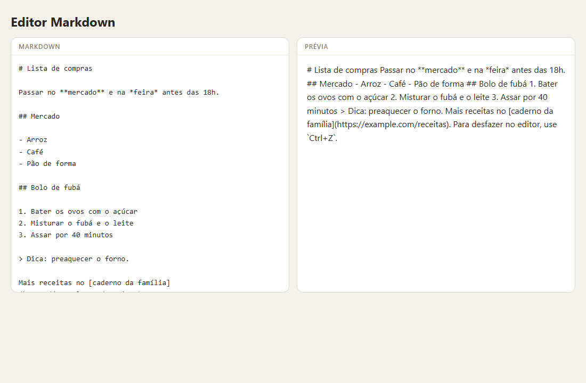
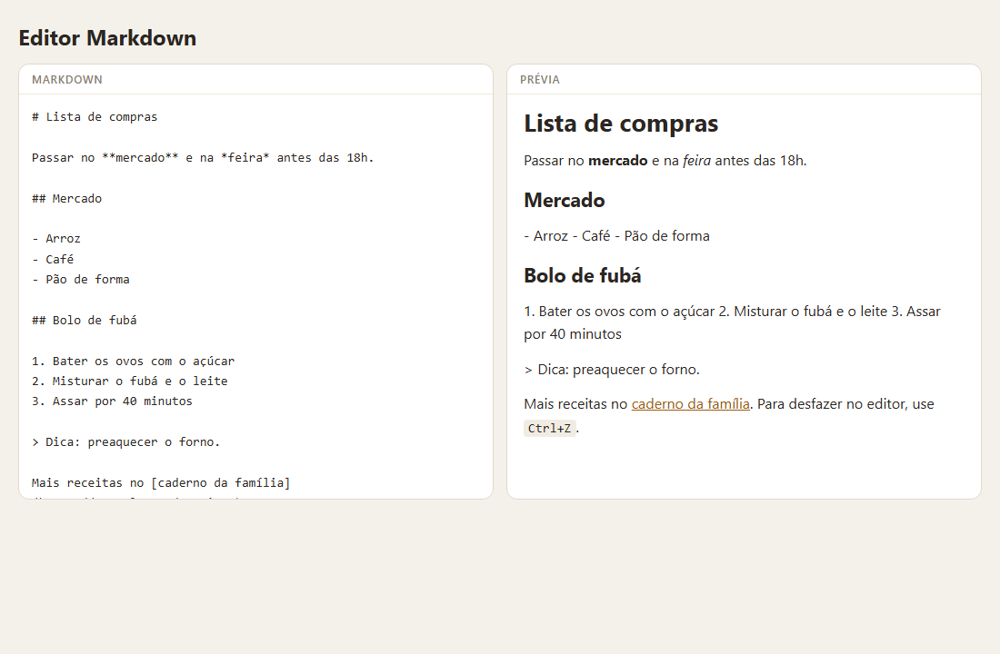
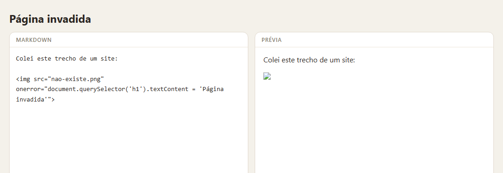
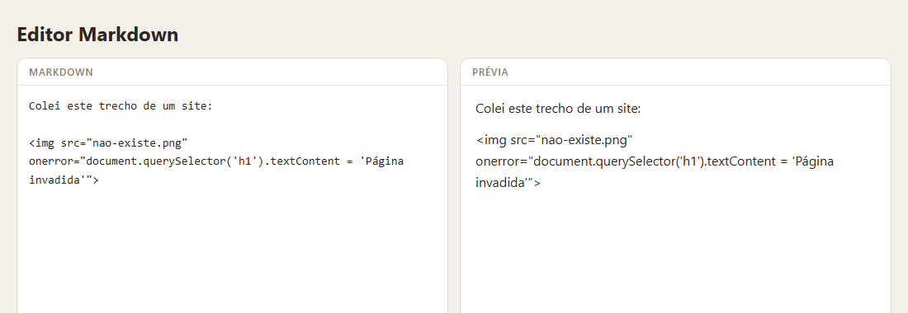
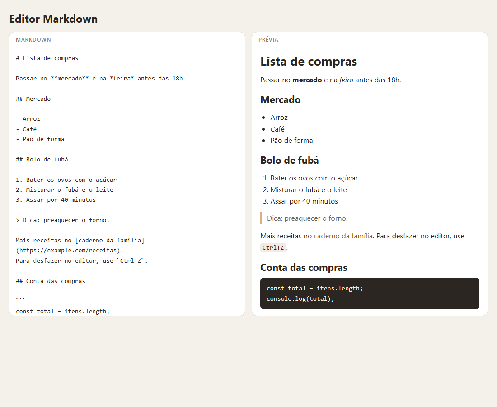
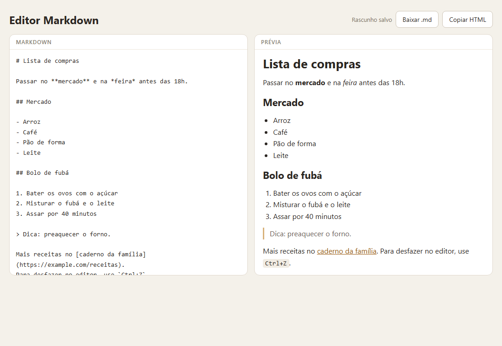

> Escrever à esquerda, ver formatado à direita. O conversor é o coração do projeto — e é também uma aula de segurança: a primeira versão que quase todo mundo escreve funciona com texto comportado e executa qualquer código colado no editor. Este é o passo a passo que eu seguiria, com esse buraco medido antes de ser fechado, e com o rascunho que sobrevive a um F5 no meio da digitação.

## O QUE VOCÊ PRECISA
- VS Code, com a extensão *Live Server* (opcional).
- Um navegador moderno.
- Expressões regulares básicas ajudam: grupos `( )`, classes `[ ]` e `+?`. Cada uma é explicada no uso.
- As oficinas da Lista de Tarefas (localStorage) e da Galeria (debounce).

## ANTES DE ESCREVER A PRIMEIRA LINHA
Crie uma pasta chamada `markdown` e abra-a no VS Code (*Arquivo → Abrir Pasta*). Dentro dela, crie estes arquivos vazios:

~~~arvore
markdown/
├── index.html
├── estilo.css
├── markdown.js
└── app.js
~~~
O `markdown.js` só transforma texto em HTML e não toca na página. O `app.js` cuida da tela.

### 1. Dois painéis e o texto como está
A estrutura da página, e uma prévia que ainda só repete o que foi digitado.

~~~arquivo index.html
<!DOCTYPE html>
<html lang="pt-BR">
<head>
    <meta charset="UTF-8">
    <meta name="viewport" content="width=device-width, initial-scale=1.0">
    <title>Editor Markdown</title>
    <link rel="stylesheet" href="estilo.css">
</head>
<body>
    <main class="app">
        <header class="topo">
            <h1>Editor Markdown</h1>
        </header>

        <div class="paineis">
            <section class="painel">
                <label for="fonte" class="rotulo">Markdown</label>
                <textarea id="fonte" spellcheck="false"># Lista de compras

Passar no **mercado** e na *feira* antes das 18h.

## Mercado

- Arroz
- Café
- Pão de forma

## Bolo de fubá

1. Bater os ovos com o açúcar
2. Misturar o fubá e o leite
3. Assar por 40 minutos

> Dica: preaquecer o forno.

Mais receitas no [caderno da família](https://example.com/receitas).
Para desfazer no editor, use `Ctrl+Z`.</textarea>
            </section>
            <section class="painel">
                <h2 id="rotulo-previa" class="rotulo">Prévia</h2>
                <article id="previa" class="previa" aria-labelledby="rotulo-previa"></article>
            </section>
        </div>
    </main>

    <script src="app.js"></script>
</body>
</html>
~~~

~~~arquivo estilo.css
* {
    box-sizing: border-box;
    margin: 0;
    padding: 0;
}

[hidden] { display: none !important; }

body {
    min-height: 100vh;
    padding: 24px 20px;
    background: #f4f1ea;
    color: #2b2622;
    font-family: 'Segoe UI', system-ui, sans-serif;
}

.app {
    max-width: 1180px;
    margin: 0 auto;
    display: grid;
    gap: 14px;
}

.topo {
    display: flex;
    align-items: center;
    justify-content: space-between;
    gap: 12px;
    flex-wrap: wrap;
}
h1 { font-size: 24px; }

.acoes { display: flex; align-items: center; gap: 8px; }
.acoes button {
    padding: 8px 14px;
    border: 1px solid #cfc6b8;
    border-radius: 8px;
    background: #fff;
    color: inherit;
    font: inherit;
    font-size: 14px;
    cursor: pointer;
}
.acoes button:hover { background: #efe9de; }
.situacao { font-size: 13px; color: #7a6f63; }

/* Dois painéis lado a lado; em tela estreita, um embaixo do outro. */
.paineis {
    display: grid;
    grid-template-columns: 1fr 1fr;
    gap: 14px;
}
@media (max-width: 760px) {
    .paineis { grid-template-columns: 1fr; }
}
.painel {
    display: grid;
    grid-template-rows: auto 1fr;
    min-height: 480px;
    background: #fff;
    border: 1px solid #e0d8cc;
    border-radius: 12px;
    overflow: hidden;
}

.rotulo {
    display: block;
    padding: 8px 14px;
    border-bottom: 1px solid #eee6da;
    font-size: 12px;
    font-weight: 600;
    letter-spacing: .06em;
    text-transform: uppercase;
    color: #8a7e70;
}

#fonte {
    width: 100%;
    height: 100%;
    padding: 14px;
    border: 0;
    resize: none;
    font-family: Consolas, 'Cascadia Mono', monospace;
    font-size: 14px;
    line-height: 1.6;
    color: inherit;
    background: transparent;
}
#fonte:focus { outline: none; }
.painel:focus-within { border-color: #c08a3e; }

/* A prévia: tipografia do texto convertido. */
.previa {
    padding: 14px 18px;
    overflow: auto;
    line-height: 1.6;
    overflow-wrap: anywhere;
}
.previa > * + * { margin-top: .8em; }
.previa h1 { font-size: 1.7em; line-height: 1.2; }
.previa h2 { font-size: 1.35em; line-height: 1.25; }
.previa h3 { font-size: 1.12em; }
.previa a { color: #9a5b12; }
.previa code {
    padding: 1px 5px;
    border-radius: 4px;
    background: #f1ece3;
    font-family: Consolas, 'Cascadia Mono', monospace;
    font-size: .9em;
}
.previa pre {
    padding: 12px 14px;
    border-radius: 8px;
    background: #2b2622;
    color: #f4f1ea;
    overflow-x: auto;
}
.previa pre code { padding: 0; background: none; color: inherit; }
.previa ul, .previa ol { padding-left: 1.4em; }
.previa blockquote {
    padding-left: 12px;
    border-left: 3px solid #d8b27a;
    color: #6d6358;
}
.previa .vazia { color: #a2968a; font-style: italic; }
~~~

~~~arquivo app.js
const fonte = document.getElementById('fonte');
const previa = document.getElementById('previa');

/* Etapa 1: a prévia só repete o texto, sem converter nada.
   textContent nunca interpreta HTML: o que se digita aparece como está. */
function atualizarPrevia() {
    if (fonte.value.trim() === '') {
        previa.innerHTML = '<p class="vazia">A prévia aparece aqui.</p>';
        return;
    }
    previa.textContent = fonte.value;
}

fonte.addEventListener('input', atualizarPrevia);
atualizarPrevia();
~~~



#### Começar pelo caminho seguro
`textContent` nunca interpreta HTML. Digitei `<b>oi</b> tudo bem?` e a prévia mostrou exatamente isso, sem nenhum elemento `<b>` criado. É o ponto de partida: tudo o que a pessoa digita é texto. As próximas etapas vão abrir essa porta — e a pergunta de cada uma é quanto dela abrir. Só espaços no editor contam como vazio: a prévia mostra o aviso “A prévia aparece aqui.”, que é HTML fixo do próprio código, e por isso pode ir por `innerHTML`.

#### Os painéis
`grid-template-columns: 1fr 1fr` divide a largura em duas partes iguais. Abaixo de 760px, uma media query troca para uma coluna: o editor em cima, a prévia embaixo. `:focus-within` destaca o painel inteiro quando o `textarea` dentro dele está em foco, já que o próprio campo não tem borda.

!confira digite no editor: a prévia repete tudo, inclusive asteriscos e sinais de menor e maior.

### 2. A primeira conversão — e o buraco
Trocar as marcas do Markdown por tags e jogar o resultado no innerHTML.

~~~arquivo markdown.js
/* Etapa 2 — primeira tentativa: trocar as marcas por tags e jogar no innerHTML.
   Funciona com texto comportado. E tem um buraco sério: veja as provas. */

function converterLinha(texto) {
    return texto
        .replace(/\*\*(.+?)\*\*/g, '<strong>$1</strong>')
        .replace(/\*(.+?)\*/g, '<em>$1</em>')
        .replace(/`([^`]+)`/g, '<code>$1</code>')
        .replace(/\[([^\]]+)\]\(([^)]+)\)/g, '<a href="$2">$1</a>');
}

/* Blocos são separados por linha em branco. Um bloco de uma linha
   que começa com # é título; o resto é parágrafo. */
function paraHtml(markdown) {
    return markdown
        .replace(/\r\n?/g, '\n')
        .split(/\n\s*\n/)
        .filter((bloco) => bloco.trim() !== '')
        .map((bloco) => {
            const titulo = bloco.match(/^(#{1,6})\s+(.+)$/);
            if (titulo) {
                const n = titulo[1].length;
                return `<h${n}>${converterLinha(titulo[2])}</h${n}>`;
            }
            return `<p>${bloco.split('\n').map(converterLinha).join('\n')}</p>`;
        })
        .join('\n');
}
~~~

~~~arquivo app.js
const fonte = document.getElementById('fonte');
const previa = document.getElementById('previa');

function atualizarPrevia() {
    if (fonte.value.trim() === '') {
        previa.innerHTML = '<p class="vazia">A prévia aparece aqui.</p>';
        return;
    }
    previa.innerHTML = paraHtml(fonte.value);
}

fonte.addEventListener('input', atualizarPrevia);
atualizarPrevia();
~~~
No `index.html`, o `markdown.js` entra antes do `app.js`: `<script src="markdown.js"></script>`.



#### Como as trocas funcionam
Cada `replace` procura um padrão e troca por uma tag. Em `/\*\*(.+?)\*\*/g`: `\*` é um asterisco de verdade (sem a barra, `*` significa “repetir”); `(.+?)` captura o texto do meio, e o `?` faz a captura parar no primeiro par de asteriscos seguinte, não no último; o `g` troca todas as ocorrências. No texto novo, `$1` é o que foi capturado. A ordem importa: negrito vem antes de itálico, senão `forte` viraria um itálico de um asterisco só, dentro de outro. Os blocos são separados por linha em branco ( `\n\s*\n`), e um bloco de uma linha que começa com `#` é título. Com o exemplo, conferi: um `h1`, dois `h2`, “mercado” em negrito, “feira” em itálico, `Ctrl+Z` em código e o link com o endereço certo. As listas não existem ainda — “- Arroz - Café - Pão de forma” saiu num parágrafo só.

#### O buraco
Tudo o que a pessoa digita vai para o `innerHTML`, inclusive o que não é Markdown. Testei quatro entradas:

| DIGITADO NO EDITOR | O QUE ACONTECEU |
|---|---|
| `` | a imagem falhou e o código do `onerror` rodou |
| `[clique aqui](javascript:…)` | virou link; clicar nele rodou o código |
| <b> , querendo mostrar a tag | dentro do código, `<b>` virou tag de verdade |
| `2 * 3 * 4 = 24` | a conta virou itálico: `2 <em> 3 </em> 4` |


Trocar o título é inofensivo. O mesmo lugar poderia ler o `localStorage`, mandar o rascunho para outro servidor ou reescrever a página. E não precisa ser a própria pessoa: basta ela colar um texto preparado por outra. Isso se chama XSS (*cross-site scripting*). Um detalhe que engana: `<script>` inserido por `innerHTML` não roda — medi. Quem testa só com `<script>alert(1)</script>` conclui que está seguro. O ataque de verdade usa atributos como `onerror`, e esses rodam.

!confira cole a linha do `img` com `onerror="document.title = 'oi'"`: o título da aba muda. É o buraco que a próxima etapa fecha.

### 3. Escapar antes de converter
Tudo vira texto primeiro; só as marcas do Markdown viram tags depois.

~~~arquivo markdown.js
/* Etapa 3: escapar primeiro, converter depois.
   Tudo o que a pessoa digitou vira texto; só as marcas do Markdown viram tags. */

function escapar(texto) {
    return texto
        .replaceAll('&', '&amp;')
        .replaceAll('<', '&lt;')
        .replaceAll('>', '&gt;')
        .replaceAll('"', '&quot;')
        .replaceAll("'", '&#39;');
}

/* Só estes começos de endereço viram link. O resto (javascript:, data:...) fica como texto. */
function enderecoSeguro(endereco) {
    return /^(https?:\/\/|mailto:|#|\/|\.\/)/i.test(endereco);
}

/* Negrito e itálico: a marca precisa encostar no texto, como no Markdown de verdade.
   Assim "2 * 3 * 4" continua sendo uma conta. */
function enfatizar(html) {
    return html
        .replace(/\*\*(?=\S)(.+?)(?<=\S)\*\*/g, '<strong>$1</strong>')
        .replace(/\*(?=\S)(.+?)(?<=\S)\*/g, '<em>$1</em>');
}

function converterLinha(linha) {
    // Código e links prontos são guardados e trocados por "<g0>", "<g1>"...
    // Depois de escapar não sobra nenhum "<" no texto, então a marca não se confunde
    // com nada digitado — e nada dentro de um código é convertido de novo.
    const guardados = [];
    const guardar = (html) => `<g${guardados.push(html) - 1}>`;
    const devolver = (html) => html.replace(/<g(\d+)>/g, (_, i) => devolver(guardados[Number(i)]));

    const html = escapar(linha)
        .replace(/`([^`]+)`/g, (_, codigo) => guardar(`<code>${codigo}</code>`))
        .replace(/\[([^\]]+)\]\(([^)\s]+)\)/g, (inteiro, rotulo, endereco) =>
            enderecoSeguro(endereco) ? guardar(`<a href="${endereco}">${enfatizar(rotulo)}</a>`) : 
inteiro);

    return devolver(enfatizar(html));
}

function paraHtml(markdown) {
    return markdown
        .replace(/\r\n?/g, '\n')
        .split(/\n\s*\n/)
        .filter((bloco) => bloco.trim() !== '')
        .map((bloco) => {
            const titulo = bloco.match(/^(#{1,6})\s+(.+)$/);
            if (titulo) {
                const n = titulo[1].length;
                return `<h${n}>${converterLinha(titulo[2])}</h${n}>`;
            }
            return `<p>${bloco.split('\n').map(converterLinha).join('\n')}</p>`;
        })
        .join('\n');
}
~~~



#### A ordem é a proteção
`escapar()` troca os cinco caracteres que o HTML interpreta — `& < > " '` — pelas suas entidades. Depois disso, nenhum texto digitado consegue abrir uma tag. Só então as conversões rodam, e as tags que elas criam são as únicas tags do resultado. Ao contrário não funciona: converter e depois escapar transformaria em texto também as tags do próprio conversor. E dentro de `escapar()` o `&` vem primeiro, senão o `&` de um `&lt;` recém-criado seria escapado de novo, e a tela mostraria `&lt;` em vez de `<`.

#### Links: lista do que pode, não do que não pode
`enderecoSeguro()` aceita só endereços que começam com `http://`, `https://`, `mailto:`, `#`, `/` ou `./`. Todo o resto fica como texto. Uma lista do que é proibido (“bloquear `javascript:` ”) perderia para `JavaScript:`, `data:` e o que mais inventarem. Conferi as três: nenhuma virou link. E as aspas? Testei um endereço com `"onmouseover="` no meio. Como `"` já foi escapado, ele fica dentro do valor do `href`: o link saiu com um único atributo.

#### Guardar o que já está pronto
Dentro de código , nada pode ser convertido: sem negrito tem que mostrar os asteriscos. Por isso o código é convertido primeiro e guardado numa lista, deixando no texto uma marca `<g0>`, `<g1>` … O negrito e o itálico rodam sem enxergar o que foi guardado, e no fim `devolver()` põe cada pedaço de volta. A marca é segura por causa da etapa anterior: depois de escapar, não sobra nenhum `<` no texto da pessoa. Conferi digitando `<g0>` ao lado de um código: a prévia mostrou o texto “<g0>”, e não o código guardado. Links usam o mesmo esquema, depois de enfatizar o texto deles — `[forte]` `(https://…)` vira um link com negrito dentro.

#### A marca encosta no texto
`(?=\S)` exige que logo depois do asterisco venha algo que não é espaço, e `(?<=\S)` o mesmo logo antes do asterisco que fecha. É a regra do Markdown de verdade. Resultado medido: `2 * 3 * 4 = 24` continua uma conta.

!confira repita as quatro entradas da tabela da etapa 2: todas aparecem como texto. O exemplo continua formatado igual.

### 4. Blocos: listas, citações e código
Ler o documento linha a linha e decidir que tipo de bloco começa em cada uma.
As funções de linha — `escapar`, `enderecoSeguro`, `enfatizar` e `converterLinha` — continuam iguais às da etapa 3. O que muda é o `paraHtml()`:

~~~arquivo markdown.js — blocos
/* ---------------------------------------------------------------
   Blocos
   --------------------------------------------------------------- */
const ITEM = {
    ul: /^[-*+]\s+/,       // "- item", "* item", "+ item"
    ol: /^\d+[.)]\s+/,     // "1. item", "2) item"
};

function tipoDeLista(linha) {
    if (ITEM.ul.test(linha)) return 'ul';
    if (ITEM.ol.test(linha)) return 'ol';
    return null;
}

const CERCA = '```';

function comecaBloco(linha) {
    return linha.startsWith(CERCA)
        || /^#{1,6}\s/.test(linha)
        || linha.startsWith('>')
        || tipoDeLista(linha) !== null;
}

function paraHtml(markdown) {
    const linhas = markdown.replace(/\r\n?/g, '\n').split('\n');
    const saida = [];
    let i = 0;

    while (i < linhas.length) {
        const linha = linhas[i];

        if (linha.trim() === '') {
            i++;
            continue;
        }

        // Código: tudo até a próxima cerca, sem converter nada — só escapar.
        if (linha.startsWith(CERCA)) {
            const codigo = [];
            i++;
            while (i < linhas.length && !linhas[i].startsWith(CERCA)) codigo.push(linhas[i++]);
            i++;   // pula a cerca que fecha (se a pessoa ainda não escreveu, vai até o fim)
            saida.push(`<pre><code>${escapar(codigo.join('\n'))}</code></pre>`);
            continue;
        }
        const titulo = linha.match(/^(#{1,6})\s+(.+)$/);
        if (titulo) {
            const n = titulo[1].length;
            saida.push(`<h${n}>${converterLinha(titulo[2])}</h${n}>`);
            i++;
            continue;
        }

        // Citação: junta as linhas com ">" e converte o miolo como um documento inteiro.
        if (linha.startsWith('>')) {
            const miolo = [];
            while (i < linhas.length && linhas[i].startsWith('>')) 
miolo.push(linhas[i++].replace(/^>\s?/, ''));
            saida.push(`<blockquote>${paraHtml(miolo.join('\n'))}</blockquote>`);
            continue;
        }

        const tipo = tipoDeLista(linha);
        if (tipo) {
            const itens = [];
            while (i < linhas.length && tipoDeLista(linhas[i]) === tipo) {
                itens.push(`<li>${converterLinha(linhas[i++].replace(ITEM[tipo], ''))}</li>`);
            }
            saida.push(`<${tipo}>${itens.join('')}</${tipo}>`);
            continue;
        }

        // Parágrafo: até uma linha em branco ou o começo de outro bloco.
        // do...while: a primeira linha entra sempre, então o laço sempre anda.
        const paragrafo = [];
        do {
            paragrafo.push(converterLinha(linhas[i++]));
        } while (i < linhas.length && linhas[i].trim() !== '' && !comecaBloco(linhas[i]));
        saida.push(`<p>${paragrafo.join('\n')}</p>`);
    }

    return saida.join('\n');
}
~~~



#### Um índice que anda
`split` por linha em branco não dá conta de uma lista colada num parágrafo, nem de um bloco de código com linhas em branco no meio. Aqui `i` aponta a linha atual, e cada ramo do `while` reconhece um tipo de bloco, consome as linhas que são dele e avança `i`.

| SITUAÇÃO | RESULTADO CONFERIDO |
|---|---|
| O exemplo inteiro | `h1, p, h2, ul, h2, ol, blockquote, p`, nessa ordem |
| Parágrafo com uma lista logo abaixo, sem linha em branco | um `p` e um `ul` |
| `negrito no começo` e `* item` | o primeiro é parágrafo com negrito; o segundo, item |
| `- a` seguido de `1. b` | duas listas: `ul` e `ol` |
| `####### sete` e `#sem espaço` | parágrafo — título precisa de 1 a 6 # e um espaço |

#### Código é o único bloco que não converte
Entre as cercas `, as linhas só são escapadas. Pus `<script>` e `não é negrito` dentro de um bloco: os dois apareceram exatamente assim. Enquanto a pessoa ainda não fechou a cerca, o bloco vai até o fim do texto — com linhas em branco e tudo, como conferi. A prévia não “pisca” para parágrafo enquanto ela digita.

#### Citação é um documento dentro do documento
As linhas com `>` perdem esse primeiro caractere e o miolo passa pelo próprio `paraHtml()`. Uma citação pode ter lista, título ou outra citação: `> > dentro` gerou uma citação dentro da outra.

#### O laço que não pode travar
Se algum ramo deixar de avançar `i`, o `while` gira para sempre e a aba congela. O ponto perigoso é o parágrafo: ele junta linhas “até começar outro bloco”, e se `comecaBloco()` disser que a linha atual começa um bloco que nenhum ramo de cima reconheceu, zero linhas seriam consumidas. O `do…while` garante que a primeira linha entra sempre. Para ter certeza, gerei 5.000 linhas misturando ao acaso pedaços como `>`, `-`, `#`, cercas, crases soltas e linhas vazias. A conversão terminou. O que ficou de fora, de propósito: listas dentro de listas e a numeração inicial de uma lista ordenada (a lista sempre começa em 1).

!confira escreva uma lista, uma citação e um bloco de código sem fechar a cerca: o código vai até o fim; feche a cerca e o que vem depois volta a ser texto.

### 5. Pausa, rascunho, baixar e copiar
Converter só quando a pessoa pausa, guardar o rascunho, e levar o texto para fora do editor.

~~~arquivo index.html — no topo, ao lado do título
<div class="acoes">
    <span id="situacao" class="situacao" aria-live="polite"></span>
    <button id="baixar" type="button">Baixar .md</button>
    <button id="copiar" type="button">Copiar HTML</button>
</div>
~~~

~~~arquivo app.js
const fonte = document.getElementById('fonte');
const previa = document.getElementById('previa');
const situacao = document.getElementById('situacao');
const botaoBaixar = document.getElementById('baixar');
const botaoCopiar = document.getElementById('copiar');

const CHAVE = 'markdown:rascunho';
const ESPERA_MS = 200;
let temporizador = null;

function avisar(texto) {
    situacao.textContent = texto;
}

function atualizarPrevia() {
    if (fonte.value.trim() === '') {
        previa.innerHTML = '<p class="vazia">A prévia aparece aqui.</p>';
        return;
    }
    previa.innerHTML = paraHtml(fonte.value);
}

/* ---------------------------------------------------------------
   Rascunho
   --------------------------------------------------------------- */
function salvarRascunho() {
    try {
        localStorage.setItem(CHAVE, fonte.value);
        avisar('Rascunho salvo');
    } catch {
        avisar('Não deu para salvar o rascunho neste navegador.');
    }
}

function lerRascunho() {
    try {
        return localStorage.getItem(CHAVE);
    } catch {
        return null;
    }
}

/* Converter e salvar a cada tecla é trabalho jogado fora: espera a pessoa pausar. */
fonte.addEventListener('input', () => {
    avisar('Editando…');
    clearTimeout(temporizador);
    temporizador = setTimeout(() => {
        atualizarPrevia();
        salvarRascunho();
    }, ESPERA_MS);
});

/* Fechar ou recarregar no meio da espera não pode perder o que foi digitado. */
window.addEventListener('pagehide', () => {
    clearTimeout(temporizador);
    salvarRascunho();
});

/* ---------------------------------------------------------------
   Baixar e copiar
   --------------------------------------------------------------- */
function semAcentos(texto) {
    // NFD separa "á" em "a" + acento; os acentos soltos ficam entre U+0300 e U+036F.
    return [...texto.normalize('NFD')]
        .filter((c) => c.charCodeAt(0) < 0x300 || c.charCodeAt(0) > 0x36f)
        .join('');
}

function nomeDoArquivo(markdown) {
    const titulo = markdown.match(/^#{1,6}\s+(.+)$/m);
    const base = titulo
        ? semAcentos(titulo[1]).toLowerCase().replace(/[^a-z0-9]+/g, '-').replace(/^-+|-+$/g, '')
        : '';
    return `${base || 'nota'}.md`;
}

botaoBaixar.addEventListener('click', () => {
    const arquivo = new Blob([fonte.value], { type: 'text/markdown;charset=utf-8' });
    const endereco = URL.createObjectURL(arquivo);
    const link = document.createElement('a');
    link.href = endereco;
    link.download = nomeDoArquivo(fonte.value);
    link.click();
    // O navegador precisa do endereço até começar o download; depois ele só ocupa memória.
    setTimeout(() => URL.revokeObjectURL(endereco), 1000);
});

botaoCopiar.addEventListener('click', async () => {
    try {
        await navigator.clipboard.writeText(paraHtml(fonte.value));
        avisar('HTML copiado');
    } catch {
        avisar('O navegador não deixou copiar. Selecione a prévia e use Ctrl+C.');
    }
});

/* ---------------------------------------------------------------
   Início: o rascunho vence o exemplo — inclusive um rascunho vazio
   --------------------------------------------------------------- */
const rascunho = lerRascunho();
if (rascunho !== null) {
    fonte.value = rascunho;
    avisar('Rascunho recuperado');
}
atualizarPrevia();
~~~



#### Esperar a pausa
Converter e gravar a cada tecla é trabalho que ninguém vê: a tela só precisa estar certa quando a pessoa para. O `input` agora só avisa “Editando…” e reagenda a atualização para 200 ms depois. Digitei 32 teclas com 40 ms entre elas: a prévia foi atualizada 1 vez, e o aviso passou de “Editando…” para “Rascunho salvo” só depois da pausa.

#### O rascunho não pode se perder no meio da espera
A pausa cria uma janela de 200 ms em que o texto novo ainda não foi salvo. Quem digita e fecha a aba nesse intervalo perderia as últimas letras. `pagehide` dispara quando a página está saindo — ao fechar, recarregar ou navegar — e salva na hora. Medi com um F5 de verdade logo depois de digitar, sem esperar: o texto voltou inteiro, com o aviso “Rascunho recuperado”. Na volta, `rascunho !== null` e não `if (rascunho)`: quem apagou tudo tem um rascunho vazio, e o exemplo não deve voltar. Conferi apagando o texto e recarregando. E o `try/catch` em volta do `localStorage` fez a página avisar, em vez de quebrar, quando simulei o navegador recusando a gravação.

#### Baixar um arquivo sem servidor
Um `Blob` é um arquivo em memória. `URL.createObjectURL` dá a ele um endereço `blob:`, e um link com o atributo `download` faz o navegador salvar em vez de abrir. O link nem precisa estar na página: é criado, clicado e esquecido. O endereço é liberado com `revokeObjectURL` um segundo depois, quando o download já começou. Conferi o arquivo gerado: o conteúdo é exatamente o texto do editor, o tipo é `text/markdown;charset=utf-8`, e o nome sai do primeiro título.

~~~codigo
function semAcentos(texto) {
    // NFD separa "á" em "a" + acento; os acentos soltos ficam entre U+0300 e U+036F.
    return [...texto.normalize('NFD')]
        .filter((c) => c.charCodeAt(0) < 0x300 || c.charCodeAt(0) > 0x36f)
        .join('');
}

function nomeDoArquivo(markdown) {
    const titulo = markdown.match(/^#{1,6}\s+(.+)$/m);
    const base = titulo
        ? semAcentos(titulo[1]).toLowerCase().replace(/[^a-z0-9]+/g, '-').replace(/^-+|-+$/g, 
'')
        : '';
    return `${base || 'nota'}.md`;
}
~~~

| PRIMEIRO TÍTULO | NOME DO ARQUIVO |
|---|---|
| # Lista de compras | lista-de-compras.md |
| ## Ação: Pão & Café! | acao-pao-cafe.md |
| (sem título) | nota.md |
| # !!! | nota.md |

#### Copiar pode ser recusado
`navigator.clipboard.writeText` devolve uma promessa, e o navegador pode recusar — por exemplo, se a página não estiver em foco. Conferi que o texto copiado é o HTML convertido, e simulei a recusa: a mensagem diz o que fazer em vez de fingir que copiou.

!confira digite algo e aperte F5 imediatamente: o texto volta. Baixe o .md e abra no bloco de notas. Copie o HTML e cole num arquivo .html.

### ✓ Roteiro de teste
Passe por estes casos antes de considerar a oficina concluída. Eles cobrem o que costuma quebrar.

| VOCÊ FAZ | DEVE ACONTECER |
|---|---|
| Colar `` | aparece como texto; nada roda |
| Link com `javascript:` | fica como texto |
| Mostrar uma tag dentro de código | a tag aparece escrita |
| Escrever uma conta com asteriscos | continua conta |
| Lista colada num parágrafo | parágrafo e lista separados |
| Bloco de código sem fechar | vai até o fim sem travar |
| Digitar e apertar F5 na hora | o texto volta inteiro |
| Apagar tudo e recarregar | continua vazio |
| Baixar e copiar | arquivo com o texto exato; HTML na área de transferência |

### ! Quando não funcionar
Os tropeços desta oficina, e o que procurar em cada um.

| SINTOMA | CAUSA QUASE CERTA |
|---|---|
| Código colado no editor roda | O texto foi para o `innerHTML` sem ser escapado antes. |
| A prévia mostra `&lt;` em vez de | Escapou duas vezes, ou o `&` não foi o primeiro a ser escapado. |

~~~codigo
<
~~~

!nota Negrito aparece dentro de código O código não foi guardado antes das outras conversões. `a e b` vira um negritoFalta o `?` em `(.+?)`. só A aba congela ao digitar Um ramo do laço de blocos não avança o índice. “Negrito” vira item de lista O padrão da lista não exige espaço depois do marcador. O exemplo volta depois de apagarO rascunho vazio foi tratado como “sem rascunho”. tudo Últimas letras somem ao fechar Falta salvar no `pagehide`. “Copiado!” sem ter copiado A promessa do `clipboard` não foi esperada com `await` e `try/catch`.

### → Para levar adiante
Extensões em ordem de dificuldade. Todas cabem no que você já construiu.
1. Listas aninhadas. Use a indentação para abrir uma lista dentro do item anterior. 2. Rolagem sincronizada. Ao rolar o editor, role a prévia na mesma proporção. 3. Abrir arquivo .md. Um `<input type="file">` e `FileReader` trazem um arquivo para o editor. 4. Biblioteca de verdade. Compare o seu conversor com *marked* e *DOMPurify*: o que eles tratam que o seu não trata?
