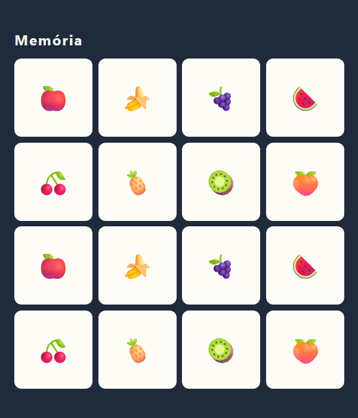
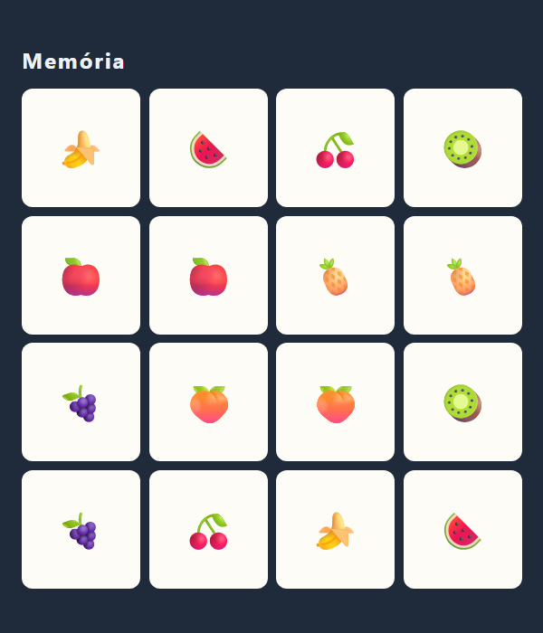
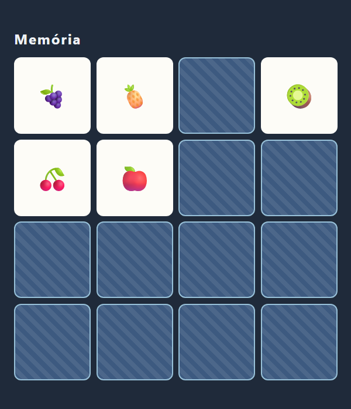
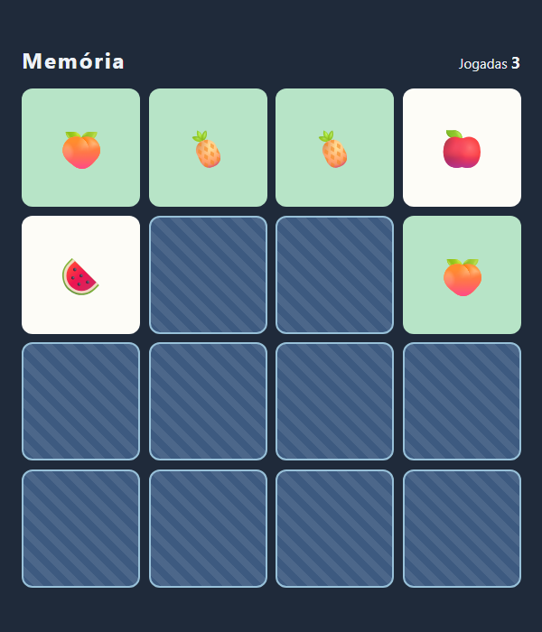

> Cartas viradas, pares e tempo. O que este projeto ensina de verdade é lidar com o intervalo entre duas ações: os 800 milissegundos em que duas cartas erradas ficam à mostra antes de desvirar. É nesse intervalo que quase todo mundo cria um bug. Este é o passo a passo que eu seguiria — com uma etapa que reproduz esses bugs de propósito, e medições reais de um erro de embaralhamento que parece certo.

## O QUE VOCÊ PRECISA
- VS Code, com a extensão *Live Server* (opcional).
- Um navegador atual.
- A oficina da Forca ajuda: a ideia de montar os botões uma vez e só atualizá-los volta aqui, com um motivo novo.

## ANTES DE ESCREVER A PRIMEIRA LINHA
Crie uma pasta chamada `memoria` e abra-a no VS Code (*Arquivo → Abrir Pasta*). Dentro dela, crie estes arquivos vazios:

~~~arvore
memoria/
├── index.html
├── estilo.css
└── app.js
~~~
Três arquivos. O HTML ganha o placar na etapa 4 e os controles na etapa 5.

### 1. O tabuleiro
Dezesseis cartas geradas a partir de oito símbolos, cada uma com frente e verso.
O HTML tem só o container. Quem cria as cartas é o JavaScript, a partir de uma lista — assim a grade de 6 × 6 da etapa 5 vai ser uma mudança de número, não de HTML.

~~~arquivo index.html
<!DOCTYPE html>
<html lang="pt-BR">
<head>
    <meta charset="UTF-8">
    <meta name="viewport" content="width=device-width, initial-scale=1.0">
    <title>Jogo da Memória</title>
    <link rel="stylesheet" href="estilo.css">
</head>
<body>
    <main class="memoria">
        

            <h1>Memória</h1>
        

        

    </main>

    
</body>
</html>
~~~
O CSS entra inteiro, inclusive o giro 3D e o placar, que só são usados mais adiante.

~~~arquivo estilo.css
* {
    box-sizing: border-box;
    margin: 0;
    padding: 0;
}

[hidden] { display: none !important; }

body {
    min-height: 100vh;
    display: grid;
    place-items: center;
    padding: 24px;
    background: #1f2a3a;
    color: #eef2f7;
    font-family: 'Segoe UI', system-ui, sans-serif;
}

.memoria { width: min(560px, 100%); }
.topo {
    display: flex;
    flex-wrap: wrap;
    align-items: baseline;
    justify-content: space-between;
    gap: 12px;
    margin-bottom: 16px;
}

h1 { font-size: 24px; letter-spacing: .08em; }

.placar {
    display: flex;
    gap: 18px;
    font-size: 15px;
    font-variant-numeric: tabular-nums;
}
.placar b { font-size: 18px; }

.controles {
    display: flex;
    align-items: center;
    gap: 10px;
    margin-bottom: 16px;
    font-size: 15px;
}
select, .novo {
    padding: 6px 12px;
    border: 0;
    border-radius: 8px;
    font: inherit;
}
.novo { background: #ffb703; color: #1f2a3a; font-weight: 600; cursor: pointer; }

/* O número de colunas vem do JavaScript, pela variável --lado. */
.tabuleiro {
    display: grid;
    grid-template-columns: repeat(var(--lado, 4), 1fr);
    gap: 10px;
}

/* A carta gira inteira, e as duas faces giram junto com ela. */
.carta {
    position: relative;
    aspect-ratio: 1;
    padding: 0;
    border: 0;
    background: none;
    cursor: pointer;
    transform: perspective(600px) rotateY(0deg);
    transform-style: preserve-3d;
    transition: transform .45s;
}
.carta.virada,
.carta.achada   { transform: perspective(600px) rotateY(180deg); }
.carta:disabled { cursor: default; }
.carta:focus-visible { outline: 3px solid #ffb703; outline-offset: 3px; border-radius: 12px; }
/* As duas faces ocupam o mesmo lugar. backface-visibility esconde a
   que está de costas para quem olha. */
.face {
    position: absolute;
    inset: 0;
    display: grid;
    place-items: center;
    border-radius: 12px;
    backface-visibility: hidden;
}
.verso {
    border: 2px solid #98c1d9;
    background: #3d5a80 repeating-linear-gradient(45deg, transparent 0 8px, rgba(255, 255, 255, .08) 
8px 16px);
}
.frente {
    transform: rotateY(180deg);   /* já nasce de costas */
    background: #fdfcf7;
    color: #1f2a3a;               /* botão desabilitado desbota o texto herdado — e o emoji junto */
    font-size: clamp(22px, 7vw, 44px);
}
.achada .frente { background: #b7e4c7; }

.aviso {
    margin-top: 18px;
    padding: 14px 16px;
    border-radius: 12px;
    background: #b7e4c7;
    color: #1b4332;
    font-size: 17px;
    text-align: center;
}
~~~

~~~arquivo app.js
const tabuleiro = document.getElementById('tabuleiro');
/* Cada símbolo tem um nome: é o que o leitor de tela anuncia. */
const SIMBOLOS = [
~~~
`['` 🍎 `', 'maçã'], ['` 🍌 `', 'banana'], ['` 🍇 `', 'uva'], ['` 🍉 `', 'melancia'],`
`['` 🍒 `', 'cereja'], ['` 🍍 `', 'abacaxi'], ['` 🥝 `', 'kiwi'], ['` 🍑 `', 'pêssego'],`

~~~codigo
];
/* Cada símbolo entra duas vezes: são os pares. */
const cartas = [...SIMBOLOS, ...SIMBOLOS].map(([emoji, nome]) => ({ emoji, nome }));
function montarTabuleiro() {
    tabuleiro.replaceChildren();
    cartas.forEach((carta, indice) => {
        const botao = document.createElement('button');
        botao.className = 'carta virada';          // por enquanto, todas de face para cima
        botao.dataset.indice = indice;
        botao.setAttribute('aria-label', carta.nome);
        const verso = document.createElement('span');
        verso.className = 'face verso';
        const frente = document.createElement('span');
        frente.className = 'face frente';
        frente.textContent = carta.emoji;
        botao.append(verso, frente);
        tabuleiro.append(botao);
    });
}
montarTabuleiro();
~~~

#### Os dados vêm antes da tela

~~~codigo
const cartas = [...SIMBOLOS, ...SIMBOLOS].map(([emoji, nome]) => ({ emoji, nome }));
~~~
`[...SIMBOLOS, ...SIMBOLOS]` junta a lista com ela mesma: cada símbolo aparece duas vezes, e são os pares. O `map` transforma cada `['` 🍎 `', 'maçã']` num objeto `{ emoji, nome }`. A partir da etapa 3, esse objeto ganha `virada` e `achada` — e o jogo inteiro passa a ser esse array. O nome existe para o `aria-label`: um leitor de tela anuncia “maçã” em vez de tentar descrever o emoji.

#### Frente e verso no mesmo lugar

~~~codigo
.carta.virada,
.carta.achada   { transform: perspective(600px) rotateY(180deg); }

.face {
    position: absolute;
    inset: 0;
    display: grid;
    place-items: center;
    border-radius: 12px;
    backface-visibility: hidden;
}

.frente {
    transform: rotateY(180deg);   /* já nasce de costas */
    background: #fdfcf7;
    color: #1f2a3a;               /* botão desabilitado desbota o texto herdado — e o emoji 
junto */
    font-size: clamp(22px, 7vw, 44px);
}
~~~
As duas faces são `position: absolute` com `inset: 0`: ocupam exatamente o mesmo espaço dentro do botão. A frente já nasce girada 180°, de costas para quem olha, e `backface-visibility: hidden` esconde qualquer face que esteja de costas. Então, parada, só o verso aparece. Virar a carta é girar o botão inteiro 180°. As faces giram junto: o verso fica de costas (some) e a frente fica de frente (aparece). A animação sai de graça, da `transition` no `transform`. Nenhuma linha de JavaScript mexe em ângulo.

#### `perspective(600px)` dentro do transform de cada carta
A perspectiva é o que faz o giro parecer 3D em vez de a carta só encolher e esticar. Colocada no container da grade, ela teria um único ponto de fuga para o tabuleiro inteiro, e as cartas das bordas girariam tortas. Dentro do `transform` de cada carta, cada uma tem o próprio ponto de fuga no centro — e aparece nos dois estados ( `rotateY(0deg)` e `rotateY(180deg)`) para que a transição tenha como interpolar.

!confira 16 cartas em 4 colunas, todas mostrando o emoji, cada fruta duas vezes seguidas.

### 2. Embaralhar do jeito certo
Fisher-Yates — e a medição do jeito errado mais famoso da internet.
Uma função nova, e a criação das cartas passa a embaralhar antes:

~~~codigo
function embaralhar(lista) {
    const copia = [...lista];
    for (let i = copia.length - 1; i > 0; i--) {
        const j = Math.floor(Math.random() * (i + 1));
        [copia[i], copia[j]] = [copia[j], copia[i]];
    }
    return copia;
}

const cartas = embaralhar([...SIMBOLOS, ...SIMBOLOS])
    .map(([emoji, nome]) => ({ emoji, nome }));
~~~

#### Como o Fisher-Yates funciona
Ele anda do fim da lista para o começo. Na posição `i`, sorteia uma posição `j` entre 0 e `i` — incluindo a própria `i` — e troca as duas. Depois disso, a posição `i` está decidida e nunca mais é tocada. Na última posição, qualquer uma das 16 cartas pode cair, com a mesma chance. Na penúltima, qualquer uma das 15 que sobraram. E assim por diante. O resultado é que toda ordem possível tem exatamente a mesma probabilidade. A troca `[a, b] = [b, a]` é desestruturação: troca dois valores sem variável auxiliar. E a função trabalha numa cópia ( `[...lista]`). Conferi que a lista original continua intacta depois de embaralhar.

#### O jeito errado, medido

~~~codigo
lista.sort(() => Math.random() - 0.5)   // parece embaralhar. Não embaralha.
~~~
Essa linha aparece em resposta de fórum há anos. Em vez de discutir, medi: embaralhei uma lista de 16 cartas 16.000 vezes com cada método e contei em que posição a carta 0 foi parar. Se o embaralhamento for justo, cada posição deve receber cerca de 1.000.

| ONDE A CARTA 0 CAIU | FISHER-YATES | SORT ALEATÓRIO |
|---|---|---|
| Posição 0 | 1.047 | 4.508 |
| Posição 1 | 989 | 4.451 |
| Posição 2 | 970 | 3.122 |
| Posição 3 | 1.037 | 1.672 |
| Posições 8 a 15 (somadas) | 7.940 | 405 |
| Menor e maior contagem | 919 a 1.047 | 34 a 4.508 |
O Fisher-Yates ficou perto de 1.000 em todas as posições. O `sort` deixou a primeira carta nas duas primeiras posições em 56% das vezes, quando o justo seria 12,5% — e ela quase nunca chegou à segunda metade do tabuleiro. Num jogo da memória, isso quer dizer que quem joga muito começa a acertar de onde as cartas saíram. Por quê: `sort` foi feito para uma função que compara de forma coerente (se A < B e B < C, então A < C). Respondendo aleatoriamente, você quebra essa premissa, e o resultado passa a depender de como o algoritmo por dentro percorre a lista. A especificação da linguagem nem define o que acontece com um comparador incoerente — cada navegador pode distorcer de um jeito. Os números acima são de uma rodada de medição no Chrome.

!confira recarregue algumas vezes: a ordem muda e cada fruta continua aparecendo exatamente duas vezes.

### 3. Virar e comparar — do jeito ingênuo
Clique vira a carta; a segunda carta decide se é par. Funciona, e tem dois bugs.
Como no Pomodoro, esta etapa tem bugs de propósito. É o código que sai naturalmente na primeira tentativa, e os dois defeitos dele são exatamente os dois primeiros critérios da oficina.

~~~arquivo app.js
const tabuleiro = document.getElementById('tabuleiro');
const SIMBOLOS = [
~~~
`['` 🍎 `', 'maçã'], ['` 🍌 `', 'banana'], ['` 🍇 `', 'uva'], ['` 🍉 `', 'melancia'],`
`['` 🍒 `', 'cereja'], ['` 🍍 `', 'abacaxi'], ['` 🥝 `', 'kiwi'], ['` 🍑 `', 'pêssego'],`

~~~codigo
];
const ESPERA_MS = 800;

function embaralhar(lista) {
    const copia = [...lista];
    for (let i = copia.length - 1; i > 0; i--) {
        const j = Math.floor(Math.random() * (i + 1));
        [copia[i], copia[j]] = [copia[j], copia[i]];
    }
    return copia;
}

/* Agora cada carta sabe se está virada e se já teve o par achado. */
let cartas = embaralhar([...SIMBOLOS, ...SIMBOLOS])
    .map(([emoji, nome]) => ({ emoji, nome, virada: false, achada: false }));
let primeira = null;   // índice da carta que está esperando o par

function montarTabuleiro() {
    tabuleiro.replaceChildren();
    cartas.forEach((carta, indice) => {
        const botao = document.createElement('button');
        botao.className = 'carta';
        botao.dataset.indice = indice;

        const verso = document.createElement('span');
        verso.className = 'face verso';

        const frente = document.createElement('span');
        frente.className = 'face frente';
        frente.textContent = carta.emoji;

        botao.append(verso, frente);
        tabuleiro.append(botao);
    });
}

/* Os botões não são recriados: se fossem, a animação de virar não
   aconteceria — um elemento novo já nasce no estado final. */
function desenhar() {
    cartas.forEach((carta, i) => {
        const botao = tabuleiro.children[i];
        const aMostra = carta.virada || carta.achada;
        botao.classList.toggle('virada', carta.virada);
        botao.classList.toggle('achada', carta.achada);
        botao.disabled = carta.achada;
        botao.setAttribute('aria-label', aMostra ? carta.nome : 'Carta virada para baixo');
    });
}

/* Versão ingênua — tem dois bugs. A etapa 4 existe por causa deles. */
function virar(indice) {
    const carta = cartas[indice];
    if (carta.achada) return;

    carta.virada = true;

    if (primeira === null) {
        primeira = indice;
        desenhar();
        return;
    }

    const outra = cartas[primeira];
    primeira = null;

    if (outra.emoji === carta.emoji) {
        outra.achada = true;
        carta.achada = true;
    } else {
        setTimeout(() => {
            outra.virada = false;
            carta.virada = false;
            desenhar();
        }, ESPERA_MS);
    }
    desenhar();
}

tabuleiro.addEventListener('click', (evento) => {
    const botao = evento.target.closest('.carta');
    if (botao) virar(Number(botao.dataset.indice));
});

montarTabuleiro();
desenhar();
~~~

#### Os botões nunca são recriados — e agora o motivo é visual
Na Forca, recriar o teclado fazia o foco se perder. Aqui há um motivo a mais: a animação. Uma transição CSS acontece quando uma propriedade muda num elemento que já existe. Um botão recém- criado já com a classe `virada` nasce girado, sem animação nenhuma. Por isso `montarTabuleiro()` roda uma vez e `desenhar()` só liga e desliga classes nos botões que já estão lá.

#### Bug 1: cinco cliques rápidos viram cinco cartas
A primeira jogada errada agenda o desvirar para daqui a 800 ms — e devolve o controle imediatamente. Nada impede o terceiro clique: ele simplesmente começa uma jogada nova, com as duas cartas anteriores ainda à mostra. Cliquei em cinco cartas diferentes em sequência e contei: cinco viradas ao mesmo tempo. Com tempo suficiente, a pessoa vê meio tabuleiro de uma vez.

#### Bug 2: a mesma carta duas vezes vira par
Clique na carta, clique *nela mesma* de novo. A segunda chamada encontra `primeira` preenchida, compara a carta com ela mesma — e, claro, o emoji é igual. Testei: a carta ficou marcada como achada sozinha, e o par verdadeiro dela ficou órfão. Esse jogo nunca mais termina, porque a outra carta não tem com quem formar par.

!confira reproduza os dois: clique rápido em várias cartas (mais de duas viram) e clique duas vezes na mesma carta (ela fica verde sozinha). A próxima etapa corrige os dois com uma linha.

### 4. A trava
Três guardas numa linha, e um contador de jogadas.
No HTML, o placar entra no topo:

~~~arquivo index.html (trecho novo)

    Jogadas <b id="jogadas">0</b>

~~~
No `app.js`, duas variáveis novas no estado e a função `virar()` corrigida. O resto é igual à etapa 3, mais a linha `campoJogadas.textContent = jogadas;` no fim de `desenhar()`.

~~~codigo
let travado = false;   // ligado nos 800 ms em que duas cartas erradas ficam à mostra
let jogadas = 0;       // uma jogada = duas cartas viradas
~~~

~~~arquivo app.js — virar()
function virar(indice) {
    const carta = cartas[indice];

    // As três guardas: esperando desvirar, carta já à mostra, par já achado.
    if (travado || carta.virada || carta.achada) return;

    carta.virada = true;

    if (primeira === null) {
        primeira = indice;
        desenhar();
        return;
    }

    const outra = cartas[primeira];
    primeira = null;
    jogadas++;

    if (outra.emoji === carta.emoji) {
        outra.achada = true;
        carta.achada = true;
    } else {
        travado = true;
        setTimeout(() => {
            outra.virada = false;
            carta.virada = false;
            travado = false;
            desenhar();
        }, ESPERA_MS);
    }
    desenhar();
}
~~~

#### Uma linha, três bugs a menos

~~~codigo
    if (travado || carta.virada || carta.achada) return;
~~~
Cada condição fecha uma porta:
- `travado` — há duas cartas erradas esperando para desvirar. É o bug 1.
- `carta.virada` — esta carta já está à mostra, inclusive se for a primeira da jogada. É o bug 2.
- `carta.achada` — o par já foi formado.
Refiz as medições da etapa 3 com essa versão: cinco cliques rápidos viraram duas cartas; a mesma carta duas vezes não formou par nem contou jogada; clicar numa carta achada não mudou nada.

#### `travado` é o estado do intervalo
O jogo tem um momento em que ele está esperando *o próprio relógio*, e não o jogador. O jeito de representar isso é uma variável que existe só para esse intervalo: liga quando o `setTimeout` é agendado, desliga dentro dele. Todo jogo com animação ou espera tem um momento assim — no Breakout vai ser a bola voltando ao centro, numa API vai ser a requisição a caminho.

#### Uma jogada é um par de cliques
`jogadas++` fica depois do `if (primeira === null)`: só conta quando a segunda carta vira. E como a guarda impede cliques inválidos antes de chegar ali, o contador bate com o que a pessoa realmente fez.

!confira clique rápido em cinco cartas: só duas viram. Clique duas vezes na mesma: nada. O contador soma um a cada duas cartas.

### 5. Vitória, tempo, recorde e tamanhos
Fechar a partida, medir o tempo direito, guardar o melhor — e o bug que só aparece ao começar outra partida rápido.
O topo ganha tempo e recorde; abaixo dele, a escolha de tamanho e o botão de novo jogo:

~~~arquivo index.html (trecho novo)
    

        Jogadas <b id="jogadas">0</b>
        Tempo <b id="tempo">0:00</b>
        Recorde <b id="recorde">—</b>
    

    <label for="nivel">Tamanho</label>
    <select id="nivel">
        <option value="4">4 × 4 (8 pares)</option>
        <option value="6">6 × 6 (18 pares)</option>
    </select>
    <button class="novo" id="novo">Novo jogo</button>

~~~

~~~arquivo app.js
const tabuleiro = document.getElementById('tabuleiro');
const campoJogadas = document.getElementById('jogadas');
const campoTempo = document.getElementById('tempo');
const campoRecorde = document.getElementById('recorde');
const seletorNivel = document.getElementById('nivel');
const botaoNovo = document.getElementById('novo');
const aviso = document.getElementById('aviso');

/* Dezoito símbolos: o bastante para a grade de 6 × 6. */
const SIMBOLOS = [
~~~
`['` 🍎 `', 'maçã'], ['` 🍌 `', 'banana'], ['` 🍇 `', 'uva'], ['` 🍉 `', 'melancia'],`
`['` 🍒 `', 'cereja'], ['` 🍍 `', 'abacaxi'], ['` 🥝 `', 'kiwi'], ['` 🍑 `', 'pêssego'],`
`['` 🥕 `', 'cenoura'], ['` 🌽 `', 'milho'], ['` 🥑 `', 'abacate'], ['` 🍋 `', 'limão'],`
`['` 🍓 `', 'morango'], ['` 🥥 `', 'coco'], ['` 🍐 `', 'pera'], ['` 🍅 `', 'tomate'],`
`['` 🥭 `', 'manga'], ['` 🍆 `', 'berinjela'],`

~~~codigo
];
const ESPERA_MS = 800;
const CHAVE_RECORDE = 'memoria:recorde:';   // + lado da grade

function embaralhar(lista) {
    const copia = [...lista];
    for (let i = copia.length - 1; i > 0; i--) {
        const j = Math.floor(Math.random() * (i + 1));
        [copia[i], copia[j]] = [copia[j], copia[i]];
    }
    return copia;
}
function formatarTempo(ms) {
    const segundos = Math.floor(ms / 1000);
    return `${Math.floor(segundos / 60)}:${String(segundos % 60).padStart(2, '0')}`;
}

/* ---------------------------------------------------------------
   Recorde por tamanho de grade
   --------------------------------------------------------------- */
function lerRecorde(lado) {
    try {
        const valor = Number(localStorage.getItem(CHAVE_RECORDE + lado));
        return Number.isFinite(valor) && valor > 0 ? valor : null;
    } catch {
        return null;
    }
}

function salvarRecorde(lado, ms) {
    try {
        localStorage.setItem(CHAVE_RECORDE + lado, String(ms));
    } catch {
        // Sem armazenamento, o recorde vale só nesta aba.
    }
}

/* ---------------------------------------------------------------
   Estado da partida
   --------------------------------------------------------------- */
let lado;
let cartas;
let primeira;
let travado;
let jogadas;
let inicio;       // Date.now() do primeiro clique; null antes dele
let fim;          // Date.now() do último par; null enquanto joga
let relogio;      // setInterval que só atualiza o tempo na tela
let espera;       // setTimeout de desvirar; guardado para poder cancelar

function novoJogo() {
    clearTimeout(espera);          // um desvirar pendente da partida anterior
    clearInterval(relogio);

    lado = Number(seletorNivel.value);
    const usados = SIMBOLOS.slice(0, (lado * lado) / 2);
    cartas = embaralhar([...usados, ...usados])
        .map(([emoji, nome]) => ({ emoji, nome, virada: false, achada: false }));

    primeira = null;
    travado = false;
    jogadas = 0;
    inicio = null;
    fim = null;
    relogio = null;
    espera = null;
    aviso.hidden = true;

    montarTabuleiro();
    desenhar();
}

function montarTabuleiro() {
    tabuleiro.style.setProperty('--lado', lado);
    tabuleiro.replaceChildren();
    cartas.forEach((carta, indice) => {
        const botao = document.createElement('button');
        botao.className = 'carta';
        botao.dataset.indice = indice;

        const verso = document.createElement('span');
        verso.className = 'face verso';

        const frente = document.createElement('span');
        frente.className = 'face frente';
        frente.textContent = carta.emoji;

        botao.append(verso, frente);
        tabuleiro.append(botao);
    });
}

function tempoDecorrido() {
    if (inicio === null) return 0;
    return (fim ?? Date.now()) - inicio;
}

function desenhar() {
    cartas.forEach((carta, i) => {
        const botao = tabuleiro.children[i];
        const aMostra = carta.virada || carta.achada;
        botao.classList.toggle('virada', carta.virada);
        botao.classList.toggle('achada', carta.achada);
        botao.disabled = carta.achada;
        botao.setAttribute('aria-label', aMostra ? carta.nome : 'Carta virada para baixo');
    });

    const recorde = lerRecorde(lado);
    campoJogadas.textContent = jogadas;
    campoTempo.textContent = formatarTempo(tempoDecorrido());
    campoRecorde.textContent = recorde === null ? '—' : formatarTempo(recorde);
}

/* ---------------------------------------------------------------
   Jogada
   --------------------------------------------------------------- */
function virar(indice) {
    const carta = cartas[indice];
    if (travado || carta.virada || carta.achada) return;

    if (inicio === null) {
        inicio = Date.now();
        relogio = setInterval(desenhar, 250);
    }

    carta.virada = true;

    if (primeira === null) {
        primeira = indice;
        desenhar();
        return;
    }

    const outra = cartas[primeira];
    primeira = null;
    jogadas++;

    if (outra.emoji === carta.emoji) {
        outra.achada = true;
        carta.achada = true;
        if (cartas.every((c) => c.achada)) terminar();
    } else {
        travado = true;
        espera = setTimeout(() => {
            outra.virada = false;
            carta.virada = false;
            travado = false;
            espera = null;
            desenhar();
        }, ESPERA_MS);
    }
    desenhar();
}

function terminar() {
    fim = Date.now();
    clearInterval(relogio);
    relogio = null;

    const duracao = tempoDecorrido();
    const anterior = lerRecorde(lado);
    const novoRecorde = anterior === null || duracao < anterior;
    if (novoRecorde) salvarRecorde(lado, duracao);

    aviso.textContent = `Você achou os ${cartas.length / 2} pares em ${jogadas} jogadas `
                      + `e ${formatarTempo(duracao)}.` + (novoRecorde ? ' Novo recorde!' : '');
    aviso.hidden = false;
    botaoNovo.focus();
}

tabuleiro.addEventListener('click', (evento) => {
    const botao = evento.target.closest('.carta');
    if (botao) virar(Number(botao.dataset.indice));
});

botaoNovo.addEventListener('click', novoJogo);
seletorNivel.addEventListener('change', novoJogo);

novoJogo();
~~~

#### O tempo, com a lição do Pomodoro
O relógio não conta tiques: guarda `inicio = Date.now()` e calcula a diferença. O `setInterval` só serve para atualizar a tela. Três detalhes:
- Ele começa no primeiro clique, não ao carregar — senão o tempo de olhar a página conta como jogo. Conferi: três segundos depois do primeiro clique, o placar mostrava `0:03`.
- Ao terminar, `fim` congela a conta. Dois segundos depois da vitória, o tempo continuava igual.
- A vitória é calculada — `cartas.every((c) => c.achada)` —, e não um contador de pares que alguém esquece de zerar.

#### Recorde por tamanho, e desconfiado

~~~codigo
function lerRecorde(lado) {
    try {
        const valor = Number(localStorage.getItem(CHAVE_RECORDE + lado));
        return Number.isFinite(valor) && valor > 0 ? valor : null;
    } catch {
        return null;
    }
}
~~~
Cada tamanho de grade tem sua chave ( `memoria:recorde:4`, `memoria:recorde:6`): comparar um 6 × 6 com um 4 × 4 não faz sentido. O valor é guardado em milissegundos e formatado só na tela. A leitura desconfia do que encontra, como no Pomodoro: `Number(null)` dá 0 e `Number('abc')` dá `NaN` — os dois viram “sem recorde”. Testei com `'abc'` gravado à mão. E testei o óbvio que costuma quebrar: com recorde de 1 segundo salvo, uma partida mais lenta não sobrescreveu, e o aviso não falou em recorde.

#### Tamanho é um número
`SIMBOLOS.slice(0, (lado * lado) / 2)` pega 8 ou 18 símbolos, e `tabuleiro.style.setProperty('--` `lado', lado)` manda o número de colunas para o CSS, onde `repeat(var(--lado, 4), 1fr)` monta a grade. Nenhum HTML muda entre 4 × 4 e 6 × 6. Conferi o 6 × 6: 36 cartas, 18 símbolos, cada um exatamente duas vezes.

#### O bug que só aparece ao trocar de partida rápido

~~~codigo
function novoJogo() {
    clearTimeout(espera);          // um desvirar pendente da partida anterior
    clearInterval(relogio);
~~~
Imagine: você erra uma jogada (o desvirar fica agendado para 800 ms) e clica em “Novo jogo” antes disso. O `setTimeout` antigo continua agendado — ele não sabe que a partida acabou. Quando dispara, executa `travado = false` no meio da partida nova. Montei esse cenário com e sem a primeira linha:

~~~codigo
   0 ms  erro na partida 1 — desvirar agendado para 800 ms
 500 ms  Novo jogo
 600 ms  erro na partida 2 — travado até 1400 ms
 800 ms  o timeout VELHO dispara: travado = false
 850 ms  clique numa terceira carta
~~~
Sem `clearTimeout`, a terceira carta virou: três à mostra, o bug 1 de volta por outro caminho. Com ele, a terceira foi ignorada e o jogo continuava travado, como deveria. É por isso que o id do `setTimeout` é guardado em `espera`: timer que você não guarda é timer que você não consegue cancelar.

!confira termine uma partida: aviso, tempo parado, recorde no topo. F5: o recorde continua. Troque para 6 × 6: 36 cartas e recorde próprio. Erre uma jogada e clique em Novo jogo na hora — a partida nova não pode se comportar de um jeito estranho.

### ✓ Roteiro de teste
Passe por estes casos antes de considerar a oficina concluída. Eles cobrem o que costuma quebrar.

| VOCÊ FAZ | DEVE ACONTECER |
|---|---|
| Clicar rápido em cinco cartas | só duas viram |
| Clicar duas vezes na mesma carta | nada acontece, e nenhuma jogada é contada |
| Clicar numa carta de par já achado | nada acontece |
| Errar e clicar Novo jogo antes de desvirar; errar de novo e clicar numa terceira | a terceira carta não vira |
| Recarregar várias vezes | a ordem muda; cada símbolo aparece duas vezes |
| Terminar uma partida | aviso com pares, jogadas e tempo; o tempo para |
| Terminar mais devagar que o recorde | o recorde não muda |
| Bater o recorde e apertar F5 | o recorde continua no topo |
| Trocar para 6 × 6 | 36 cartas, 18 pares, recorde separado |
| Jogar só com Tab e Enter | dá para terminar a partida |

### ! Quando não funcionar
Os tropeços desta oficina, e o que procurar em cada um.

| SINTOMA | CAUSA QUASE CERTA |
|---|---|
| A carta troca de lado sem animação | Os botões estão sendo recriados a cada jogada. Monte uma vez e só troque classes. |
| O emoji das cartas achadas aparece desbotado | O botão está `disabled`, e o navegador dá a ele uma cor de texto semitransparente, que a frente herda — o emoji inclusive. Defina `color` na `.frente`. |
| As duas faces aparecem, ou o emoji sai espelhado | Falta `backface-visibility: hidden` nas faces, ou o `rotateY(180deg)` na frente. |
| Mais de duas cartas ficam viradas | Falta a variável `travado` na guarda de `virar()`. |
| Clicar duas vezes numa carta forma par | Falta `carta.virada` na guarda. |
| A partida nunca termina | Uma carta foi marcada achada sozinha (bug acima) e o par dela ficou órfão. |
| As mesmas cartas sempre perto do começo | `sort(() => Math.random() - 0.5)`. Troque por Fisher-Yates. |
| O tempo corre antes do primeiro clique | `inicio` recebe `Date.now()` ao carregar, e não na primeira jogada. |
| Depois de Novo jogo, três cartas viram | Um `setTimeout` da partida anterior destravou o jogo. Guarde o id e use `clearTimeout`. |
| O recorde some no F5, ou mistura tamanhos | A leitura não acontece ao carregar, ou a chave não inclui o tamanho da grade. |

### → Para levar adiante
Extensões em ordem de dificuldade. Todas cabem no que você já construiu.
1. Tema com imagens. Troque os emojis por imagens em `` com `alt`. O desafio é pré-carregar para a primeira virada não piscar. 2. Contra o relógio. Um limite de tempo por tamanho, usando o mesmo `Date.now()`. Perder precisa travar o tabuleiro. 3. Dois jogadores. Acertou, joga de novo; errou, passa a vez. Um placar por jogador e a vez atual destacada. 4. Som ao formar par. Reaproveite o bipe do Pomodoro, com frequências diferentes para acerto e erro.
