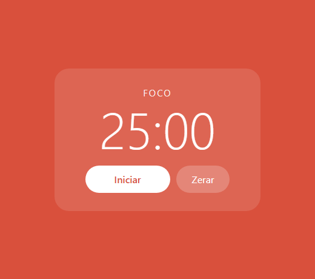
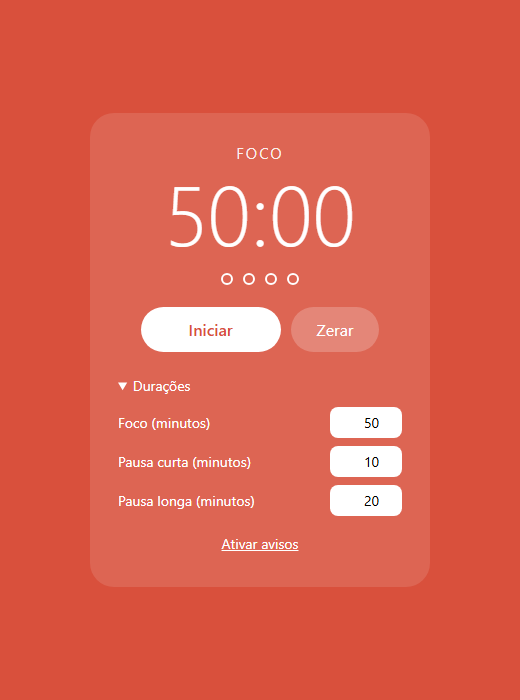

> Um temporizador que alterna 25 minutos de foco com pausas. Parece o projeto mais simples do laboratório, e é justamente por isso que ele engana: tempo é uma das coisas que mais produz bug em programa de iniciante. Este é o passo a passo que eu seguiria, e ele inclui, de propósito, uma etapa com o bug que quase todo mundo escreve — com a tela provando que ele existe — antes da versão certa.

## O QUE VOCÊ PRECISA
- VS Code, com a extensão *Live Server* (opcional, mas poupa apertar F5).
- Um navegador atual.
- Ter feito a oficina da Calculadora ajuda: a ideia de estado e de `mostrar()` volta aqui.

## ANTES DE ESCREVER A PRIMEIRA LINHA
Crie uma pasta chamada `pomodoro` e abra-a no VS Code (*Arquivo → Abrir Pasta*). Dentro dela, crie estes arquivos vazios:

~~~arvore
pomodoro/
├── index.html
├── estilo.css
└── app.js
~~~
São três arquivos até o fim. O `app.js` vai ser reescrito algumas vezes — é o esperado.

### 1. O mostrador parado
Estrutura, visual e a primeira função: transformar segundos em relógio.
Começo pelo que não se move. Um cronômetro parado mostrando `25:00` já exige decidir a coisa mais importante do projeto: em que unidade o programa pensa.

~~~arquivo index.html
<!DOCTYPE html>
<html lang="pt-BR">
<head>
    <meta charset="UTF-8">
    <meta name="viewport" content="width=device-width, initial-scale=1.0">
    <title>Pomodoro</title>
    <link rel="stylesheet" href="estilo.css">
</head>
<body data-fase="foco">
    <main class="pomodoro">
        
Foco

        <output class="mostrador" id="mostrador">25:00</output>

        

            <button class="principal" id="principal">Iniciar</button>
            <button class="secundario" id="zerar">Zerar</button>
        

    </main>

    
</body>
</html>
~~~
O CSS vai inteiro agora, incluindo as bolinhas de ciclo e o painel de configuração que só aparecem nas etapas 4 e 5. Assim ele não precisa ser reimpresso a cada etapa; regra de CSS para um elemento que ainda não existe simplesmente não faz nada.

~~~arquivo estilo.css
* {
    box-sizing: border-box;
    margin: 0;
    padding: 0;
}

/* Uma variável de cor por fase. O JavaScript só troca o data-fase
   do <body>; a cor da página inteira acompanha sozinha. */
:root                  { --cor: #d9503c; }
body[data-fase="curta"] { --cor: #2b9270; }
body[data-fase="longa"] { --cor: #3570c0; }

body {
    min-height: 100vh;
    display: grid;
    place-items: center;
    background: var(--cor);
    color: #fff;
    font-family: 'Segoe UI', system-ui, sans-serif;
    transition: background .6s;
}

.pomodoro {
    width: 340px;
    padding: 30px 28px;
    text-align: center;
    background: rgba(255, 255, 255, .12);
    border-radius: 24px;
}

.fase {
    font-size: 15px;
    letter-spacing: .14em;
    text-transform: uppercase;
    opacity: .9;
}

/* tabular-nums: todo algarismo com a mesma largura. Sem isso o
   relógio "treme" de lado quando 1 vira 0 (o 1 é mais estreito). */
.mostrador {
    display: block;
    margin: 6px 0 20px;
    font-size: 84px;
    font-weight: 300;
    line-height: 1;
    font-variant-numeric: tabular-nums;
}

.ciclos {
    display: flex;
    justify-content: center;
    gap: 10px;
    margin-bottom: 22px;
    list-style: none;
}
.ciclos li {
    width: 12px;
    height: 12px;
    border: 2px solid #fff;
    border-radius: 50%;
}
.ciclos li.feito { background: #fff; }

.controles {
    display: flex;
    justify-content: center;
    gap: 10px;
}

button {
    padding: 12px 26px;
    border: 0;
    border-radius: 999px;
    font: inherit;
    font-size: 16px;
    cursor: pointer;
}
.principal  { min-width: 140px; background: #fff; color: var(--cor); font-weight: 600; }
.secundario { background: rgba(255, 255, 255, .22); color: #fff; }

.config { margin-top: 24px; text-align: left; font-size: 14px; }
.config summary { cursor: pointer; }
.config form {
    display: grid;
    grid-template-columns: 1fr auto;
    gap: 8px 12px;
    align-items: center;
    margin-top: 12px;
}
.config input {
    width: 72px;
    padding: 6px 8px;
    border: 0;
    border-radius: 8px;
    font: inherit;
    text-align: right;
}

.avisos {
    margin-top: 14px;
    padding: 4px;
    background: none;
    color: #fff;
    font-size: 14px;
    text-decoration: underline;
}
.avisos:disabled { text-decoration: none; opacity: .8; cursor: default; }
~~~

~~~arquivo app.js
const mostrador = document.getElementById('mostrador');
/* O programa inteiro pensa em segundos. Só esta função sabe que
   existe um formato de relógio. */
function formatar(segundos) {
    const minutos = Math.floor(segundos / 60);
    const resto = segundos % 60;
    return String(minutos).padStart(2, '0') + ':' + String(resto).padStart(2, '0');
}
mostrador.textContent = formatar(25 * 60);
~~~

#### O programa pensa em segundos; o relógio é só apresentação
Seria tentador guardar o texto `"25:00"`. Mas o cronômetro precisa subtrair, comparar com zero, somar durações — e nada disso se faz com texto. Então o estado é um número, e `formatar()` é a única função que sabe que minutos e segundos existem. É a mesma divisão da calculadora (o visor fala vírgula, a conta fala ponto): o dado tem uma forma, a tela tem outra, e a tradução mora num lugar só.

#### `Math.floor`, `%` e `padStart`

~~~codigo
Math.floor(3599 / 60)   // 59  — minutos inteiros
3599 % 60               // 59  — o que sobra são os segundos
String(5).padStart(2, '0')  // "05"
~~~
`%` é o resto da divisão: é ele que separa os segundos que não completam um minuto. `padStart(2,` `'0')` completa com zero à esquerda até ter dois caracteres — sem ele, 65 segundos virariam `1:5`. Teste agora, antes de seguir. Abra o console (F12) e digite os casos da borda: `formatar(0)`, `formatar(59)`, `formatar(60)`, `formatar(3599)`. Devem dar `00:00`, `00:59`, `01:00` e `59:59`. Função pequena testada nas bordas não te surpreende depois.

~~~codigo
font-variant-numeric: tabular-nums
~~~
Na maioria das fontes o `1` é mais estreito que o `0`. Num relógio que muda todo segundo, isso faz o número inteiro dançar para os lados. `tabular-nums` dá a todos os algarismos a mesma largura. Uma linha, e o mostrador fica parado no lugar.

#### A cor mora no CSS, a fase mora no JavaScript
O `<body>` tem `data-fase="foco"`, e o CSS define `--cor` diferente para cada fase. Na etapa 4 o JavaScript só vai trocar esse atributo — fundo, botão e transição acompanham sozinhos. Nenhuma cor escrita no JavaScript.

!confira fundo vermelho, `25:00` no centro, e os quatro casos de `formatar()` certos no console.

### 2. A contagem — do jeito ingênuo
Fazer o tempo andar com setInterval. Funciona com um clique, e quebra com dois.
Esta etapa tem um bug, e ele está aqui de propósito. É o código que praticamente todo mundo escreve primeiro, e entender por que ele quebra é o que faz a etapa 3 fazer sentido.

~~~arquivo app.js
const mostrador = document.getElementById('mostrador');
const principal = document.getElementById('principal');

let restante = 25 * 60;   // segundos que faltam

function formatar(segundos) {
    const minutos = Math.floor(segundos / 60);
    const resto = segundos % 60;
    return String(minutos).padStart(2, '0') + ':' + String(resto).padStart(2, '0');
}

function mostrar() {
    mostrador.textContent = formatar(restante);
}

/* Versão ingênua — funciona com UM clique. A etapa 3 existe
   por causa do que acontece com dois. */
principal.addEventListener('click', () => {
    const id = setInterval(() => {
        restante--;
        mostrar();
        if (restante === 0) clearInterval(id);
    }, 1000);
});

mostrar();
~~~
Com um clique, tudo certo: o tempo desce um segundo por segundo e para no zero. Agora aperte F5, clique em Iniciar três vezes e espere dez segundos. As duas telas abaixo são o mesmo código, dez segundos depois de carregar:

#### Por que o tempo passa três vezes mais rápido
`setInterval` não liga “o” cronômetro — ele cria um novo repetidor a cada chamada, e devolve um número que o identifica. Três cliques são três repetidores independentes, cada um tirando 1 de `restante` por segundo. Nada no código impede isso.

#### E o bug pior: passar do zero
Cada repetidor guarda o próprio `id` numa constante local e só se desliga quando *ele mesmo* encontra `restante === 0`. Com dois repetidores e 3 segundos faltando, eu medi o que acontece:

~~~codigo
segundo 1:  A tira 1 → 2      B tira 1 → 1
segundo 2:  A tira 1 → 0      A vê zero e se desliga
            B tira 1 → -1     B nunca viu zero — segue para sempre
~~~
Cinco segundos depois, o visor mostrava `-1:-4`. O repetidor B perdeu a única chance de ver o zero, e como o `id` dele estava numa variável local, nenhum outro código consegue desligá-lo. Trocar `=== 0` por `<= 0` esconderia o sintoma e deixaria a causa: continuariam existindo dois repetidores. A correção de verdade é garantir que só exista um.

!confira um clique conta certo; três cliques (depois de F5) contam rápido demais. Se o seu também correu, você reproduziu o bug — é isso que a próxima etapa resolve.

### 3. Pausar e continuar, do jeito certo
Um intervalo só, id guardado, e um relógio que não depende de contar tiques.
Reescrevo o `app.js` inteiro. Mudam duas ideias ao mesmo tempo, e as duas são mais importantes que o código em si.

| VARIÁVEL | O QUE GUARDA |
|---|---|
| `restanteMs` | quanto falta, em milissegundos, enquanto o cronômetro está parado |
| `alvo` | o instante exato em que o tempo acaba, enquanto está rodando |
| `intervalo` | o id do único `setInterval`; `null` quer dizer parado |
| `comecou` | se a fase já foi iniciada — decide entre “Iniciar” e “Continuar” |

~~~arquivo app.js
const mostrador = document.getElementById('mostrador');
const principal = document.getElementById('principal');
const zerar = document.getElementById('zerar');

const DURACAO_MS = 25 * 60 * 1000;

/* ---------------------------------------------------------------
   O estado. Repare que nenhuma variável conta "quantos tiques já
   passaram" — é essa ausência que torna o cronômetro preciso.
   --------------------------------------------------------------- */
let restanteMs = DURACAO_MS;  // quanto falta, enquanto está parado
let alvo = null;              // instante em que o tempo acaba, enquanto roda
let intervalo = null;         // id do setInterval; null quer dizer parado
let comecou = false;          // a fase já foi iniciada alguma vez?

function formatar(segundos) {
    const minutos = Math.floor(segundos / 60);
    const resto = segundos % 60;
    return String(minutos).padStart(2, '0') + ':' + String(resto).padStart(2, '0');
}

/* Parado: o que foi guardado. Rodando: a distância até o alvo. */
function msRestantes() {
    if (alvo === null) return restanteMs;
    return Math.max(0, alvo - Date.now());
}

function mostrar() {
    mostrador.textContent = formatar(Math.ceil(msRestantes() / 1000));
    principal.textContent = intervalo !== null ? 'Pausar'
                          : comecou            ? 'Continuar'
                          :                      'Iniciar';
}

function iniciar() {
    if (intervalo !== null) return;   // já está rodando: não cria outro
    alvo = Date.now() + restanteMs;
    intervalo = setInterval(tique, 250);
    comecou = true;
    mostrar();
}

function pausar() {
    if (intervalo === null) return;
    restanteMs = msRestantes();       // congela exatamente o que faltava
    clearInterval(intervalo);
    intervalo = null;
    alvo = null;
    mostrar();
}

function tique() {
    if (msRestantes() === 0) {
        pausar();
        return;
    }
    mostrar();
}

principal.addEventListener('click', () => {
    if (intervalo === null) iniciar();
    else pausar();
});

zerar.addEventListener('click', () => {
    pausar();
    restanteMs = DURACAO_MS;
    comecou = false;
    mostrar();
});

mostrar();
~~~

#### Ideia 1: no máximo um intervalo, sempre com o id guardado

~~~codigo
function iniciar() {
    if (intervalo !== null) return;   // já está rodando: não cria outro
    alvo = Date.now() + restanteMs;
    intervalo = setInterval(tique, 250);
    comecou = true;
    mostrar();
}
~~~
A primeira linha é a correção do bug da etapa 2. Se já existe um intervalo, não cria outro. E o id agora vive numa variável de fora da função, então `pausar()` sempre sabe qual desligar. Eu testei chamando `iniciar()` dez vezes seguidas: continuou existindo exatamente um intervalo, e dez segundos depois o visor mostrava `24:50`.

#### Ideia 2: não contar tiques — comparar com o relógio
A versão ingênua confiava que `setInterval(..., 1000)` dispara a cada 1000 ms. Não dispara. O número é um mínimo: se o navegador estiver ocupado, o tique atrasa. E navegadores reduzem de propósito os timers de abas em segundo plano para economizar bateria — justamente o caso de quem deixa o Pomodoro numa aba e vai trabalhar em outra. Cada tique atrasado num contador é tempo perdido para sempre.

~~~codigo
function msRestantes() {
    if (alvo === null) return restanteMs;
    return Math.max(0, alvo - Date.now());
}
~~~
A versão nova grava quando o tempo acaba ( `alvo`) e, a cada tique, calcula a distância até lá. Se um tique atrasar, o próximo mostra o tempo certo mesmo assim. Por isso o intervalo pode ser de 250 ms: a frequência só decide o quão rápido a tela atualiza, não a precisão.

#### Milissegundos no estado, arredondamento só na tela
Se eu pausasse guardando segundos inteiros, cada pausa jogaria fora a fração — pausar em 24:43,4 e continuar devolveria 0,4 s ao usuário. Guardando milissegundos, a pausa é exata: na prova, pausar, esperar e rodar mais 2 segundos descontou exatamente 2000 ms. E o arredondamento é `Math.ceil` (para cima) de propósito: ao iniciar, 1.499.750 ms ainda mostram `25:00`, e `00:00` só aparece quando o tempo realmente acabou.

#### Por que existe `comecou`
O botão tem três textos, e três textos precisam de estado suficiente para distingui-los. “Rodando ou não” é `intervalo`; “já começou ou não” precisa de outra variável. Deduzir isso comparando `restanteMs` com a duração funciona até o dia em que a duração muda no meio — que é exatamente o que a etapa 5 vai permitir.

!confira Iniciar, Pausar, esperar alguns segundos, Continuar: o número retoma de onde parou. Clique rápido várias vezes: a contagem nunca acelera. Zerar volta a `25:00` e “Iniciar”.

### 4. Ciclos de foco e pausa
Ao terminar o foco, a pausa entra sozinha. A cada quatro focos, a pausa é longa.
Agora o cronômetro precisa lembrar em que fase está e quantos focos já fez. No HTML, entram as quatro bolinhas logo abaixo do mostrador:

~~~arquivo index.html (trecho novo)
<ol class="ciclos" id="ciclos" aria-label="Focos concluídos neste ciclo">
    <li></li><li></li><li></li><li></li>
</ol>
~~~

~~~arquivo app.js
const mostrador = document.getElementById('mostrador');
const principal = document.getElementById('principal');
const zerar = document.getElementById('zerar');
const rotulo = document.getElementById('fase');
const bolinhas = document.querySelectorAll('#ciclos li');

const DURACOES = { foco: 25, curta: 5, longa: 15 };   // em minutos
const NOMES = { foco: 'Foco', curta: 'Pausa curta', longa: 'Pausa longa' };

let fase = 'foco';
let focosFeitos = 0;          // quantos focos já terminaram, no total
let restanteMs = duracaoMs(fase);
let alvo = null;
let intervalo = null;
let comecou = false;

function duracaoMs(qual) {
    return DURACOES[qual] * 60 * 1000;
}

function formatar(segundos) {
    const minutos = Math.floor(segundos / 60);
    const resto = segundos % 60;
    return String(minutos).padStart(2, '0') + ':' + String(resto).padStart(2, '0');
}

function msRestantes() {
    if (alvo === null) return restanteMs;
    return Math.max(0, alvo - Date.now());
}

function mostrar() {
    const tempo = formatar(Math.ceil(msRestantes() / 1000));

    mostrador.textContent = tempo;
    rotulo.textContent = NOMES[fase];
    document.body.dataset.fase = fase;           // o CSS troca a cor
    document.title = `${tempo} · ${NOMES[fase]}`;
    // Na pausa longa as quatro ficam cheias; fora dela, o resto da divisão.
    const cheias = fase === 'longa' ? 4 : focosFeitos % 4;
    bolinhas.forEach((b, i) => b.classList.toggle('feito', i < cheias));

    principal.textContent = intervalo !== null ? 'Pausar'
                          : comecou            ? 'Continuar'
                          :                      'Iniciar';
}

function iniciar() {
    if (intervalo !== null) return;
    alvo = Date.now() + restanteMs;
    intervalo = setInterval(tique, 250);
    comecou = true;
    mostrar();
}

function pausar() {
    if (intervalo === null) return;
    restanteMs = msRestantes();
    clearInterval(intervalo);
    intervalo = null;
    alvo = null;
    mostrar();
}

function tique() {
    if (msRestantes() === 0) {
        terminarFase();
        return;
    }
    mostrar();
}

/* A virada: decide a próxima fase e já a coloca para rodar. */
function terminarFase() {
    pausar();

    if (fase === 'foco') {
        focosFeitos++;
        fase = focosFeitos % 4 === 0 ? 'longa' : 'curta';
    } else {
        fase = 'foco';
    }

    restanteMs = duracaoMs(fase);
    comecou = false;
    iniciar();
}

principal.addEventListener('click', () => {
    if (intervalo === null) iniciar();
    else pausar();
});

zerar.addEventListener('click', () => {
    pausar();
    restanteMs = duracaoMs(fase);
    comecou = false;
    mostrar();
});

mostrar();
~~~

#### `terminarFase()` é o único lugar que decide a sequência

~~~codigo
if (fase === 'foco') {
    focosFeitos++;
    fase = focosFeitos % 4 === 0 ? 'longa' : 'curta';
} else {
    fase = 'foco';
}

restanteMs = duracaoMs(fase);
~~~
`focosFeitos % 4 === 0` é verdadeiro no 4.º, 8.º, 12.º foco — o resto da divisão por 4 volta a zero a cada quatro. Rodei a virada oito vezes seguidas e a sequência saiu exatamente curta, foco, curta, foco, curta, foco, longa, foco.

#### Agora a guarda da etapa 3 trabalha de verdade
Até aqui, `iniciar()` só era chamado por clique. Agora `terminarFase()` chama `iniciar()` sozinho, sem ninguém clicar. Cada caminho novo que cria intervalo é uma chance nova de criar dois. A guarda cobre todos: depois das oito viradas seguidas da prova, continuava existindo exatamente um intervalo vivo.

#### Uma função que atualiza tudo
`mostrar()` agora mexe em cinco coisas: mostrador, nome da fase, cor, título da aba e bolinhas. Nenhuma outra função toca na tela. Por isso `terminarFase()` só mexe no estado e confia que a próxima chamada de `mostrar()` deixa tudo coerente. O título da aba ( `24:12 · Foco`) é o detalhe que torna o Pomodoro usável: dá para acompanhar o tempo com a aba em segundo plano.

#### Como testar sem esperar 25 minutos
Variáveis e funções declaradas no topo do `app.js` ficam acessíveis pelo console. Então, em vez de esperar:

~~~codigo
terminarFase()          // pula para a próxima fase agora
restanteMs = 3000        // e depois clique em Iniciar: 3 segundos
~~~
Chame `terminarFase()` sete vezes e você chega na pausa longa. É o tipo de atalho que qualquer programador usa para testar código que depende de tempo.

!confira `terminarFase()` no console troca a fase e a cor; sete vezes chegam na pausa longa com quatro bolinhas; o título da aba mostra tempo e fase.

### 5. Aviso e configuração
Som e notificação na virada, e durações que o usuário escolhe e que sobrevivem ao F5.
Duas funcionalidades que parecem simples e que têm, cada uma, uma regra do navegador que derruba quem não conhece. No HTML, entram o painel de durações e o botão de avisos:

~~~arquivo index.html (trecho novo)

    
Durações

    <form id="config">
        <label for="d-foco">Foco (minutos)</label>
        <input id="d-foco" name="foco" type="number" min="1" max="180" required>

        <label for="d-curta">Pausa curta (minutos)</label>
        <input id="d-curta" name="curta" type="number" min="1" max="180" required>

        <label for="d-longa">Pausa longa (minutos)</label>
        <input id="d-longa" name="longa" type="number" min="1" max="180" required>
    </form>

<button class="avisos" id="avisos">Ativar avisos</button>
~~~

~~~arquivo app.js
const mostrador = document.getElementById('mostrador');
const principal = document.getElementById('principal');
const zerar = document.getElementById('zerar');
const rotulo = document.getElementById('fase');
const bolinhas = document.querySelectorAll('#ciclos li');
const formulario = document.getElementById('config');
const botaoAvisos = document.getElementById('avisos');

const NOMES = { foco: 'Foco', curta: 'Pausa curta', longa: 'Pausa longa' };

/* ---------------------------------------------------------------
   Configuração salva
   --------------------------------------------------------------- */
const CHAVE = 'pomodoro:duracoes';
const PADRAO = { foco: 25, curta: 5, longa: 15 };

function valida(minutos) {
    return Number.isInteger(minutos) && minutos >= 1 && minutos <= 180;
}

function carregarDuracoes() {
    try {
        const salvo = JSON.parse(localStorage.getItem(CHAVE));
        if (salvo && ['foco', 'curta', 'longa'].every((k) => valida(salvo[k]))) {
            return { foco: salvo.foco, curta: salvo.curta, longa: salvo.longa };
        }
    } catch {
        // JSON corrompido ou armazenamento bloqueado: segue com o padrão.
    }
    return { ...PADRAO };
}

let duracoes = carregarDuracoes();

/* ---------------------------------------------------------------
   Estado do cronômetro
   --------------------------------------------------------------- */
let fase = 'foco';
let focosFeitos = 0;
let restanteMs = duracaoMs(fase);
let alvo = null;
let intervalo = null;
let comecou = false;
let audio = null;             // só pode nascer depois de um clique

function duracaoMs(qual) {
    return duracoes[qual] * 60 * 1000;
}

function formatar(segundos) {
    const minutos = Math.floor(segundos / 60);
    const resto = segundos % 60;
    return String(minutos).padStart(2, '0') + ':' + String(resto).padStart(2, '0');
}

function msRestantes() {
    if (alvo === null) return restanteMs;
    return Math.max(0, alvo - Date.now());
}

function mostrar() {
    const tempo = formatar(Math.ceil(msRestantes() / 1000));

    mostrador.textContent = tempo;
    rotulo.textContent = NOMES[fase];
    document.body.dataset.fase = fase;
    document.title = `${tempo} · ${NOMES[fase]}`;

    const cheias = fase === 'longa' ? 4 : focosFeitos % 4;
    bolinhas.forEach((b, i) => b.classList.toggle('feito', i < cheias));

    principal.textContent = intervalo !== null ? 'Pausar'
                          : comecou            ? 'Continuar'
                          :                      'Iniciar';
}

function iniciar() {
    if (intervalo !== null) return;
    alvo = Date.now() + restanteMs;
    intervalo = setInterval(tique, 250);
    comecou = true;
    mostrar();
}

function pausar() {
    if (intervalo === null) return;
    restanteMs = msRestantes();
    clearInterval(intervalo);
    intervalo = null;
    alvo = null;
    mostrar();
}

function tique() {
    if (msRestantes() === 0) {
        terminarFase();
        return;
    }
    mostrar();
}

function terminarFase() {
    pausar();

    if (fase === 'foco') {
        focosFeitos++;
        fase = focosFeitos % 4 === 0 ? 'longa' : 'curta';
    } else {
        fase = 'foco';
    }

    restanteMs = duracaoMs(fase);
    comecou = false;
    avisar();
    iniciar();
}

/* ---------------------------------------------------------------
   Avisos: som e notificação
   --------------------------------------------------------------- */
function bipe() {
    if (audio === null) return;
    const agora = audio.currentTime;
    const oscilador = audio.createOscillator();
    const volume = audio.createGain();

    oscilador.frequency.value = 880;
    volume.gain.setValueAtTime(0.25, agora);
    volume.gain.exponentialRampToValueAtTime(0.001, agora + 0.6);

    oscilador.connect(volume).connect(audio.destination);
    oscilador.start(agora);
    oscilador.stop(agora + 0.6);
}

function avisar() {
    bipe();
    if ('Notification' in window && Notification.permission === 'granted') {
        new Notification(NOMES[fase], { body: `Começou: ${duracoes[fase]} minutos.` });
    }
}

function mostrarAvisos() {
    if (!('Notification' in window)) {
        botaoAvisos.textContent = 'Este navegador não tem notificações';
        botaoAvisos.disabled = true;
        return;
    }
    const estado = Notification.permission;
    botaoAvisos.textContent = estado === 'granted' ? 'Avisos ativados'
                            : estado === 'denied'  ? 'Avisos bloqueados no navegador'
                            :                        'Ativar avisos';
    botaoAvisos.disabled = estado !== 'default';
}

botaoAvisos.addEventListener('click', async () => {
    await Notification.requestPermission();   // pedido nasce de um clique
    mostrarAvisos();
});

/* ---------------------------------------------------------------
   Controles
   --------------------------------------------------------------- */
principal.addEventListener('click', () => {
    if (audio === null) audio = new AudioContext();
    if (intervalo === null) iniciar();
    else pausar();
});

zerar.addEventListener('click', () => {
    pausar();
    restanteMs = duracaoMs(fase);
    comecou = false;
    mostrar();
});

formulario.addEventListener('change', (evento) => {
    const campo = evento.target;
    const minutos = Number(campo.value);

    if (!valida(minutos)) {
        campo.value = duracoes[campo.name];   // devolve o último valor bom
        return;
    }

    duracoes[campo.name] = minutos;
    try {
        localStorage.setItem(CHAVE, JSON.stringify(duracoes));
    } catch {
        // Sem armazenamento a configuração vale só até fechar a aba.
    }

    // Fase ainda não iniciada já assume a nova duração.
    if (campo.name === fase && !comecou) {
        restanteMs = duracaoMs(fase);
        mostrar();
    }
});

for (const campo of formulario.elements) {
    campo.value = duracoes[campo.name];
}

mostrarAvisos();
mostrar();
~~~

#### A permissão de notificação só pode nascer de um clique

~~~codigo
botaoAvisos.addEventListener('click', async () => {
    await Notification.requestPermission();   // pedido nasce de um clique
    mostrarAvisos();
});
~~~
Pedir permissão assim que a página carrega é o jeito mais rápido de levar um “Bloquear” — e bloqueio é permanente até o usuário ir nas configurações do site. O Firefox nem chega a mostrar o pedido se ele não vier de um gesto do usuário. Por isso existe um botão, e o pedido acontece dentro do clique dele.

#### O som também depende de um clique
Navegadores bloqueiam áudio que começa sem interação: um `AudioContext` criado antes de qualquer clique nasce suspenso e fica mudo. Por isso `audio` começa `null` e só é criado dentro do clique em Iniciar. A virada de fase acontece minutos depois, sem clique nenhum, mas usa o contexto que já foi liberado. O bipe é gerado, não carregado: um oscilador em 880 Hz com o volume caindo em `exponentialRampToValueAtTime`. Cortar o som de uma vez produz um estalo; a rampa evita. E ela vai até `0.001`, e não até zero, porque a rampa exponencial não aceita zero como destino.

#### Nunca confie no que está no `localStorage`

~~~codigo
function carregarDuracoes() {
    try {
        const salvo = JSON.parse(localStorage.getItem(CHAVE));
        if (salvo && ['foco', 'curta', 'longa'].every((k) => valida(salvo[k]))) {
            return { foco: salvo.foco, curta: salvo.curta, longa: salvo.longa };
        }
    } catch {
        // JSON corrompido ou armazenamento bloqueado: segue com o padrão.
    }
    return { ...PADRAO };
}
~~~
O que está salvo é texto, e qualquer um edita pelo DevTools. Três coisas podem dar errado, e testei as três: JSON corrompido ( `JSON.parse` lança erro — daí o `try/catch`), valor fora da faixa (foco de 0 minutos) e tipo errado (a string `"25"` não passa em `Number.isInteger`). Em qualquer caso, a página abre com o padrão em vez de quebrar.

#### `change`, e não `input`
`input` dispara a cada tecla: para digitar 50, o valor passaria por 5. O evento `change` só dispara quando a pessoa confirma — sai do campo, aperta Enter ou usa as setinhas. E um valor inválido (testei com 999) é recusado e o campo volta ao último valor bom, sem alert. Por fim: mudar a duração da fase que já está rodando não corta o tempo dela. A nova duração vale a partir da próxima vez que a fase começar.

!confira mude Foco para 50 — o visor mostra `50:00`; aperte F5 — continua 50; digite 999 — o campo volta para 50. Ative os avisos, rode `restanteMs = 3000` no console, clique em Iniciar e espere o bipe.

### ✓ Roteiro de teste
Passe por estes casos antes de considerar a oficina concluída. Eles cobrem o que costuma quebrar.

| VOCÊ FAZ | DEVE ACONTECER |
|---|---|
| Clicar Iniciar/Pausar dez vezes seguidas, depois deixar rodando | a contagem nunca acelera |
| Pausar, esperar um minuto, Continuar | retoma exatamente do número em que parou |
| Iniciar e ir para outra aba por dois minutos | ao voltar, os dois minutos foram descontados |
| Chegar a zero (use `restanteMs = 3000`) | bipe, e a próxima fase começa sozinha |
| `terminarFase()` sete vezes no console | pausa longa, fundo azul, quatro bolinhas |
| Olhar o título da aba com o cronômetro rodando | tempo e fase, atualizando |
| Mudar Foco para 50 e apertar F5 | continua 50 |
| Digitar 999 ou 0 numa duração | o campo volta ao valor anterior |
| Rodar | abre normal, com 25/5/15 |

~~~codigo
localStorage.setItem('pomodoro:duracoes',
~~~

!nota `'x{')` e F5

### ! Quando não funcionar
Os tropeços desta oficina, e o que procurar em cada um.

| SINTOMA | CAUSA QUASE CERTA |
|---|---|
| O tempo corre em dobro | Existe mais de um `setInterval` vivo. Falta a guarda `if (intervalo !==` `null) return;` em `iniciar()`. |
| O visor mostra coisas como `-1:-4` | Um intervalo cujo id se perdeu continua rodando. É o bug da etapa 2: o id precisa viver fora da função. |
| Pausar não pausa | `clearInterval` recebeu o id errado — ou `intervalo = null` foi feito antes do `clearInterval(intervalo)`. |
| Com a aba em segundo plano, o tempo atrasa | O código conta tiques. Compare com `Date.now()` e um `alvo`. |
| O relógio treme de lado | Falta `font-variant-numeric: tabular-nums` no mostrador. |
| Nunca toca som | O `AudioContext` foi criado fora de um clique e nasceu suspenso. |
| A configuração some no F5 | Grava mas não lê ao carregar — ou gravou o objeto sem `JSON.stringify` e salvou `"[object Object]"`. |
| A página não abre e o console fala de JSON | `JSON.parse` sem `try/catch` encontrou um valor corrompido. |

### → Para levar adiante
Extensões em ordem de dificuldade. Todas cabem no que você já construiu.
1. Anel de progresso. Um círculo SVG cujo `stroke-dashoffset` acompanha `msRestantes()`. Exercita SVG e proporção. 2. Atalho de teclado. Espaço inicia e pausa. O cuidado: não disparar enquanto o foco está num campo de duração. 3. Histórico do dia. Guarde cada foco concluído com data em formato ISO e mostre quantos foram hoje. 4. Proteger o foco. Use `beforeunload` para confirmar antes de fechar a aba — só durante um foco, nunca na pausa.
