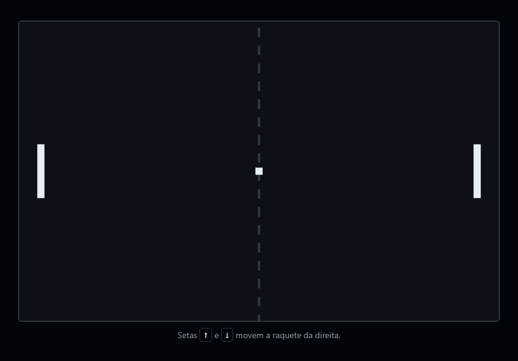
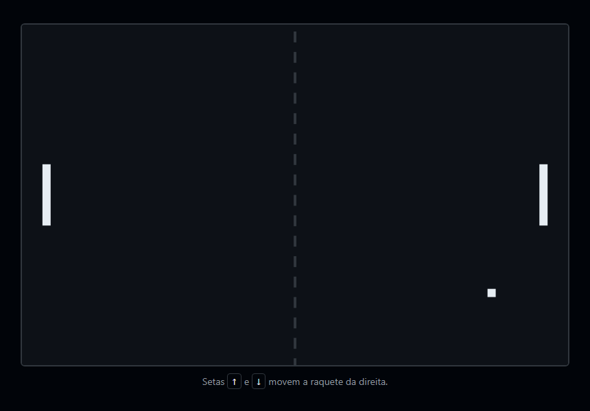
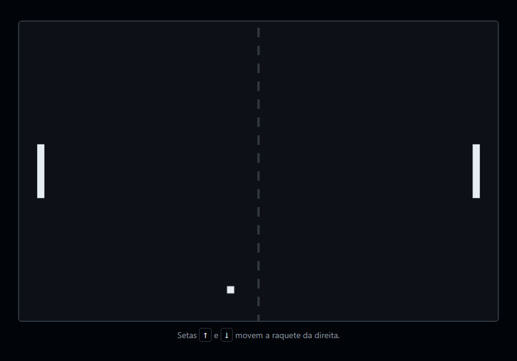
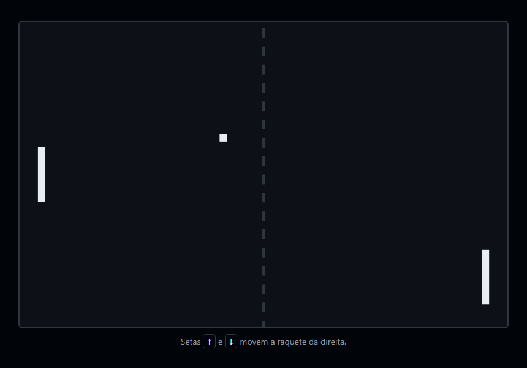
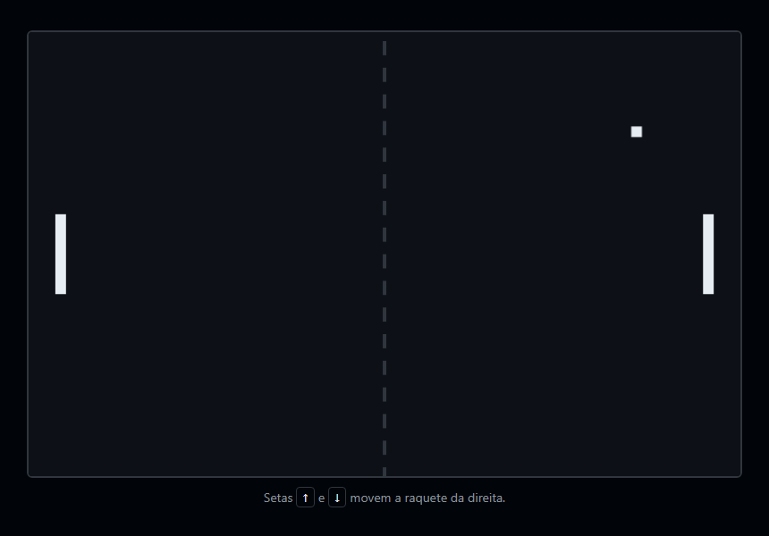
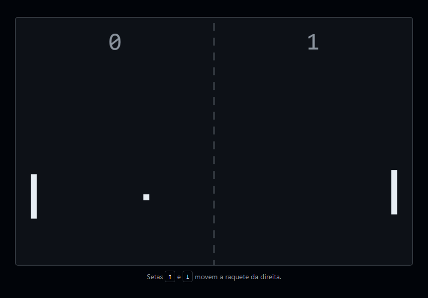

> Seu primeiro jogo com laço de animação. Canvas, movimento por tempo e colisão são a base de qualquer jogo que vier depois — e o Pong tem as três armadilhas clássicas: o jogo que roda no dobro da velocidade em monitor de 120 Hz, a bola que fica presa tremendo na parede, e a bola rápida que atravessa a raquete sem encostar. Este é o passo a passo que eu seguiria, e cada armadilha vem com a medição que mostra quando ela acontece.

## O QUE VOCÊ PRECISA
- VS Code, com a extensão *Live Server* (opcional).
- Um navegador atual.
- Seno e cosseno aparecem na etapa 5. Não precisa lembrar da escola: o texto explica o que cada um faz aqui.

## ANTES DE ESCREVER A PRIMEIRA LINHA
Crie uma pasta chamada `pong` e abra-a no VS Code (*Arquivo → Abrir Pasta*). Dentro dela, crie estes arquivos vazios:

~~~arvore
pong/
├── index.html
├── estilo.css
└── jogo.js
~~~
O HTML e o CSS ficam prontos na etapa 1 e não mudam mais. Todo o resto acontece no `jogo.js`.

### 1. A tela e o primeiro desenho
Um canvas de 800 × 500, duas raquetes e uma bola — parados.
Parece pouco, e é meia batalha: aqui se decide como o jogo guarda posições e como ele desenha. Nada se move ainda.

~~~arquivo index.html
<!DOCTYPE html>
<html lang="pt-BR">
<head>
    <meta charset="UTF-8">
    <meta name="viewport" content="width=device-width, initial-scale=1.0">
    <title>Pong</title>
    <link rel="stylesheet" href="estilo.css">
</head>
<body>
    <main>
        <canvas id="tela" width="800" height="500" aria-label="Jogo de Pong"></canvas>
        
Setas <kbd>↑</kbd> e <kbd>↓</kbd> movem a raquete da direita.

    </main>

    
</body>
</html>
~~~

~~~arquivo estilo.css
* {
    box-sizing: border-box;
    margin: 0;
    padding: 0;
}

body {
    min-height: 100vh;
    display: grid;
    place-items: center;
    padding: 24px;
    background: #010409;
    color: #8b949e;
    font-family: 'Segoe UI', system-ui, sans-serif;
}

main {
    display: grid;
    justify-items: center;
    gap: 12px;
}

/* O tamanho de DESENHO vem dos atributos width e height do <canvas>.
   O CSS só decide o tamanho NA TELA — e pode encolher sem distorcer. */
canvas {
    display: block;
    width: 800px;
    max-width: 100%;
    height: auto;
    border: 2px solid #30363d;
    border-radius: 6px;
}

.dica { font-size: 14px; }

kbd {
    padding: 1px 6px;
    border: 1px solid #30363d;
    border-radius: 4px;
    color: #e6edf3;
    font-family: inherit;
}
~~~

~~~arquivo jogo.js
const tela = document.getElementById('tela');
const ctx = tela.getContext('2d');

const LARGURA = tela.width;    // 800
const ALTURA = tela.height;    // 500

const RAQUETE = { largura: 12, altura: 90, margem: 30 };
const BOLA = { tamanho: 12 };

/* Posições em pixels do canvas, sempre pelo canto superior esquerdo. */
const esquerda = { x: RAQUETE.margem, y: (ALTURA - RAQUETE.altura) / 2 };
const direita = { x: LARGURA - RAQUETE.margem - RAQUETE.largura, y: (ALTURA - RAQUETE.altura) / 2 };
const bola = { x: (LARGURA - BOLA.tamanho) / 2, y: (ALTURA - BOLA.tamanho) / 2 };

function desenhar() {
    // Pintar a tela inteira é o que apaga o quadro anterior.
    ctx.fillStyle = '#0d1117';
    ctx.fillRect(0, 0, LARGURA, ALTURA);

    // Rede tracejada no meio
    ctx.fillStyle = '#30363d';
    for (let y = 10; y < ALTURA; y += 30) {
        ctx.fillRect(LARGURA / 2 - 2, y, 4, 16);
    }

    ctx.fillStyle = '#e6edf3';
    ctx.fillRect(esquerda.x, esquerda.y, RAQUETE.largura, RAQUETE.altura);
    ctx.fillRect(direita.x, direita.y, RAQUETE.largura, RAQUETE.altura);
    ctx.fillRect(bola.x, bola.y, BOLA.tamanho, BOLA.tamanho);
}

desenhar();
~~~

#### `width="800"` no HTML, e não só no CSS
O canvas tem dois tamanhos. Os atributos `width` e `height` definem quantos pixels existem para desenhar; o CSS define o tamanho em que isso aparece na tela. Se você só puser `width: 800px` no CSS, o canvas continua com a resolução padrão de 300 × 150 e é esticado — tudo sai borrado e com coordenadas que não batem com o que você vê. Com os atributos certos, o CSS pode encolher o canvas numa tela pequena ( `max-width: 100%`) sem mudar nenhuma coordenada do jogo.

#### No canvas não existem objetos, só tinta
Um `<button>` continua existindo depois de criado; você muda uma classe e ele se redesenha. O canvas é o oposto: `fillRect` pinta pixels e esquece. Não há “a raquete” na tela para mover. Por isso o jogo guarda as posições em objetos comuns — `esquerda`, `direita`, `bola` — e `desenhar()` pinta tudo a partir deles. A primeira linha pinta a tela inteira de fundo: é isso que apaga o quadro anterior quando o jogo começar a se mover. Conferi os pixels: fundo, bola e as duas raquetes estão onde os objetos dizem.

!confira um retângulo escuro com as duas raquetes, a bola e a rede. Encolha a janela: o canvas diminui junto, sem distorcer.

### 2. O laço, medido em tempo
A bola anda em linha reta — na mesma velocidade em qualquer monitor.

~~~arquivo jogo.js
const tela = document.getElementById('tela');
const ctx = tela.getContext('2d');

const LARGURA = tela.width;
const ALTURA = tela.height;

const RAQUETE = { largura: 12, altura: 90, margem: 30 };
const BOLA = { tamanho: 12 };

const esquerda = { x: RAQUETE.margem, y: (ALTURA - RAQUETE.altura) / 2 };
const direita = { x: LARGURA - RAQUETE.margem - RAQUETE.largura, y: (ALTURA - RAQUETE.altura) / 2 };

/* A velocidade é em pixels POR SEGUNDO — não por quadro. */
const bola = { x: (LARGURA - BOLA.tamanho) / 2, y: (ALTURA - BOLA.tamanho) / 2, vx: 320, vy: 160 };

let anterior = null;   // horário do quadro anterior, em ms

function quadro(agora) {
    // Segundos desde o quadro anterior. O teto de 1/30 s evita um salto
    // enorme quando a aba volta do segundo plano.
    const dt = anterior === null ? 0 : Math.min((agora - anterior) / 1000, 1 / 30);
    anterior = agora;

    atualizar(dt);
    desenhar();
    requestAnimationFrame(quadro);
}

function atualizar(dt) {
    bola.x += bola.vx * dt;
    bola.y += bola.vy * dt;
}

function desenhar() {
    ctx.fillStyle = '#0d1117';
    ctx.fillRect(0, 0, LARGURA, ALTURA);

    ctx.fillStyle = '#30363d';
    for (let y = 10; y < ALTURA; y += 30) {
        ctx.fillRect(LARGURA / 2 - 2, y, 4, 16);
    }

    ctx.fillStyle = '#e6edf3';
    ctx.fillRect(esquerda.x, esquerda.y, RAQUETE.largura, RAQUETE.altura);
    ctx.fillRect(direita.x, direita.y, RAQUETE.largura, RAQUETE.altura);
    ctx.fillRect(bola.x, bola.y, BOLA.tamanho, BOLA.tamanho);
}

requestAnimationFrame(quadro);
~~~

~~~codigo
requestAnimationFrame
~~~
Ele pede ao navegador: “chame esta função logo antes de desenhar o próximo quadro da tela”. Por isso `quadro()` termina pedindo a si mesma de novo — é o laço. O ritmo é o do monitor: 60 vezes por segundo num comum, 120 ou 144 num de jogos. E numa aba escondida ele para, o que economiza bateria sem você programar nada.

#### Pixels por segundo, não por quadro
O navegador entrega a `quadro()` o horário atual. A diferença para o quadro anterior é `dt`, em segundos, e todo movimento é `velocidade × dt`. Parei o laço real e chamei `quadro()` com horários exatos para comparar com o jeito errado — somar uma quantidade fixa a cada quadro, calibrada para 60 Hz:

| MONITOR | POR QUADRO (ERRADO) | POR TEMPO (DT) |
|---|---|---|
| 60 Hz | 320 px em 1 s | 320 px em 1 s |
| 120 Hz | 640 px em 1 s | 320 px em 1 s |
| 144 Hz | 768 px em 1 s | 320 px em 1 s |
Por quadro, o mesmo jogo fica duas vezes mais difícil no monitor de quem tem um melhor. Por tempo, deu 320 px em 30, 60, 120 e 144 Hz.

#### O teto de 1/30 de segundo

~~~codigo
    const dt = anterior === null ? 0 : Math.min((agora - anterior) / 1000, 1 / 30);
~~~
Troque de aba por cinco segundos e volte. O laço estava parado, e o primeiro quadro na volta teria `dt` `= 5`: a bola saltaria 1.600 px de uma vez, atravessando raquetes e paredes. Com o teto, esse quadro conta como 1/30 s — medi 10,67 px — e o jogo simplesmente continua de onde estava. O mesmo teto vai ser importante na etapa 5.

!confira a bola atravessa a tela na diagonal e some. Recarregue: ela sai do centro de novo.

### 3. As paredes
Quicar em cima e embaixo — sem nunca ficar presa tremendo na borda.
Uma função nova, chamada logo depois de mover a bola. E, provisoriamente, a bola que sai pelos lados volta ao centro, para dar para observar:

~~~codigo
function atualizar(dt) {
    bola.x += bola.vx * dt;
    bola.y += bola.vy * dt;

    quicarNasParedes();

    // Provisório: sem raquetes funcionando, a bola que sai volta ao centro.
    if (bola.x > LARGURA || bola.x + BOLA.tamanho < 0) {
        bola.x = (LARGURA - BOLA.tamanho) / 2;
        bola.vx = -bola.vx;
    }
}

function quicarNasParedes() {
    if (bola.y < 0) {
        bola.y = -bola.y;
        bola.vy = Math.abs(bola.vy);                 // para baixo
    } else if (bola.y + BOLA.tamanho > ALTURA) {
        bola.y = 2 * (ALTURA - BOLA.tamanho) - bola.y;
        bola.vy = -Math.abs(bola.vy);                // para cima
    }
}
~~~

#### Por que “inverter a velocidade” não basta
O código óbvio é `if (bola.y + tamanho > ALTURA) vy = -vy`. Ele parece funcionar — até o quadro em que a bola entra mais fundo na borda do que consegue sair no quadro seguinte. Isso acontece sozinho quando a taxa de quadros oscila: um quadro lento (1/30 s) enfia a bola 7 px além da borda; o próximo, a 144 Hz, só anda 2 px para cima. A bola continua fora, então `vy` inverte de novo e ela volta a descer. Simulei exatamente isso: com a versão ingênua, a bola ficou presa na borda em 144 de 144 quadros, tremendo para sempre.

#### As duas defesas
Devolver a bola para dentro. Se ela passou 7 px da borda, é colocada 7 px para dentro, como se tivesse batido e voltado no meio do quadro. É o `2 * (ALTURA - tamanho) - y`: a posição espelhada na borda. Forçar a direção em vez de trocar o sinal. `Math.abs(vy)` na parede de cima garante “para baixo”, não importa quantas vezes a regra rode. Trocar o sinal duas vezes volta ao começo; forçar duas vezes dá o mesmo resultado. No mesmo cenário, a versão com as duas defesas teve zero quadros fora. E rodei 3 segundos a 3.000 px/s e 30 Hz — velocidade absurda, quadros lentos: a bola não saiu da tela nenhuma vez.

!confira deixe rodar: a bola quica em cima e embaixo, e quando sai pelos lados reaparece no centro indo para o outro lado.

### 4. A raquete do jogador
Setas movem a raquete direita — com o movimento acontecendo no laço, não no evento.
Uma constante de velocidade na raquete, um objeto com as teclas pressionadas, e três ouvintes de evento. A leitura acontece em `moverJogador()`, chamada no começo de `atualizar()`.

~~~codigo
const RAQUETE = { largura: 12, altura: 90, margem: 30, velocidade: 420 };   // px/s
const teclas = { ArrowUp: false, ArrowDown: false };
function limitar(valor, minimo, maximo) {
    return Math.min(Math.max(valor, minimo), maximo);
}
function moverJogador(dt) {
    const direcao = (teclas.ArrowDown ? 1 : 0) - (teclas.ArrowUp ? 1 : 0);
    direita.y = limitar(direita.y + direcao * RAQUETE.velocidade * dt, 0, ALTURA - RAQUETE.altura);
}
~~~

~~~arquivo jogo.js — eventos de teclado
document.addEventListener('keydown', (evento) => {
    if (evento.key in teclas) {
        teclas[evento.key] = true;
        evento.preventDefault();          // as setas não rolam a página
    }
});

document.addEventListener('keyup', (evento) => {
    if (evento.key in teclas) teclas[evento.key] = false;
});

/* Segurar a seta e trocar de janela: o keyup nunca chega. Sem isto,
   a raquete voltaria andando sozinha. */
window.addEventListener('blur', () => {
    teclas.ArrowUp = false;
    teclas.ArrowDown = false;
});
~~~

#### Não mova a raquete dentro do `keydown`
Segurar uma tecla gera um `keydown`, uma pausa (a espera de repetição do sistema operacional, em torno de meio segundo), e depois uma rajada de repetições no ritmo que o sistema quiser. Movendo a raquete em cada evento, ela dá um passo, trava, e depois anda aos soquinhos. Aqui os eventos só anotam “seta para baixo está pressionada”, e o laço move a raquete a cada quadro enquanto a anotação for verdadeira. Testei com um único `keydown`, sem nenhuma repetição: em meio segundo a raquete desceu exatamente 210 px (420 px/s × 0,5 s).

#### Três detalhes que viram bug se faltarem
- `limitar()` — sem ele a raquete sai da tela. Segurando a seta por três segundos, ela parou em 410, que é a altura do canvas menos a da raquete.
- `preventDefault()` — sem ele as setas também rolam a página, e o jogo pula enquanto você joga. Conferi que o evento sai cancelado.
- `blur` — segure a seta e dê Alt+Tab. O `keyup` acontece na outra janela, e o jogo nunca fica sabendo. Na volta, a raquete desceria sozinha. Soltar todas as teclas ao perder o foco resolve; testei e a raquete ficou parada.
E `(baixo ? 1 : 0) - (cima ? 1 : 0)` dá −1, 0 ou 1: as duas setas juntas se anulam em vez de uma vencer a outra por ordem de código.

!confira segure a seta para baixo: a raquete desce contínua desde o primeiro instante e para na borda. Segure, troque de janela e volte: ela não anda sozinha. As setas não rolam a página.

### 5. Colisão e ângulo
A bola rebate nas raquetes, com o ângulo decidido por onde bateu — e nunca atravessa.
A etapa central do jogo. Entram: constantes de velocidade e ângulo, uma função de saque, e a colisão. A bola agora sai do centro por `sacar()` e, se passar por uma raquete, volta para o centro.

~~~codigo
const BOLA = { tamanho: 12, velocidadeInicial: 360, aceleracao: 1.06, velocidadeMaxima: 900 };
const ANGULO_MAXIMO = Math.PI / 3;   // 60°, na ponta da raquete

function sacar(sentido) {
    bola.x = (LARGURA - BOLA.tamanho) / 2;
    bola.y = (ALTURA - BOLA.tamanho) / 2;
    const angulo = (Math.random() * 2 - 1) * (Math.PI / 6);
    bola.vx = sentido * BOLA.velocidadeInicial * Math.cos(angulo);
    bola.vy = BOLA.velocidadeInicial * Math.sin(angulo);
}

function moverBola(dt) {
    const antes = { x: bola.x, y: bola.y };
    bola.x += bola.vx * dt;
    bola.y += bola.vy * dt;

    quicarNasParedes();

    if (bola.vx > 0) rebater(direita, antes);
    else rebater(esquerda, antes);

    if (bola.x > LARGURA) sacar(-1);
    else if (bola.x + BOLA.tamanho < 0) sacar(1);
}
~~~

~~~arquivo jogo.js — rebater()
/* Colisão "varrida": não pergunta se a bola ESTÁ sobre a raquete agora,
   e sim se ela CRUZOU a face da raquete durante este quadro. É o que
   impede a bola rápida de atravessar sem nunca ter encostado. */
function rebater(raquete, antes) {
    const paraDireita = bola.vx > 0;
    const face = paraDireita ? raquete.x : raquete.x + RAQUETE.largura;
    const bordaAntes = paraDireita ? antes.x + BOLA.tamanho : antes.x;
    const bordaAgora = paraDireita ? bola.x + BOLA.tamanho : bola.x;

    const cruzou = paraDireita
        ? bordaAntes <= face && bordaAgora >= face
        : bordaAntes >= face && bordaAgora <= face;
    if (!cruzou) return;

    // Em que fração do quadro tocou a face, e em que altura estava nesse instante.
    const fracao = bordaAgora === bordaAntes ? 0 : (face - bordaAntes) / (bordaAgora - bordaAntes);
    const yNoToque = antes.y + (bola.y - antes.y) * fracao;
    const centro = yNoToque + BOLA.tamanho / 2;
    if (centro < raquete.y || centro > raquete.y + RAQUETE.altura) return;   // passou por fora

    // -1 na ponta de cima, 0 no meio, +1 na ponta de baixo
    const onde = (centro - (raquete.y + RAQUETE.altura / 2)) / (RAQUETE.altura / 2);
    const angulo = onde * ANGULO_MAXIMO;
    const velocidade = Math.min(Math.hypot(bola.vx, bola.vy) * BOLA.aceleracao, 
BOLA.velocidadeMaxima);

    bola.vx = (paraDireita ? -1 : 1) * velocidade * Math.cos(angulo);
    bola.vy = velocidade * Math.sin(angulo);
    bola.x = paraDireita ? face - BOLA.tamanho : face;
    bola.y = yNoToque;
}
~~~

#### Tunelamento: quando a bola atravessa sem encostar
O teste de colisão comum pergunta: “no fim deste quadro, a bola está sobreposta à raquete?”. A bola tem 12 px e a raquete tem 12 px, então existe uma janela de 24 px em que a resposta é sim. Se a bola andar mais de 24 px num único quadro, ela pode estar antes da raquete num quadro e depois dela no seguinte — sem nunca estar sobreposta. Calculei, para a velocidade máxima do jogo (900 px/s), em que fração das posições de chegada o teste comum deixaria a bola passar:

| TAXA DE QUADROS | PASSO POR QUADRO | ATRAVESSA |
|---|---|---|
| 144 Hz | 6,3 px | 0% |
| 60 Hz | 15 px | 0% |
| 40 Hz | 22,5 px | 0% |
| 30 Hz | 30 px | 22% |
| 20 Hz | 45 px | 48% |
Num computador rápido, nunca. Num notebook fraco que cai para 30 quadros, uma bola em cada cinco passa pela raquete. É o pior tipo de bug: você nunca vê na sua máquina.

#### A colisão varrida
`rebater()` faz outra pergunta: “entre o quadro anterior e este, a borda da bola cruzou a face da raquete?”. Por isso `moverBola()` guarda a posição de `antes`. Se a borda estava de um lado da face e agora está do outro, houve cruzamento, não importa o tamanho do passo. Depois, `fracao` calcula em que ponto do quadro o cruzamento aconteceu, e com isso a altura da bola naquele instante ( `yNoToque`). Só então se confere se essa altura estava dentro da raquete. Testei com 3.000 px/s a 30 Hz — 100 px por quadro, oito vezes a janela de colisão —: a bola rebateu e foi recolocada exatamente na frente da raquete.

#### O ângulo é o que torna o Pong jogável
Se a bola só invertesse `vx`, ela repetiria sempre o mesmo caminho e o jogo seria decidido no primeiro saque. Em vez disso:

~~~codigo
const onde = (centro - (raquete.y + RAQUETE.altura / 2)) / (RAQUETE.altura / 2);
const angulo = onde * ANGULO_MAXIMO;
const velocidade = Math.min(Math.hypot(bola.vx, bola.vy) * BOLA.aceleracao, 
BOLA.velocidadeMaxima);

bola.vx = (paraDireita ? -1 : 1) * velocidade * Math.cos(angulo);
bola.vy = velocidade * Math.sin(angulo);
~~~
`onde` vale −1 na ponta de cima, 0 no meio e +1 na ponta de baixo. Multiplicado por 60°, vira o ângulo de saída. Cosseno e seno dividem a velocidade total entre as duas direções: com ângulo zero, tudo vai para `vx` (reto); com 60°, a maior parte vai para `vy` (inclinado). Medi: bola na ponta de cima saiu a 59° para cima; no meio, reta; na ponta de baixo, para baixo. A cada rebatida a velocidade total cresce 6% ( `Math.hypot` é o tamanho do vetor) até o teto de 900 px/s. Uma rebatida no meio a 400 px/s saiu a 424; perto do teto, ficou em 900.

!confira mova a raquete para receber a bola: bater na ponta a manda inclinada, no meio a manda reta. A cada troca ela fica mais rápida. Se errar, a bola volta ao centro.

### 6. Adversário e placar
Um oponente que persegue a bola com velocidade limitada, pontos, e uma pausa antes de cada saque.
O arquivo final. As mudanças em relação à etapa 5 são `ADVERSARIO`, `ESPERA_SAQUE_MS`, os `pontos` nas raquetes, `relogio` e `sacarEm`, a função `moverAdversario()`, a contagem de pontos em `moverBola()` e o placar em `desenhar()`.

~~~arquivo jogo.js
const tela = document.getElementById('tela');
const ctx = tela.getContext('2d');

const LARGURA = tela.width;
const ALTURA = tela.height;

const RAQUETE = { largura: 12, altura: 90, margem: 30, velocidade: 420 };
const BOLA = { tamanho: 12, velocidadeInicial: 360, aceleracao: 1.06, velocidadeMaxima: 900 };
const ANGULO_MAXIMO = Math.PI / 3;
const ADVERSARIO = { velocidade: 290 };   // mais lento que o jogador: é o que o torna vencível
const ESPERA_SAQUE_MS = 800;

const esquerda = { x: RAQUETE.margem, y: (ALTURA - RAQUETE.altura) / 2, pontos: 0 };
const direita = { x: LARGURA - RAQUETE.margem - RAQUETE.largura, y: (ALTURA - RAQUETE.altura) / 2, 
pontos: 0 };
const bola = { x: 0, y: 0, vx: 0, vy: 0 };

const teclas = { ArrowUp: false, ArrowDown: false };

let anterior = null;
let relogio = 0;     // tempo de jogo acumulado, em ms
let sacarEm = 0;     // até este instante a bola espera parada no centro

function limitar(valor, minimo, maximo) {
    return Math.min(Math.max(valor, minimo), maximo);
}

function sacar(sentido) {
    bola.x = (LARGURA - BOLA.tamanho) / 2;
    bola.y = (ALTURA - BOLA.tamanho) / 2;
    const angulo = (Math.random() * 2 - 1) * (Math.PI / 6);
    bola.vx = sentido * BOLA.velocidadeInicial * Math.cos(angulo);
    bola.vy = BOLA.velocidadeInicial * Math.sin(angulo);
    sacarEm = relogio + ESPERA_SAQUE_MS;
}

function quadro(agora) {
    const dt = anterior === null ? 0 : Math.min((agora - anterior) / 1000, 1 / 30);
    anterior = agora;

    atualizar(dt);
    desenhar();
    requestAnimationFrame(quadro);
}
function atualizar(dt) {
    relogio += dt * 1000;
    moverJogador(dt);
    moverAdversario(dt);
    if (relogio < sacarEm) return;   // bola esperando o saque
    moverBola(dt);
}

function moverJogador(dt) {
    const direcao = (teclas.ArrowDown ? 1 : 0) - (teclas.ArrowUp ? 1 : 0);
    direita.y = limitar(direita.y + direcao * RAQUETE.velocidade * dt, 0, ALTURA - RAQUETE.altura);
}

/* O adversário não lê o futuro: persegue a altura atual da bola quando
   ela vem na direção dele, e volta ao centro quando ela vai embora.
   A velocidade limitada é o que deixa espaço para ele errar. */
function moverAdversario(dt) {
    const alvo = bola.vx < 0 ? bola.y + BOLA.tamanho / 2 : ALTURA / 2;
    const distancia = alvo - (esquerda.y + RAQUETE.altura / 2);
    const passo = limitar(distancia, -ADVERSARIO.velocidade * dt, ADVERSARIO.velocidade * dt);
    esquerda.y = limitar(esquerda.y + passo, 0, ALTURA - RAQUETE.altura);
}

function moverBola(dt) {
    const antes = { x: bola.x, y: bola.y };
    bola.x += bola.vx * dt;
    bola.y += bola.vy * dt;

    quicarNasParedes();

    if (bola.vx > 0) rebater(direita, antes);
    else rebater(esquerda, antes);

    // Saiu por um lado: ponto de quem está do outro, e o saque vai para quem sofreu.
    if (bola.x > LARGURA) {
        esquerda.pontos++;
        sacar(1);
    } else if (bola.x + BOLA.tamanho < 0) {
        direita.pontos++;
        sacar(-1);
    }
}

function quicarNasParedes() {
    if (bola.y < 0) {
        bola.y = -bola.y;
        bola.vy = Math.abs(bola.vy);
    } else if (bola.y + BOLA.tamanho > ALTURA) {
        bola.y = 2 * (ALTURA - BOLA.tamanho) - bola.y;
        bola.vy = -Math.abs(bola.vy);
    }
}

function rebater(raquete, antes) {
    const paraDireita = bola.vx > 0;
    const face = paraDireita ? raquete.x : raquete.x + RAQUETE.largura;
    const bordaAntes = paraDireita ? antes.x + BOLA.tamanho : antes.x;
    const bordaAgora = paraDireita ? bola.x + BOLA.tamanho : bola.x;
    const cruzou = paraDireita
        ? bordaAntes <= face && bordaAgora >= face
        : bordaAntes >= face && bordaAgora <= face;
    if (!cruzou) return;

    const fracao = bordaAgora === bordaAntes ? 0 : (face - bordaAntes) / (bordaAgora - bordaAntes);
    const yNoToque = antes.y + (bola.y - antes.y) * fracao;
    const centro = yNoToque + BOLA.tamanho / 2;
    if (centro < raquete.y || centro > raquete.y + RAQUETE.altura) return;

    const onde = (centro - (raquete.y + RAQUETE.altura / 2)) / (RAQUETE.altura / 2);
    const angulo = onde * ANGULO_MAXIMO;
    const velocidade = Math.min(Math.hypot(bola.vx, bola.vy) * BOLA.aceleracao, 
BOLA.velocidadeMaxima);

    bola.vx = (paraDireita ? -1 : 1) * velocidade * Math.cos(angulo);
    bola.vy = velocidade * Math.sin(angulo);
    bola.x = paraDireita ? face - BOLA.tamanho : face;
    bola.y = yNoToque;
}

function desenhar() {
    ctx.fillStyle = '#0d1117';
    ctx.fillRect(0, 0, LARGURA, ALTURA);

    ctx.fillStyle = '#30363d';
    for (let y = 10; y < ALTURA; y += 30) {
        ctx.fillRect(LARGURA / 2 - 2, y, 4, 16);
    }

    ctx.fillStyle = '#8b949e';
    ctx.font = '48px monospace';
    ctx.textAlign = 'center';
    ctx.fillText(esquerda.pontos, LARGURA / 4, 64);
    ctx.fillText(direita.pontos, (LARGURA * 3) / 4, 64);

    ctx.fillStyle = '#e6edf3';
    ctx.fillRect(esquerda.x, esquerda.y, RAQUETE.largura, RAQUETE.altura);
    ctx.fillRect(direita.x, direita.y, RAQUETE.largura, RAQUETE.altura);
    ctx.fillRect(bola.x, bola.y, BOLA.tamanho, BOLA.tamanho);
}

document.addEventListener('keydown', (evento) => {
    if (evento.key in teclas) {
        teclas[evento.key] = true;
        evento.preventDefault();
    }
});

document.addEventListener('keyup', (evento) => {
    if (evento.key in teclas) teclas[evento.key] = false;
});

window.addEventListener('blur', () => {
    teclas.ArrowUp = false;
    teclas.ArrowDown = false;
});
sacar(1);
requestAnimationFrame(quadro);
~~~

#### Um adversário que pode perder

~~~codigo
function moverAdversario(dt) {
    const alvo = bola.vx < 0 ? bola.y + BOLA.tamanho / 2 : ALTURA / 2;
    const distancia = alvo - (esquerda.y + RAQUETE.altura / 2);
    const passo = limitar(distancia, -ADVERSARIO.velocidade * dt, ADVERSARIO.velocidade * dt);
    esquerda.y = limitar(esquerda.y + passo, 0, ALTURA - RAQUETE.altura);
}
~~~
Fazer o adversário perfeito é uma linha: `esquerda.y = bola.y`. E aí ninguém nunca ganha. O que torna o jogo interessante são as limitações:
- ele só persegue a bola quando ela vem na direção dele; quando vai embora, volta ao centro;
- persegue a altura atual da bola, sem prever onde ela vai estar;
- anda no máximo 290 px/s — mais devagar que o jogador (420) e bem mais devagar que uma bola inclinada perto do teto. Medi o passo: 290 px/s, nem um a mais.
Para saber se ficou equilibrado, simulei três partidas de cinco minutos contra um jogador-robô na direita, que persegue a altura da bola na velocidade normal da raquete. Os saques usaram uma semente fixa de números aleatórios, para o resultado ser reproduzível:

| PARTIDA | JOGADOR-ROBÔ | ADVERSÁRIO |
|---|---|---|
| 1 | 5 | 3 |
| 2 | 3 | 7 |
| 3 | 3 | 8 |
O jogador ganhou uma e perdeu duas, e marcou ponto em todas: o adversário é vencível, e não é trivial. Nos quinze minutos simulados, a bola não saiu da tela na vertical nenhuma vez.

#### Um relógio de jogo, e não o do computador
A pausa antes do saque podia usar `Date.now()`. Mas `relogio` é somado com o próprio `dt`, a cada quadro — então ele para quando o jogo para. Se a aba ficar escondida no meio da pausa, o saque não acontece às escondidas; ele espera você voltar. Conferi os dois lados: meio segundo depois do ponto a bola continuava no centro; passados os 800 ms, ela saiu.

#### Ponto, e saque para quem sofreu

~~~codigo
if (bola.x > LARGURA) {
    esquerda.pontos++;
    sacar(1);
} else if (bola.x + BOLA.tamanho < 0) {
    direita.pontos++;
    sacar(-1);
~~~
A bola que sai pela direita é ponto da esquerda, e o saque vai para a direita, na direção de quem acabou de perder — dá a chance de devolver na hora. Forcei dez bolas para fora pela esquerda: dez pontos para o jogador, zero para o adversário.

!confira jogue uma partida. O placar aumenta do lado certo, a bola espera um instante no centro antes de cada saque, e dá para marcar ponto no adversário com bolas inclinadas.

### ✓ Roteiro de teste
Passe por estes casos antes de considerar a oficina concluída. Eles cobrem o que costuma quebrar.

| VOCÊ FAZ | DEVE ACONTECER |
|---|---|
| Deixar a bola quicar nas paredes por um minuto | nunca escapa por cima ou por baixo |
| Rebater até a bola ficar no máximo | ela nunca atravessa a raquete |
| Jogar num monitor de 120 Hz, ou com o DevTools reduzindo o desempenho | a velocidade é a mesma |
| Trocar de aba por alguns segundos e voltar | o jogo continua de onde estava, sem salto |
| Segurar a seta | a raquete anda contínua desde o primeiro instante e para na borda |
| Segurar a seta e trocar de janela | na volta a raquete está parada |
| Bater na ponta e no meio da raquete | ponta sai inclinada; meio sai reto |
| Jogar uma partida inteira | dá para marcar ponto no adversário |
| Contar dez pontos | o placar bate |

### ! Quando não funcionar
Os tropeços desta oficina, e o que procurar em cada um.

| SINTOMA | CAUSA QUASE CERTA |
|---|---|
| Tudo sai borrado e as coordenadas não batem | O tamanho do canvas foi definido só no CSS. Use os atributos `width` e `height`. |
| O jogo deixa rastro da bola | Falta pintar o fundo inteiro no começo de `desenhar()`. |
| Mais rápido num monitor, mais lento em outro | Movimento por quadro. Multiplique a velocidade por `dt`. |
| A bola dá um salto ao voltar para a aba | Falta o teto de `1 / 30` no `dt`. |
| A bola fica tremendo presa na parede | Só o sinal de `vy` é trocado. Devolva a bola para dentro e force a direção com `Math.abs`. |
| A raquete trava um instante e depois anda aos trancos | O movimento está dentro do `keydown`. Anote a tecla e mova no laço. |
| A raquete anda sozinha depois de Alt+Tab | Falta soltar as teclas no evento `blur`. |
| A bola atravessa a raquete de vez em quando | Colisão por sobreposição. Use o teste de cruzamento com a posição de `antes`. |
| A bola sempre faz o mesmo caminho | O rebote só inverte `vx`. Calcule o ângulo pela posição do toque. |
| Ninguém consegue ganhar do adversário | Ele é rápido demais ou prevê a bola. Limite a velocidade e faça-o seguir só a altura atual. |

### → Para levar adiante
Extensões em ordem de dificuldade. Todas cabem no que você já construiu.
1. Som. Um bipe na raquete e outro na parede, com o oscilador do Pomodoro. O cuidado: criar o `AudioContext` num gesto do usuário. 2. Dois jogadores. W e S para a raquete esquerda no lugar do adversário. O objeto `teclas` ganha duas chaves. 3. Fim de partida. Primeiro a 7 vence, com uma tela de vitória. Um estado `jogando` / `fim` decide o que o laço faz. 4. Rastro da bola. Guarde as últimas oito posições e desenhe com opacidade decrescente — sem deixar de limpar a tela.
