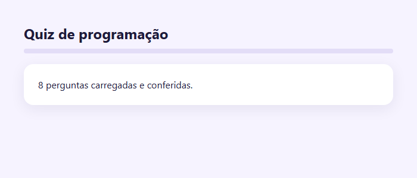
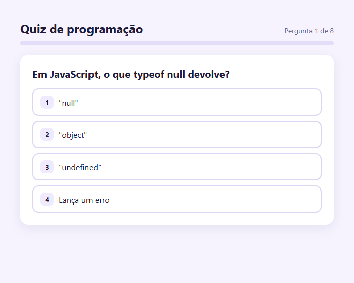
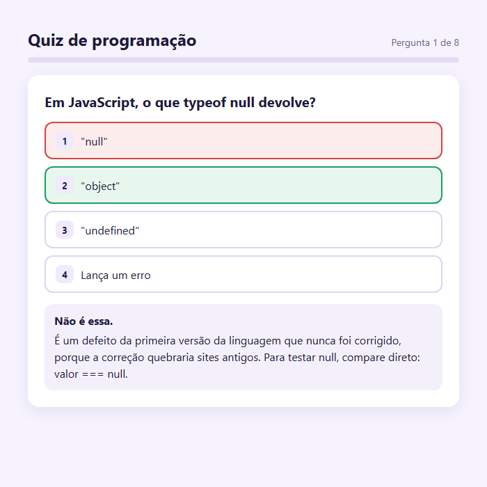
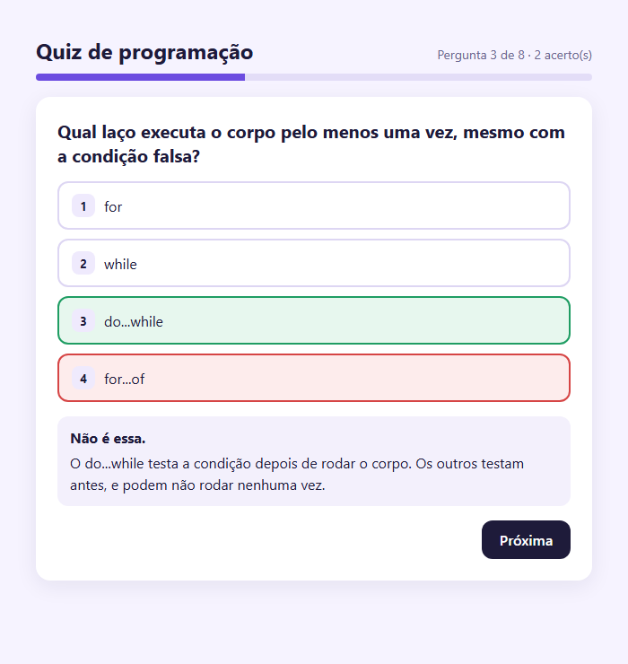
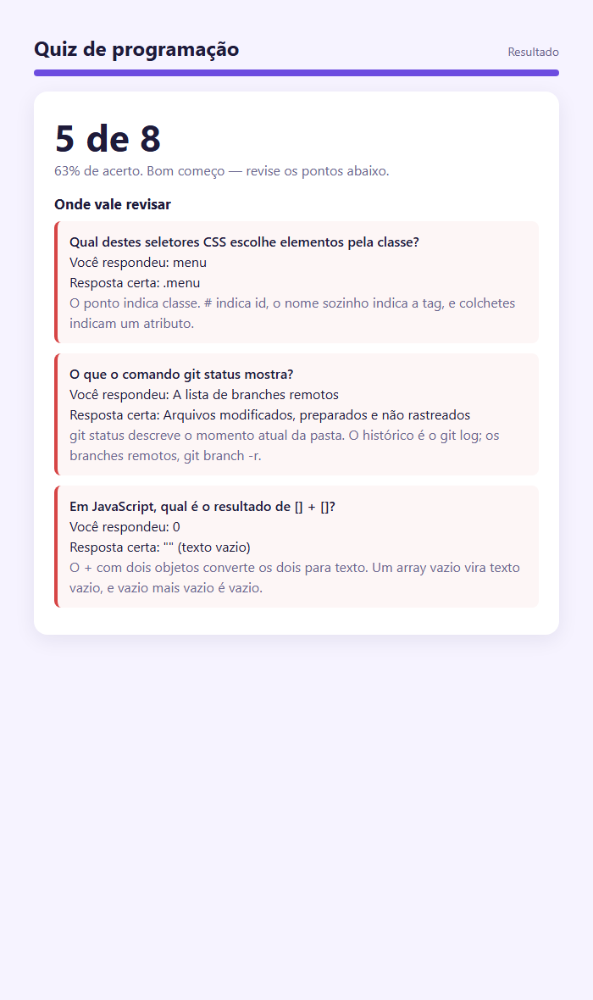
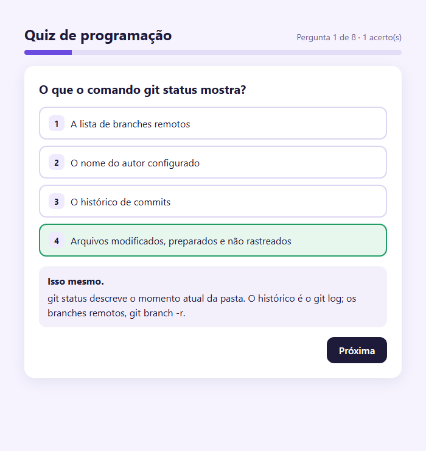

> Um quiz é o exercício perfeito para uma lição que vale para qualquer projeto: separar o conteúdo do código. Nenhuma pergunta vai estar escrita no HTML ou no JavaScript — tudo sai de um arquivo de dados, e trocar o quiz inteiro vai ser trocar esse arquivo. Este é o passo a passo que eu seguiria, e ele termina no bug número um deste projeto, com a medição de quanto ele erra.

## O QUE VOCÊ PRECISA
- VS Code, com a extensão *Live Server* (opcional).
- Um navegador atual.
- As oficinas da Memória (embaralhar) e da Lista de Tarefas (desenhar a partir do estado) ajudam bastante.

## ANTES DE ESCREVER A PRIMEIRA LINHA
Crie uma pasta chamada `quiz` e abra-a no VS Code (*Arquivo → Abrir Pasta*). Dentro dela, crie estes arquivos vazios:

~~~arvore
quiz/
├── index.html
├── estilo.css
├── perguntas.js
└── app.js
~~~
HTML, CSS e perguntas ficam prontos na etapa 1 e não mudam mais. O `app.js` cresce a cada etapa.

### 1. Os dados primeiro
As perguntas num arquivo próprio — e um código que confere os dados antes de usá-los.
Antes de qualquer tela, escrevo as perguntas. Se os dados estiverem bem modelados, o resto do projeto sai quase sozinho; se estiverem mal modelados, cada tela vai precisar de um remendo.

~~~arquivo perguntas.js
/* Os dados do quiz. Trocar o quiz inteiro é trocar este arquivo.
   `correta` é a POSIÇÃO da alternativa certa, contando do zero. */
const PERGUNTAS = [
    {
        enunciado: 'Em JavaScript, o que typeof null devolve?',
        alternativas: ['"null"', '"object"', '"undefined"', 'Lança um erro'],
        correta: 1,
        explicacao: 'É um defeito da primeira versão da linguagem que nunca foi corrigido, porque a 
correção quebraria sites antigos. Para testar null, compare direto: valor === null.',
    },
    {
        enunciado: 'Em JavaScript, quanto vale 0.1 + 0.2 === 0.3?',
        alternativas: ['true', 'false', 'NaN', 'Dá erro de sintaxe'],
        correta: 1,
        explicacao: '0,1 e 0,2 não têm representação exata em binário, e a soma dá 
0.30000000000000004. É por isso que dinheiro se guarda em centavos inteiros.',
    },
    {
        enunciado: 'Qual laço executa o corpo pelo menos uma vez, mesmo com a condição falsa?',
        alternativas: ['for', 'while', 'do...while', 'for...of'],
        correta: 2,
        explicacao: 'O do...while testa a condição depois de rodar o corpo. Os outros testam antes, e 
podem não rodar nenhuma vez.',
    },
    {
        enunciado: 'Numa API REST, qual método HTTP é o convencional para criar um recurso?',
        alternativas: ['GET', 'POST', 'DELETE', 'HEAD'],
        correta: 1,
        explicacao: 'POST cria. GET lê e não deve alterar nada, DELETE remove, e HEAD é um GET que 
devolve só os cabeçalhos.',
    },
    {
        enunciado: 'Numa consulta SQL, qual cláusula filtra linhas ANTES do agrupamento?',
        alternativas: ['HAVING', 'ORDER BY', 'WHERE', 'LIMIT'],
        correta: 2,
        explicacao: 'WHERE filtra linha a linha, antes do GROUP BY. HAVING filtra os grupos já 
formados — é onde entram condições sobre COUNT ou SUM.',
    },
    {
        enunciado: 'Qual destes seletores CSS escolhe elementos pela classe?',
        alternativas: ['#menu', '.menu', 'menu', '[menu]'],
        correta: 1,
        explicacao: 'O ponto indica classe. # indica id, o nome sozinho indica a tag, e colchetes 
indicam um atributo.',
    },
    {
        enunciado: 'O que o comando git status mostra?',
        alternativas: ['O histórico de commits', 'Arquivos modificados, preparados e não rastreados', 
'A lista de branches remotos', 'O nome do autor configurado'],
        correta: 1,
        explicacao: 'git status descreve o momento atual da pasta. O histórico é o git log; os 
branches remotos, git branch -r.',
    },
    {
        enunciado: 'Em JavaScript, qual é o resultado de [] + []?',
        alternativas: ['[]', '"" (texto vazio)', '0', 'undefined'],
        correta: 1,
        explicacao: 'O + com dois objetos converte os dois para texto. Um array vazio vira texto 
vazio, e vazio mais vazio é vazio.',
    },
];
~~~

~~~arquivo index.html
<!DOCTYPE html>
<html lang="pt-BR">
<head>
    <meta charset="UTF-8">
    <meta name="viewport" content="width=device-width, initial-scale=1.0">
    <title>Quiz de programação</title>
    <link rel="stylesheet" href="estilo.css">
</head>
<body>
    <main class="quiz">
        <header class="topo">
            <h1>Quiz de programação</h1>
            

        </header>

        

            

        

        <!-- Nenhuma pergunta aqui: a tela inteira é montada a partir de perguntas.js -->
        <section id="tela" class="tela" aria-live="polite"></section>
    </main>

    
    
</body>
</html>
~~~

~~~arquivo estilo.css
* {
    box-sizing: border-box;
    margin: 0;
    padding: 0;
}

[hidden] { display: none !important; }
body {
    min-height: 100vh;
    padding: 40px 18px;
    background: #f6f3ff;
    color: #1e1b3a;
    font-family: 'Segoe UI', system-ui, sans-serif;
}

.quiz { max-width: 620px; margin: 0 auto; }

.topo {
    display: flex;
    flex-wrap: wrap;
    align-items: baseline;
    justify-content: space-between;
    gap: 12px;
    margin-bottom: 10px;
}
h1 { font-size: 24px; }
.progresso { color: #6b6790; font-size: 14px; font-variant-numeric: tabular-nums; }

.barra {
    height: 8px;
    margin-bottom: 18px;
    overflow: hidden;
    border-radius: 999px;
    background: #e3ddf7;
}
.preenchimento { width: 0; height: 100%; background: #6c4ce0; transition: width .3s; }

.tela {
    padding: 24px;
    border-radius: 16px;
    background: #fff;
    box-shadow: 0 6px 24px rgba(30, 27, 58, .08);
}

.enunciado { margin-bottom: 16px; font-size: 20px; line-height: 1.35; }
.enunciado:focus,
.nota:focus { outline: none; }

.alternativas { display: grid; gap: 10px; list-style: none; }
.alternativa {
    display: flex;
    align-items: center;
    gap: 10px;
    width: 100%;
    padding: 12px 14px;
    border: 2px solid #ddd6f3;
    border-radius: 12px;
    background: #fff;
    color: inherit;
    font: inherit;
    text-align: left;
    cursor: pointer;
}
.alternativa:hover:not(:disabled) { border-color: #6c4ce0; }
.alternativa:focus-visible { outline: 3px solid #6c4ce0; outline-offset: 2px; }
/* Botão desabilitado desbota o texto por padrão — aqui a resposta precisa continuar legível. */
.alternativa:disabled { color: inherit; cursor: default; }
.alternativa .tecla {
    display: grid;
    flex: none;
    place-items: center;
    width: 26px;
    height: 26px;
    border-radius: 8px;
    background: #efeafd;
    font-size: 13px;
    font-weight: 700;
}
.alternativa.certa  { border-color: #1f9d63; background: #e7f7ee; }
.alternativa.errada { border-color: #d64545; background: #fdecec; }

.explicacao {
    margin-top: 16px;
    padding: 12px 14px;
    border-radius: 12px;
    background: #f3f0fc;
    line-height: 1.5;
}
.explicacao b { display: block; margin-bottom: 4px; }

.acoes { display: flex; justify-content: flex-end; margin-top: 16px; }
.botao {
    padding: 11px 20px;
    border: 0;
    border-radius: 12px;
    background: #1e1b3a;
    color: #fff;
    font: inherit;
    font-weight: 600;
    cursor: pointer;
}
.botao:focus-visible { outline: 3px solid #6c4ce0; outline-offset: 3px; }

.nota { font-size: 44px; font-weight: 700; }
.resumo { margin-bottom: 18px; color: #6b6790; }
.titulo-revisao { margin-bottom: 10px; font-size: 17px; }

.revisao { display: grid; gap: 12px; margin-bottom: 8px; list-style: none; }
.revisao li {
    padding: 12px 14px;
    border-left: 4px solid #d64545;
    border-radius: 8px;
    background: #fdf6f6;
    line-height: 1.5;
}
.revisao .pergunta { font-weight: 600; }
.discreto { color: #6b6790; }
~~~

~~~arquivo app.js
const tela = document.getElementById('tela');
/* Os dados vêm de fora do código — então o código confere antes de usar.
   Um "correta: 4" numa pergunta de quatro alternativas quebraria o quiz
   só quando alguém chegasse nela; aqui quebra ao abrir, com o motivo. */
function validarPerguntas(lista) {
    if (!Array.isArray(lista) || lista.length === 0) {
        throw new Error('PERGUNTAS precisa ser uma lista com ao menos uma pergunta');
    }
    lista.forEach((p, i) => {
        const onde = `Pergunta ${i + 1}`;
        if (typeof p.enunciado !== 'string' || p.enunciado.trim() === '') {
            throw new Error(`${onde}: enunciado vazio`);
        }
        if (!Array.isArray(p.alternativas) || p.alternativas.length < 2) {
            throw new Error(`${onde}: precisa de ao menos duas alternativas`);
        }
        if (!Number.isInteger(p.correta) || p.correta < 0 || p.correta >= p.alternativas.length) {
            throw new Error(`${onde}: "correta" (${p.correta}) não aponta para nenhuma alternativa`);
        }
        if (typeof p.explicacao !== 'string' || p.explicacao.trim() === '') {
            throw new Error(`${onde}: falta a explicação`);
        }
    });
}
try {
    validarPerguntas(PERGUNTAS);
    tela.textContent = `${PERGUNTAS.length} perguntas carregadas e conferidas.`;
} catch (erro) {
    tela.textContent = `Problema nos dados do quiz — ${erro.message}.`;
}
~~~

#### O formato de uma pergunta
Quatro campos, cada um com um papel: o `enunciado`, a lista de `alternativas`, a posição da `correta` nessa lista (contando do zero) e a `explicacao`, que aparece depois da resposta. Guardar a certa como posição, e não como texto repetido, evita que um erro de digitação faça a resposta certa não bater com nenhuma alternativa. A explicação é obrigatória de propósito. Um quiz que só diz “errou” não ensina nada; a etapa 5 vai usar essa explicação para transformar os erros em revisão.

#### Conferir os dados ao abrir
Os dados vêm de outro arquivo, e qualquer pessoa pode editar esse arquivo. Um `correta: 4` numa pergunta de quatro alternativas quebraria o quiz só quando alguém chegasse naquela pergunta — talvez semanas depois. `validarPerguntas()` quebra na hora de abrir, dizendo onde e por quê. Testei quatro dados ruins:

| DADO | MENSAGEM |
|---|---|
| `correta: 2` com duas alternativas | Pergunta 1: "correta" (2) não aponta para nenhuma alternativa |
| uma alternativa só | Pergunta 1: precisa de ao menos duas alternativas |
| `correta: "1"`, como texto | Pergunta 1: "correta" (1) não aponta para nenhuma alternativa |
| sem `explicacao` | Pergunta 1: falta a explicação |
O terceiro caso é o traiçoeiro: `"1"` entre aspas *parece* certo. `Number.isInteger` recusa, porque texto não é número.

#### Um quiz de programação não pode ensinar errado
Três perguntas são sobre o comportamento do JavaScript, e comportamento de linguagem se confere executando, não de memória. A prova rodou cada uma no navegador e comparou com a alternativa marcada como certa:

| CÓDIGO EXECUTADO | RESULTADO | ALTERNATIVA MARCADA |
|---|---|---|

~~~codigo
typeof null object "object"
0.1 + 0.2 === 0.3 false false
~~~

!nota `[] + []` texto vazio `"" (texto vazio)` `do { n++ } while (false)` o corpo rodou 1 vez `do...while`

#### A ordem dos scripts
`perguntas.js` declara `PERGUNTAS` no escopo global, e `app.js` usa. Por isso ele vem antes no HTML. É o mesmo arranjo das palavras na oficina da Forca.

!confira a página diz “8 perguntas carregadas e conferidas”. Troque um `correta` por 9 e recarregue: a mensagem aponta a pergunta e o problema. Desfaça.

### 2. Uma pergunta na tela
Enunciado e alternativas montados a partir dos dados — sem uma linha de pergunta no HTML.
Entram a função `el()` (a mesma do Painel do Tempo), a variável `atual` e o desenho. O resto do arquivo é o da etapa 1; no fim, em vez da mensagem de carga, chama `desenhar()`.

~~~codigo
function el(tag, classe, conteudo) {
    const elemento = document.createElement(tag);
    if (classe) elemento.className = classe;
    if (Array.isArray(conteudo)) elemento.append(...conteudo);
    else if (conteudo !== undefined) elemento.textContent = conteudo;
    return elemento;
}

let atual = 0;   // posição da pergunta na tela

function desenhar() {
    const pergunta = PERGUNTAS[atual];

    progresso.textContent = `Pergunta ${atual + 1} de ${PERGUNTAS.length}`;

    const lista = el('ol', 'alternativas', pergunta.alternativas.map((texto, i) => {
        const botao = el('button', 'alternativa', [el('span', 'tecla', String(i + 1)), el('span', 
null, texto)]);
        botao.type = 'button';
        botao.dataset.indice = i;   // só a POSIÇÃO — nada no HTML diz qual é a certa
        return el('li', null, [botao]);
    }));

    tela.replaceChildren(el('h2', 'enunciado', pergunta.enunciado), lista);
}
~~~

#### Trocar um número troca a tela inteira
A tela não guarda nada: ela é montada de `PERGUNTAS[atual]`. Para conferir, no console, `atual = 3;` `desenhar()`. Na prova, isso trocou o enunciado para a pergunta sobre REST e o progresso para “Pergunta 4 de 8”. Não existe HTML de pergunta para ficar esquecido na página.

#### Nada no HTML revela a resposta
Um jeito muito comum de fazer é marcar o botão certo com algo como `data-correta="true"`, e comparar no clique. Funciona — e qualquer pessoa descobre todas as respostas clicando com o botão direito em *Inspecionar*. Aqui cada botão leva só a sua posição ( `data-indice`). Qual posição é a certa fica nos dados, em memória. Conferi os atributos de todos os botões: `class`, `data-indice` e `type`, e nada mais. Um aviso honesto: isso protege contra a espiada casual, não contra quem quer trapacear. O `perguntas.js` também é público. Numa prova de verdade, a correção acontece no servidor.

!confira a primeira pergunta aparece com quatro botões numerados. No console, `atual =` `7; desenhar()` mostra a última.

### 3. Responder
Marcar certo e errado, mostrar a explicação — e travar a pergunta.

~~~codigo
let respostas = PERGUNTAS.map(() => null);   // o índice escolhido em cada pergunta, ou null
~~~

~~~arquivo app.js — desenhar()
function desenhar() {
    const pergunta = PERGUNTAS[atual];
    const escolhida = respostas[atual];
    const respondida = escolhida !== null;

    progresso.textContent = `Pergunta ${atual + 1} de ${PERGUNTAS.length}`;

    const lista = el('ol', 'alternativas', pergunta.alternativas.map((texto, i) => {
        const botao = el('button', 'alternativa', [el('span', 'tecla', String(i + 1)), el('span', 
null, texto)]);
        botao.type = 'button';
        botao.dataset.indice = i;
        botao.disabled = respondida;
        // As cores só aparecem DEPOIS de responder, calculadas a partir dos dados.
        if (respondida) {
            botao.classList.toggle('certa', i === pergunta.correta);
            botao.classList.toggle('errada', i === escolhida && i !== pergunta.correta);
        }
        return el('li', null, [botao]);
    }));

    const partes = [el('h2', 'enunciado', pergunta.enunciado), lista];

    if (respondida) {
        const acertou = escolhida === pergunta.correta;
        partes.push(el('div', 'explicacao', [
            el('b', null, acertou ? 'Isso mesmo.' : 'Não é essa.'),
            el('span', null, pergunta.explicacao),
        ]));
    }

    tela.replaceChildren(...partes);
}

function responder(indice) {
    if (respostas[atual] !== null) return;   // já respondida: a escolha não muda
    respostas[atual] = indice;
    desenhar();
}

tela.addEventListener('click', (evento) => {
    const alternativa = evento.target.closest('.alternativa');
    if (alternativa) responder(Number(alternativa.dataset.indice));
});
~~~

#### Uma escolha por pergunta, e depois ela não muda
`respostas` tem uma posição por pergunta, começando em `null` — “ainda não respondeu”. A primeira linha de `responder()` recusa uma segunda resposta. Testei os dois caminhos: chamar `responder()` de novo e clicar num botão travado. A escolha continuou a primeira nos dois.

#### As cores são calculadas, não aplicadas no clique
O clique não pinta nada. Ele só grava a escolha e redesenha, e `desenhar()` decide as cores comparando cada posição com `correta` e com a escolhida. É por isso que a certa aparece em verde mesmo quando a pessoa escolheu outra: ela é descoberta pelos dados, e só depois de responder.

#### Botão travado continua legível
Na Memória, um botão `disabled` desbotou os emojis, porque o navegador dá cor semitransparente a botão desabilitado. Aqui a regra `.alternativa:disabled { color: inherit }` evita que a resposta fique apagada logo quando a pessoa precisa lê-la. Conferi a cor calculada de um botão travado: a mesma do texto normal.

!confira clique numa alternativa: cores e explicação aparecem, e nenhum botão responde mais.

### 4. Avançar e pontuar
Próxima pergunta, contador de acertos, barra de progresso — e o foco no lugar certo para jogar pelo teclado.

~~~codigo
function acertos() {
    return respostas.filter((r, i) => r === PERGUNTAS[i].correta).length;
}

function terminou() {
    return atual >= PERGUNTAS.length;
}

function desenhar() {
    if (terminou()) desenharResultado();
    else desenharPergunta();
}

progresso.textContent = `Pergunta ${atual + 1} de ${PERGUNTAS.length} · ${acertos()} acerto(s)`;
preenchimento.style.width = `${((atual + (respondida ? 1 : 0)) / PERGUNTAS.length) * 100}%`;

const ultima = atual === PERGUNTAS.length - 1;
const avancar = el('button', 'botao', ultima ? 'Ver resultado' : 'Próxima');
avancar.type = 'button';
avancar.dataset.acao = 'avancar';
partes.push(el('div', 'acoes', [avancar]));

function responder(indice) {
    if (terminou() || respostas[atual] !== null) return;
    respostas[atual] = indice;
    desenhar();
    tela.querySelector('[data-acao="avancar"]').focus();   // Enter já leva adiante
}

function avancar() {
    if (respostas[atual] === null) return;   // não pula pergunta sem responder
    atual++;
    desenhar();
    tela.querySelector('.enunciado, .nota').focus();
}
~~~
`desenharPergunta()` é o antigo `desenhar()`, com o botão de avançar no fim; e `desenharResultado()`, por enquanto, só mostra a nota.

#### Acertos contados, não somados
Não existe `pontos++` em lugar nenhum. `acertos()` compara as respostas com os dados a cada desenho. Na terceira pergunta, depois de acertar duas, o progresso dizia “Pergunta 3 de 8 · 2 acerto(s)” e a barra estava em 37,5%: ela conta a pergunta atual como feita assim que é respondida. Respondi as oito alternando certo e errado, e a nota final foi 4 de 8.

#### O foco anda junto com a pessoa
Depois de responder, `responder()` leva o foco para o botão “Próxima”: quem joga pelo teclado aperta Enter e avança. Depois de avançar, o foco vai para o enunciado da pergunta nova — que tem `tabIndex` `= -1`, o que permite receber foco por código sem entrar na ordem do Tab. Um leitor de tela lê a pergunta, e o Tab seguinte cai na primeira alternativa. Por que não dar foco direto à primeira alternativa? Porque o Enter que acabou de apertar “Próxima” poderia, com a tecla ainda pressionada, responder a pergunta nova sem a pessoa ler. Conferi os dois destinos do foco na prova.

#### Não dá para pular
`avancar()` começa recusando se a pergunta atual não foi respondida — e o botão nem existe antes da resposta. Chamei `avancar()` direto, sem responder: continuou na pergunta 1.

!confira responda e aperte Enter: vai para a próxima. A barra e o contador acompanham, e na última o botão diz “Ver resultado”.

### 5. O resultado
Nota, percentual, e cada erro de volta com a resposta certa e a explicação.

~~~codigo
function mensagemFinal(fracao) {
    if (fracao === 1) return 'Gabaritou!';
    if (fracao >= 0.7) return 'Muito bem.';
    if (fracao >= 0.4) return 'Bom começo — revise os pontos abaixo.';
    return 'Vale rever as aulas e tentar de novo.';
}
~~~

~~~arquivo app.js — desenharResultado()
function desenharResultado() {
    const total = PERGUNTAS.length;
    const certos = acertos();

    progresso.textContent = 'Resultado';
    preenchimento.style.width = '100%';

    const nota = el('p', 'nota', `${certos} de ${total}`);
    nota.tabIndex = -1;
    const partes = [nota, el('p', 'resumo', `${Math.round((certos / total) * 100)}% de acerto. 
${mensagemFinal(certos / total)}`)];

    const erradas = PERGUNTAS
        .map((pergunta, i) => ({ pergunta, escolhida: respostas[i] }))
        .filter(({ pergunta, escolhida }) => escolhida !== pergunta.correta);

    if (erradas.length > 0) {
        partes.push(el('h2', 'titulo-revisao', 'Onde vale revisar'));
        partes.push(el('ol', 'revisao', erradas.map(({ pergunta, escolhida }) => el('li', null, [
            el('p', 'pergunta', pergunta.enunciado),
            el('p', null, `Você respondeu: ${pergunta.alternativas[escolhida]}`),
            el('p', null, `Resposta certa: ${pergunta.alternativas[pergunta.correta]}`),
            el('p', 'discreto', pergunta.explicacao),
        ]))));
    }

    tela.replaceChildren(...partes);
}
~~~

#### Errar é onde o aprendizado acontece
A tela de resultado mostra a nota, mas o que importa está embaixo: cada pergunta errada, com o que a pessoa respondeu, o que era certo e a explicação. Respondi cinco certas e três erradas: a nota saiu “5 de 8”, o resumo “63% de acerto. Bom começo — revise os pontos abaixo.”, e os três erros apareceram com os quatro textos certos. Os 63% são 62,5% arredondados por `Math.round`. E com todas certas, a mensagem virou “Gabaritou!” e a lista de revisão nem foi criada.

#### Tudo calculado a partir de duas listas
`desenharResultado()` não recebe nada: combina `PERGUNTAS` e `respostas`, filtra as que não batem e monta a revisão. Não há uma lista de erros sendo preenchida durante o jogo — que seria mais uma coisa para zerar e mais uma chance de ficar diferente das respostas.

!confira termine com alguns erros: nota, percentual e a lista de revisão com a sua resposta, a certa e a explicação.

### 6. Refazer e embaralhar
Cada rodada em ordem nova, com as alternativas embaralhadas — sem a resposta certa virar errada.

~~~arquivo app.js
const tela = document.getElementById('tela');
const progresso = document.getElementById('progresso');
const preenchimento = document.getElementById('preenchimento');

function validarPerguntas(lista) {
    if (!Array.isArray(lista) || lista.length === 0) {
        throw new Error('PERGUNTAS precisa ser uma lista com ao menos uma pergunta');
    }
    lista.forEach((p, i) => {
        const onde = `Pergunta ${i + 1}`;
        if (typeof p.enunciado !== 'string' || p.enunciado.trim() === '') {
            throw new Error(`${onde}: enunciado vazio`);
        }
        if (!Array.isArray(p.alternativas) || p.alternativas.length < 2) {
            throw new Error(`${onde}: precisa de ao menos duas alternativas`);
        }
        if (!Number.isInteger(p.correta) || p.correta < 0 || p.correta >= p.alternativas.length) {
            throw new Error(`${onde}: "correta" (${p.correta}) não aponta para nenhuma alternativa`);
        }
        if (typeof p.explicacao !== 'string' || p.explicacao.trim() === '') {
            throw new Error(`${onde}: falta a explicação`);
        }
    });
}

function el(tag, classe, conteudo) {
    const elemento = document.createElement(tag);
    if (classe) elemento.className = classe;
    if (Array.isArray(conteudo)) elemento.append(...conteudo);
    else if (conteudo !== undefined) elemento.textContent = conteudo;
    return elemento;
}

/* Fisher-Yates, o mesmo da oficina da Memória. */
function embaralhar(lista) {
    const copia = [...lista];
    for (let i = copia.length - 1; i > 0; i--) {
        const j = Math.floor(Math.random() * (i + 1));
        [copia[i], copia[j]] = [copia[j], copia[i]];
    }
    return copia;
}

/* Embaralhar as alternativas levando JUNTO a marca de qual é a certa.
   Depois, a nova posição da certa é procurada — nunca suposta. */
function embaralharAlternativas(pergunta) {
    const marcadas = pergunta.alternativas.map((texto, i) => ({ texto, certa: i === pergunta.correta 
}));
    const novas = embaralhar(marcadas);
    return {
        ...pergunta,
        alternativas: novas.map((a) => a.texto),
        correta: novas.findIndex((a) => a.certa),
    };
}

/* ---------------------------------------------------------------
   O estado de uma rodada. PERGUNTAS nunca é alterado: cada rodada
   trabalha numa cópia embaralhada.
   --------------------------------------------------------------- */
let rodada;      // as perguntas desta rodada, na ordem em que aparecem
let atual;       // posição da pergunta na tela
let respostas;   // índice escolhido em cada pergunta, ou null

function novaRodada() {
    rodada = embaralhar(PERGUNTAS).map(embaralharAlternativas);
    atual = 0;
    respostas = rodada.map(() => null);
    desenhar();
}

function acertos() {
    return respostas.filter((r, i) => r === rodada[i].correta).length;
}

function terminou() {
    return atual >= rodada.length;
}

function desenhar() {
    if (terminou()) desenharResultado();
    else desenharPergunta();
}

function desenharPergunta() {
    const pergunta = rodada[atual];
    const escolhida = respostas[atual];
    const respondida = escolhida !== null;

    progresso.textContent = `Pergunta ${atual + 1} de ${rodada.length} · ${acertos()} acerto(s)`;
    preenchimento.style.width = `${((atual + (respondida ? 1 : 0)) / rodada.length) * 100}%`;

    const enunciado = el('h2', 'enunciado', pergunta.enunciado);
    enunciado.tabIndex = -1;

    const lista = el('ol', 'alternativas', pergunta.alternativas.map((texto, i) => {
        const botao = el('button', 'alternativa', [el('span', 'tecla', String(i + 1)), el('span', 
null, texto)]);
        botao.type = 'button';
        botao.dataset.indice = i;
        botao.disabled = respondida;
        if (respondida) {
            botao.classList.toggle('certa', i === pergunta.correta);
            botao.classList.toggle('errada', i === escolhida && i !== pergunta.correta);
        }
        return el('li', null, [botao]);
    }));
    const partes = [enunciado, lista];

    if (respondida) {
        const acertou = escolhida === pergunta.correta;
        partes.push(el('div', 'explicacao', [
            el('b', null, acertou ? 'Isso mesmo.' : 'Não é essa.'),
            el('span', null, pergunta.explicacao),
        ]));

        const ultima = atual === rodada.length - 1;
        const avancar = el('button', 'botao', ultima ? 'Ver resultado' : 'Próxima');
        avancar.type = 'button';
        avancar.dataset.acao = 'avancar';
        partes.push(el('div', 'acoes', [avancar]));
    }

    tela.replaceChildren(...partes);
}

function mensagemFinal(fracao) {
    if (fracao === 1) return 'Gabaritou!';
    if (fracao >= 0.7) return 'Muito bem.';
    if (fracao >= 0.4) return 'Bom começo — revise os pontos abaixo.';
    return 'Vale rever as aulas e tentar de novo.';
}

function desenharResultado() {
    const total = rodada.length;
    const certos = acertos();

    progresso.textContent = 'Resultado';
    preenchimento.style.width = '100%';

    const nota = el('p', 'nota', `${certos} de ${total}`);
    nota.tabIndex = -1;
    const partes = [nota, el('p', 'resumo', `${Math.round((certos / total) * 100)}% de acerto. 
${mensagemFinal(certos / total)}`)];

    const erradas = rodada
        .map((pergunta, i) => ({ pergunta, escolhida: respostas[i] }))
        .filter(({ pergunta, escolhida }) => escolhida !== pergunta.correta);

    if (erradas.length > 0) {
        partes.push(el('h2', 'titulo-revisao', 'Onde vale revisar'));
        partes.push(el('ol', 'revisao', erradas.map(({ pergunta, escolhida }) => el('li', null, [
            el('p', 'pergunta', pergunta.enunciado),
            el('p', null, `Você respondeu: ${pergunta.alternativas[escolhida]}`),
            el('p', null, `Resposta certa: ${pergunta.alternativas[pergunta.correta]}`),
            el('p', 'discreto', pergunta.explicacao),
        ]))));
    }

    const refazer = el('button', 'botao', 'Refazer');
    refazer.type = 'button';
    refazer.dataset.acao = 'refazer';
    partes.push(el('div', 'acoes', [refazer]));
    tela.replaceChildren(...partes);
}

function responder(indice) {
    if (terminou() || respostas[atual] !== null) return;
    if (indice < 0 || indice >= rodada[atual].alternativas.length) return;   // tecla 7 numa pergunta 
de 4
    respostas[atual] = indice;
    desenhar();
    tela.querySelector('[data-acao="avancar"]').focus();
}

function avancar() {
    if (respostas[atual] === null) return;
    atual++;
    desenhar();
    tela.querySelector('.enunciado, .nota').focus();
}

tela.addEventListener('click', (evento) => {
    const alternativa = evento.target.closest('.alternativa');
    if (alternativa) {
        responder(Number(alternativa.dataset.indice));
        return;
    }
    const acao = evento.target.closest('[data-acao]');
    if (!acao) return;
    if (acao.dataset.acao === 'avancar') {
        avancar();
    } else if (acao.dataset.acao === 'refazer') {
        novaRodada();
        tela.querySelector('.enunciado').focus();
    }
});

/* Atalho: as teclas 1 a 9 escolhem a alternativa com aquele número. */
document.addEventListener('keydown', (evento) => {
    if (evento.ctrlKey || evento.metaKey || evento.altKey) return;
    if (/^[1-9]$/.test(evento.key)) responder(Number(evento.key) - 1);
});

try {
    validarPerguntas(PERGUNTAS);
    novaRodada();
} catch (erro) {
    tela.textContent = `Problema nos dados do quiz — ${erro.message}.`;
}
~~~

#### O bug número um deste projeto
Embaralhar as alternativas é uma linha: `embaralhar(pergunta.alternativas)`. Só que `correta` continua valendo a posição antiga. A alternativa certa foi para outro lugar, e o quiz passa a marcar como certa a alternativa que caiu na posição antiga. Medi: embaralhando só as alternativas, o índice antigo ainda apontava para a resposta certa em 25% dos casos — o acaso puro de quatro alternativas. Nos outros 75%, o quiz diz “errou” para quem acertou.

#### Embaralhar levando a marca junto

~~~codigo
function embaralharAlternativas(pergunta) {
    const marcadas = pergunta.alternativas.map((texto, i) => ({ texto, certa: i === 
pergunta.correta }));
    const novas = embaralhar(marcadas);
    return {
        ...pergunta,
        alternativas: novas.map((a) => a.texto),
        correta: novas.findIndex((a) => a.certa),
    };
}
~~~
Antes de embaralhar, cada alternativa vira um objeto que carrega consigo se é a certa. Embaralham-se os objetos, e depois a nova posição da certa é procurada com `findIndex` — nunca suposta. Rodei 2.000 vezes para cada uma das oito perguntas: nas 16.000 vezes, a alternativa na posição `correta` era a certa.

#### Os dados originais nunca mudam
`novaRodada()` monta `rodada`, uma cópia embaralhada, e o jogo inteiro passa a ler dela. `PERGUNTAS` fica intacto — conferi que ele era idêntico antes e depois de todas aquelas rodadas. Isso importa porque cada rodada precisa embaralhar a partir do original, e não de uma bagunça da rodada anterior. Em 60 rodadas seguidas, a primeira pergunta mudou. Refazer é só chamar `novaRodada()`: `atual` volta a 0, `respostas` volta a ser tudo `null`, e como a tela sai desses dados, não sobra cor, contagem ou barra da rodada anterior. Conferi os quatro, e que o foco voltou ao enunciado.

#### Jogar inteiro pelo teclado
As teclas 1 a 9 respondem a alternativa com aquele número, e a guarda em `responder()` ignora números que não existem na pergunta (a tecla 7 numa pergunta de quatro não fez nada) e combinações com Ctrl. Joguei as oito perguntas só com teclas: a cada resposta o foco estava em “Próxima”, e a nota final bateu exatamente com as escolhas feitas.

!confira termine e clique em Refazer: outra ordem, alternativas em outras posições, e as respostas certas continuam certas. Jogue uma rodada inteira sem tocar no mouse.

### ✓ Roteiro de teste
Passe por estes casos antes de considerar a oficina concluída. Eles cobrem o que costuma quebrar.

| VOCÊ FAZ | DEVE ACONTECER |
|---|---|
| Procurar uma pergunta no index.html | não existe nenhuma |
| Inspecionar os botões de alternativa | nenhum atributo diz qual é a certa |
| Responder e tentar clicar em outra alternativa | nada muda |
| Embaralhar e responder a certa | é marcada como certa |
| Terminar com alguns erros | a nota bate, e cada erro aparece com a explicação |
| Jogar só com teclado (números, Enter, Tab) | dá para ir do começo ao resultado |
| Refazer | nova ordem, sem cores, contador ou barra da rodada anterior |
| Colocar `correta: 9` numa pergunta | a página avisa qual pergunta está errada |

### ! Quando não funcionar
Os tropeços desta oficina, e o que procurar em cada um.

| SINTOMA | CAUSA QUASE CERTA |
|---|---|
| `PERGUNTAS is not defined` | O `perguntas.js` está depois do `app.js` no HTML. |
| A resposta certa aparece no Inspecionar | Algum atributo como `data-correta` está nos botões. Guarde só a posição. |
| Dá para trocar a resposta depois de responder | Falta a guarda `respostas[atual] !== null` em `responder()`. |
| A resposta travada fica apagada | Botão `disabled` herda cor desbotada. Use `color: inherit`. |
| Depois de embaralhar, a certa é marcada como errada | O índice `correta` não acompanhou as alternativas. Carregue a marca junto. |
| A segunda rodada sai com as mesmas posições embaralhadas | O embaralhamento está alterando `PERGUNTAS`. Trabalhe numa cópia. |
| O contador de acertos não bate | Ele está sendo somado em algum lugar. Conte a partir das respostas. |
| Enter numa pergunta nova já responde | O foco foi para uma alternativa. Mande para o enunciado. |

### → Para levar adiante
Extensões em ordem de dificuldade. Todas cabem no que você já construiu.
1. Tempo por pergunta. Um limite de 30 segundos com `Date.now()`. Tempo esgotado conta como erro e mostra a explicação. 2. Categorias. Cada pergunta ganha uma `categoria`; o resultado mostra o percentual por categoria. 3. Melhor resultado. Guarde a melhor nota no `localStorage`, com a validação das oficinas anteriores. 4. Perguntas de outro lugar. Troque `perguntas.js` por um `perguntas.json` lido com `fetch` — e a validação da etapa 1 vira ainda mais importante.
