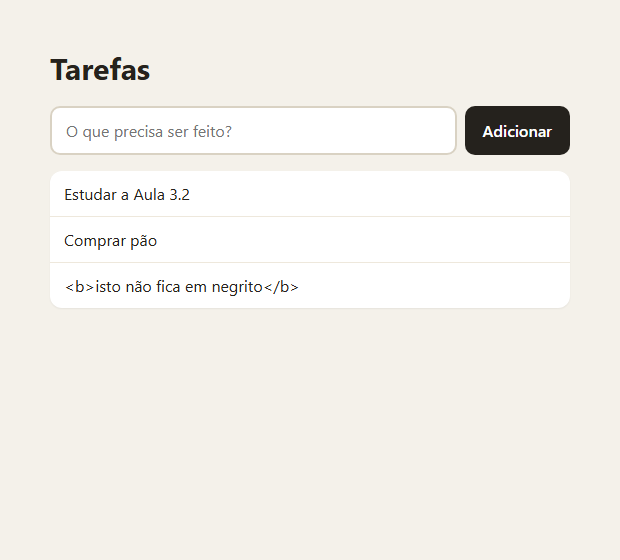
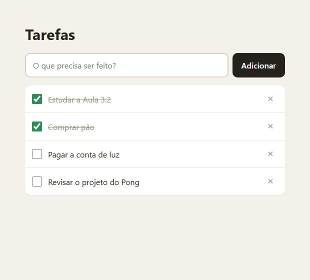
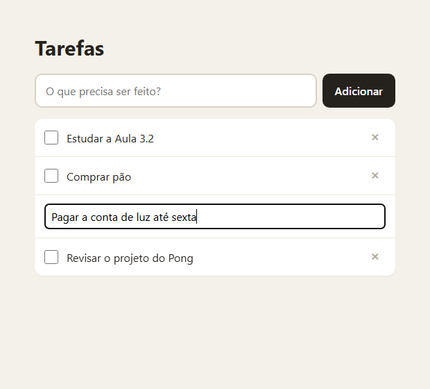
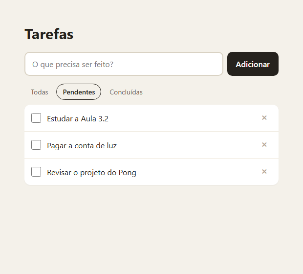
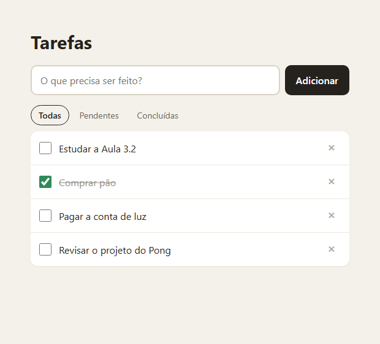

> O projeto mais pedido em teste de vaga júnior — justamente porque é simples de começar e revelador no detalhe. Filtro, edição e persistência separam quem entende estado de quem copiou um tutorial. Este é o passo a passo que eu seguiria, e três das decisões dele vêm com a medição do bug que acontece quando se decide diferente: o id que é índice, o Esc que salva, e o texto do usuário que vira código.

## O QUE VOCÊ PRECISA
- VS Code, com a extensão *Live Server* (opcional).
- Um navegador atual.
- As oficinas da Forca e da Memória ajudam: a ideia de desenhar a tela inteira a partir do estado é o coração desta.

## ANTES DE ESCREVER A PRIMEIRA LINHA
Crie uma pasta chamada `tarefas` e abra-a no VS Code (*Arquivo → Abrir Pasta*). Dentro dela, crie estes arquivos vazios:

~~~arvore
tarefas/
├── index.html
├── estilo.css
└── app.js
~~~
O HTML ganha a barra de filtros na etapa 4 e o contador na etapa 6. O CSS fica pronto já na primeira.

### 1. Adicionar
Campo, botão e lista — com o array como única fonte da verdade.

~~~arquivo index.html
<!DOCTYPE html>
<html lang="pt-BR">
<head>
    <meta charset="UTF-8">
    <meta name="viewport" content="width=device-width, initial-scale=1.0">
    <title>Tarefas</title>
    <link rel="stylesheet" href="estilo.css">
</head>
<body>
    <main class="app">
        <h1>Tarefas</h1>

        <form id="nova" class="nova">
            <label for="texto" class="oculto">Nova tarefa</label>
            <input id="texto" type="text" placeholder="O que precisa ser feito?"
                   autocomplete="off" maxlength="200">
            <button type="submit">Adicionar</button>
        </form>

        <ul id="lista" class="lista"></ul>
    </main>

    
</body>
</html>
~~~

~~~arquivo estilo.css
* {
    box-sizing: border-box;
    margin: 0;
    padding: 0;
}

[hidden] { display: none !important; }

body {
    min-height: 100vh;
    padding: 48px 20px;
    background: #f4f1ea;
    color: #25221d;
    font-family: 'Segoe UI', system-ui, sans-serif;
}

.app { max-width: 520px; margin: 0 auto; }

h1 { margin-bottom: 18px; font-size: 30px; }
/* Some da tela, mas continua lido por leitor de tela. */
.oculto {
    position: absolute;
    width: 1px;
    height: 1px;
    overflow: hidden;
    clip-path: inset(50%);
    white-space: nowrap;
}

.nova { display: flex; gap: 8px; margin-bottom: 16px; }
.nova input {
    flex: 1;
    padding: 12px 14px;
    border: 2px solid #d9d2c3;
    border-radius: 10px;
    background: #fff;
    font: inherit;
}
.nova input:focus { outline: none; border-color: #3d6fb6; }
.nova button {
    padding: 0 18px;
    border: 0;
    border-radius: 10px;
    background: #25221d;
    color: #fff;
    font: inherit;
    font-weight: 600;
    cursor: pointer;
}

.barra {
    display: flex;
    flex-wrap: wrap;
    align-items: center;
    justify-content: space-between;
    gap: 10px;
    margin-bottom: 10px;
}
.contador { color: #6d665a; font-size: 14px; }

.filtros { display: flex; gap: 4px; }
.filtros button {
    padding: 6px 12px;
    border: 1px solid transparent;
    border-radius: 999px;
    background: none;
    color: #6d665a;
    font: inherit;
    font-size: 14px;
    cursor: pointer;
}
/* O estado do filtro mora no aria-pressed — e o CSS lê de lá. */
.filtros button[aria-pressed="true"] { border-color: #25221d; color: #25221d; font-weight: 600; }

.lista {
    overflow: hidden;
    border-radius: 12px;
    background: #fff;
    box-shadow: 0 1px 2px rgba(0, 0, 0, .06);
    list-style: none;
}

.tarefa {
    display: flex;
    align-items: center;
    gap: 12px;
    padding: 12px 14px;
    border-bottom: 1px solid #eee8dc;
}
.tarefa:last-child { border-bottom: 0; }

.marca { width: 20px; height: 20px; accent-color: #2f8a57; cursor: pointer; }
.texto { flex: 1; word-break: break-word; cursor: text; }
.feita .texto { color: #9a9284; text-decoration: line-through; }

.remover {
    width: 30px;
    height: 30px;
    border: 0;
    border-radius: 8px;
    background: none;
    color: #b3a99a;
    font-size: 22px;
    line-height: 1;
    cursor: pointer;
}
.remover:hover,
.remover:focus-visible { background: #fbe9e7; color: #b3261e; }

.edicao {
    flex: 1;
    padding: 6px 8px;
    border: 2px solid #3d6fb6;
    border-radius: 6px;
    font: inherit;
}

.vazio { padding: 28px; color: #8a8273; text-align: center; }

.limpar {
    display: block;
    margin: 14px 0 0 auto;
    padding: 8px 14px;
    border: 1px solid #d9d2c3;
    border-radius: 10px;
    background: none;
    color: #6d665a;
    font: inherit;
    cursor: pointer;
}
~~~

~~~arquivo app.js
const formulario = document.getElementById('nova');
const campo = document.getElementById('texto');
const lista = document.getElementById('lista');

/* Os dados. A lista na tela é só um retrato deste array. */
let tarefas = [];

/* Redesenha a lista INTEIRA a partir do array — nunca item a item. */
function desenhar() {
    lista.replaceChildren(...tarefas.map(criarItem));
}

function criarItem(tarefa) {
    const item = document.createElement('li');
    item.className = 'tarefa';

    const texto = document.createElement('span');
    texto.className = 'texto';
    texto.textContent = tarefa.texto;   // o que foi digitado vira texto, nunca HTML

    item.append(texto);
    return item;
}

formulario.addEventListener('submit', (evento) => {
    evento.preventDefault();            // sem isto, enviar o formulário recarrega a página

    const texto = campo.value.trim();
    campo.value = '';
    campo.focus();
    if (texto === '') return;           // vazio ou só espaços: recusa

    tarefas.push({ texto });
    desenhar();
});

desenhar();
~~~

#### A tela é um retrato do array

~~~codigo
function desenhar() {
    lista.replaceChildren(...tarefas.map(criarItem));
}
~~~
Ao adicionar, o código não cria um `<li>` e pendura na lista. Ele acrescenta ao array e redesenha a lista inteira a partir dele. Parece desperdício com três itens. Nas próximas etapas, cada ação — concluir, remover, editar, filtrar — vai só mexer no array e chamar `desenhar()`. Nunca vai existir a situação em que a tela diz uma coisa e os dados dizem outra, porque a tela não guarda nada.

#### `textContent`, e nunca `innerHTML`, com texto do usuário
Digitei como tarefa o texto ``. Com `textContent`, ele apareceu como texto, nenhuma imagem foi criada, e o código do `onerror` não rodou. Depois fiz o teste contrário: pus o mesmo texto no `innerHTML` de uma `
` que nem estava na página. O navegador criou a imagem, tentou carregá-la, falhou — e executou o código. É o XSS da Aula 10.3: se essa lista algum dia mostrar tarefas de outra pessoa, quem escrever a tarefa roda código no navegador de quem lê.

#### Os detalhes do formulário
- `preventDefault()` — o comportamento padrão de enviar um formulário é recarregar a página. Conferi que uma variável criada antes do envio continuou existindo depois.
- `trim()` e recusa — texto vazio ou só com espaços não entra; espaços nas pontas saem.
- `label` com a classe `oculto` — some da tela, mas o leitor de tela continua anunciando o campo como “Nova tarefa”. Um `placeholder` sozinho não substitui o rótulo.

!confira Enter ou o botão adicionam; texto vazio ou só espaços não entra; digitar `<b>oi</b>` mostra as tags, sem negrito.

### 2. Concluir e remover
Cada tarefa ganha um id de verdade, e a lista, dois ouvintes de evento.

~~~arquivo app.js
const formulario = document.getElementById('nova');
const campo = document.getElementById('texto');
const lista = document.getElementById('lista');

/* Cada tarefa ganha um id próprio, que nunca muda enquanto ela existir. */
let tarefas = [];   // [{ id, texto, feita }]

function desenhar() {
    lista.replaceChildren(...tarefas.map(criarItem));
}

function criarItem(tarefa) {
    const item = document.createElement('li');
    item.className = 'tarefa';
    item.dataset.id = tarefa.id;
    item.classList.toggle('feita', tarefa.feita);

    const marca = document.createElement('input');
    marca.type = 'checkbox';
    marca.className = 'marca';
    marca.checked = tarefa.feita;
    marca.setAttribute('aria-label', `Concluir: ${tarefa.texto}`);

    const texto = document.createElement('span');
    texto.className = 'texto';
    texto.textContent = tarefa.texto;

    const remover = document.createElement('button');
    remover.className = 'remover';
    remover.textContent = '×';
    remover.setAttribute('aria-label', `Remover: ${tarefa.texto}`);

    item.append(marca, texto, remover);
    return item;
}

/* Do elemento clicado até a tarefa no array, sempre pelo id. */
function acharTarefa(elemento) {
    const id = elemento.closest('.tarefa').dataset.id;
    return tarefas.find((t) => t.id === id);
}

formulario.addEventListener('submit', (evento) => {
    evento.preventDefault();

    const texto = campo.value.trim();
    campo.value = '';
    campo.focus();
    if (texto === '') return;
    tarefas.push({ id: crypto.randomUUID(), texto, feita: false });
    desenhar();
});

/* Dois ouvintes no <ul>, e nenhum em cada item: a lista é redesenhada
   o tempo todo, e ouvintes em itens recriados teriam que ser recriados junto. */
lista.addEventListener('change', (evento) => {
    if (!evento.target.matches('.marca')) return;
    acharTarefa(evento.target).feita = evento.target.checked;
    desenhar();
});

lista.addEventListener('click', (evento) => {
    if (!evento.target.matches('.remover')) return;
    const alvo = acharTarefa(evento.target);
    tarefas = tarefas.filter((t) => t !== alvo);
    desenhar();
});

desenhar();
~~~

#### Um id que nunca muda
Cada tarefa nasce com `crypto.randomUUID()`, um identificador aleatório de 36 caracteres. Gerei 5.000 seguidos: 5.000 diferentes. Removi a tarefa do meio de uma lista de quatro: as outras três mantiveram exatamente os mesmos ids. Um detalhe de ambiente: `randomUUID` só existe em contexto seguro. Abrindo o arquivo direto ( `file://`) ou pelo Live Server ( `localhost`), funciona — conferi `isSecureContext` verdadeiro no arquivo local. Num endereço `http://` de outra máquina da rede, não existe. Por que não usar a posição no array, que é mais simples? A resposta aparece de forma concreta na etapa 4.

#### Dois ouvintes no `<ul>`
Como a lista inteira é recriada a cada mudança, um ouvinte posto em cada botão de remover morreria junto com o botão e teria que ser recolocado. O ouvinte no `<ul>` fica: o clique sobe do botão até ele. `change` atende a caixa de marcar, `click` atende o ×, e `acharTarefa()` vai do elemento clicado até a tarefa pelo `data-id`.

!confira marcar risca a tarefa; remover a do meio não mexe nas outras.

### 3. Editar
Duplo clique vira campo. Enter salva, Esc cancela, sair do campo salva — e a ordem de duas linhas decide se o Esc funciona.

~~~arquivo app.js
const formulario = document.getElementById('nova');
const campo = document.getElementById('texto');
const lista = document.getElementById('lista');

let tarefas = [];      // [{ id, texto, feita }]
let editando = null;   // id da tarefa que está sendo editada, ou null

function desenhar() {
    lista.replaceChildren(...tarefas.map(criarItem));
}

function criarItem(tarefa) {
    const item = document.createElement('li');
    item.className = 'tarefa';
    item.dataset.id = tarefa.id;
    item.classList.toggle('feita', tarefa.feita);

    // A tarefa em edição vira um campo de texto — decidido pelo estado.
    if (tarefa.id === editando) {
        const entrada = document.createElement('input');
        entrada.className = 'edicao';
        entrada.value = tarefa.texto;
        entrada.setAttribute('aria-label', 'Editar tarefa');
        item.append(entrada);
        return item;
    }

    const marca = document.createElement('input');
    marca.type = 'checkbox';
    marca.className = 'marca';
    marca.checked = tarefa.feita;
    marca.setAttribute('aria-label', `Concluir: ${tarefa.texto}`);

    const texto = document.createElement('span');
    texto.className = 'texto';
    texto.textContent = tarefa.texto;

    const remover = document.createElement('button');
    remover.className = 'remover';
    remover.textContent = '×';
    remover.setAttribute('aria-label', `Remover: ${tarefa.texto}`);

    item.append(marca, texto, remover);
    return item;
}

function acharTarefa(elemento) {
    const id = elemento.closest('.tarefa').dataset.id;
    return tarefas.find((t) => t.id === id);
}

function comecarEdicao(id) {
    editando = id;
    desenhar();
    const entrada = lista.querySelector('.edicao');
    entrada.focus();
    entrada.select();
}

/* Os três caminhos — Enter, Esc e sair do campo — terminam aqui. */
function terminarEdicao(guardar, valor) {
    if (editando === null) return;   // já terminou por outro caminho

    const tarefa = tarefas.find((t) => t.id === editando);
    editando = null;                 // ANTES de redesenhar: veja o texto da etapa 3

    const texto = guardar ? valor.trim() : '';
    if (tarefa && texto !== '') tarefa.texto = texto;
    desenhar();
}

formulario.addEventListener('submit', (evento) => {
    evento.preventDefault();

    const texto = campo.value.trim();
    campo.value = '';
    campo.focus();
    if (texto === '') return;

    tarefas.push({ id: crypto.randomUUID(), texto, feita: false });
    desenhar();
});

lista.addEventListener('change', (evento) => {
    if (!evento.target.matches('.marca')) return;
    acharTarefa(evento.target).feita = evento.target.checked;
    desenhar();
});

lista.addEventListener('click', (evento) => {
    if (!evento.target.matches('.remover')) return;
    const alvo = acharTarefa(evento.target);
    tarefas = tarefas.filter((t) => t !== alvo);
    desenhar();
});

lista.addEventListener('dblclick', (evento) => {
    if (!evento.target.matches('.texto')) return;
    comecarEdicao(acharTarefa(evento.target).id);
});

lista.addEventListener('keydown', (evento) => {
    if (!evento.target.matches('.edicao')) return;
    if (evento.key === 'Enter') terminarEdicao(true, evento.target.value);
    else if (evento.key === 'Escape') terminarEdicao(false);
});
/* blur não borbulha até o <ul>; focusout borbulha. Por isso a delegação usa focusout. */
lista.addEventListener('focusout', (evento) => {
    if (evento.target.matches('.edicao')) terminarEdicao(true, evento.target.value);
});

desenhar();
~~~

#### A edição também é estado
`editando` guarda o id da tarefa em edição. `criarItem()` olha para ele e decide: para essa tarefa, desenha um campo de texto em vez do texto. Começar a editar é mudar a variável e redesenhar; terminar é voltar a variável para `null` e redesenhar.

#### Três caminhos, uma função
Enter e Esc chegam pelo `keydown`. Sair do campo chega por `focusout` — e não por `blur`, porque `blur` não sobe até o `<ul>`, e a delegação depende disso. Os três chamam `terminarEdicao()`: Enter e sair com `guardar = true`, Esc com `false`. Testei os três, e mais um: apagar todo o texto e apertar Enter mantém o texto antigo, em vez de criar uma tarefa vazia.

#### As duas linhas cuja ordem decide tudo

~~~codigo
function terminarEdicao(guardar, valor) {
    if (editando === null) return;   // já terminou por outro caminho

    const tarefa = tarefas.find((t) => t.id === editando);
    editando = null;                 // ANTES de redesenhar: veja o texto da etapa 3

    const texto = guardar ? valor.trim() : '';
    if (tarefa && texto !== '') tarefa.texto = texto;
    desenhar();
}
~~~
Quando o Esc redesenha a lista, o campo de edição — que tem o foco — é removido da página. Medi: no Chrome, remover um campo com foco dispara `focusout`. E `focusout` é o caminho “sair do campo salva”. Troquei a função por uma versão que redesenha primeiro e só depois faz `editando = null`. Resultado do Esc: a tarefa ficou com o texto “NÃO DEVIA SALVAR” — o `focusout` da remoção salvou o que o Esc tinha cancelado —, e o campo de edição continuou na tela, porque no momento do redesenho `editando` ainda apontava para a tarefa. Na ordem certa, `editando` vira `null` antes de redesenhar. O `focusout` ainda acontece, mas encontra `editando === null` na primeira linha e não faz nada.

!confira duplo clique num texto: vira campo com o texto selecionado. Enter salva; Esc descarta; clicar fora salva. Apague tudo e aperte Enter: o texto antigo volta.

### 4. Filtrar
Todas, pendentes, concluídas — sem apagar nada do array.
No HTML, a barra com os três filtros entra logo antes da lista:

~~~arquivo index.html (trecho novo)

    

        <button type="button" data-filtro="todas" aria-pressed="true">Todas</button>
        <button type="button" data-filtro="pendentes" aria-pressed="false">Pendentes</button>
        <button type="button" data-filtro="concluidas" aria-pressed="false">Concluídas</button>
    

<ul id="lista" class="lista"></ul>
~~~
No `app.js`, uma variável, uma função, o redesenho usando essa função, e um ouvinte:

~~~codigo
let filtro = 'todas';   // 'todas' | 'pendentes' | 'concluidas'
function visiveis() {
    if (filtro === 'pendentes') return tarefas.filter((t) => !t.feita);
    if (filtro === 'concluidas') return tarefas.filter((t) => t.feita);
    return tarefas;
}
function desenhar() {
    lista.replaceChildren(...visiveis().map(criarItem));
    for (const botao of filtros.querySelectorAll('[data-filtro]')) {
        botao.setAttribute('aria-pressed', String(botao.dataset.filtro === filtro));
    }
}
filtros.addEventListener('click', (evento) => {
    const botao = evento.target.closest('[data-filtro]');
    if (!botao) return;
    filtro = botao.dataset.filtro;
    desenhar();
});
~~~

#### O filtro escolhe o que aparece, não o que existe
Um jeito comum de filtrar é apagar do array o que não deve aparecer. Aí trocar de volta para “Todas” não tem de onde tirar as tarefas. Aqui `visiveis()` devolve um array novo com o recorte, e `tarefas` fica intacto. Conferi: pendentes, concluídas e de volta para todas — as quatro tarefas, na ordem original. E concluir uma tarefa dentro do filtro “Pendentes” a tira da vista, mas o array continua com as quatro.

#### Agora sim: por que o id não pode ser o índice
Com o filtro ligado, a posição de uma tarefa na tela deixa de ser a posição dela no array. Montei o caso com índice como id: tarefas Pão, Luz (concluída) e Pong. No filtro “Pendentes” aparecem Pão e Pong — Pong na posição 1 da tela. Concluir Pong usando essa posição mexeu em `tarefas[1]`, que é Luz. Pong continuou pendente, e Luz foi desmarcada. Nenhum erro no console, nada quebra na hora: só a tarefa errada muda. É por isso que o id da etapa 2 existe.

#### `aria-pressed` guarda o filtro ativo — e o CSS lê de lá
Os três botões funcionam como interruptores. `aria-pressed="true"` diz ao leitor de tela qual está ligado, e o seletor `.filtros button[aria-pressed="true"]` desenha o destaque. Uma informação, dois usos, nenhuma classe extra para manter em sincronia.

!confira conclua algumas tarefas, alterne entre os filtros e volte para “Todas”: tudo reaparece. Conclua uma tarefa com o filtro “Pendentes” ligado: é ela que some.

### 5. Persistir
Salvar a cada ação e carregar ao abrir — desconfiando do que estiver guardado.

~~~codigo
function carregar() {
    try {
        const dados = JSON.parse(localStorage.getItem(CHAVE));
        if (!Array.isArray(dados)) return [];
        return dados.filter((t) => t
            && typeof t.id === 'string'
            && typeof t.texto === 'string'
            && typeof t.feita === 'boolean');
    } catch {
        return [];   // JSON corrompido ou armazenamento bloqueado
    }
}

function salvar() {
    try {
        localStorage.setItem(CHAVE, JSON.stringify(tarefas));
    } catch {
        // Sem armazenamento, a lista vale só até fechar a aba.
    }
}

let tarefas = carregar();

function atualizar() {
    salvar();
    desenhar();
}
~~~
Toda chamada a `desenhar()` que vem de uma mudança nos dados — adicionar, concluir, remover, terminar edição — vira `atualizar()`. Trocar o filtro e começar a editar continuam chamando só `desenhar()`.

#### O localStorage só guarda texto
`JSON.stringify` transforma o array em texto para gravar; `JSON.parse` faz o caminho de volta. Sem isso, gravar um array salva a string `"[object Object],[object Object]"`. Testei com um F5 real: a prova adicionou três tarefas, concluiu uma, recarregou a página e continuou depois do recarregamento. As tarefas voltaram com os mesmos ids, na mesma ordem, com a mesma marcada.

#### O que está guardado não é confiável
O valor pode ter sido editado no DevTools, gravado por uma versão antiga do app, ou corrompido. `carregar()` desconfia de três formas, e testei as três: JSON quebrado ( `'x{'`) devolveu lista vazia sem erro; um objeto no lugar de array devolveu lista vazia; e numa lista misturada, só entrou o item com `id` texto, `texto` texto e `feita` booleano — o item com id numérico, o `null` e o item sem `feita` ficaram de fora.

#### Quando salvar
Salvar a cada tecla digitada no campo é o jeito mais fácil de deixar uma lista grande lenta. Aqui a gravação acontece por ação concluída. Contei as gravações: digitar uma palavra inteira no campo, zero; trocar de filtro, zero; concluir uma tarefa, uma.

!confira adicione tarefas, conclua uma, aperte F5: tudo volta igual. No DevTools, em Application › Local Storage, troque o valor por `x{` e aperte F5: a página abre, com a lista vazia.

### 6. Acabamento
Contador de pendentes, limpar concluídas e uma mensagem decente quando não há nada.

~~~arquivo index.html (trecho novo)
            

...

<button id="limpar" class="limpar" type="button" hidden>Limpar concluídas</button>

function desenhar() {
    const mostradas = visiveis();
    lista.replaceChildren(...mostradas.map(criarItem));

    // Contador, botão de limpar e mensagem de vazio: tudo calculado, nada guardado.
    const pendentes = tarefas.filter((t) => !t.feita).length;
    contador.textContent = pendentes === 1 ? '1 pendente' : `${pendentes} pendentes`;
    botaoLimpar.hidden = !tarefas.some((t) => t.feita);

    vazio.hidden = mostradas.length > 0;
    vazio.textContent = tarefas.length === 0
        ? 'Nenhuma tarefa ainda. Que tal a primeira?'
        : 'Nada neste filtro.';

    for (const botao of filtros.querySelectorAll('[data-filtro]')) {
        botao.setAttribute('aria-pressed', String(botao.dataset.filtro === filtro));
    }
}

botaoLimpar.addEventListener('click', () => {
    tarefas = tarefas.filter((t) => !t.feita);
    atualizar();
});
~~~

#### Tudo calculado, nada guardado
Não existe variável `quantidadePendentes`. O contador é contado a cada desenho, e por isso nunca fica desatualizado depois de uma remoção ou de um F5. O mesmo vale para o botão de limpar (aparece se alguma tarefa estiver feita) e para a mensagem de vazio. Conferi o singular: 0 pendentes, 1 pendente, 3 pendentes.

#### Dois vazios diferentes
“Nenhuma tarefa ainda” e “Nada neste filtro” são situações diferentes, e a pessoa precisa saber qual é. Com a lista vazia apareceu a primeira; com tarefas, mas o filtro “Concluídas” sem nenhuma, a segunda.

#### O `[hidden]` que precisa da regra do CSS
O botão de limpar tem `display: block` no CSS, para se alinhar à direita. Sem a regra `[hidden] {` `display: none !important; }`, esse `display` venceria o atributo `hidden` e o botão apareceria sempre — é o mesmo caso da Forca. Conferi o estilo calculado: com `hidden`, `none`; sem, `block`.

!confira o contador acompanha cada ação; limpar remove só as concluídas e some; com tudo removido, volta o convite da primeira visita.

### ✓ Roteiro de teste
Passe por estes casos antes de considerar a oficina concluída. Eles cobrem o que costuma quebrar.

| VOCÊ FAZ | DEVE ACONTECER |
|---|---|
| Adicionar tarefas, concluir algumas e apertar F5 | tudo volta, inclusive o que estava concluído |
| Remover a tarefa do meio | as outras não mudam |
| Alternar entre os filtros e voltar para Todas | nada se perde |
| Concluir uma tarefa com o filtro Pendentes ligado | é exatamente essa que muda |
| Editar, alterar o texto e apertar Esc | o texto antigo continua |
| Editar e clicar fora | salva |
| Adicionar texto vazio ou só espaços | não entra |
| Adicionar `
~~~

!nota Corromper o valor no DevTools e apertara página abre sem erro F5 Concluir tudo e limpar o botão some e o convite aparece

### ! Quando não funcionar
Os tropeços desta oficina, e o que procurar em cada um.

| SINTOMA | CAUSA QUASE CERTA |
|---|---|
| Enviar o formulário recarrega a página | Falta `evento.preventDefault()` no `submit`. |
| Uma tarefa com tags aparece formatada | Está usando `innerHTML`. Troque por `textContent` — é XSS. |
| Concluir com filtro ligado marca a tarefa errada | O item é identificado pela posição. Use um id guardado na tarefa. |
| Botões param de funcionar depois de redesenhar | Ouvintes foram postos nos itens recriados. Coloque um só no `<ul>`. |
| Esc salva a edição | O redesenho acontece antes de `editando = null`, e o `focusout` da remoção salva. |
| Sair do campo não salva | O ouvinte está em `blur`, que não sobe até a lista. Use `focusout`. |
| Voltar para "Todas" não mostra tudo | O filtro está apagando itens do array. |
| Tudo some no F5 | Não carrega ao abrir, ou gravou o array sem `JSON.stringify`. |
| A página não abre depois de mexer no localStorage | `JSON.parse` sem `try/catch`. |
| `crypto.randomUUID is not a` `function` | A página foi aberta por `http://` num endereço que não é seguro. Use o Live Server (localhost). |

### → Para levar adiante
Extensões em ordem de dificuldade. Todas cabem no que você já construiu.
1. Arrastar para reordenar. Mudar a ordem é mudar a posição no array e redesenhar — o Kanban faz isso em escala. 2. Prazo e atrasadas. Uma data em formato ISO por tarefa, e a classe `atrasada` calculada no desenho. 3. Categorias com cor. Um campo `categoria` e um filtro a mais — que se combina com o de estado. 4. Exportar e importar. Baixar o JSON e ler um arquivo de volta, passando pela mesma validação de `carregar()`.
